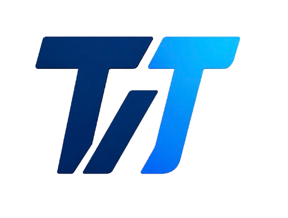

<p align="center">
  
</p>

<h1 align="center">TodayInTech</h1>

<p align="center">
  <strong>🚀 Building the Future of Health Tech Software</strong>
</p>

<p align="center">
  We design, develop, and deploy white-label health software that empowers clinics, pharmacies, and wellness brands to scale faster — without building from scratch.
</p>

<p align="center">
  <a href="#features">Features</a> •
  <a href="#tech-stack">Tech Stack</a> •
  <a href="#getting-started">Getting Started</a> •
  <a href="#project-structure">Structure</a> •
  <a href="#screenshots">Screenshots</a> •
  <a href="#contact">Contact</a>
</p>
<p align="center">
  
  
  
</p>

---


## 🏥 About TodayInTech

**TodayInTech** is a professional technology company specializing in **health white-label software solutions**. We work with healthcare brands, clinics, pharmacies, and wellness companies to deliver production-ready software products under their own brand.

Beyond health tech, we also deliver custom software across multiple domains — from mobile apps to cloud-native platforms — with a proven track record of **50+ happy clients** and **120+ projects delivered**.

### 🎯 What We Specialize In

| Area | Description |
|------|-------------|
| 🏥 **Health White-Label** | Telemedicine, EHR/EMR, Patient Portals, E-Prescriptions |
| 📱 **Mobile Development** | React Native & Flutter apps for iOS & Android |
| 🌐 **Web Applications** | SaaS platforms, admin dashboards, customer portals |
| ☁️ **Cloud & DevOps** | AWS, Docker, Kubernetes, CI/CD pipelines |
| 🔗 **API & Integrations** | HL7/FHIR compliance, REST APIs, payment gateways |
| 🎨 **UI/UX Design** | Human-centered design, prototyping, user research |

---

## ✨ Features

This portfolio website showcases our company with a **premium, modern design**:

- 🌙 **Dark Theme** — Sleek dark UI with vibrant gradient accents
- 🪟 **Glassmorphism** — Modern glass-effect cards and navigation
- 🎭 **Scroll Animations** — Staggered reveal animations on scroll
- 💫 **Counter Animations** — Animated statistics with easing
- ⌨️ **Typed Text Effect** — Dynamic hero text animation
- 🔄 **3D Tilt Cards** — Interactive card hover effects
- 🖱️ **Parallax Glow** — Background glow follows mouse movement
- 📞 **Booking Modal** — Full consultation booking form with validation
- 📱 **Fully Responsive** — Optimized for mobile, tablet, and desktop
- 🔍 **SEO Optimized** — Proper meta tags, semantic HTML, heading hierarchy

### 📄 Page Sections

| # | Section | Description |
|---|---------|-------------|
| 1 | **Navigation** | Fixed glassmorphism navbar with smooth scroll & mobile menu |
| 2 | **Hero** | Animated hero with typing effect, stats, floating badges |
| 3 | **Trusted By** | Client logo strip for social proof |
| 4 | **Services** | 6 interactive service cards with tags |
| 5 | **About / Why Us** | Company story, features grid, animated stats |
| 6 | **Portfolio** | 4 project showcases with images & tech stacks |
| 7 | **Process** | 4-step visual workflow |
| 8 | **Testimonials** | 6 client review cards with 5-star ratings |
| 9 | **Tech Stack** | Technology badges grid |
| 10 | **CTA** | Book a consultation with trust badges |
| 11 | **Footer** | Multi-column footer with social links |

---

## 🛠️ Tech Stack

This website is built with **zero dependencies** — pure web technologies:

| Technology | Purpose |
|-----------|---------|
|  | Semantic structure & SEO |
|  | Design system, animations, glassmorphism |
|  | Interactions, animations, modal logic |
|  | Inter & Space Grotesk typography |

---

## 🚀 Getting Started

### Prerequisites

- Any modern web browser (Chrome, Firefox, Safari, Edge)
- *(Optional)* Node.js for local development server

### Quick Start

1. **Clone the repository**
   ```bash
   git clone git@github.com:JASIM0021/todayintechweb.git
   cd todayintechweb
   ```

2. **Open directly in browser**
   ```
   Just double-click index.html — it works out of the box!
   ```

3. **Or use a local dev server** *(recommended)*
   ```bash
   npx serve
   ```
   Then open [http://localhost:3000](http://localhost:3000)

---

## 📁 Project Structure

```
todayintechweb/
│
├── index.html              # Main HTML page (all sections)
├── style.css               # Complete CSS design system
│                             ├── CSS Variables & tokens
│                             ├── Reset & utilities
│                             ├── Component styles
│                             ├── Animations & keyframes
│                             └── Responsive breakpoints
├── script.js               # JavaScript interactions
│                             ├── Navbar scroll effect
│                             ├── Mobile menu toggle
│                             ├── Scroll reveal animations
│                             ├── Counter animations
│                             ├── Typed text effect
│                             ├── 3D card tilt effect
│                             ├── Parallax glow effect
│                             ├── Booking modal logic
│                             └── Active nav highlighting
├── assets/
│   ├── logo.png             # TodayInTech brand logo
│   ├── hero-bg.png          # Hero section background
│   ├── project-health-app.png     # Portfolio: Health app
│   ├── project-telemedicine.png   # Portfolio: Telemedicine
│   ├── project-pharmacy.png       # Portfolio: Pharmacy
│   └── project-fitness.png        # Portfolio: Fitness
│
└── README.md               # This file
```

---

## 📸 Screenshots

### 🖥️ Hero Section
> Dark theme hero with animated typing effect, floating badges, and statistics counter

### 📋 Services
> 6 interactive service cards with glassmorphism effect and tech tags

### 💼 Portfolio
> Project showcase with hover zoom effects and technology badges

### ⭐ Testimonials
> Client reviews with 5-star ratings and avatar badges

### 📞 Booking Modal
> Full consultation form with validation and success animation

---

## 🤝 Our Clients Love Us

> *"TodayInTech transformed our clinic's operations. Their white-label platform saved us 6 months of development."*
> — **Dr. Rahul Mehta**, CEO, MediCare Plus

> *"Working with TodayInTech was seamless. They delivered our telemedicine app ahead of schedule."*
> — **Sarah Anderson**, CTO, DocConnect

> *"The pharmacy management system handles 10,000+ daily transactions flawlessly."*
> — **Ahmed Khalil**, Founder, PharmaLink

---

## 📊 Key Numbers

| Metric | Value |
|--------|-------|
| 🤝 Happy Clients | **50+** |
| 🚀 Projects Delivered | **120+** |
| 😊 Client Satisfaction | **99%** |
| 👨‍💻 Team Members | **35+** |
| 🌍 Countries Served | **12+** |
| 📅 Years Experience | **5+** |

---

## 📬 Contact

Ready to build your next health tech product? Let's talk!

| Channel | Details |
|---------|---------|
| 📧 **Email** | [contact@todayintech.in](mailto:contact@todayintech.in) |
| 📞 **Phone** | +91 7679349780 |
| 🌐 **Website** | [todayintech.com](https://todayintech.com) |
| 📍 **Location** | Kolkata, India |

---

## 📄 License

This project is licensed under the **MIT License** — see the [LICENSE](LICENSE) file for details.

---

<p align="center">
  Made with ❤️ by <strong>TodayInTech</strong>
</p>

<p align="center">
  <a href="https://todayintech.com">Website</a> •
  <a href="mailto:contact@todayintech.in">Email</a> •
  <a href="https://linkedin.com/company/todayintech">LinkedIn</a>
</p>
