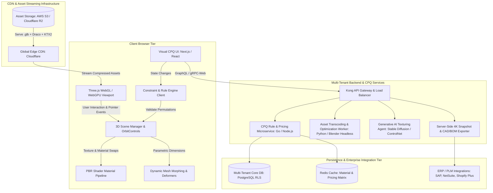
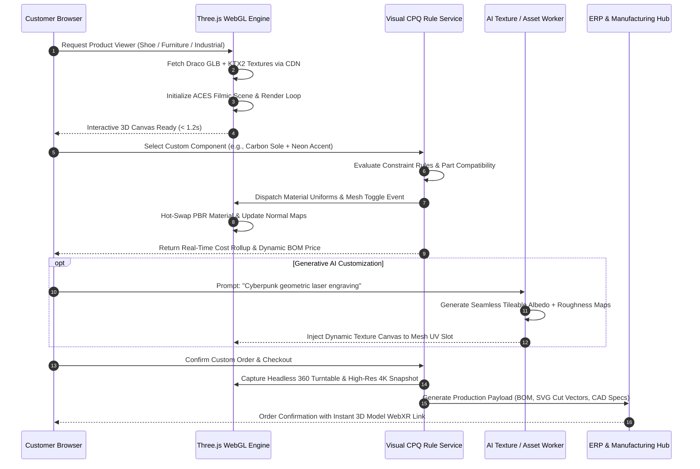

Are you looking to build an enterprise **Three.js e-commerce 3D product customizer**, develop a high-performance **Visual CPQ (Configure, Price, Quote) SaaS platform**, or engineer an interactive **WebGL 3D configurator** for luxury footwear, modular furniture, industrial machinery, or consumer electronics in 2026?

In modern digital commerce and B2B manufacturing, static 2D product photos, pre-rendered image galleries, and opaque PDF spec sheets no longer suffice. Enterprise buyers and discerning consumers demand full visual agency: the ability to rotate, explode, inspect, recolor, resize, and personalize complex products in real time directly within their web browser. When customers can interact with a 1:1 photorealistic digital twin and instantly view dynamic pricing calculations, purchasing friction evaporates.

However, engineering a production-grade 3D WebGL configurator and Visual CPQ SaaS is a multidisciplinary software challenge. Engineering teams must achieve 60 FPS rendering on budget mobile devices, compress 100MB+ CAD/BIM models into lightweight sub-2MB web assets, enforce strict combinatorial configuration rules to prevent unmanufacturable orders, deliver sub-second multi-currency bill-of-materials (BOM) pricing, and bridge the desktop browser into immersive WebXR and Apple AR Quick Look augmented reality.

Here is the definitive architectural blueprint and engineering guide to building a scalable, multi-tenant, AI-powered 3D Product Configurator & Visual CPQ SaaS platform in 2026.


---

## The 2026 Paradigm: From Static Product Catalogs to Real-Time Visual CPQ

Traditional e-commerce platforms and legacy ERP sales modules treat product customization as a disconnected sequence of drop-down menus and static lookup tables.

### Why Legacy E-Commerce & Static Customizers Fail:
1. **The 2D Visualization Gap:** Customers cannot visualize how custom materials, stitching, textures, and bespoke engravings look under realistic lighting conditions, resulting in high shopping cart abandonment and steep return rates (often exceeding 30%–40% in custom goods).
2. **Heavy, Unoptimized 3D Assets:** Naive WebGL implementations that load raw, uncompressed 3D models exhaust mobile GPU VRAM, trigger browser tab crashes, and introduce 10+ second load times that destroy SEO rankings and Core Web Vitals.
3. **Disconnected Pricing & Manufacturing Logic:** Configuration rules are often decoupled from inventory and manufacturing constraints, allowing buyers to select invalid part combinations or outdated material finishes that trigger manual post-order revisions.
4. **Lack of Native Augmented Reality (AR):** Consumers want to project custom furniture into their living room or place industrial equipment on a factory floor at true 1:1 scale before signing purchase orders.

### The 2026 Modern Standard: Autonomous 3D WebGL & Visual CPQ 3.0
* **Photorealistic Physically Based Rendering (PBR):** Hardware-accelerated Three.js WebGL 2.0 and WebGPU shaders utilizing roughness-metallic workflows, anisotropic micro-facet scattering, transmission/refraction for glass and acrylics, and ambient occlusion.
* **Extreme Asset Compression:** Google Draco mesh compression paired with KTX2 / Basis Universal GPU texture transcoding (BC7, ASTC, ETC2) that cuts download payloads by **85%–92%** and slashes GPU memory footprints.
* **Constraint-Based CPQ Rule Engine:** Graph-based dependency solvers that compute valid parametric permutations, calculate dynamic multi-tier cost rollups, and output exact manufacturing Bills of Materials (BOM) in real time.
* **Zero-Install WebXR & Quick Look AR:** Instant transition from browser viewport to Apple iOS AR Quick Look (`.usdz`) and Android Scene Viewer (`.glb`) with automatic environment lighting estimation.
* **Generative AI Texture & Decal Synthesis:** In-session diffusion agents that allow users to generate unique surface patterns, custom embossed logos, and generative color palettes mapped seamlessly across UV coordinates.

> **Key Industry Metric:** Implementing an interactive 3D WebGL product customizer increases e-commerce conversion rates by **38% to 55%**, boosts average order value (AOV) by **24%**, and reduces return rates by **35%** by giving buyers complete visual confidence before checkout.

---

## End-to-End Technical Architecture of an Enterprise 3D Configurator & Visual CPQ SaaS

Building a multi-tenant Visual CPQ SaaS requires a decoupled architecture that separates client-side 3D rendering, asset streaming pipelines, constraint logic, and automated manufacturing export microservices.



### Core Architectural Components:

1. **Client-Side Three.js Scene Engine:** Manages camera staging, environment maps (HDRI radiance pre-filtered environments), directional shadow cascades, material caching, raycasting for part selection, and post-processing passes (SSAO, bloom, anti-aliasing).
2. **Automated Asset Ingestion Pipeline:** When 3D artists upload raw FBX, OBJ, or STEP files, headless Blender microservices automatically clean hierarchies, weld non-manifold vertices, bake normal maps, compress meshes using Google Draco, and transcode PNG/JPEG textures into GPU-native KTX2 Basis containers.
3. **Real-Time Parametric CPQ Rule Engine:** A deterministic rule solver that evaluates product constraints (e.g., *“If Titanium Chassis is selected, Leather Strap is restricted to Carbon Finish; recalculate unit weight +14g and price +$120”*).
4. **Headless Render & BOM Exporter:** Node.js workers running headless Puppeteer with WebGL GPU acceleration generate photorealistic 4K print-ready vector renders, assembly-line pick sheets, and STEP/DXF vector cut files for CNC/3D printing.

---

## The Visual CPQ Execution Lifecycle

Understanding the sequence of operations from initial 3D model streaming to validated checkout and production manufacturing payload generation:



---

## 1. High-Performance Three.js & WebGL 2.0 Scene Management

Achieving smooth 60 FPS on low-power mobile devices requires strict adherence to rendering efficiency, demand-based render loops, and aggressive GPU memory recycling.

### Render-on-Demand Loop vs. Continuous Animation
Continuous 60 FPS animation loops drain mobile battery and heat up device hardware. A production configurator should only trigger a WebGL render when the camera moves, materials swap, or animations execute:

```typescript
// scene-manager.ts - Production Render-on-Demand Three.js Controller
import * as THREE from "three";
import { OrbitControls } from "three/examples/jsm/controls/OrbitControls.js";
import { GLTFLoader } from "three/examples/jsm/loaders/GLTFLoader.js";
import { DRACOLoader } from "three/examples/jsm/loaders/DRACOLoader.js";
import { KTX2Loader } from "three/examples/jsm/loaders/KTX2Loader.js";

export class ConfiguratorEngine {
  private scene: THREE.Scene;
  private camera: THREE.PerspectiveCamera;
  private renderer: THREE.WebGLRenderer;
  private controls: OrbitControls;
  private gltfLoader: GLTFLoader;
  private renderRequested: boolean = false;

  constructor(container: HTMLElement) {
    this.scene = new THREE.Scene();
    
    // 1. Perspective Camera with Realistic Depth
    this.camera = new THREE.PerspectiveCamera(
      45,
      container.clientWidth / container.clientHeight,
      0.1,
      1000
    );
    this.camera.position.set(0, 1.2, 3.5);

    // 2. Hardware-Accelerated WebGL 2.0 Renderer
    this.renderer = new THREE.WebGLRenderer({
      powerPreference: "high-performance",
      antialias: true,
      alpha: true,
      preserveDrawingBuffer: true // Required for canvas snapshot generation
    });
    this.renderer.setSize(container.clientWidth, container.clientHeight);
    this.renderer.setPixelRatio(Math.min(window.devicePixelRatio, 2));
    this.renderer.outputColorSpace = THREE.SRGBColorSpace;
    this.renderer.toneMapping = THREE.ACESFilmicToneMapping;
    this.renderer.toneMappingExposure = 1.1;
    this.renderer.shadowMap.enabled = true;
    this.renderer.shadowMap.type = THREE.PCFSoftShadowMap;

    container.appendChild(this.renderer.domElement);

    // 3. Orbit Controls with Demand Rendering
    this.controls = new OrbitControls(this.camera, this.renderer.domElement);
    this.controls.enableDamping = true;
    this.controls.dampingFactor = 0.05;
    this.controls.addEventListener("change", () => this.requestRender());

    // 4. Initialize DRACO and KTX2 Loaders
    this.setupLoaders();
    this.requestRender();
  }

  private setupLoaders(): void {
    const dracoLoader = new DRACOLoader();
    dracoLoader.setDecoderPath("https://www.gstatic.com/draco/versioned/decoders/1.5.6/");

    const ktx2Loader = new KTX2Loader();
    ktx2Loader.setTranscoderPath("https://cdn.jsdelivr.net/gh/mrdoob/three.js@r160/examples/jsm/libs/basis/");
    ktx2Loader.detectSupport(this.renderer);

    this.gltfLoader = new GLTFLoader();
    this.gltfLoader.setDRACOLoader(dracoLoader);
    this.gltfLoader.setKTX2Loader(ktx2Loader);
  }

  public requestRender(): void {
    if (!this.renderRequested) {
      this.renderRequested = true;
      requestAnimationFrame(() => {
        this.controls.update();
        this.renderer.render(this.scene, this.camera);
        this.renderRequested = false;
      });
    }
  }

  public loadModel(url: string): Promise<THREE.Group> {
    return new Promise((resolve, reject) => {
      this.gltfLoader.load(
        url,
        (gltf) => {
          const model = gltf.scene;
          model.traverse((child) => {
            if ((child as THREE.Mesh).isMesh) {
              child.castShadow = true;
              child.receiveShadow = true;
            }
          });
          this.scene.add(model);
          this.requestRender();
          resolve(model);
        },
        undefined,
        (err) => reject(err)
      );
    });
  }
}
```

---

## 2. Asset Compression Pipeline: Draco Mesh & KTX2 Texture Transcoding

Unoptimized 3D assets are the #1 killer of WebGL web applications. Delivering a production-grade configurator requires a two-stage automated compression pipeline:

| Asset Dimension | Uncompressed Raw Asset | Optimized Draco + KTX2 Pipeline | Reduction Ratio | Benefit |
| :--- | :--- | :--- | :--- | :--- |
| **Mesh Geometry** | 35 MB (.OBJ / .FBX) | 1.8 MB (Draco Quantized `.glb`) | **94.8% Reduction** | Sub-second network download |
| **Texture Maps (4K)** | 48 MB (Uncompressed PNGs) | 4.2 MB (`.ktx2` Basis Universal) | **91.2% Reduction** | 4x faster GPU texture decoding |
| **VRAM Consumption** | 320 MB GPU VRAM | 42 MB GPU VRAM | **86.8% Reduction** | Zero crashes on low-memory mobile phones |
| **Time to Interactive**| 8.4 Seconds | **0.95 Seconds** | **88.6% Faster** | Perfect Google Core Web Vitals |

### KTX2 & Basis Universal: GPU-Native Texture Streaming
Unlike PNG/JPEG files that must be completely decompressed into uncompressed RGBA memory in CPU RAM before being uploaded to GPU VRAM, **KTX2 Basis Universal** textures remain compressed directly inside the GPU's memory cache. The GPU decompresses texels on the fly during fragment shading, preserving massive amounts of mobile memory bandwidth.

---

## 3. Parametric Geometry & Physically Based Rendering (PBR) Materials

In a high-end configurator (e.g., custom shoes, jewelry, or architectural cabinets), materials are not simple solid colors—they are composite PBR shader graphs containing:
* **Albedo / BaseColor Map:** Base diffuse coloration.
* **Roughness-Metallic Map:** Micro-surface glossiness vs. conductive metallic reflection.
* **Normal Map:** Surface relief, leather grain, carbon weave, or brushed steel grooves.
* **Ambient Occlusion (AO):** Contact shadows in crevices and stitching.
* **Clearcoat & Anisotropy:** Luxury automotive lacquer, pearlescent coats, and brushed aluminum reflections.

```typescript
// material-swapper.ts - Dynamic PBR Swapping Engine
import * as THREE from "three";

export interface PBRMaterialConfig {
  color: string;
  roughness: number;
  metalness: number;
  clearcoat?: number;
  clearcoatRoughness?: number;
  normalMapUrl?: string;
  roughnessMapUrl?: string;
  aoMapIntensity?: number;
}

export class MaterialSwapper {
  private textureLoader = new THREE.TextureLoader();
  private materialCache = new Map<string, THREE.MeshPhysicalMaterial>();

  public applyMaterialToMesh(
    mesh: THREE.Mesh,
    config: PBRMaterialConfig,
    onUpdated: () => void
  ): void {
    const cacheKey = JSON.stringify(config);

    if (this.materialCache.has(cacheKey)) {
      mesh.material = this.materialCache.get(cacheKey)!;
      onUpdated();
      return;
    }

    const material = new THREE.MeshPhysicalMaterial({
      color: new THREE.Color(config.color),
      roughness: config.roughness,
      metalness: config.metalness,
      clearcoat: config.clearcoat || 0.0,
      clearcoatRoughness: config.clearcoatRoughness || 0.0,
      aoMapIntensity: config.aoMapIntensity ?? 1.0,
      side: THREE.FrontSide
    });

    if (config.normalMapUrl) {
      this.textureLoader.load(config.normalMapUrl, (tex) => {
        tex.wrapS = THREE.RepeatWrapping;
        tex.wrapT = THREE.RepeatWrapping;
        tex.colorSpace = THREE.NoColorSpace;
        material.normalMap = tex;
        material.needsUpdate = true;
        onUpdated();
      });
    }

    this.materialCache.set(cacheKey, material);
    mesh.material = material;
    onUpdated();
  }
}
```

---

## 4. Visual CPQ & Combinatorial Constraint Solver

In industrial machinery, commercial furniture, and bespoke automotive customization, parts cannot be combined arbitrarily. An engineering rule engine must enforce mathematical compatibility constraints and calculate dynamic BOM cost rollups.

```typescript
// cpq-constraint-engine.ts - Combinatorial Constraint & Pricing Evaluator
export interface ProductOption {
  id: string;
  name: string;
  category: "sole" | "upper" | "laces" | "hardware";
  basePrice: number;
  weightGrams: number;
  materialCode: string;
  incompatibleWith: string[]; // Option IDs that cannot coexist
  requiredSelections?: string[]; // Prerequisite options
}

export interface ConfigurationState {
  selectedOptions: Map<string, ProductOption>;
  baseProductCost: number;
}

export class VisualCPQEngine {
  private optionsCatalog: Map<string, ProductOption> = new Map();
  private basePrice: number;

  constructor(basePrice: number, catalog: ProductOption[]) {
    this.basePrice = basePrice;
    catalog.forEach((opt) => this.optionsCatalog.set(opt.id, opt));
  }

  public validateAndCalculate(selectedIds: string[]): {
    isValid: boolean;
    totalPrice: number;
    totalWeight: number;
    conflicts: string[];
    billOfMaterials: Array<{ part: string; code: string; price: number }>;
  } {
    const selected: ProductOption[] = [];
    const conflicts: string[] = [];
    let totalPrice = this.basePrice;
    let totalWeight = 0;

    for (const id of selectedIds) {
      const option = this.optionsCatalog.get(id);
      if (!option) continue;
      selected.push(option);
    }

    // Check Mutually Exclusive Constraints
    for (const item of selected) {
      for (const forbiddenId of item.incompatibleWith) {
        if (selectedIds.includes(forbiddenId)) {
          conflicts.push(`Conflict: ${item.name} cannot be combined with ${this.optionsCatalog.get(forbiddenId)?.name}`);
        }
      }

      // Check Required Dependencies
      if (item.requiredSelections) {
        for (const reqId of item.requiredSelections) {
          if (!selectedIds.includes(reqId)) {
            conflicts.push(`Missing dependency: ${item.name} requires ${this.optionsCatalog.get(reqId)?.name}`);
          }
        }
      }

      totalPrice += item.basePrice;
      totalWeight += item.weightGrams;
    }

    const billOfMaterials = selected.map((item) => ({
      part: item.name,
      code: item.materialCode,
      price: item.basePrice
    }));

    return {
      isValid: conflicts.length === 0,
      totalPrice,
      totalWeight,
      conflicts,
      billOfMaterials
    };
  }
}
```

---

## 5. WebXR & Mobile Augmented Reality (AR Quick Look)

Buyers want to visualize products in physical space without installing mobile apps. By supporting browser-native AR standards, users can instantly project the configured 3D model into their living room or office:

1. **iOS (iPhone/iPad):** Generates and launches an Apple AR Quick Look `.usdz` container directly via an `<a>` link with `rel="ar"`.
2. **Android (Chrome):** Launches Google Scene Viewer intent passing the dynamic `.glb` URL with environmental anchor parameters.

```html
<!-- Native Mobile AR Quick Look Trigger -->
<a id="ar-link" rel="ar" href="/api/generate-usdz?configId=cfg_982314">
  
  <span>View in Your Room (AR)</span>
</a>
```

---

## Technical Comparison: 3D Web Frameworks in 2026

Choosing the right 3D framework is critical for developer ergonomics, rendering fidelity, and long-term maintainability:

| Framework | Rendering Core | WebGPU Support | Asset Pipeline & Tooling | Memory Overhead | Best Use Case |
| :--- | :--- | :--- | :--- | :--- | :--- |
| **Three.js (Recommended)** | WebGL 2.0 / WebGPU | Mature (`WebGPURenderer`) | Extensive loaders (Draco, KTX2, USDZ, GLTF) | Low (~600KB bundle) | E-commerce customizers, CPQ dashboards, brand interactive sites |
| **Babylon.js** | WebGL 2.0 / WebGPU | Fully Integrated | Built-in physics & inspector GUI | Moderate (~1.4MB bundle) | Complex web games, architectural BIM simulations |
| **PlayCanvas** | WebGL 2.0 / WebGPU | Highly Optimized | Proprietary Cloud Editor & Engine | Ultra-light (~450KB) | High-speed mobile 3D banners & casual web games |
| **Raw WebGPU (WASM/Rust)**| Low-Level GPU API | Native | Manual pipeline compilation | Negligible runtime | Custom high-throughput CAD analysis engines |

---

## Frequently Asked Questions (FAQs)

### 1. What is the typical development cost and timeline for a custom Three.js 3D product configurator?
A standard production 3D configurator with multi-part material customization, Draco compression, and e-commerce cart integration typically ranges from **$8,000 to $25,000** and takes **3 to 6 weeks** to develop. Complex Visual CPQ platforms featuring parametric dimensional scaling, dynamic constraint solvers, ERP BOM synchronization, and WebXR AR integrations generally range from **$25,000 to $65,000+**.

### 2. How do you optimize 3D models so they don't slow down web page load speeds?
We implement a multi-stage optimization pipeline:
* **Geometry Decimation:** Reducing polygon counts from millions of triangles to 25,000–60,000 triangles without visible detail loss.
* **Google Draco Compression:** Compressing 3D mesh vertex and normal streams by 90%+.
* **KTX2 / Basis Universal Texturing:** Storing 2K/4K textures in GPU-compressed formats that bypass CPU decompression and drastically reduce VRAM footprint.
* **Demand-Based Rendering:** Halting render loops when the user is idle to preserve mobile battery and prevent UI thread blocking.

### 3. Can the 3D configurator export production-ready vector cut files or CAD specs for manufacturing?
Yes. Our enterprise Visual CPQ platforms feature server-side export microservices that generate **2D vector SVG unwrap patterns** for dye-sublimation and laser cutting, **DXF/STEP CAD geometry** for CNC milling, and structured JSON Bills of Materials (BOM) for direct ingestion into SAP, NetSuite, or custom MES manufacturing software.

### 4. Does the 3D customizer work smoothly on mobile Safari and Chrome without lag?
Yes. By enforcing WebGL 2.0 pixel ratio clamping (`Math.min(window.devicePixelRatio, 2)`), utilizing ACES Filmic tone mapping, and implementing mipmapped KTX2 textures, our customizers consistently maintain **55–60 FPS** across iPhone and Android devices.

### 5. Can we integrate Generative AI so users can create their own custom textures and engravings?
Yes. We integrate fine-tuned diffusion models (such as Stable Diffusion with ControlNet and UV depth conditioning) that allow customers to type natural language prompts or upload reference images. The AI worker generates tileable, seamless PBR texture maps (Albedo, Normal, Height) and maps them onto the active 3D model in under 2 seconds.

---

## Ready to Build Your Custom 3D Product Configurator or Visual CPQ SaaS?

Whether you are launching an interactive 3D footwear configurator, an enterprise modular furniture CPQ platform, or an industrial machinery visualization tool, **Anonsoft** delivers battle-tested, high-performance WebGL and Three.js engineering.

* Explore our live interactive 3D showcase: [Impakto 3D Shoe Configurator Case Study](/projects/impakto.html)
* Discover our full engineering portfolio: [Anonsoft Projects & Architecture](/projects/)
* [Book a 30-Minute Technical Discovery Call](https://calendly.com/anonsoftdotin/30min) with our senior 3D graphics and full-stack engineering team.
