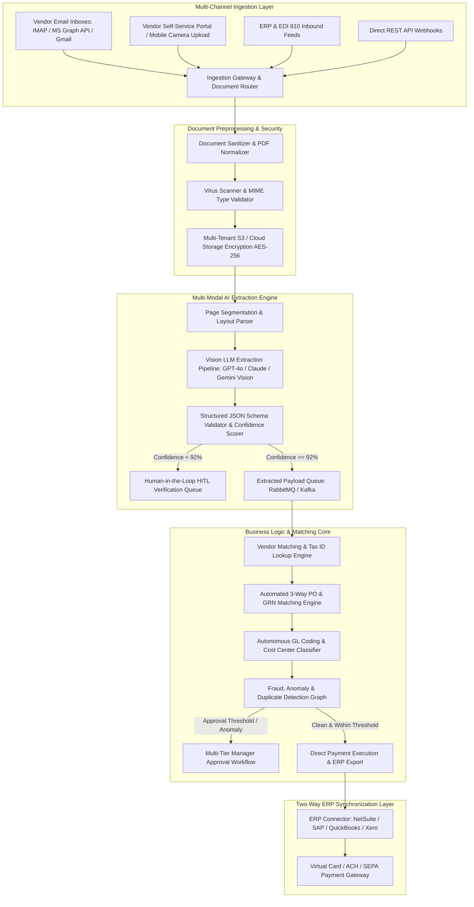

Are you designing a next-generation Accounts Payable (AP) automation platform, building an intelligent invoice processing SaaS, or modernizing an enterprise billing workflow with multi-modal AI in 2026?

Corporate accounting and finance departments across the globe process tens of billions of commercial B2B invoices each year. Yet, despite decades of software adoption, finance teams still spend **over 60% of their operational hours manually opening email PDF attachments, retyping line items into ERPs, chasing departmental approval signatures, and reconciling purchase orders**.

In 2026, forward-thinking CFOs, B2B FinTech startups, and enterprise software vendors are transitioning from brittle, template-based Optical Character Recognition (OCR) to **AI-Native Autonomous Accounts Payable (AP) Automation SaaS Platforms**. By leveraging Multi-Modal Vision LLMs, automated 3-Way PO Matching engines, real-time bidirectional ERP connectors (NetSuite, SAP, QuickBooks, Xero), and graph-based fraud detection algorithms, modern AP platforms achieve **95%+ touchless invoice processing rates with sub-second turnaround times**.

Here is the complete architectural blueprint and engineering guide for building an enterprise-grade AI Accounts Payable and Autonomous Invoice Processing SaaS in 2026.


---

## The Paradigm Shift: From Template OCR to Multi-Modal Vision Intelligence

Traditional accounts payable software relies on legacy zonal OCR (like Tesseract or basic cloud OCR engines) that expects static, pixel-perfect document coordinates. The moment a vendor modifies their invoice layout, relocates their tax ID table, or sends a photographed paper receipt, zonal OCR fails catastrophically—routing the document into manual exception queues.

### Critical Failure Modes of Legacy AP Workflows

1. **Brittle Layout Fragility:** Template-based OCR breaks when invoices contain multi-page itemized tables, varying tax jurisdictions (VAT/GST/Sales Tax), or non-standard header formats.
2. **Disconnected 3-Way Matching:** Human operators must manually compare three separate documents—the **Vendor Invoice**, the **Purchase Order (PO)**, and the **Goods Receipt Note (GRN / Warehouse Receipt)**—to detect discrepancies in unit prices, quantities, and freight charges.
3. **Escalating Fraud & Vendor Impersonation:** Sophisticated spear-phishing attacks (Business Email Compromise - BEC) and altered bank routing numbers slip past standard rule engines, costing global enterprises billions annually.
4. **Batch-Mode ERP Sync Delays:** Traditional middleware batches invoices overnight via scheduled flat-file CSVs, creating stale cash-flow analytics and missed early-payment supplier discounts (e.g., 2/10 Net 30).

### The 2026 Standard: Autonomous AI Accounts Payable Architecture

* **Multi-Modal Document Understanding:** Vision-Language Foundation Models extract structured key-value entities, nested line-item tables, and tax breakdowns across any format, rotation, language, or scan quality without pre-trained templates.
* **Deterministic 3-Way Tolerance Reconciler:** Automated algorithmic reconciliation cross-checks line items against ERP purchase orders and receiving logs with configurable fuzzy-matching tolerances.
* **Autonomous General Ledger (GL) & Cost-Center Coding:** Vector embeddings and historical transaction memory automatically assign correct chart-of-accounts (COA) codes with 98% accuracy.
* **Graph Neural Anomaly & Fraud Detection:** Real-time analysis of vendor bank detail changes, duplicate hash signatures, invoice velocity spikes, and outlier line-item prices.
* **Instantaneous Bidirectional ERP Synchronization:** Event-driven webhooks and REST/GraphQL APIs synchronize vendor data, payment statuses, and journal entries across SAP S/4HANA, Oracle NetSuite, Microsoft Dynamics 365, and QuickBooks Online.

> **Key Financial Impact:** Enterprises deploying autonomous AI AP workflows experience an **82% reduction in cost-per-invoice processed** (from $15.50 down to under $2.10) and cut invoice lifecycle turnaround from **14 days to under 4 hours**.

---

## Enterprise System Architecture Overview

An enterprise-ready AI Accounts Payable SaaS requires a scalable, multi-tenant, event-driven microservices architecture designed for high document throughput, strict data isolation, and bank-grade SOC 2 Type II / ISO 27001 compliance.



---

## Key Subsystems & Technical Implementation

### 1. Multi-Modal Vision Document Extraction Pipeline

Rather than passing raw OCR text strings to an LLM (which loses 2D spatial context and spatial table alignments), modern AP engines use **Multi-Modal Vision LLMs** combined with structured JSON schema constraints.

#### Extraction Process:
1. Convert incoming multi-page PDFs or image captures into high-DPI rendered canvas frames.
2. Segment document regions (Header Metadata, Vendor Block, Remit-To Address, Line-Item Table, Tax Breakdown, Total Summary).
3. Execute structured inference with strict Pydantic / JSON schema validation to guarantee deterministic outputs.

```python
# app/services/ai_extractor.py
import base64
import json
from pydantic import BaseModel, Field
from typing import List, Optional

class InvoiceLineItem(BaseModel):
    item_description: str = Field(description="Description of purchased item or service")
    item_code: Optional[str] = Field(description="Vendor SKU or catalog number")
    quantity: float = Field(description="Quantity ordered/delivered")
    unit_price: float = Field(description="Unit price before tax")
    total_amount: float = Field(description="Calculated line total")
    gl_code_suggestion: Optional[str] = Field(description="Predicted GL code based on description")

class ExtractedInvoiceSchema(BaseModel):
    invoice_number: str
    vendor_name: str
    vendor_tax_id: Optional[str]
    invoice_date: str
    due_date: str
    purchase_order_number: Optional[str]
    currency: str = "USD"
    subtotal: float
    tax_amount: float
    total_amount: float
    bank_account_number: Optional[str]
    bank_routing_number: Optional[str]
    line_items: List[InvoiceLineItem]
    confidence_score: float = Field(ge=0.0, le=1.0)

async def extract_invoice_payload(image_bytes: bytes) -> ExtractedInvoiceSchema:
    # Encodes image frame and sends to Vision LLM with Structured Schema Output
    encoded_b64 = base64.b64encode(image_bytes).decode('utf-8')
    
    prompt = """
    Extract all structured billing metadata from this commercial invoice.
    Carefully preserve line-item quantities, prices, currency symbols, and banking details.
    Verify that line totals sum up exactly to the reported subtotal and grand total.
    """
    
    # Vision LLM structured call invocation (e.g. Gemini 1.5 Pro / GPT-4o)
    # Returns strictly validated ExtractedInvoiceSchema instance
    ...
```

---

### 2. Autonomous 3-Way PO & Goods Receipt Matching Engine

The core value proposition of an enterprise AP system is **automated reconciliation**. The matching algorithm compares three critical data sets:

| Verification Stage | Data Source | Key Fields Validated | Allowed Tolerance |
| :--- | :--- | :--- | :--- |
| **Stage 1: PO Validation** | ERP Purchase Order | PO Number, Vendor ID, Currency, Payment Terms | Exact match on Vendor & Terms |
| **Stage 2: Line Item Reconciliation** | PO Line Items vs. Invoice Items | SKU/Description, Unit Price, Billed Quantity | Price: 0% variance / Qty: +/- 2% |
| **Stage 3: Receiving Verification (GRN)** | Warehouse / Delivery Log | Received Quantity, Delivery Date, Damage Flags | Total Invoiced <= Total Received |

```python
# app/services/matching_engine.py
def execute_3way_matching(invoice: ExtractedInvoiceSchema, erp_po, erp_grn) -> dict:
    match_status = {
        "is_matched": True,
        "variance_amount": 0.0,
        "discrepancies": []
    }
    
    # 1. Vendor Identity Verification
    if invoice.vendor_name.lower() not in erp_po.vendor_name.lower():
        match_status["is_matched"] = False
        match_status["discrepancies"].append("Vendor name mismatch against ERP Purchase Order.")
        
    # 2. Line Item Pricing & Quantity Cross-Check
    for item in invoice.line_items:
        po_item = find_po_line_item(erp_po, item.item_code, item.item_description)
        if not po_item:
            match_status["is_matched"] = False
            match_status["discrepancies"].append(f"Unmatched line item: {item.item_description}")
            continue
            
        # Price tolerance check (e.g. 0.01 currency threshold)
        if abs(item.unit_price - po_item.unit_price) > 0.01:
            match_status["is_matched"] = False
            match_status["discrepancies"].append(
                f"Price variance on {item.item_code}: Invoiced ${item.unit_price}, PO ${po_item.unit_price}"
            )
            
        # GRN quantity check
        received_qty = get_received_quantity(erp_grn, item.item_code)
        if item.quantity > received_qty:
            match_status["is_matched"] = False
            match_status["discrepancies"].append(
                f"Quantity overbilled for {item.item_code}: Invoiced {item.quantity}, Received {received_qty}"
            )
            
    return match_status
```

---

### 3. AI Fraud Detection & Anomaly Prevention

Enterprise AP platforms must serve as an active security perimeter against billing fraud, ghost vendors, and altered banking details.

* **Bank Account Drift Protection:** Whenever an invoice provides a new remit-to bank routing or IBAN number that differs from the verified ERP vendor profile, the platform places an automated hard payment lock and alerts the controller via two-factor out-of-band verification.
* **Exact & Fuzzy Duplicate Invoice Guard:** Compares MD5/SHA256 image hashes, identical invoice numbers, and fuzzy total amounts within rolling 90-day vendor windows.
* **Split Invoice Anomaly Detection:** Detects when multiple small invoices are generated just below a manager's signature threshold (e.g., three $4,950 invoices to bypass a $5,000 threshold).

---

## Technical Comparison: Legacy OCR vs. 2026 AI Vision AP Automation

| Capability / Metric | Legacy OCR AP Systems | 2026 AI-Powered AP SaaS |
| :--- | :--- | :--- |
| **Document Ingestion** | Rigid PDF / TIFF templates only | PDFs, JPGs, mobile camera snaps, multi-page scans, email bodies |
| **Field Extraction Accuracy** | 60% – 75% (Template dependent) | **96% – 99.4%** across zero-shot formats |
| **Line-Item Table Parsing** | High failure rate on multi-page tables | Fully contextual semantic table reconstruction |
| **3-Way Matching** | Manual visual inspection | Fully autonomous programmatic matching with fuzzy tolerance |
| **GL Coding Workflow** | Manual dropdown selection | Contextual AI vector memory prediction (98% auto-coded) |
| **Fraud & Risk Defense** | Static rule-based threshold checks | Graph-based anomaly detection & bank detail change locks |
| **Time to Process Single Invoice** | 2 to 5 business days | **Under 60 seconds (Touchless)** |
| **Average Processing Cost** | $12 – $18 per invoice | **$1.50 – $2.50 per invoice** |

---

## Multi-Tenant Database Schema Architecture

For a scalable B2B AP platform, PostgreSQL with JSONB attributes combined with Row-Level Security (RLS) provides both structured relational guarantees and flexible document storage:

```sql
-- Multi-Tenant Database Schema for AP Automation SaaS
CREATE TABLE organizations (
    id UUID PRIMARY KEY DEFAULT gen_random_uuid(),
    name VARCHAR(255) NOT NULL,
    slug VARCHAR(100) UNIQUE NOT NULL,
    default_currency VARCHAR(3) DEFAULT 'USD',
    created_at TIMESTAMPTZ DEFAULT NOW()
);

CREATE TABLE vendors (
    id UUID PRIMARY KEY DEFAULT gen_random_uuid(),
    org_id UUID REFERENCES organizations(id) ON DELETE CASCADE,
    name VARCHAR(255) NOT NULL,
    tax_id VARCHAR(50),
    erp_vendor_id VARCHAR(100),
    bank_routing_number VARCHAR(100),
    bank_account_encrypted BYTEA,
    is_verified BOOLEAN DEFAULT FALSE,
    created_at TIMESTAMPTZ DEFAULT NOW()
);

CREATE TABLE invoices (
    id UUID PRIMARY KEY DEFAULT gen_random_uuid(),
    org_id UUID REFERENCES organizations(id) ON DELETE CASCADE,
    vendor_id UUID REFERENCES vendors(id),
    invoice_number VARCHAR(100) NOT NULL,
    status VARCHAR(50) DEFAULT 'INGESTED', -- INGESTED, EXTRACTING, REVIEW, MATCHED, APPROVED, PAID
    currency VARCHAR(3) DEFAULT 'USD',
    subtotal NUMERIC(15, 2) NOT NULL,
    tax_amount NUMERIC(15, 2) DEFAULT 0.00,
    total_amount NUMERIC(15, 2) NOT NULL,
    invoice_date DATE NOT NULL,
    due_date DATE NOT NULL,
    file_storage_url TEXT NOT NULL,
    raw_extraction_payload JSONB,
    matching_result JSONB,
    confidence_score NUMERIC(5, 4),
    created_at TIMESTAMPTZ DEFAULT NOW()
);

CREATE TABLE invoice_line_items (
    id UUID PRIMARY KEY DEFAULT gen_random_uuid(),
    invoice_id UUID REFERENCES invoices(id) ON DELETE CASCADE,
    item_description TEXT NOT NULL,
    item_code VARCHAR(100),
    quantity NUMERIC(12, 4) NOT NULL,
    unit_price NUMERIC(15, 4) NOT NULL,
    total_amount NUMERIC(15, 2) NOT NULL,
    gl_code VARCHAR(50),
    cost_center VARCHAR(50)
);

CREATE INDEX idx_invoices_org_status ON invoices(org_id, status);
CREATE INDEX idx_invoices_vendor_num ON invoices(org_id, vendor_id, invoice_number);
```

---

## Frequently Asked Questions (FAQs)

### 1. How does AI AP automation handle non-standard or handwritten invoices?
Modern Vision-Language Models (VLMs) operate directly on high-resolution image embeddings rather than relying on brittle character grids. They understand document topology, semantic handwriting, and foreign languages without needing custom template training. If confidence falls below 92%, the system automatically flags the document for quick one-click human verification.

### 2. Can an AI AP SaaS integrate directly with legacy ERPs like SAP ECC or on-prem NetSuite?
Yes. Enterprise AP platforms utilize hybrid API connectors and secure on-premises data relays. For cloud ERPs (NetSuite SuiteTalk REST/SOAP, SAP S/4HANA OData, QuickBooks Online), communication occurs via bidirectional webhooks and OAuth 2.0. For legacy on-prem systems, secure agent proxies stream encrypted transaction batches.

### 3. What is the difference between 2-Way and 3-Way PO Matching?
2-Way matching reconciles the **Vendor Invoice** directly against the **Purchase Order** (used predominantly for services and subscription expenses). 3-Way matching adds the **Goods Receipt Note (GRN / Warehouse Receipt)** into the validation loop, ensuring that physical inventory was delivered and inspected before payment authorization.

### 4. How are duplicate and fraudulent invoices prevented?
The platform uses multi-layered fraud defense: cryptographic file hashes to detect duplicate uploads, fuzzy string and date matching on invoice numbers, bank detail drift detection that flags unauthorized remittance account changes, and anomaly detection algorithms for unusual transaction spikes.

### 5. What is the typical development timeline for building a custom white-label AP automation platform?
With a specialized development partner like TodayInTech, a fully functional MVP featuring multi-modal invoice extraction, automated 3-way matching, human-in-the-loop validation, and ERP integration can be built and deployed in **4 to 8 weeks**.

---

## Ready to Build Your Custom AI-Powered Invoicing & AP SaaS?

Whether you are launching a high-growth B2B FinTech product, automating multi-entity accounts payable, or modernizing your enterprise ERP billing stack, **TodayInTech** is your dedicated software engineering partner.

* **Explore Our Invoicing Solutions:** Learn more on our [Custom Invoicing & Billing Software Platform](/projects/inventory-billing.html).
* **AI & Automation Capabilities:** Explore our AI workflow platform at [NexBotix Enterprise Automation](/projects/nexbotix.html).
* **Zero Upfront Risk:** We build your functional working prototype first under our [No Upfront Payment Software Agency Model](/blog/no-upfront-payment-software-agency).
* **Schedule an Engineering Consultation:** [Book a 30-Minute Architecture Call with Our Engineering Team](https://calendly.com/todayintechdotin/30min).
