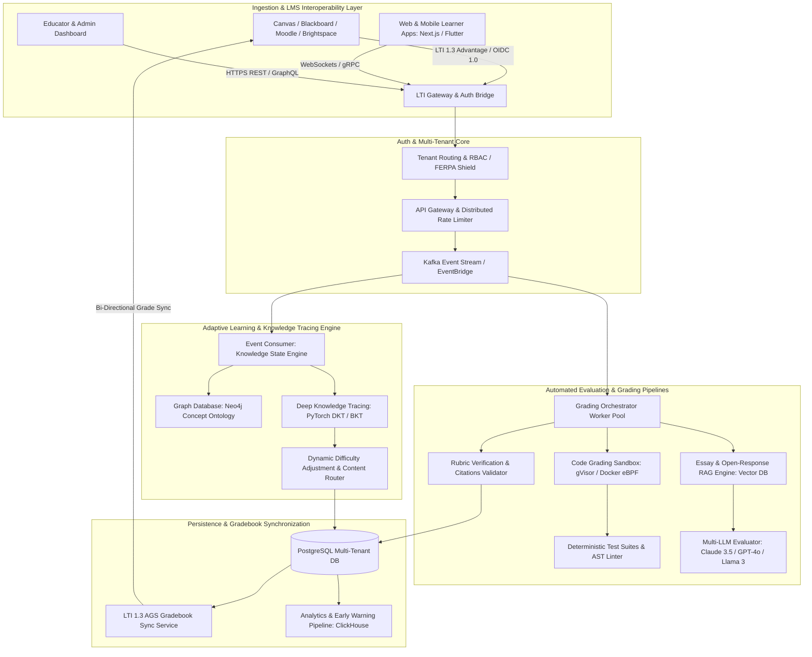
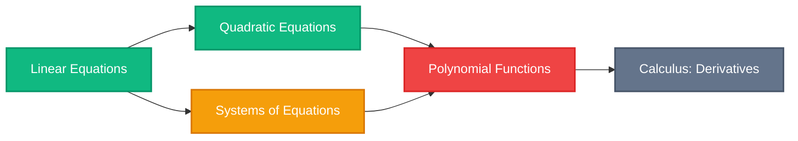
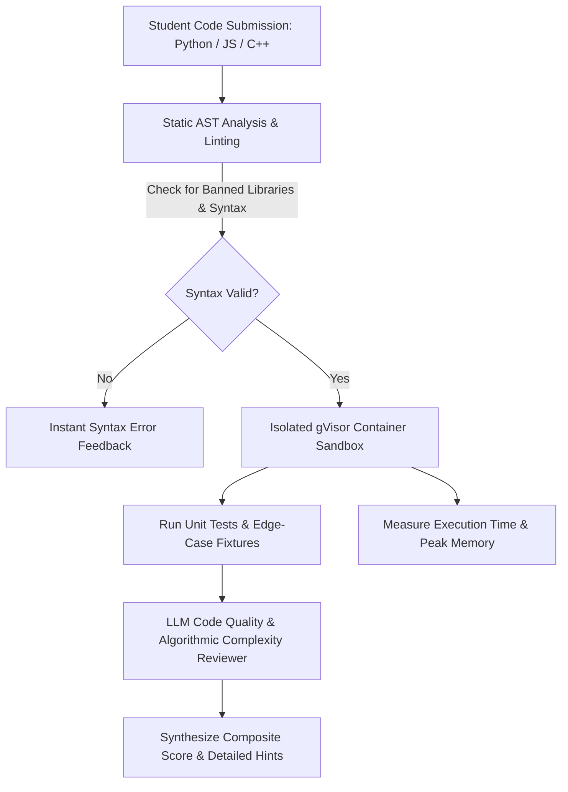

Are you architecting a next-generation adaptive learning platform, building an automated code and essay grading SaaS, or modernizing an enterprise Learning Management System (LMS) with autonomous AI tutoring in 2026?

Education technology is undergoing its most profound structural shift in decades. Traditional Learning Management Systems (LMS) like legacy Moodle, Blackboard, and Canvas installations have historically served as passive digital filing cabinets—storing static PDFs, recording multiple-choice quiz grades, and relaying asynchronous announcements. However, student learning is inherently non-linear, and educators spend up to **40% of their instructional time manually grading repetitive assignments, leaving little room for individualized student interventions**.

In 2026, leading universities, K-12 school districts, enterprise corporate academies, and EdTech startups are adopting **AI-Native Adaptive Learning & Real-Time Automated Grading SaaS Platforms**. By combining Deep Knowledge Tracing (DKT) with concept dependency graphs, sandboxed multimodal code/essay evaluation, and seamless 1EdTech LTI 1.3 Advantage interoperability, modern platforms provide personalized, real-time learning trajectories and instantaneous formative feedback to millions of concurrent learners.

Here is the comprehensive engineering blueprint for architecting, training, securing, and scaling an enterprise-grade AI-powered adaptive learning and automated grading EdTech SaaS in 2026.


---

## The Paradigm Shift: From Passive Static LMS to Real-Time Adaptive Intelligence

Traditional educational platforms operate on rigid, synchronous syllabi where every student progresses through identical modules at identical speeds regardless of mastery. When a student falls behind in foundational prerequisites (e.g., polynomial factoring in algebra), standard LMS platforms continue serving advanced modules, accelerating student disengagement and learning loss.

### Critical Deficiencies of Legacy EdTech Architectures

1. **Delayed Formative Feedback Loops:** Students frequently wait days or weeks to receive graded problem sets and essay critique, by which time the cognitive window for addressing misconceptions has closed.
2. **Coarse-Grained Student Assessment:** Traditional multiple-choice assessments only evaluate whether an answer is correct or incorrect—they cannot diagnose *why* a student arrived at an incorrect step or trace the underlying flawed mental model.
3. **Severe Instructor Grading Burnout:** Evaluating thousands of open-ended coding submissions or subjective essays across large cohorts drains faculty time, causing grading inconsistency and subjective scoring variance.
4. **Data Silos & Weak Interoperability:** Legacy educational software relies on proprietary database schemas and brittle CSV exports rather than modern LTI 1.3 standards, preventing smooth cross-platform grade synchronization.

### The 2026 Standard: AI-Native Adaptive EdTech Platforms

* **Sub-200ms Knowledge State Tracing:** Recurrent neural networks (RNNs) and Graph Neural Networks (GNNs) track probabilistic student concept mastery across complex knowledge graphs in real time.
* **Rubric-Anchored Multimodal Grading:** Retrieval-Augmented Generation (RAG) coupled with Abstract Syntax Tree (AST) parsing evaluates subjective essays and executable code with rigorous, verifiable rubric criteria.
* **1EdTech LTI 1.3 Advantage Native:** Complete bi-directional gradebook synchronization (Assignment and Grade Services - AGS), Deep Linking (LTI-DL), and Names and Role Provisioning Services (NRPS).
* **Zero-Trust Student Privacy & FERPA/COPPA Compliance:** Isolated multi-tenant architecture with encrypted audit logs, anonymized student identifiers, and automated data retention policies.

> **Key Instructional Metric:** Adaptive learning engines powered by real-time knowledge tracing have demonstrated a **28% improvement in exam pass rates** and a **65% reduction in faculty grading turnaround times**.

---

## Enterprise System Architecture Overview

Building a high-throughput, multi-tenant EdTech SaaS requires an event-driven microservices architecture capable of handling millions of concurrent student interactions, streaming AI tutor dialogues, and running isolated code grading sandboxes.



### Architectural Highlights

1. **LTI 1.3 Advantage Gateway:** Utilizes OpenID Connect (OIDC) third-party launch flows with JSON Web Key Sets (JWKS) asymmetric cryptography, allowing single-click LMS launches without sharing user passwords.
2. **Decoupled Kafka Event Bus:** Every user interaction—keystrokes, quiz answers, video pause events, hint requests, and code runs—is serialized as a typed event to Apache Kafka for asynchronous processing.
3. **Sandboxed Code Execution Engine:** Executes untrusted student code inside lightweight, micro-VM sandboxes (utilizing gVisor or WebAssembly) with strict memory, CPU, network, and execution timeouts.
4. **Vector-Augmented Rubric Evaluation:** Breaks complex grading rubrics into modular embeddings stored in Qdrant or Milvus, providing step-by-step scoring with direct quotation citations from student essays.

---

## Deep Knowledge Tracing & Concept Dependency Graphs

At the core of personalized adaptive learning is the capability to continuously estimate a student's hidden mastery state across an interconnected curriculum.



### 1. Bayesian Knowledge Tracing (BKT) vs. Deep Knowledge Tracing (DKT)

Traditional Bayesian Knowledge Tracing models each concept independently as a two-state Hidden Markov Model (Mastered vs. Not Mastered):

* **$P(L_0)$**: Prior probability that the student already mastered the skill.
* **$P(T)$**: Probability of transitioning from unmastered to mastered state after practice.
* **$P(G)$ (Guess)**: Probability that an unmastered student answers correctly by chance.
* **$P(S)$ (Slip)**: Probability that a student who knows the concept makes an accidental error.

Modern AI platforms use **Deep Knowledge Tracing (DKT)** with Long Short-Term Memory (LSTM) or Transformer architectures (Self-Attentive Knowledge Tracing - SAKT). The model takes the historical sequence of student exercise interactions $x_t = (q_t, a_t)$ (where $q_t$ is question ID and $a_t \in \{0, 1\}$ is correctness) and projects student latent mastery across all interconnected concepts simultaneously:

$$h_t = \text{LSTM}(W_{hx} x_t + W_{hh} h_{t-1} + b_h)$$
$$y_t = \sigma(W_{yh} h_t + b_y)$$

Where vector $y_t$ outputs predicted probabilities of answering future exercises across all curriculum nodes correctly.

---

## Automated Grading Pipeline: Sandboxed Code & RAG Rubric Evaluation

Automated grading must be both accurate and explainable. When students or professors dispute a score, the AI engine must provide clear justification rooted in the assigned rubric.

### 1. Sandboxed Programming Assignment Grading

For computer science curricula, assignments pass through a tiered execution pipeline:



* **Security Isolation:** Code runs with zero network egress, read-only file systems, a 512MB RAM ceiling, and a 2.0-second execution cutoff to prevent infinite loops or fork bombs.
* **Semantic Analysis:** Beyond binary unit test pass/fail metrics, an LLM evaluates code readability, asymptotic time/space complexity ($O(N)$ vs $O(N^2)$), and adherence to idiomatic design patterns.

### 2. Multi-Criteria Essay & Open-Response Grading

For humanities, business case studies, and social sciences, the grading engine employs structured **Rubric Decomposition**:

1. **Rubric Parsing:** The rubric is vectorized into hierarchical dimensions (e.g., Thesis Clarity, Textual Evidence, Counterargument Synthesis, Grammar & Cohesion).
2. **Chunked Semantic Search:** The student's text is segmented into logical paragraphs and matched against the rubric vector space.
3. **Constraint-Guided Generation:** The evaluator LLM is prompted with strict JSON schemas, requiring explicit paragraph line numbers as evidence for each assigned score:

```json
{
  "submission_id": "sub_94827104",
  "criterion_scores": [
    {
      "criterion_name": "Thesis & Argumentation",
      "score_awarded": 4,
      "max_score": 5,
      "evidence_quotes": [
        "Paragraph 2 clearly establishes the counterargument regarding market liquidity."
      ],
      "actionable_feedback": "Your thesis is strong, but introduce the macroeconomic impact in your opening paragraph rather than waiting until section 3."
    }
  ],
  "total_score": 92.5,
  "confidence_score": 0.96
}
```

---

## LTI 1.3 Advantage & Modern LMS Interoperability

To sell software to universities and school districts, seamless LMS interoperability is mandatory. 1EdTech LTI 1.3 Advantage replaces legacy LTI 1.1 keys with asymmetric OAuth 2.0 token exchanges.

| LTI 1.3 Service | Protocol Specification | Educational Function |
| :--- | :--- | :--- |
| **Core LTI 1.3** | OIDC Launch + JWT Signature | Authenticates students and instructors without storing passwords |
| **Assignment and Grade Services (AGS v2.0)** | RESTful LineItem & Score Endpoints | Synchronizes scores, sub-scores, feedback comments, and timestamps to the LMS gradebook |
| **Names and Role Provisioning Services (NRPS v2.0)** | Canvas/Moodle Roster API | Automatically syncs course rosters, dropped students, and teacher assistants |
| **Deep Linking (LTI-DL v2.0)** | Content Item Selection Message | Allows instructors to embed specific AI modules or problem sets directly in course modules |

---

## Security, Student Privacy & Regulatory Compliance (FERPA / COPPA)

Educational software handles sensitive minor student records. Enterprise deployments must adhere to rigorous data privacy standards:

1. **FERPA (Family Educational Rights and Privacy Act):** All student Personally Identifiable Information (PII) is encrypted at rest using AES-256 with tenant-specific envelope keys (AWS KMS / GCP Cloud KMS).
2. **Zero Training on Student Data:** AI LLM inference contracts enforce strict Zero Data Retention (ZDR) agreements ensuring student essays, code, and chat transcripts are never utilized for public foundation model training.
3. **Role-Based Access Control (RBAC):** Granular permission tiers segregate student submissions, teaching assistant grading queues, institutional administrator reports, and system audit trails.
4. **COPPA Compliance for K-12:** Verified parental consent workflows and age-gated account provisioning for learners under the age of 13.

---

## Feature Matrix: Custom Anonsoft AI EdTech SaaS vs. Legacy LMS Add-ons

| Capability | Generic Off-The-Shelf LMS Plugins | Custom Anonsoft Built EdTech SaaS |
| :--- | :--- | :--- |
| **Source Code & IP Ownership** | ❌ Proprietary vendor lock-in | ✅ **100% Full IP & Source Code Ownership** |
| **Adaptive Knowledge Tracing** | ❌ Basic linear branching rules | ✅ **Neural Graph Deep Knowledge Tracing (DKT)** |
| **Automated Code & Essay Grading** | ⚠️ Limited string matching & basic regex | ✅ **Sandboxed Execution + Verifiable RAG Rubrics** |
| **LTI 1.3 Advantage Certification** | ⚠️ Often requires paid connector middleware | ✅ **Native LTI 1.3 AGS, NRPS, and Deep Linking** |
| **Multi-Tenant White-Labeling** | ❌ Fixed vendor branding | ✅ **Complete White-Labeling for Resellers & Campuses** |
| **Cloud Hosting & Database Freedom** | ❌ Shared vendor multi-tenant cloud | ✅ **Deploy to your AWS, GCP, Azure, or On-Prem** |
| **Upfront Financial Risk** | ❌ Costly annual recurring enterprise licenses | ✅ **Zero Upfront Payment** (Prototype Delivered First) |

---

## Frequently Asked Questions (FAQs)

### 1. How does the automated essay grading engine prevent AI hallucinations and grading bias?
Our grading engine utilizes a multi-step verification pipeline. The LLM cannot award or deduct points without citing specific text spans directly from the student's submission. Furthermore, an automated confidence scoring model flags edge-case submissions (scores with low model confidence or high score variance) and routes them automatically to human educators for review.

### 2. Can the platform connect with both Canvas and Google Classroom simultaneously?
Yes. Our integration tier implements standard LTI 1.3 Advantage for enterprise LMS platforms (Canvas, Blackboard, Moodle, D2L Brightspace) as well as the Google Classroom REST API and Microsoft Teams for Education, allowing multi-institution EdTech vendors to support any school ecosystem.

### 3. How does the sandbox prevent malicious code execution during automated programming tests?
Student code is executed inside ephemeral, unprivileged Linux micro-VMs managed by gVisor or Firecracker. System calls are virtualized at the user space kernel layer, network egress is completely disabled, and execution is strictly capped by CPU time, memory limits, and file system write quotas.

### 4. What is the recommended technology stack for building this EdTech SaaS?
We recommend:
* **Frontend:** Next.js (React 19), Tailwind CSS, Monaco Editor (for code assignments), KaTeX (for mathematical rendering).
* **Backend:** Node.js (TypeScript) or Go for high-concurrency API gateways; Python (FastAPI, PyTorch) for knowledge tracing and LLM orchestration.
* **Data Storage:** PostgreSQL with Row-Level Security (RLS) for tenant relational data, Neo4j for curriculum knowledge graphs, Qdrant/Milvus for vector rubrics, and Redis for session caching.
* **Execution Environment:** Docker with gVisor / AWS ECS Fargate for sandboxed code grading.

### 5. How long does it take to develop a production-ready AI EdTech MVP?
Using Anonsoft's pre-built modular libraries for LTI 1.3, sandboxed code execution, and knowledge tracing algorithms, a fully functional, white-label AI EdTech MVP can be developed and deployed in **6 to 10 weeks**.

---

## Build Your AI-Powered EdTech Platform with Anonsoft

Are you ready to launch an intelligent adaptive learning platform, build an automated grading SaaS for universities, or white-label a modern school ERP for K-12 school systems?

At **Anonsoft**, we specialize in engineering high-throughput AI SaaS platforms, custom educational technology, and enterprise-grade cloud systems.

* **Explore Our Education Solutions:** Check out our [White-Label School Management ERP](/projects/school-management-system.html).
* **Zero Upfront Risk:** We build your functional working prototype first—you only pay after testing and approving your software.
* **Get Started Today:** [Book a 30-minute Architecture Consultation](/bookademo/) or request a [Free Software Proposal](/free-consultation/).
