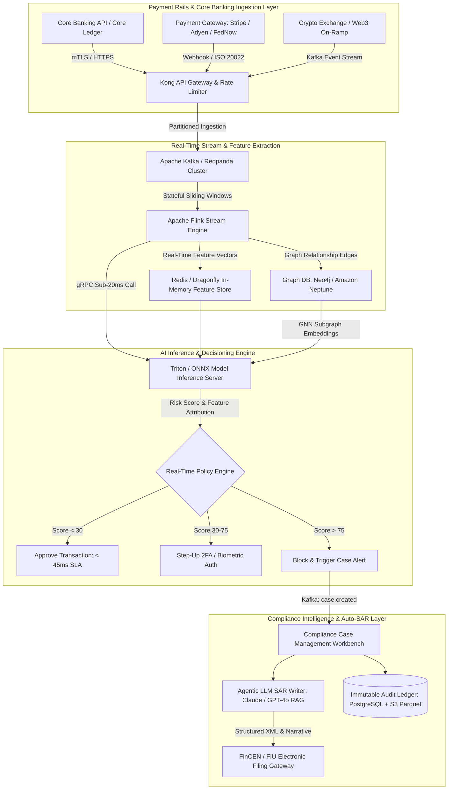
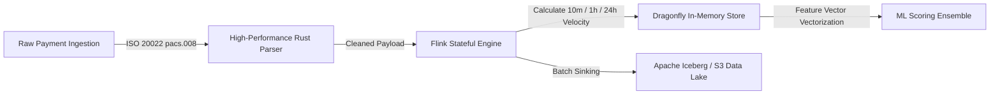
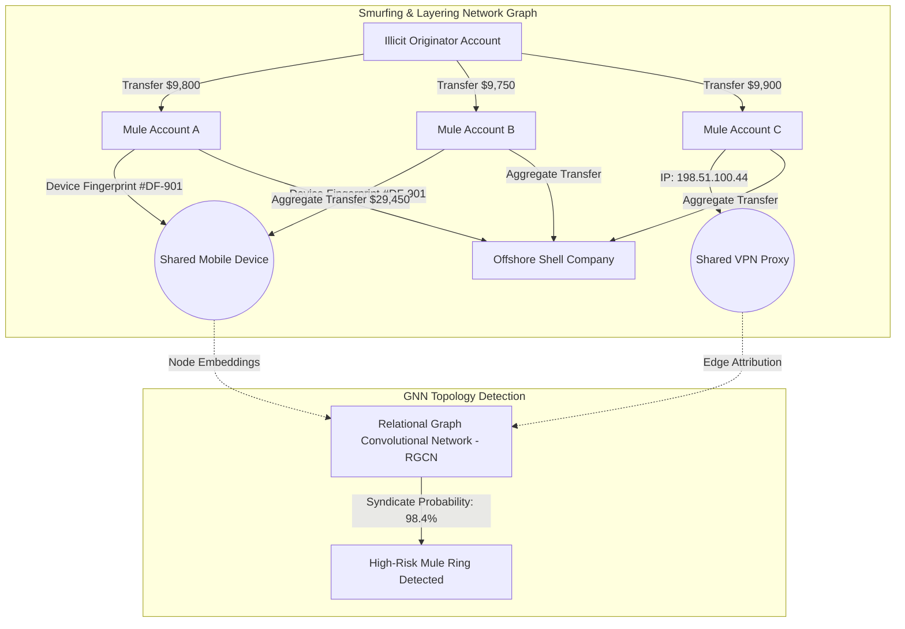
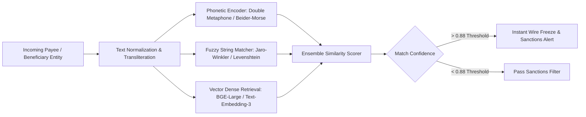
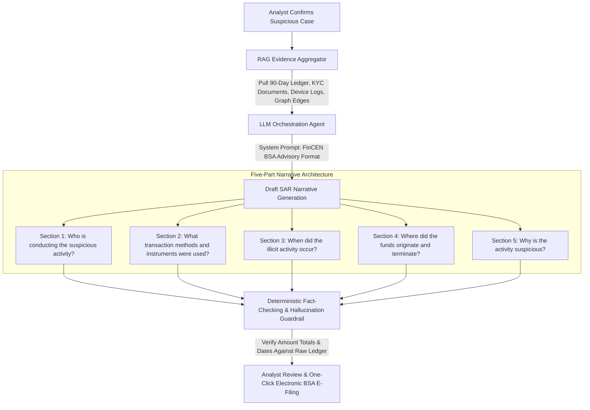

Are you building an enterprise-grade Anti-Money Laundering (AML) compliance platform, launching a next-generation real-time transaction monitoring engine, or architecting a multi-tenant RegTech SaaS for banks, neo-banks, crypto exchanges, and FinTech payment gateways in 2026?

For decades, financial institutions have relied on legacy, static rule-based AML engines (such as Mantas, Actimize, or legacy SQL cron jobs). These systems suffer from staggering inefficiencies: **over 95% false-positive alert rates, 24-to-72 hour batch settlement lag, blind spots against distributed money mule syndicates and smurfing rings, and hundreds of human analyst hours lost manually writing FinCEN Suspicious Activity Reports (SARs)**.

Modern financial networks, powered by instant payment rails like FedNow, SEPA Instant, UPI, and crypto on/off-ramps, demand sub-50ms decisioning. Today\'s FinTech ecosystem requires a platform combining **real-time distributed stream processing, Graph Neural Networks (GNNs) for entity resolution, automated fuzzy sanctions screening, and guardrailed LLMs for automated regulatory reporting**.

Here is the definitive engineering blueprint for architecting, securing, and deploying an AI-powered, real-time AML and Fraud Detection FinTech SaaS platform in 2026.


---

## The Paradigm Shift in FinTech AML & Fraud Prevention

The regulatory landscape across FinCEN (USA), FCA (UK), BaFin (Germany), and FATF global standards has intensified. Financial institutions face multi-million dollar penalties for compliance lapses while losing legitimate customers to clumsy transaction freezes:

| Capability | Legacy Rule-Based AML Systems | Modern AI-Native Real-Time RegTech SaaS (2026) |
| :--- | :--- | :--- |
| **Ingestion & Latency** | Overnight SQL batch jobs (T+1 to T+3 days) | Sub-50ms distributed stream processing (Apache Flink / RisingWave) |
| **Detection Methodology** | Rigid boolean thresholds (e.g., `amount > $10,000`) | Multi-modal ML ensemble (GNNs + Gradient Boosted Trees + Anomaly Autoencoders) |
| **Mule Ring Detection** | Disconnected row-by-row queries; blind to multi-hop networks | Heterogeneous Graph Knowledge Graphs (Neo4j / Amazon Neptune / Memgraph) |
| **False Positive Rate** | 90% – 98% false positives, swamping compliance teams | < 12% false positives with adaptive contextual behavioral baselining |
| **Sanctions & PEP Screening** | Exact string matching or rigid SQL `LIKE` queries | Vector embeddings + phonetics (Double Metaphone) + fuzzy Jaro-Winkler |
| **SAR / Regulatory Filing** | Manual copywriting taking 3–6 hours per case | Automated LLM agent generation with RAG evidence validation in < 30 seconds |
| **Payment Rail Support** | Legacy SWIFT MT103 and NACHA files | Native ISO 20022 XML, FedNow, SEPA Instant, RTP, and Blockchain telemetry |

---

## System Architecture Blueprint

An enterprise AML and Fraud Prevention SaaS requires an ultra-low-latency, horizontally scalable event-driven architecture capable of processing tens of thousands of transactions per second (TPS) while maintaining immutable audit trails:



---

## 5 Core Engineering Modules of a Modern AI-Powered AML SaaS

### 1. Sub-50ms Real-Time Stream Ingestion & Dynamic Feature Engineering

Instant payment networks allow funds to settle irreversibly in seconds. Post-settlement detection is no longer viable—the AML engine must score and intervene before ledger finalization:

* **ISO 20022 XML & JSON Stream Parsing:** The ingestion microservice handles structured financial messaging (`pacs.008` credit transfers, `pain.001` payment initiations, and `camt.053` bank statements), extracting rich metadata including originating BIC/IBAN, ultimate beneficiary, intermediary clearing houses, and remittance strings.
* **Stateful Real-Time Sliding Windows:** Powered by Apache Flink or RisingWave, the stream processor calculates temporal velocity metrics across arbitrary tumbling and sliding windows:
  * Transaction count in the last 60 seconds, 5 minutes, 1 hour, and 24 hours.
  * Ratio of current amount relative to the user's 90-day moving average.
  * Velocity of unique IP addresses, geolocation hops (impossible travel speed), and device fingerprints associated with a single account ID within 10 minutes.
* **In-Memory Feature Serving:** Extracted features are pushed into low-latency memory stores (Redis Enterprise or Dragonfly) with sub-millisecond read access during model inference.



---

### 2. Graph Neural Networks (GNNs) for Mule Ring & Smurfing Detection

Traditional tabular models analyze transactions in isolation. Criminal syndicates circumvent single-transaction limits using **smurfing** (structuring transactions just below reporting thresholds, e.g., $9,900) and **mule networks** (routing illicit funds through hundreds of newly opened intermediary accounts).



* **Heterogeneous Entity Graphs:** The graph engine models accounts, credit cards, bank identification numbers (BINs), device hashes, phone numbers, tax IDs, and IP addresses as heterogeneous nodes. Edges represent fund transfers, shared devices, co-logins, and corporate beneficial ownership.
* **Relational Graph Convolutional Networks (RGCNs):** Instead of static graph heuristics, the system utilizes GNNs (built with PyTorch Geometric or DGL) trained to detect money-laundering topologies (such as fan-in, fan-out, circular layering, and bipartite mixing patterns).
* **Sub-Graph Neighborhood Extraction:** When an alert fires, the system dynamically exports the 3-hop ego-graph of the target entity into interactive 3D WebGL visualizations on the compliance analyst dashboard.

---

### 3. Automated Sanctions, PEP, and Adverse Media Fuzzy Screening

Regulators require real-time screening against global watchlists, including OFAC (Specially Designated Nationals - SDN), UN Security Council, EU Financial Sanctions, UK HMT, and Interpol Red Notices:



* **Multi-Alphabet Transliteration:** Automatically converts Cyrillic, Arabic, Chinese Hanzi, and accented Latin characters into normalized UTF-8 phonetic tokens.
* **Hybrid Match Ensemble:** Combines deterministic exact matching, phonetic algorithms (Double Metaphone, Soundex, Beider-Morse for Slavic/Germanic names), string distance metrics (Jaro-Winkler with prefix scaling), and semantic dense embeddings.
* **Adverse Media NLP Extraction:** Continuously crawls and indexes global financial press, regulatory enforcement notices, and court records using LLM entity extraction to identify unlisted high-risk individuals and politically exposed persons (PEPs) within minutes of publication.

---

### 4. Automated FinCEN Suspicious Activity Report (SAR) Generation with Guardrailed LLMs

Writing regulatory narratives is the most labor-intensive step in financial compliance. A compliance analyst spends an average of 4 hours compiling transaction ledgers, KYC artifacts, and writing the mandatory 5-part SAR narrative:



* **Deterministic Fact-Checking Guardrail:** Before presenting the drafted narrative to the analyst, an automated validation script verifies that every dollar figure, timestamp, account number, and entity name mentioned in the narrative matches the underlying database records with zero hallucination.
* **BSA E-Filing Integration:** Formats the final validated report into the official FinCEN XML schema (BSA E-Filing System batch specifications) for direct electronic submission via API.

---

### 5. Multi-Tenant Tenancy, Audit Logging, and SOC2/PCI-DSS Compliance

Financial software must meet the strictest global data sovereignty, non-repudiation, and encryption standards:

* **Tenant Isolation with PostgreSQL Row-Level Security (RLS):** Every database query enforces tenant isolation at the database kernel level using session variables (`SET LOCAL app.current_tenant_id = 'tenant_xyz'`), preventing data leakage across institutions.
* **Immutable Cryptographic Audit Trail:** All analyst actions—including alert dismissals, threshold adjustments, note attachments, and SAR submissions—are hashed and logged into an append-only cryptographic ledger (similar to AWS QLDB or Merkle-tree verified append logs).
* **Role-Based Access Control (RBAC) & Dual-Control Approvals:** High-stakes actions, such as unfreezing a blocked high-risk transaction or whitelisting a high-volume merchant, require four-eyes verification (dual-signoff from a Level 2 compliance officer and a BSA Officer).

---

## Technical Comparison: Graph DB & Stream Processing Tech Stack for FinTech AML

Selecting the right streaming engine and graph database determines whether your AML platform can scale to tens of thousands of transactions per second:

| Technology Component | Options Evaluated | Recommended Choice | Engineering Rationale |
| :--- | :--- | :--- | :--- |
| **Event Streaming Bus** | Apache Kafka vs Redpanda vs Apache Pulsar | **Apache Kafka / Redpanda** | Proven sub-5ms pub/sub throughput, strict partition ordering by account ID, broad ecosystem support for Flink connectors. |
| **Stream Processing Engine** | Apache Flink vs Spark Streaming vs RisingWave | **Apache Flink** | True event-driven streaming (unlike micro-batch Spark), native RocksDB state backend for sliding window aggregations, sub-10ms state checkpointing. |
| **Graph Database** | Neo4j vs Amazon Neptune vs Memgraph | **Memgraph / Neo4j Enterprise** | In-memory C++ graph execution (Memgraph) delivers the 5ms multi-hop neighborhood traversal speed needed for synchronous payment evaluation. |
| **Inference Serving** | TorchServe vs Triton vs ONNX Runtime | **Triton Inference Server** | Dynamic batching, multi-model concurrent execution on GPU/CPU, and native support for ONNX, TensorRT, and PyTorch backends. |
| **Primary Relational DB** | PostgreSQL vs CockroachDB vs TiDB | **PostgreSQL (with Citus / RDS Aurora)** | Robust Row-Level Security (RLS), ACID compliance for cases and audit logs, JSONB flexibility for dynamic AML rule sets. |

---

## Production Stream Processing Example: Flink Real-Time Velocity & Smurfing Rule in Python

Below is an architecture implementation of a PyFlink streaming job calculating sliding-window transaction velocities and flagging structured smurfing attempts in real time:

```python
from pyflink.table import EnvironmentSettings, TableEnvironment
from pyflink.table.expressions import col, lit

# Initialize PyFlink Streaming Table Environment
env_settings = EnvironmentSettings.in_streaming_mode()
table_env = TableEnvironment.create(env_settings)

# Register Kafka Source for Real-Time ISO 20022 Transactions
table_env.execute_sql("""
    CREATE TABLE transaction_stream (
        transaction_id STRING,
        account_id STRING,
        counterparty_id STRING,
        amount DECIMAL(18, 2),
        currency STRING,
        channel STRING,
        ip_address STRING,
        device_id STRING,
        event_time TIMESTAMP(3),
        WATERMARK FOR event_time AS event_time - INTERVAL '2' SECOND
    ) WITH (
        'connector' = 'kafka',
        'topic' = 'financial.transactions.v1',
        'properties.bootstrap.servers' = 'kafka.fintech.internal:9092',
        'properties.group.id' = 'aml-velocity-engine',
        'format' = 'json',
        'scan.startup.mode' = 'latest-offset'
    )
""")

# Register Alert Sink for High-Risk Smurfing Detection
table_env.execute_sql("""
    CREATE TABLE aml_alert_sink (
        account_id STRING,
        window_start TIMESTAMP(3),
        window_end TIMESTAMP(3),
        tx_count BIGINT,
        total_volume DECIMAL(18, 2),
        avg_amount DECIMAL(18, 2),
        alert_reason STRING
    ) WITH (
        'connector' = 'kafka',
        'topic' = 'aml.alerts.high_priority',
        'properties.bootstrap.servers' = 'kafka.fintech.internal:9092',
        'format' = 'json'
    )
""")

# Execute 10-Minute Sliding Window Aggregation for Smurfing Patterns ($8,000 - $9,999 Structuring)
table_env.execute_sql("""
    INSERT INTO aml_alert_sink
    SELECT 
        account_id,
        TUMBLE_START(event_time, INTERVAL '10' MINUTE) AS window_start,
        TUMBLE_END(event_time, INTERVAL '10' MINUTE) AS window_end,
        COUNT(transaction_id) AS tx_count,
        SUM(amount) AS total_volume,
        AVG(amount) AS avg_amount,
        'SUSPICIOUS_SMURFING_STRUCTURING_PATTERN' AS alert_reason
    FROM transaction_stream
    WHERE amount >= 8000.00 AND amount < 10000.00
    GROUP BY 
        account_id, 
        TUMBLE(event_time, INTERVAL '10' MINUTE)
    HAVING COUNT(transaction_id) >= 3
""")
```

---

## Frequently Asked Questions (Commercial & Technical)

### 1. How does real-time AML scoring impact transaction latency on instant payment rails?
Our modern AML architecture operates on a **dual-tier decisioning model**. The critical path (Tier 1) evaluates lightweight tree ensembles (XGBoost) and in-memory Redis velocity features within **18 to 35 milliseconds**, well below the 100ms budget allowed by Visa, Mastercard, FedNow, and SEPA Instant. Deeper graph traversal and multi-hop GNN inference (Tier 2) execute asynchronously in parallel. If deep risk patterns are identified post-authorization, automated risk mitigation actions (such as secondary withdrawal holds or automated account quarantine) are triggered before final settlement.

### 2. How do you prevent regulatory scrutiny over AI "black-box" decisions?
Regulators (including FinCEN, the Federal Reserve, and the European Banking Authority) strictly prohibit unexplainable AI models in financial compliance. Our platform generates **SHAP (SHapley Additive exPlanations) and TreeSHAP attribution scores** for every alert. When an alert is presented to a compliance officer or auditor, the system displays the exact statistical contributors (e.g., *`+34% due to rapid 5-minute velocity spike`*, *`+28% due to high-risk counterparty geolocation hop`*, *`+18% due to structured amount near $10,000 threshold`*).

### 3. Can the platform be deployed on-premise or in sovereign private clouds?
Yes. Many Tier-1 banks, sovereign wealth funds, and national payment networks require strict on-premise data localization due to strict banking secrecy laws. The entire AML platform is containerized via Kubernetes (Helm charts) and can be deployed in air-gapped environments on AWS Outposts, Google Distributed Cloud, Microsoft Azure Stack, or bare-metal enterprise Kubernetes clusters.

### 4. How does the automated SAR generator handle confidentiality and data protection?
The SAR generation pipeline uses **locally hosted open-weight LLMs (such as Llama-3-70B-Instruct or Mistral-Large deployed via vLLM) with zero third-party API exposure**, or dedicated private Azure OpenAI / AWS Bedrock HIPAA and SOC2-compliant endpoints. All PII (Personally Identifiable Information) undergoes tokenized masking before entering the prompt context and is re-hydrated only during final cryptographic XML schema compilation.

---

## Build Your AI-Powered FinTech AML & RegTech Platform with Anonsoft

Building an enterprise-ready, low-latency Anti-Money Laundering and fraud detection system requires deep domain mastery across distributed stream computing, graph data structures, financial regulatory schemas, and enterprise security.

At **Anonsoft**, we specialize in designing and engineering custom, white-label, and enterprise FinTech platforms:

* **Zero Upfront Payment Prototype:** We architect and deliver a fully functional working prototype of your custom FinTech compliance platform before you pay a single dollar.
* **End-to-End RegTech Engineering:** Full integration with ISO 20022 messaging, Core Banking APIs, Kafka/Flink streaming pipelines, Neo4j/Memgraph graph knowledge networks, and automated FinCEN BSA E-Filing.
* **Enterprise Security & Compliance:** SOC2 Type II compliance readiness, PCI-DSS Level 1 compliance, ISO 27001 standards, and automated cryptographic audit logging.

Ready to build your next-generation AI AML & Fraud Prevention SaaS? [**Schedule a Technical Architecture Demo with Anonsoft Today**](/bookademo/) or explore our custom development services at [**Anonsoft.in**](/).
