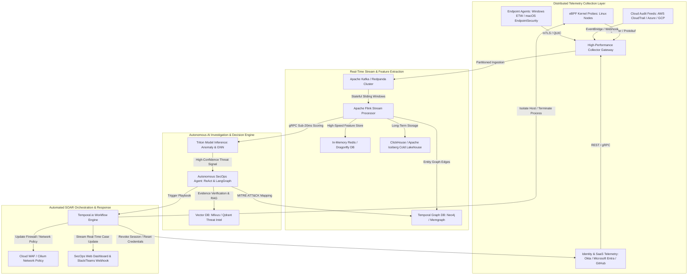

Are you building an enterprise-grade Security Operations Center (SOC) platform, launching a next-generation Extended Detection and Response (XDR) SaaS, or architecting a multi-tenant Managed Detection and Response (MDR) copilot for SecOps teams and Managed Security Service Providers (MSSPs) in 2026?

For the past two decades, enterprise SecOps teams have drowned in an unsustainable avalanche of alerts from legacy SIEM (Security Information and Event Management) and rule-based EDR (Endpoint Detection and Response) tools. Human analysts spend **up to 75% of their working hours manually triaging false positives, copying telemetry hashes across disparate threat intelligence feeds, writing repetitive incident summaries, and stitching together disjointed logs across multicloud environments**.

With the weaponization of generative AI by adversaries—executing hyper-automated polymorphic malware, deepfake-engineered social engineering, and sub-second lateral cloud movement—legacy 15-minute alert cycles and manual playbook triggers are fatal. Modern enterprise cybersecurity demands an **AI-native, autonomous SOC platform powered by in-kernel eBPF real-time telemetry, Graph Neural Networks (GNNs) for MITRE ATT&CK campaign correlation, deterministic agentic triage copilots, and automated sub-second SOAR remediation**.

Here is the definitive engineering blueprint for architecting, building, and deploying an enterprise AI-powered Autonomous Cybersecurity SOC & XDR SaaS platform in 2026.


---

## The Paradigm Shift: Legacy SIEM/EDR vs. Autonomous AI SOC & XDR

Modern enterprise security is shifting from reactive post-breach forensics to proactive, real-time autonomous threat containment:

| Security Dimension | Legacy SIEM & Rule-Based EDR (2015–2023) | Modern Autonomous AI SOC & XDR SaaS (2026) |
| :--- | :--- | :--- |
| **Telemetry Ingestion** | Heavyweight userspace agent polling with 5–15 min delay | In-kernel eBPF probes with zero context-switching overhead (< 5ms latency) |
| **Detection Logic** | Static regex, brittle Sigma/YARA rules, and threshold triggers | Graph Neural Networks (GNNs) + Anomaly Autoencoders + Behavioral Baselines |
| **Alert Fatigue & Noise** | 90%–95% false positive rates, overwhelming Tier-1 analysts | > 88% autonomous noise suppression with dynamic contextual blast-radius analysis |
| **Threat Correlation** | Disconnected row-by-row log tables requiring complex SPL/KQL | Real-time Temporal Knowledge Graphs automatically mapped to MITRE ATT&CK matrix |
| **Incident Investigation** | Manual multi-tab pivot queries across Okta, CrowdStrike, and AWS | Autonomous AI agents executing multi-step diagnostic reasoning & evidence chains |
| **Remediation Speed** | 30–120 minutes Mean Time to Remediate (MTTR) with manual actions | Sub-second automated SOAR playbooks (quarantine host, revoke OAuth, isolate pod) |
| **Multi-Tenancy** | Siloed on-prem instances or expensive single-tenant cloud VMs | Cloud-native multi-tenant Kubernetes with cryptographic tenant data isolation |

---

## System Architecture Blueprint

An enterprise-grade Autonomous SOC and XDR platform requires a fault-tolerant, horizontally scalable event-driven architecture capable of streaming millions of events per second (EPS) with sub-second inference:



---

## Core Technical Modules & Engineering Implementation

Building a competitive autonomous SOC and XDR product requires deep mastery across low-level kernel tracing, distributed stream analytics, LLM reasoning pipelines, and resilient workflow automation.

### 1. In-Kernel eBPF Telemetry Collection Engine

Traditional endpoint monitoring software operates in userspace, requiring frequent CPU context switching that slows down host performance and can be bypassed by rootkits. In 2026, modern XDR systems leverage **eBPF (Extended Berkeley Packet Filter)** to hook directly into Linux kernel tracepoints (`sys_enter_execve`, `sys_enter_connect`, `security_file_open`) with zero overhead:

```c
// ebpf_socket_monitor.c - eBPF kernel program capturing unauthorized outbound C2 traffic
#include <vmlinux.h>
#include <bpf/bpf_helpers.h>
#include <bpf/bpf_tracing.h>
#include <bpf/bpf_core_read.h>

struct security_event_t {
    __u32 pid;
    __u32 uid;
    __u32 daddr;
    __u16 dport;
    char comm[16];
};

struct {
    __uint(type, BPF_MAP_TYPE_RINGBUF);
    __uint(max_entries, 1 << 24); // 16MB ring buffer
} telemetry_events SEC(".maps");

SEC("kprobe/tcp_v4_connect")
int BPF_KPROBE(trace_tcp_v4_connect, struct sock *sk) {
    struct security_event_t event = {};
    __u64 pid_tgid = bpf_get_current_pid_tgid();
    
    event.pid = pid_tgid >> 32;
    event.uid = bpf_get_current_uid_gid() & 0xFFFFFFFF;
    bpf_get_current_comm(&event.comm, sizeof(event.comm));
    
    struct sockaddr_in *usin = (struct sockaddr_in *)PT_REGS_PARM2(ctx);
    if (usin) {
        bpf_core_read(&event.daddr, sizeof(event.daddr), &usin->sin_addr.s_addr);
        bpf_core_read(&event.dport, sizeof(event.dport), &usin->sin_port);
    }
    
    // Submit event asynchronously to userspace daemon ring buffer
    bpf_ringbuf_output(&telemetry_events, &event, sizeof(event), 0);
    return 0;
}

char LICENSE[] SEC("license") = "Dual BSD/GPL";
```

### 2. Real-Time MITRE ATT&CK Stream Correlation (Apache Flink)

Raw logs lack security context. The stream processing layer must correlate distributed events across identities, IP addresses, processes, and cloud workloads within a stateful 10-minute sliding window, tagging suspicious sequences against the **MITRE ATT&CK framework** (e.g., T1078 Valid Accounts + T1059 Command and Scripting Interpreter + T1048 Exfiltration):

```python
# flink_mitre_correlator.py - Apache Flink streaming pipeline for lateral movement detection
from pyflink.table import EnvironmentSettings, TableEnvironment

env_settings = EnvironmentSettings.in_streaming_mode()
table_env = TableEnvironment.create(env_settings)

# Register high-throughput Kafka telemetry source
table_env.execute_sql("""
    CREATE TABLE security_telemetry_stream (
        tenant_id STRING,
        host_id STRING,
        user_identity STRING,
        process_name STRING,
        destination_ip STRING,
        event_time TIMESTAMP(3),
        WATERMARK FOR event_time AS event_time - INTERVAL '5' SECOND
    ) WITH (
        'connector' = 'kafka',
        'topic' = 'secops.telemetry.raw',
        'properties.bootstrap.servers' = 'kafka-cluster.secops.internal:9092',
        'properties.group.id' = 'mitre-correlation-engine',
        'format' = 'json',
        'scan.startup.mode' = 'latest-offset'
    )
""")

# Register Alert Sink for Lateral Movement & Credential Dumping
table_env.execute_sql("""
    CREATE TABLE soc_incident_sink (
        tenant_id STRING,
        host_id STRING,
        user_identity STRING,
        window_start TIMESTAMP(3),
        window_end TIMESTAMP(3),
        distinct_destinations BIGINT,
        suspicious_process_count BIGINT,
        mitre_tactic STRING,
        severity STRING
    ) WITH (
        'connector' = 'kafka',
        'topic' = 'secops.incidents.triage',
        'properties.bootstrap.servers' = 'kafka-cluster.secops.internal:9092',
        'format' = 'json'
    )
""")

# Detect Sudden Internal Fan-Out Port Scans (Lateral Movement - T1046)
table_env.execute_sql("""
    INSERT INTO soc_incident_sink
    SELECT 
        tenant_id,
        host_id,
        user_identity,
        TUMBLE_START(event_time, INTERVAL '5' MINUTE) AS window_start,
        TUMBLE_END(event_time, INTERVAL '5' MINUTE) AS window_end,
        COUNT(DISTINCT destination_ip) AS distinct_destinations,
        COUNT(process_name) AS suspicious_process_count,
        'TA0008: Lateral Movement - Network Service Discovery (T1046)' AS mitre_tactic,
        'HIGH' AS severity
    FROM security_telemetry_stream
    WHERE process_name IN ('powershell.exe', 'bash', 'nc', 'curl', 'nmap', 'python3')
    GROUP BY 
        tenant_id,
        host_id,
        user_identity,
        TUMBLE(event_time, INTERVAL '5' MINUTE)
    HAVING COUNT(DISTINCT destination_ip) >= 20
""")
```

### 3. Autonomous SecOps Agentic Investigation Pipeline

When an alert is flagged, an autonomous AI investigation agent executes multi-hop forensic reasoning:
1. **Pulls identity telemetry** from Okta/Entra (check MFA status, recent location anomalies, device posture).
2. **Queries threat intelligence feeds** (VirusTotal, AlienVault OTX, CISA KEV) via vector RAG.
3. **Traverses the graph database** to construct the complete blast radius (which pods, databases, and microservices have this node communicated with?).
4. **Synthesizes an executive summary, technical timeline, and proposed remediation plan** in under 15 seconds.

```python
# autonomous_soc_agent.py - Agentic SecOps incident investigator
from dataclasses import dataclass
from typing import List, Dict, Any
import json

@dataclass
class ThreatEvidence:
    source_ip: str
    target_host: str
    mitre_technique: str
    confidence_score: float
    ioc_hashes: List[str]

class AutonomousSOCInvestigator:
    def __init__(self, threat_intel_client, graph_db_client, orchestrator_client):
        self.intel = threat_intel_client
        self.graph = graph_db_client
        self.orchestrator = orchestrator_client

    async def investigate_incident(self, incident_payload: Dict[str, Any]) -> Dict[str, Any]:
        tenant_id = incident_payload["tenant_id"]
        host_id = incident_payload["host_id"]
        user = incident_payload["user_identity"]
        
        # Step 1: Query Blast Radius Graph
        blast_radius = await self.graph.get_entity_blast_radius(tenant_id, host_id, max_hops=3)
        
        # Step 2: Correlate IP/Hash Reputation via Threat Intel Vector RAG
        threat_verdict = await self.intel.evaluate_indicators(incident_payload.get("iocs", []))
        
        # Step 3: Compute Autonomous Risk Score
        risk_score = self.compute_risk_score(threat_verdict, blast_radius, incident_payload["severity"])
        
        # Step 4: Determine Automated Remediation Action
        recommended_actions = []
        if risk_score > 0.85:
            recommended_actions = [
                {"action": "ISOLATE_K8S_POD", "target": host_id, "policy": "DENY_ALL_INGRESS_EGRESS"},
                {"action": "REVOKE_IAM_SESSION", "target": user, "invalidate_refresh_tokens": True},
                {"action": "BLOCK_MALICIOUS_IP", "target": incident_payload.get("destination_ip"), "duration": "24h"}
            ]
            
            # Execute automated SOAR workflow via Temporal
            await self.orchestrator.trigger_playbook(
                playbook_id="critical-containment-v2",
                tenant_id=tenant_id,
                actions=recommended_actions
            )
            
        return {
            "incident_id": incident_payload.get("incident_id"),
            "risk_score": risk_score,
            "status": "CONTAINED_AUTOMATICALLY" if risk_score > 0.85 else "PENDING_ANALYST_APPROVAL",
            "blast_radius_nodes": len(blast_radius),
            "threat_verdict": threat_verdict,
            "executed_actions": recommended_actions,
            "forensic_summary": f"Autonomous agent contained suspicious lateral movement on host {host_id} initiated by user {user}."
        }

    def compute_risk_score(self, threat_verdict: Dict, blast_radius: List, base_severity: str) -> float:
        base = 0.5 if base_severity == "MEDIUM" else 0.8
        multiplier = 1.2 if len(blast_radius) > 10 else 1.0
        return min(1.0, (base * multiplier))
```

---

## Security, Multi-Tenancy & Enterprise Compliance

Enterprise SOC and XDR platforms handle sensitive customer audit logs, network packets, and credentials. Architecting for enterprise buyers requires adhering to strict compliance standards:

1. **Cryptographic Tenant Isolation:** Every log partition in Kafka, table namespace in ClickHouse, and vector embedding collection in Milvus is encrypted with unique per-tenant AWS KMS / Vault customer-managed keys (CMKs).
2. **SOC 2 Type II & FedRAMP High Ready:** Immutable append-only audit logging for all automated SOAR playbook actions, ensuring zero tampering during external audits.
3. **Data Localization & Zero-Data Retention Mode:** For defense contractors and European clients subject to GDPR / NIS2, the platform offers local edge-processing agents that execute LLM inference on-premise without transferring telemetry to cloud backends.

---

## Frequently Asked Questions (Technical & Commercial)

### 1. How does an AI-powered SOC prevent catastrophic automated containment mistakes?
Our autonomous SOC architecture implements a **calibrated dual-mode governance model**. Low-risk diagnostic actions (enriching logs, scanning endpoints, querying threat feeds) run autonomously 100% of the time. High-impact destructive containment actions (isolating production database clusters or revoking executive credentials) require either:
- A statistically proven risk score exceeding `0.95` with corroborated multi-sensor evidence (e.g., eBPF network probe + active EDR malware signature + anomalous Okta login from a Tor exit node).
- A single-click human-in-the-loop authorization prompt delivered directly to SecOps Slack/Teams or PagerDuty.

### 2. What is the query latency difference between ClickHouse and traditional Elasticsearch for SecOps?
ClickHouse provides **5x to 15x faster vector aggregation and columnar search speeds while consuming 60% to 75% less RAM and disk storage compared to Elasticsearch**. For high-volume cybersecurity telemetry exceeding 50,000 EPS, ClickHouse's columnar compression (ZSTD/LZ4) and vectorized SIMD execution allow SecOps analysts to query months of historical logs in sub-second timelines.

### 3. Can TodayInTech build a white-label version of this SOC/XDR platform for our MSSP?
Yes. TodayInTech specializes in developing custom, enterprise-grade white-label cybersecurity software. We provide the complete frontend dashboard (Next.js, Tailwind, Three.js 3D threat maps), real-time streaming backend (Kafka, Flink, ClickHouse), eBPF agent binaries, and custom LLM triage agents branded under your company name with full source code ownership.

### 4. How does TodayInTech's zero upfront payment model work for cybersecurity software?
We operate with a **working prototype first, zero upfront payment** guarantee. Our engineering team designs and builds a functional prototype of your custom SOC/XDR dashboard with working telemetry feeds and AI triage workflows before you pay a single cent. You review the functional build, test the architecture, and only proceed once fully satisfied.

---

## Build Your AI-Powered Cybersecurity SOC & XDR SaaS with TodayInTech

Engineering a low-latency, scalable, and resilient autonomous cybersecurity platform demands specialized expertise in Linux kernel internals, distributed real-time streaming, enterprise identity protocols, and advanced AI reasoning architectures.

At **TodayInTech**, we help cybersecurity startups, enterprises, and MSSPs bring state-of-the-art security software products to market:

* **Zero Upfront Payment Guarantee:** We architect and deliver a fully functional working prototype of your custom SOC/XDR SaaS before taking any payment.
* **Full-Stack Security Engineering:** In-kernel eBPF probes, ClickHouse/Flink streaming pipelines, MITRE ATT&CK knowledge graphs, and automated SOAR orchestration.
* **Enterprise Security Standards:** SOC 2 Type II, ISO 27001, and HIPAA compliance readiness with per-tenant cryptographic isolation.

Ready to launch your enterprise AI SOC & XDR platform? [**Book a Technical Architecture Session with TodayInTech**](/bookademo/) or explore our custom engineering services at [**TodayInTech.in**](/).
