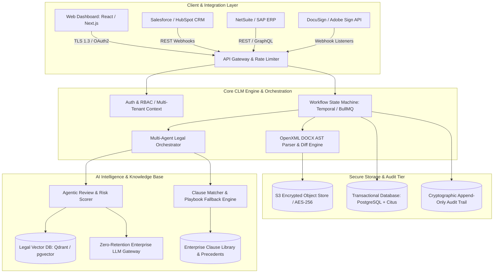
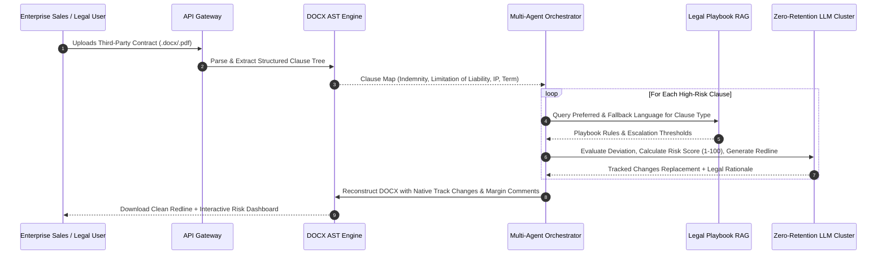

Are you building an enterprise Contract Lifecycle Management (CLM) SaaS, modernizing corporate legal ops workflows, or embedding autonomous contract negotiation engines into your B2B enterprise software in 2026?

Enterprise sales and procurement cycles routinely grind to a halt during legal review. Sales teams wait 3 to 6 weeks for standard Non-Disclosure Agreements (NDAs), Master Services Agreements (MSAs), and Statements of Work (SOWs) to pass through backlogged internal legal departments. Meanwhile, manual redlining on third-party paper introduces costly human errors, overlooked indemnification caps, and compliance drift.

In 2026, leading enterprise software companies are shifting away from static document repositories toward **Autonomous Agentic CLM Platforms**. By pairing multi-agent LLM orchestrators with abstract syntax tree (AST) document parsers, legal vector retrieval-augmented generation (RAG), and bidirectional ERP/CRM integrations, modern CLM platforms compress contract turnaround cycles from weeks to minutes while enforcing airtight governance.

Here is the comprehensive engineering guide to architecting, building, and deploying a scalable, SOC 2-compliant AI-powered B2B Contract Lifecycle Management SaaS.


## The Shift from Static Document Vaults to Autonomous Legal AI Agents

Legacy CLM systems (built in the 2010s) were little more than digital filing cabinets with basic workflow approval checkboxes. They lacked semantic comprehension of contract language, offered zero assistance during redlining negotiations, and failed to extract actionable business intelligence from executed agreements.

### Fundamental Flaws of Traditional CLMs
1. **Manual Third-Party Paper Processing:** When a vendor or enterprise customer submits their own paper, legacy systems cannot automatically align unfamiliar clauses against company fallback standards.
2. **Brittle Regex & Template Matchers:** First-generation CLMs relied on rigid keyword rules that broke whenever phrasing varied, creating thousands of false-positive compliance warnings.
3. **Disconnected Execution & ERP Silos:** Once signed, critical milestone obligations, auto-renewal triggers, and tiered volume discounts became locked in flat PDFs, forcing manual re-entry into NetSuite, Salesforce, or SAP.
4. **Negotiation Fatigue & Deal Slippage:** Enterprise sales reps lose end-of-quarter momentum while waiting for in-house counsel to review boilerplate commercial terms.

### The 2026 Paradigm: Autonomous Agentic CLM 3.0
* **Multi-Agent Negotiation Pipelines:** Autonomous AI agents intake third-party redlines, evaluate clauses against company playbooks, calculate risk scores, and generate native Word (.docx) track-changes revisions with explanatory comments in seconds.
* **OpenXML AST Manipulation:** Precise programmatic manipulation of `.docx` formatting trees ensures perfect preservation of enterprise styles, numbering hierarchies, tables, and signature blocks.
* **Hybrid Legal RAG:** Dense vector search combined with keyword BM25 retrieval over historical negotiation precedents and corporate clause fallback libraries.
* **Continuous Post-Signature Obligation Sync:** Automated webhooks push payment milestones, SLA thresholds, and renewal dates directly into ERP, billing, and accounting systems.

> **Key Business Impact:** Deploying an agentic AI CLM platform cuts contract cycle times by **78%**, reduces external legal spend by **60%**, and eliminates revenue leakage from missed renewals and untracked service credits.

---

## Technical Architecture of an Enterprise AI CLM Platform

Building a multi-tenant AI CLM platform requires a resilient, event-driven microservices architecture designed for high-concurrency document parsing, asynchronous agent evaluation, and zero-data-retention AI inference.



### Core Architecture Components

1. **Workflow State Machine (Temporal / BullMQ):** Orchestrates long-running multi-stage contract lifecycles (Drafting → Internal Approvals → Counterparty Negotiation → e-Signature → Post-Execution Monitoring) with bulletproof idempotency and rollback handling.
2. **DOCX OpenXML AST Parsing Service:** A dedicated high-performance Go/Rust microservice that decomposes Word documents into structured XML nodes, extracts individual clauses, computes structural diffs, and synthesizes native Track Changes markup without corrupting styling metadata.
3. **Multi-Agent Legal Orchestrator:** A LangGraph or Temporal-backed agentic framework coordinating specialized AI agents (Clause Extractor, Risk Analyzer, Fallback Matcher, and Redline Synthesizer).
4. **Legal RAG & Vector Knowledge Base:** Houses historical company contracts, corporate negotiation playbooks, and jurisdictional legal standards using dense semantic vector indexes (Qdrant / pgvector) paired with sparse BM25 indexing.
5. **Cryptographic Audit Ledger:** Maintains an immutable hash chain of every document revision, user interaction, AI recommendation, and legal approval for auditability in litigation or SOC 2 compliance reviews.

---

## The Autonomous Multi-Agent Redlining Pipeline

When counterparty paper or incoming redlines arrive, the platform executes a sequential, deterministic multi-agent pipeline:



### 1. Document Deconstruction & Clause Segmentation
Incoming contracts (PDFs or DOCX) are ingested and converted into clean paragraph-level OpenXML trees. Optical Character Recognition (OCR) with deep layout analysis handles scanned documents, while programmatic tokenizers segment contracts into distinct legal modules:
* Preamble & Recitals
* Service Scope & Performance Milestones
* Intellectual Property & Ownership
* Warranties & Representations
* Indemnification & Defense Obligations
* Limitation of Liability & Super-Caps
* Data Privacy & Security (GDPR/CCPA/HIPAA)
* Termination & Dispute Resolution

### 2. Semantic Comparison against Corporate Playbooks
Each clause is embedded using specialized legal domain embeddings (e.g., `text-embedding-3-large` or fine-tuned legal bi-encoders) and evaluated against the enterprise's configured **Legal Playbook**:
* **Standard / Preferred Position:** Green-lighted terms that require zero modification.
* **Secondary Fallback Position:** Acceptable compromises (e.g., agreeing to mutual indemnification if capped at 2x annual contract value).
* **Escalation Triggers (Red Flags):** Uncapped liability, broad consequential damages waivers, or aggressive exclusivity demands that immediately flag the deal for General Counsel review.

### 3. Native Track-Changes Generation
Rather than outputting conversational summaries, the AI engine directly synthesizes exact OpenXML diff tags (`<w:ins>` for insertions and `<w:del>` for deletions). It also attaches detailed contextual comments in the Word margin citing company policy, reducing back-and-forth negotiation friction with counterparty counsel.

---

## Key Technical Challenges & Enterprise Solutions

```
+------------------------------------+-----------------------------------------------------+---------------------------------------------------------+
| Engineering Challenge              | Naive Approach (Fails in Production)                | Production-Grade Solution (Anonsoft Blueprint)        |
+------------------------------------+-----------------------------------------------------+---------------------------------------------------------+
| Document Formatting Preservation   | Converting DOCX to HTML/Markdown and exporting back | Direct OpenXML AST manipulation with native diff engine |
| Hallucinated Legal Precedents      | Unconstrained generic LLM generation                | Constrained RAG with exact clause playbook fallbacks    |
| Multi-Party Concurrent Edits       | File locking / overwrite collision                  | Operational Transformation (OT) or CRDT block ledgers   |
| Enterprise Data Confidentiality    | Passing contracts to public shared model endpoints  | Zero-retention VPC endpoints with client-side KMS keys  |
| Post-Signature ERP Sync Latency    | Manual periodic CSV exports by finance staff        | Event-driven webhooks with JSON Schema validation       |
+------------------------------------+-----------------------------------------------------+---------------------------------------------------------+
```

### 1. High-Fidelity OpenXML AST Modification
One of the most complex engineering hurdles in LegalTech is manipulating Microsoft Word documents without destroying header styles, numbered nested lists, cross-references, or footers. 

Modern platforms avoid naive HTML round-tripping. Instead, they utilize custom Go/Rust OpenXML parsers that isolate text run nodes (`<w:r>`), evaluate diffs using Myers' diff algorithm, and wrap updated tokens in standard OpenXML revision markers (`<w:rPr>`, `<w:ins>`, `<w:delText>`). This ensures the counterparty receives a standard Microsoft Word file completely compatible with standard enterprise desktop software.

### 2. Multi-Tenant Legal RAG & Clause Indexing
Enterprise legal teams demand strict segregation of negotiation playbooks between business units, subsidiaries, and geographic jurisdictions:
* **Hierarchical Metadata Filtering:** RAG vector queries are filtered by jurisdiction (US Delaware vs. UK Common Law vs. EU Civil Law), contract type (Vendor Procurement vs. Customer Sales), and deal size tiers.
* **Hybrid Vector & Lexical Search:** Combining vector similarity (cosine metric on dense embeddings) with BM25 keyword matching ensures exact legal terms of art (e.g., *"gross negligence"*, *"willful misconduct"*, *"SOC 2 Type II"*) are never diluted by semantic approximations.

---

## Deep Integrations: Connecting Legal to Sales & Finance

A modern CLM must not live in isolation. It acts as the intelligent orchestration hub connecting front-office CRM systems to back-office ERP and billing engines.

```mermaid
graph LR
    subgraph Front Office (CRM)
        A[Salesforce / HubSpot] -->|Opportunity Won| B[Auto-Generate MSA / SOW]
    end

    subgraph AI CLM Core
        B --> C[AI Review & Redline Negotiation]
        C --> D[e-Signature Orchestration]
    end

    subgraph Back Office (ERP & Billing)
        D -->|Contract Executed| E[NetSuite / QuickBooks / Stripe]
        D -->|Obligations & SLAs| F[Jira / ServiceNow Task Engine]
        D -->|Renewal Schedule| G[Automated Churn & Upsell Alerts]
    end
```

1. **CRM Auto-Drafting (Salesforce CPQ / HubSpot):** Sales reps click a single button within Salesforce to generate custom SOWs populated with approved pricing matrices, discount structures, and product SKUs.
2. **Automated e-Signature Routing:** Native connectors for DocuSign, Adobe Sign, and self-hosted Web Crypto-based e-signature modules handle sequential multi-signatory signing ceremonies with automatic SMS/email OTP authentication.
3. **ERP Metadata Ingestion:** Upon signature execution, the CLM's extraction agent parses all payment terms (Net 30/60/90), line-item schedules, and auto-renewal notice periods (e.g., 60-day written notice), automatically seeding billing schedules in NetSuite or SAP.

---

## Enterprise Security, SOC 2 Compliance & Data Privacy

For enterprise legal departments, data privacy is non-negotiable. Building a commercially viable CLM SaaS requires strict security baselines:

1. **Zero Data Retention LLM Agreements:** All inference calls are routed through enterprise VPC gateways with strict zero-data-retention and zero-training guarantees (e.g., Azure OpenAI Service, AWS Bedrock, or private self-hosted vLLM clusters).
2. **Client-Side Envelope Encryption:** Contracts stored at rest are encrypted with tenant-specific Customer Managed Encryption Keys (CMEK) using AES-256-GCM.
3. **Granular RBAC & Redaction:** Sensitive PII, financial figures, or confidential trade secrets can be automatically masked before being processed by human reviewers or AI agent pipelines.
4. **Comprehensive SOC 2 Type II & HIPAA Readiness:** Append-only audit logs capture every user session, prompt input, AI suggestion, and document download with immutable cryptographic hashes.

---

## Frequently Asked Questions (FAQs)

### How does an AI CLM handle custom third-party paper without predefined templates?
Modern AI CLMs use multi-agent LLMs paired with legal domain embeddings to classify and analyze arbitrary contract layouts. The AI segments the incoming PDF or Word document into discrete legal concepts (indemnity, governing law, warranties) and measures them semantically against your organization's legal playbook rules, regardless of formatting or phrasing variations.

### Can an AI-powered CLM generate native Microsoft Word track changes?
Yes. Production-grade platforms manipulate the underlying OpenXML Abstract Syntax Tree (AST) directly. Instead of generating plain text, the engine injects standard `<w:ins>` (insertion) and `<w:del>` (deletion) XML tags along with margin comments, producing clean `.docx` files fully editable in desktop Microsoft Word.

### What is the difference between legacy CLMs and 2026 Agentic AI CLMs?
Legacy CLMs act as document storage vaults with manual approval workflows and brittle regex keywords. In contrast, 2026 Agentic AI CLMs autonomously read third-party drafts, calculate risk scores, generate redline counter-proposals based on company fallbacks, and sync post-execution obligations directly into ERP and CRM systems without manual data entry.

### How are enterprise customer contracts protected from LLM training data exposure?
Enterprise AI CLM platforms use dedicated private VPC endpoints with certified zero-data-retention agreements. Prompts, extracted text, and documents are processed entirely in ephemeral memory and are never stored or used to train public foundation models. Additionally, tenant data is partitioned at rest using isolated database schemas and client-managed encryption keys.

### How does Anonsoft build custom AI CLM and LegalTech platforms?
Anonsoft specializes in custom enterprise SaaS development with a unique zero-upfront payment model. Our engineering team designs the complete cloud architecture, OpenXML parsing engine, legal RAG pipeline, and CRM/ERP connectors, delivering a fully functional prototype before any billing commences.

---

## Build Your Enterprise AI CLM SaaS with Anonsoft

Developing an enterprise-ready AI Contract Lifecycle Management SaaS or embedding autonomous contract review into your existing B2B platform requires specialized expertise across document parsing, distributed state machines, legal vector RAG, and bank-grade security protocols.

At **Anonsoft**, we eliminate software development risk:
* **Zero Upfront Payment:** We design, architect, and construct your functional prototype first. You pay only after you test and approve the working software.
* **Production-Grade LegalTech Engineering:** Scalable OpenXML AST engines, multi-agent redlining pipelines, high-speed vector retrieval, and SOC 2-ready architectures.
* **Full Source Code Ownership:** 100% intellectual property ownership with full source code, CI/CD deployment pipelines, and zero vendor lock-in.

Ready to launch your AI CLM or LegalTech platform? [**Schedule a Free Architecture Consultation**](/free-consultation) or explore our [**Enterprise AI & SaaS Engineering Services**](/services).
