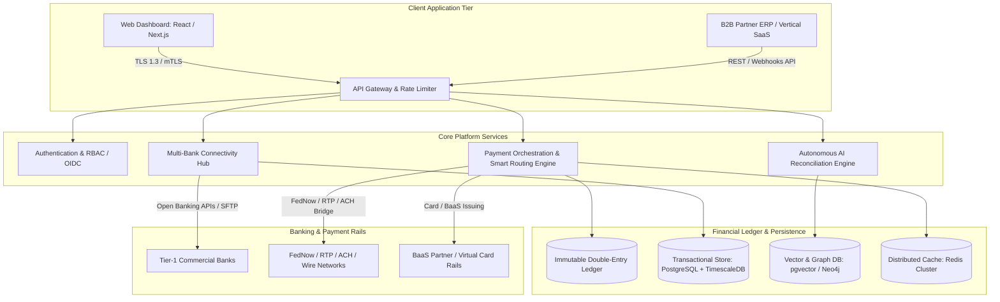
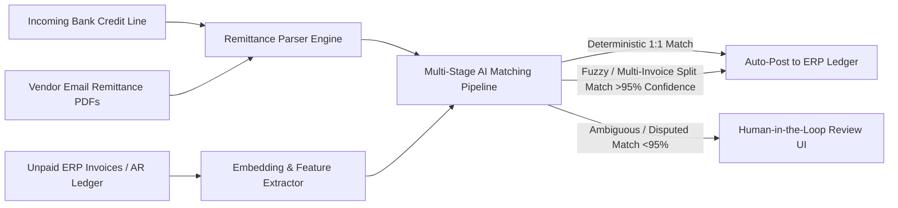
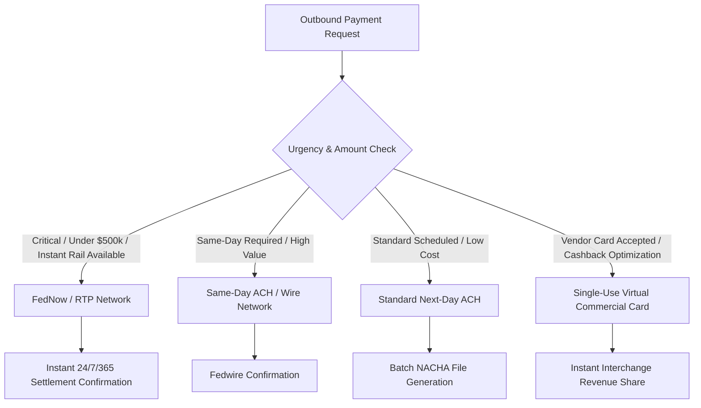

Are you designing an enterprise treasury management system (TMS), building embedded B2B payment workflows into your vertical SaaS platform, or launching a multi-tenant corporate cash liquidity management platform in 2026? 

Modern enterprises and mid-market finance teams manage liquidity across dozens of disparate commercial banking portals, struggle with opaque 3-day batch ACH settlement windows, and spend hundreds of hours manually reconciling bank statements against ERP ledgers. In 2026, building next-generation FinTech infrastructure requires unified open banking aggregation, instant clearing rails (FedNow, RTP, SEPA Instant), immutable double-entry ledger cores, and autonomous AI agents for automated reconciliation.

Here is the definitive engineering blueprint for architecting, securing, and deploying an enterprise-grade AI-powered B2B payments and multi-bank treasury management SaaS.


## The Evolution from Siloed Bank Portals to Autonomous B2B Treasury

For decades, corporate treasury and accounts payable/receivable (AP/AR) teams operated in an archaic, fragmented environment:
1. **Manual Portal Juggling:** Corporate treasurers log into 5 to 15 different commercial bank interfaces each morning, manually exporting BAI2, MT940, or CSV statement files.
2. **Batch ACH Latency & Float Inefficiency:** Traditional ACH transactions take 2 to 4 business days to clear, trapping millions in working capital and increasing counterparty credit risk.
3. **Fragile ERP Integration:** Legacy ERPs (SAP, NetSuite, Oracle) rely on batch night-run flat files that routinely fail on corrupted character encodings or misaligned bank reference numbers.
4. **Labor-Intensive Reconciliation:** Over 65% of mid-market B2B transactions require manual human intervention to match invoices to incoming partial payments, wire fees, and cross-border FX conversions.

In 2026, modern B2B SaaS platforms and corporate finance teams are consolidating operations into **Unified Autonomous Treasury Engines**:
* **Real-Time Instant Settlement:** Leveraging Federal Reserve **FedNow**, The Clearing House **RTP**, and European **SEPA Instant** rails with ISO 20022 rich structured payment metadata.
* **Virtual Accounts & Sub-Ledger Isolation:** Programmatic generation of virtual IBANs/vFBO accounts for automatic one-to-one invoice reconciliation.
* **Autonomous AI Reconciliation Agents:** Large language models and graph matching algorithms that parse unstructured remittance emails, resolve partial payments, and auto-balance general ledgers in sub-second time.

> **Key Business Takeaway:** Embedding real-time treasury and payments directly into vertical software reduces corporate days sales outstanding (DSO) by **35%**, slashes manual reconciliation labor by **85%**, and unlocks high-margin transactional interchange and payment processing revenue streams for SaaS vendors.

---

## Technical Architecture of an Enterprise B2B Treasury & Payments Platform

A production-ready multi-bank treasury SaaS requires an event-driven, fault-tolerant microservices architecture capable of processing high-volume ISO 20022 financial messages with sub-millisecond idempotency and strict cryptographic auditability.



### 1. Unified Multi-Bank Connectivity & Open Banking Aggregation
Enterprise customers maintain operating, payroll, and merchant accounts across multiple banking institutions (e.g., JPMorgan Chase, Bank of America, Silicon Valley Bank, Wells Fargo). The connectivity hub unifies these endpoints via three primary ingestion patterns:
* **Direct Open Banking & Corporate REST APIs:** Direct API integration with Open Banking protocols (Plaid, MX, Finicity, Yapily) and direct corporate host-to-host APIs using OAuth 2.0 Mutual TLS (mTLS).
* **Automated SFTP / AS2 Corporate Bridges:** Automated nightly and intra-day SFTP poller daemons that fetch raw BAI2, MT940, and CAMT.053 statement files, validating cryptographic PGP signatures before ingestion.
* **Webhook & Push Notifications:** Real-time event streams from banking partners broadcasting immediate transaction execution, credit memos, and returns.

### 2. ISO 20022 Universal Message Transformation Pipeline
Legacy payment networks relied on truncated alphanumeric strings (e.g., 32-character ACH remittance fields). In 2026, all modern real-time payment networks have adopted the **ISO 20022 XML/JSON schema**, allowing rich structured financial data to travel directly with each payment.

The platform includes a bidirectional parser transforming internal domain events into ISO 20022 schemas:
* **pain.001 (Customer Credit Transfer Initiation):** Dispatched to commercial banks to trigger vendor payouts, multi-currency wires, and payroll disbursements.
* **pacs.008 (Financial Institutional Customer Credit Transfer):** Used across FedNow and RTP networks for instantaneous real-time gross settlement (RTGS).
* **camt.053 (Bank-to-Customer Statement):** Parsed for comprehensive end-of-day bank balance reporting and automated ledger closure.
* **camt.054 (Bank-to-Customer Debit/Credit Notification):** Real-time webhook notifications confirming funds settlement within 2.5 seconds.

### 3. Immutable Double-Entry Ledger Architecture
Financial platforms cannot rely on basic mutable database columns (e.g., `balance = balance + amount`). To maintain SOC 1 Type II audit standards and eliminate phantom balance errors, the platform enforces an **event-sourced double-entry bookkeeping ledger**:
* **Zero Floating Point Arithmetic:** All monetary quantities are strictly represented as 64-bit BigInt values (in atomic currency units such as cents, satoshis, or basis points) or Arbitrary-Precision Decimal types (`numeric(28, 6)`).
* **Strict Balanced Debits and Credits:** Every transaction consists of at least one debit and one credit entry where `SUM(debits) - SUM(credits) === 0`.
* **Cryptographic Hash Chaining:** Ledger entries contain a SHA-256 HMAC hash of the previous transaction state, creating an immutable, tamper-evident audit trail identical to enterprise blockchain integrity.
* **Optimistic Concurrency & Idempotency Keys:** Every payment request carries a unique `Idempotency-Key` header stored in distributed Redis with TTL locks to prevent duplicate debiting during network retries.

```typescript
// Sample Double-Entry Journal Entry Schema
interface JournalEntry {
  transactionId: string;
  idempotencyKey: string;
  timestamp: string; // ISO 8601 UTC
  postings: Array<{
    accountId: string; // e.g., "acc_operating_jpmorgan" or "acc_accounts_receivable"
    direction: "DEBIT" | "CREDIT";
    amount: bigint;    // Atomic unit (cents)
    currency: "USD" | "EUR" | "GBP";
  }>;
  metadata: {
    invoiceId?: string;
    rail: "FEDNOW" | "RTP" | "SAME_DAY_ACH" | "WIRE";
    isoReference: string;
  };
  previousHash: string;
  signature: string;
}
```

---

## The AI-Powered Automated Reconciliation Engine

The most technically demanding component of an enterprise treasury SaaS is automating the reconciliation between incoming bank statement lines and ERP invoices.



### 1. Multi-Modal Remittance Extraction
Often, customers wire funds with cryptic references (e.g., `"INV-99823-CORP"` or `"CHK#88219"`) while emailing separate PDF remittance notices to an accounts receivable inbox. 
* The system deploys an OCR + Multimodal LLM parser (e.g., Vision-enabled document models) that ingests incoming remittance emails and PDFs.
* It extracts line-item invoice numbers, discount deductions, tax withholdings, and credits into normalized JSON payloads.

### 2. Multi-Stage Hybrid Reconciliation Algorithms
The engine evaluates potential matches through a multi-tier pipeline:
1. **Deterministic Rule Engine (Tier 1):** Exact matching on Virtual Account Number (vIBAN), exact unique invoice token, and payment amount. Instant 100% confidence match.
2. **Vector Semantic Search (Tier 2):** Uses `pgvector` embeddings on debtor counterparty names, historic payer behavior, and fuzzy invoice number strings (handling typos and missing prefix characters).
3. **Graph-Based Subset-Sum Solver (Tier 3):** When a customer submits a single lumped sum covering multiple open invoices minus an unreferenced early-payment discount, an NP-complete subset-sum solver coupled with AI constraint satisfaction identifies the exact combination of matching open receivables within milliseconds.

---

## Comparison: Legacy ERP Treasury vs. First-Gen Aggregators vs. AI Embedded SaaS

| Architectural Feature | Legacy ERP Treasury (SAP / NetSuite) | First-Gen Aggregators (Plaid / MX) | AI Embedded Treasury SaaS (TodayInTech) |
|---|---|---|---|
| **Data Sync Frequency** | Batch overnight file imports (T+1) | Read-only balance pulls (polling) | Real-time WebSockets & ISO 20022 webhooks (< 3 sec) |
| **Payment Execution** | External manual bank initiation | Payment initiation limited / 3rd party | Native FedNow, RTP, ACH, and Virtual Card orchestration |
| **Reconciliation Logic** | Rigid string matching rules (40% match) | None (Data aggregation only) | Multi-modal AI + Fuzzy Subset-Sum solver (> 96% auto-match) |
| **Ledger Model** | Relational mutable table updates | External | Immutable cryptographically-hashed double-entry ledger |
| **Cash Forecasting** | Historical spreadsheet linear models | Simple categorization tags | Machine learning time-series liquidity forecasting |
| **Developer API & Webhooks** | Outdated SOAP / proprietary SDKs | REST APIs | GraphQL, gRPC, and REST with OpenAPI 3.1 & SDK generation |
| **White-Label Embedding** | No | Partially (Drop-in Link SDK) | 100% white-labeled embeddable UI components & SDKs |

---

## Smart Payment Routing & Liquidity Optimization

In high-volume B2B environments, executing every payment via instant rails can incur unnecessary wire fees, while slow ACH can cause critical vendor supply chain holds. The platform incorporates an automated **Smart Routing Policy Engine**:



* **Fee vs. Speed Arbitrage:** Dynamically calculates interchange cost, rail fee ($0.04 for FedNow vs. $15–$25 for Fedwire), and vendor terms to select the most cost-effective compliant rail.
* **Virtual Card Cashback Generation:** Automatically spins up 16-digit single-use virtual Mastercard/Visa credit cards for eligible vendor AP runs, turning accounts payable departments into profit centers via interchange revenue share.
* **Automated Liquidity Sweeps:** Monitors real-time balance thresholds across all bank accounts and automatically triggers zero-balance sweeps (ZBA) to maximize overnight yield on high-interest money market funds.

---

## Bank-Grade Security, Regulatory Compliance & BaaS Diligence

Building software that moves money requires rigorous compliance with enterprise financial regulations:

1. **SOC 1 Type II & SOC 2 Type II Certified Architecture:** All financial transaction mutations generate cryptographically verifiable append-only audit logs with complete role-based segregation of duties (Maker-Checker approval flows for disbursements over configurable thresholds).
2. **PCI-DSS v4.0 Level 1 Compliance:** End-to-end tokenization ensuring raw bank account numbers and cardholder data never traverse unencrypted application memory.
3. **Automated KYC / KYB & OFAC Sanctions Screening:** Real-time sanctions and PEP (Politically Exposed Persons) list screening using continuous webhook checks before releasing outbound wire transfers.
4. **Hardware Security Modules (HSM) & KMS:** Private keys for bank mTLS certificates and database encryption are protected using dedicated cloud hardware security modules (AWS CloudHSM or GCP Cloud HSM) with envelope encryption (AES-256-GCM).

---

## Frequently Asked Questions (FAQs)

### What is the difference between FedNow, RTP, and Same-Day ACH?
FedNow (operated by the Federal Reserve) and RTP (operated by The Clearing House) are true instant payment networks operating 24/7/365 with final, irrevocable funds settlement in under 5 seconds. Same-Day ACH is processed in scheduled intraday batches through the ACH network and does not settle on weekends or bank holidays.

### How does an immutable double-entry ledger prevent financial discrepancies?
An immutable double-entry ledger prevents balance drift by requiring every financial movement to have equal and opposite debit and credit entries. Because records are strictly append-only and cryptographically signed, balances are calculated by aggregating immutable postings rather than mutating balance fields, eliminating race conditions and audit failure risks.

### Can an embedded treasury platform connect directly to my existing ERP?
Yes. Modern treasury SaaS architectures feature bidirectional bi-sync connectors for NetSuite, QuickBooks Online, Xero, Sage Intacct, SAP S/4HANA, and Microsoft Dynamics 365, syncing chart-of-accounts, vendor bills, invoice payment statuses, and journal entries automatically.

### How does TodayInTech build custom FinTech and Treasury software?
TodayInTech specializes in custom, enterprise-grade FinTech SaaS development with zero upfront payment. Our engineering team designs the complete cloud architecture, double-entry ledger, bank integrations, and AI reconciliation workflows, delivering a working, interactive prototype before any contract or billing commences.

---

## Build Your Custom FinTech & Treasury Platform with TodayInTech

Building an enterprise-grade B2B payments, multi-bank treasury, or embedded finance SaaS requires specialized full-stack and systems engineering across distributed ledgers, banking APIs, and bank-grade security protocols.

At **TodayInTech**, we eliminate the risk of software development:
* **Zero Upfront Payment:** We design, architect, and construct your functional prototype first. You pay only after you test and approve the working software.
* **Production-Grade FinTech Engineering:** Scalable microservices, ISO 20022 message parsers, FedNow/RTP rails, and SOC 2-compliant architectures.
* **White-Label & Dedicated Ownership:** 100% intellectual property ownership with full source code, deployment scripts, and zero vendor lock-in.

Ready to launch your B2B FinTech platform? [**Schedule a Free Architecture Consultation**](/free-consultation) or explore our [**FinTech & SaaS Engineering Services**](/services).