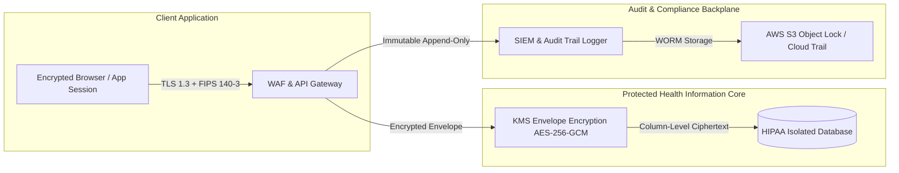

Are you designing a next-generation teletherapy platform, building a dedicated behavioral health Electronic Health Record (EHR), or launching a multi-tenant white-label psychiatry and mental health SaaS in 2026?

Behavioral healthcare presents unique clinical and technical challenges that generic telehealth video tools cannot solve. Therapists and psychiatrists spend up to **35% of their working hours on administrative documentation**, writing lengthy subjective session notes, tracking longitudinal psychiatric symptom scores (such as PHQ-9 and GAD-7), and manually compiling insurance superbills with complex psychotherapy CPT add-on codes.

Modern behavioral health platforms require zero-latency encrypted video, ambient AI clinical scribing trained specifically on therapeutic discourse, automated measurement-based care (MBC), and continuous HIPAA-compliant data pipelines. Here is the definitive engineering guide to architecting, securing, and scaling an enterprise-grade AI Behavioral Health Telehealth SaaS.


## The Shift from Generic Video Calls to Specialized Behavioral Health Platforms

During the early surge of telemedicine, mental health clinics adopted standard video conferencing software taped to fragmented legacy billing software. This patchwork architecture introduced massive operational friction:

1. **Clinician Burnout & Charting Fatigue:** Documenting 45-to-60-minute therapy sessions requires nuanced narrative capture (DAP: Data, Assessment, Plan; or SOAP: Subjective, Objective, Assessment, Plan). Therapists frequently spend late evenings catching up on "pajama charting."
2. **Disconnected Measurement-Based Care (MBC):** Standardizing psychiatric symptom tracking (PHQ-9 for depression, GAD-7 for anxiety, PCL-5 for PTSD) usually relies on manual PDF forms or separate third-party survey tools, leading to fragmented clinical records.
3. **Complex Mental Health Coding & Claims:** Mental health billing utilizes time-based and modality-specific CPT codes (e.g., 90791 for psychiatric evaluation, 90834 for 45-minute individual psychotherapy, 90837 for 60-minute sessions, +90833 psychotherapy add-on with E/M visit). Miscalculating session duration or documentation details triggers high claim denial rates.

In 2026, leading behavioral health organizations are transitioning to unified **AI-Native Mental Health Platforms** that automate ambient clinical transcription, calculate real-time symptom score trajectories, and generate compliant insurance claims before the patient leaves the virtual consultation room.

> **Key Industry Takeaway:** Implementing ambient AI session scribing in behavioral health reduces post-session documentation time by **72%**, while automated measurement-based care increases treatment adherence and clinical outcome improvements by **34%**.

---

## Technical Architecture of an Enterprise Behavioral Health Telehealth Platform

Building an enterprise-grade mental health SaaS requires a tightly integrated, decoupled architecture spanning WebRTC real-time media, ambient voice pipeline, clinical NLP orchestration, and HL7 FHIR healthcare interoperability.

```mermaid
graph TD
    subgraph Client Tier (Web, iOS, Android)
        A[Therapist Workstation / Clinical Portal] -->|E2EE WebRTC / SRTP| C[Selective Forwarding Unit - SFU Media Server]
        B[Patient Mobile App / Client Portal] -->|E2EE WebRTC / SRTP| C
        A -->|WebSocket / gRPC| D[API Gateway & Auth: OIDC / mTLS]
        B -->|Encrypted HTTPS| D
    end

    subgraph Streaming & Ambient AI Ingestion
        C -->|Audio Forking / Opus Stream| E[HIPAA-Compliant Audio Buffer Pipeline]
        E -->|Chunked Audio / WebSocket| F[Whisper Clinical Speech-to-Text Engine]
        F -->|Raw Transcript Stream| G[Medical NLP & Redaction Service: De-ID]
        G -->|De-Identified Clinical Stream| H[Specialized LLM: SOAP/DAP & DSM-5 Note Generator]
    end

    subgraph Core Healthcare Backplane
        D --> I[Session & Appointment Orchestrator]
        D --> J[Measurement-Based Care Engine: PHQ-9 / GAD-7]
        H --> K[Clinical Note Review & E-Sign Engine]
        I --> L[Multi-Tenant PostgreSQL / TimescaleDB with Row-Level Security]
        J --> L
        K --> L
        K --> M[EDI 837P / Superbill Claim Generator]
        M --> N[Clearinghouse Gateway: Change Healthcare / Waystar / Availity]
    end
```

---

## 4 Core Engineering Pillars of Modern Behavioral Health SaaS

### 1. Zero-Latency, HIPAA-Compliant WebRTC Video & Audio Infrastructure
Video therapy demands uninterrupted connection quality and crystal-clear audio to preserve subtle vocal inflections and non-verbal clinical cues:
* **Selective Forwarding Unit (SFU) Architecture:** Deploying scalable media clusters (using LiveKit, Pion, or Daily Media Server) ensures dynamic bitrate adaptation, packet loss concealment (PLC), and end-to-end encryption (SRTP/DTLS).
* **Ephemeral Media Routing:** Media streams must never be stored on intermediate relay nodes. All media transit is cryptographically signed with session tokens tied to the clinician-patient appointment lifecycle.
* **In-Session Breakout & Waiting Rooms:** Integrated digital waiting rooms with pre-call device diagnostic tests (camera, microphone, speaker, and bandwidth ping) ensure smooth session start times without technical delays.

### 2. Ambient AI Clinical Scribing for Therapy (DAP & SOAP Synthesis)
Generic medical dictation tools fail in mental health because therapy involves conversational, unstructured narrative rather than direct anatomical physical exam findings.
* **Context-Aware Therapeutic Formatting:** The NLP pipeline automatically structures unstructured conversational transcripts into standardized formats:
  * **DAP Notes:** Data (patient's reported state and objective observations), Assessment (clinical evaluation and progress), Plan (treatment goals and homework).
  * **SOAP Notes:** Subjective, Objective, Assessment, Plan.
  * **MSE (Mental Status Exam):** Captures appearance, speech, affect, thought process, and risk assessment indicators.
* **Clinician-in-the-Loop Verification:** Generated notes are presented in an editable clinical drafting window immediately after call termination. The provider reviews, adjusts, and digitally signs the note before it commits to the immutable medical record.
* **Safety & Crisis Detection Guardrails:** Real-time semantic analysis alerts the provider if explicit self-harm, suicidal ideation (Columbia-Suicide Severity Rating Scale markers), or emergency keywords are detected, prompting safety planning protocols.

### 3. Measurement-Based Care (MBC) & Longitudinal Symptom Tracking
Automated clinical assessments improve patient engagement and provide empirical documentation required by commercial health plans and Medicaid:
* **Automated Assessment Scheduling:** Pre-configured triggers deliver standardized questionnaires (PHQ-9, GAD-7, PCL-5, AUDIT-C, MDQ) via SMS or push notifications 24 hours before scheduled visits.
* **Interactive Longitudinal Trend Graphs:** Interactive visual charting renders historical score trajectories, highlighting clinically significant improvements (e.g., a 5-point drop in PHQ-9 indicating treatment response).
* **Clinical Decision Support (CDS):** When assessment scores indicate escalating severity, the system suggests evidence-based clinical interventions, dosage adjustments, or psychiatric referral pathways.

### 4. Automated Mental Health Superbill & EDI 837P Claim Generation
Streamlining revenue cycle management is vital for solo practitioners and large enterprise group practices:
* **Automated CPT & Time-Based Logic:** The platform tracks exact video session duration and calculates the correct time-based psychotherapy CPT code (e.g., 90834 for 38–52 minutes, 90837 for 53+ minutes) to prevent upcoding or undercoding audit penalties.
* **Instant Superbill Generation:** For out-of-network patients, the system generates clean, compliant PDF superbills with ICD-10 diagnostic codes, provider NPI, taxonomy codes, and place-of-service (POS 02 / POS 10 for telehealth).
* **Direct EDI 837P Claims Dispatch:** Integrated clearinghouse connectors (Change Healthcare, Availity, Claim.MD) submit claims directly to private and public payers with automated ERA (EDI 835) remittance reconciliation.

---

## Technical Architecture Comparison: Teletherapy Platforms

| Architectural Feature | Generic Video Tools (Zoom / Teams) | First-Gen EHR Telehealth | Modern AI Behavioral Health SaaS (Anonsoft) |
|---|---|---|---|
| **E2EE Video & HIPAA BAA** | Generic add-on BAA | Basic web iframe | **Native WebRTC SFU with sub-150ms latency** |
| **Clinical Session Documentation** | Manual typing in separate window | Basic static templates | **Automated Ambient AI DAP/SOAP generation** |
| **Mental Health Scribing NLP** | None | Generic speech-to-text | **Trained on psychiatric discourse & DSM-5** |
| **Measurement-Based Care (MBC)** | None | Manual PDF attachments | **Automated SMS/In-App PHQ-9 & GAD-7 tracking** |
| **Automated Superbill & EDI 837** | None | Manual billing entry | **Auto CPT calculation & 1-click clearinghouse sync** |
| **Crisis Safety Alerts** | None | None | **Real-time semantic risk & safety planning triggers** |
| **Multi-Tenant White-Labeling** | Not possible | Difficult / Expensive | **100% Brandable custom portals & mobile apps** |

---

## Database Architecture & Multi-Tenant Clinical Schema

Below is an enterprise PostgreSQL schema designed for multi-tenant clinic partitioning, encrypted clinical encounters, and structured measurement assessments:

```sql
-- Multi-Tenant Clinic / Practice Entity
CREATE TABLE clinics (
    id UUID PRIMARY KEY DEFAULT gen_random_uuid(),
    name VARCHAR(255) NOT NULL,
    subdomain VARCHAR(100) UNIQUE NOT NULL,
    npi_number VARCHAR(10) NOT NULL,
    tax_id VARCHAR(20) NOT NULL,
    created_at TIMESTAMPTZ DEFAULT NOW()
);

-- Patient Profiles with Encrypted Demographics
CREATE TABLE patients (
    id UUID PRIMARY KEY DEFAULT gen_random_uuid(),
    clinic_id UUID REFERENCES clinics(id) ON DELETE CASCADE,
    mrn VARCHAR(64) NOT NULL,
    first_name_encrypted BYTEA NOT NULL,
    last_name_encrypted BYTEA NOT NULL,
    email_encrypted BYTEA NOT NULL,
    phone_encrypted BYTEA,
    date_of_birth DATE NOT NULL,
    emergency_contact JSONB,
    created_at TIMESTAMPTZ DEFAULT NOW(),
    UNIQUE(clinic_id, mrn)
);

-- Teletherapy Appointments & Video Sessions
CREATE TABLE therapy_sessions (
    id UUID PRIMARY KEY DEFAULT gen_random_uuid(),
    clinic_id UUID REFERENCES clinics(id) ON DELETE CASCADE,
    patient_id UUID REFERENCES patients(id),
    provider_id UUID NOT NULL,
    scheduled_start TIMESTAMPTZ NOT NULL,
    actual_start TIMESTAMPTZ,
    actual_end TIMESTAMPTZ,
    session_duration_minutes INTEGER,
    modality VARCHAR(32) DEFAULT 'VIDEO_HD', -- VIDEO_HD, AUDIO_ONLY, IN_PERSON
    room_sid VARCHAR(128) UNIQUE,
    status VARCHAR(32) NOT NULL DEFAULT 'SCHEDULED' -- SCHEDULED, IN_PROGRESS, COMPLETED, NO_SHOW
);

-- Ambient AI Clinical Progress Notes (DAP / SOAP)
CREATE TABLE clinical_progress_notes (
    id UUID PRIMARY KEY DEFAULT gen_random_uuid(),
    session_id UUID UNIQUE REFERENCES therapy_sessions(id) ON DELETE CASCADE,
    patient_id UUID REFERENCES patients(id),
    provider_id UUID NOT NULL,
    note_format VARCHAR(16) DEFAULT 'DAP', -- DAP, SOAP, MSE
    
    -- Encrypted Note Fields
    data_content_encrypted BYTEA NOT NULL,       -- Objective & Subjective observations
    assessment_content_encrypted BYTEA NOT NULL, -- Clinical evaluation & diagnosis
    plan_content_encrypted BYTEA NOT NULL,       -- Goals, interventions, homework
    
    dsm5_icd10_codes JSONB NOT NULL DEFAULT '[]'::jsonb, -- e.g. [{"code": "F41.1", "desc": "Generalized Anxiety"}]
    suggested_cpt_code VARCHAR(16) NOT NULL,              -- e.g. "90834", "90837"
    ai_confidence_score NUMERIC(4, 3),
    is_signed BOOLEAN DEFAULT FALSE,
    signed_at TIMESTAMPTZ,
    created_at TIMESTAMPTZ DEFAULT NOW()
);

-- Longitudinal Measurement-Based Care (PHQ-9, GAD-7, etc.)
CREATE TABLE clinical_assessments (
    id UUID PRIMARY KEY DEFAULT gen_random_uuid(),
    clinic_id UUID REFERENCES clinics(id) ON DELETE CASCADE,
    patient_id UUID REFERENCES patients(id) ON DELETE CASCADE,
    session_id UUID REFERENCES therapy_sessions(id),
    assessment_type VARCHAR(32) NOT NULL, -- 'PHQ-9', 'GAD-7', 'PCL-5', 'AUDIT'
    raw_responses JSONB NOT NULL,
    total_score INTEGER NOT NULL,
    severity_label VARCHAR(64) NOT NULL,   -- e.g. 'Moderate Anxiety', 'Severe Depression'
    completed_at TIMESTAMPTZ DEFAULT NOW()
);
```

---

## HIPAA Compliance, Security & Data Governance

Handling behavioral health and psychiatric data mandates the highest tier of security under federal and state guidelines:



1. **42 CFR Part 2 & Substance Use Confidentiality:** For clinics managing substance use disorders (SUD), the system implements granular consent tracking that prevents disclosure of SUD records without explicit patient authorization.
2. **Column-Level Envelope Encryption (AES-256-GCM):** All identifiable patient demographics, psychotherapy narrative notes, and assessment responses are encrypted using unique per-patient data encryption keys (DEKs) wrapped by an enterprise Key Management Service (KMS).
3. **Immutable Audit Trails:** Every note view, clinical modification, electronic signature, and document export is permanently logged with timestamps, clinician IDs, and IP addresses to satisfy HIPAA Security Rule § 164.312(b).

---

## Frequently Asked Questions (FAQs)

### 1. How does ambient AI clinical scribing work for 60-minute psychotherapy sessions?
Ambient AI captures multi-turn conversational audio in real-time over secure WebRTC connections. The audio is transcribed by specialized healthcare speech-to-text models that filter non-clinical chit-chat and extract therapeutic interventions (e.g., CBT cognitive restructuring, mindfulness exercises). The AI structures this information into standardized DAP or SOAP progress notes with recommended DSM-5 and ICD-10 codes for clinician review and digital signature.

### 2. Is ambient AI note generation HIPAA-compliant?
Yes. Compliance is achieved by signing Business Associate Agreements (BAAs) with all cloud and AI API infrastructure providers, ensuring zero data retention for model training, de-identifying transcripts prior to processing, and applying end-to-end encryption in transit (TLS 1.3) and at rest (AES-256-GCM).

### 3. How does the platform calculate psychotherapy CPT billing codes?
The platform monitors exact video session durations and documentation content to automatically map visits to corresponding CPT codes (such as **90834** for 38–52 minute psychotherapy, **90837** for 53+ minute sessions, or **90791** for initial psychiatric diagnostic evaluations). This prevents common coding errors and minimizes claim denial rates.

### 4. What is Measurement-Based Care (MBC) and why is it important in mental health software?
Measurement-Based Care is the practice of systematically administering validated clinical symptom rating scales (such as the PHQ-9 for depression and GAD-7 for anxiety) before and throughout treatment. Modern EHRs automate questionnaire distribution and graph score trajectories over time, helping clinicians tailor treatment plans and providing required outcome data for insurance reimbursement.

### 5. Can Anonsoft build a custom white-label behavioral health platform for my organization?
Yes. Anonsoft designs and develops custom, HIPAA-compliant telehealth, EHR, and practice management SaaS platforms. We build an interactive, working software prototype before requiring any upfront financial commitment. [Book a Free Technical Strategy Call](https://calendly.com/anonsoftdotin/30min) or explore our [telemedicine software solutions](/projects/mednowna.html) to discuss your roadmap.

---

## Build Your Custom Behavioral Health SaaS with Anonsoft

Whether you are scaling a nationwide virtual mental health clinic, launching a specialized teledermatology/psychiatry group, or creating a B2B behavioral health EHR SaaS, **Anonsoft** delivers the engineering expertise you need.

* **Zero Upfront Payment:** We engineer an interactive, working software prototype of your custom behavioral health platform first. You only pay after reviewing and approving the live prototype.
* **100% Source Code Ownership:** Proprietary architecture with no ongoing vendor lock-in or recurring per-seat platform fees.
* **Full Healthcare Interoperability:** Certified WebRTC video, automated DAP/SOAP scribing, HL7/FHIR EHR connectors, and integrated clearinghouse billing.

Ready to build the future of mental healthcare? **[Schedule a Strategy Call with Our Engineering Leadership](https://calendly.com/anonsoftdotin/30min)** today.
