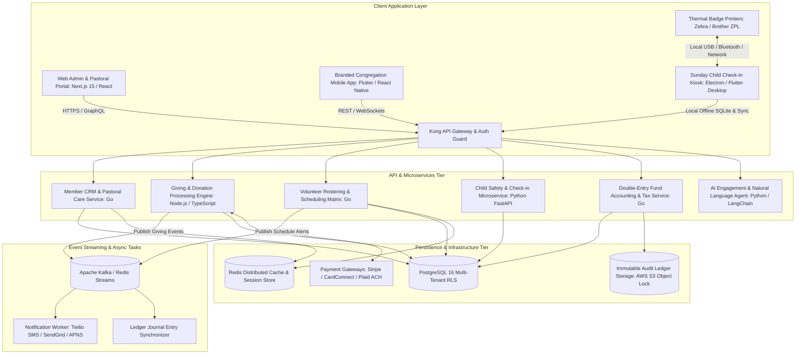
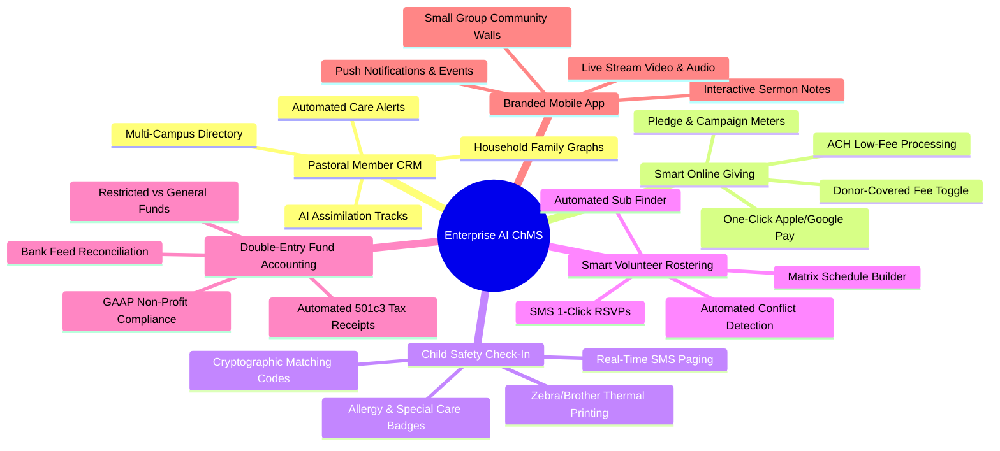
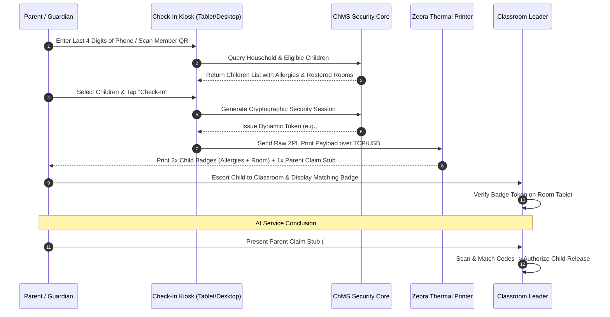
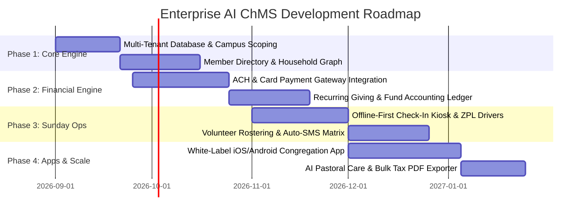
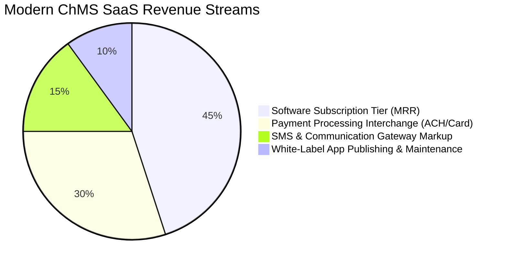

Are you looking to build an enterprise **all-in-one church management system (ChMS)**, develop a custom **white-label church administration software**, or engineer a high-conversion **custom church donation platform** with automated tithing, child check-in security, and multi-campus fund accounting in 2026?

Modern faith organizations, multi-site ministries, and non-profit communities operate with the logistical and financial complexity of medium-to-large enterprises. Yet, a vast majority of church administrators and ministry leaders find themselves crippled by software sprawl: juggling fragmented tools for member directories, third-party payment gateways with extortionate transaction fees for tithing, manual volunteer spreadsheets that lead to Sunday morning burnout, vulnerable paper sign-in sheets for nursery child care, and disconnected accounting spreadsheets that make year-end 501(c)(3) tax statements a nightmare.

In 2026, leading ministries are abandoning legacy monolithic software in favor of **AI-powered, unified, white-label Church Management Systems (ChMS)**. These modern platforms consolidate member intelligence, recurring giving, automated volunteer rostering, thermal child check-in badges, and double-entry fund accounting into a single real-time cloud and mobile ecosystem.

Here is the definitive architectural blueprint, database schema, workflow mechanics, and engineering guide to building a scalable, multi-tenant, AI-powered Church Management Software (ChMS) and Non-Profit Donation SaaS platform in 2026.


---

## The 2026 Paradigm: Why Legacy Church Software Fails Ministries

For decades, churches have relied on legacy ChMS architectures (such as early-generation desktop databases or clunky early-2000s web portals) paired with a chaotic stack of standalone SaaS point solutions. This fragmentation introduces massive administrative overhead and security vulnerabilities.

### The Critical Flaws of Legacy & Disjointed Ministry Software:

1. **Exorbitant Giving & Tithing Interchange Fees:** Generic donation platforms and legacy church giving processors frequently charge 2.9% to 4.5% + $0.30 per transaction on tithes and offerings. For a church processing $1.5M to $10M annually in donations, this results in tens of thousands of dollars siphoned away from ministry missions into payment middlemen.
2. **Data Silos & Broken Member Journeys:** When attendance tracking, small group management, sermon live streaming, and donation histories live in separate databases, pastoral teams have zero visibility into member disengagement, leading to high congregation churn and missed pastoral care opportunities.
3. **Volunteer Burnout & Roster Friction:** Managing Sunday service teams (worship band, AV technicians, greeters, nursery workers, parking attendants) across email threads and group chats causes schedule conflicts, double-booking, and high volunteer attrition.
4. **Severe Child Safety & Liability Vulnerabilities:** Handwritten paper sign-in sheets and unencrypted check-in apps fail modern child security standards. If a custody restriction or severe peanut allergy is missed during Sunday school, churches face catastrophic legal and physical liabilities.
5. **Disconnected Fund Accounting & Manual Tax Receipts:** Generic small business accounting tools (like QuickBooks) fail to handle non-profit fund accounting natively—blurring the lines between restricted building funds, missions pledges, and general operating tithes, requiring hundreds of manual staff hours every January to issue donor tax deduction letters.

### The 2026 Standard: Unified AI-Powered ChMS 3.0

* **Multi-Campus Tenant Isolation:** A single unified database architecture that empowers multi-site churches to maintain localized campus directories, budgets, and volunteer teams while rolling up macro analytics to executive leadership.
* **Low-Cost Smart Giving Engine:** Integrated ACH direct debit (0.5%–0.8% capped at $5), Apple Pay, Google Pay, and donor-covered fee incentives ("Smart Cover") that maximize net donation retention.
* **AI Pastoral CRM & Member Engagement Scoring:** Intelligent anomaly detection that alerts pastoral staff when regular attendees miss consecutive weeks, trigger prayer request follow-up workflows, and automate customized assimilation tracks for first-time visitors.
* **Biometric & QR Code Child Check-In Kiosks:** High-speed thermal label printing (Zebra/Brother ZPL protocols) generating cryptographically randomized alphanumeric matching pickup tokens, allergen flags, and emergency SMS alerts.
* **Double-Entry Restricted Fund Accounting:** Automated general ledger sync with built-in 501(c)(3) compliance, multi-fund allocation splits, and 1-click automated year-end IRS tax statement PDF generation.
* **Custom Branded White-Label Mobile App:** Native iOS and Android apps featuring interactive sermon notes, live streaming audio/video, small group prayer boards, event ticketing, and in-app micro-giving.

---

## Technical Architecture of an Enterprise Multi-Tenant ChMS SaaS

Building a multi-tenant Church Management SaaS requires an architecture that guarantees ironclad data isolation, real-time event streaming for volunteer coordination, low-latency financial transactions, and offline-resilient check-in kiosks.



### Key Architectural Highlights:

1. **Row-Level Security (RLS) & Multi-Campus Scoping:** All PostgreSQL database tables enforce tenancy by `organization_id` (the church network) and `campus_id` (individual physical sites). RLS policies at the database layer prevent any cross-tenant data leakage.
2. **Offline-First Check-In Kiosks:** On Sunday mornings, when hundreds of parents check in children simultaneously and church Wi-Fi networks fluctuate, check-in kiosks run a local embedded SQLite engine. Kiosks generate unique cryptographic matching tokens locally, print thermal badges instantly via ZPL/ESC-POS socket bridges, and asynchronously sync with the cloud cluster when network connectivity stabilizes.
3. **Direct-to-Bank ACH & Interchange Optimization:** Integrated with Plaid for instant micro-deposit bank verification and Stripe / CardConnect for tokenized PCI-DSS Level 1 compliant payments, enabling donors to set up recurring tithes without re-entering card numbers.
4. **Immutable Non-Profit Audit Trails:** Financial transactions, fund transfers, and background check verification logs are committed to write-once-read-many (WORM) audit tables to ensure compliance with financial accounting standards and child protection regulations.

---

## Complete Database Schema Design (PostgreSQL DDL)

Here is the production-ready PostgreSQL relational schema powering multi-tenant member graphs, financial tithing records, volunteer schedules, and child check-in security:

```sql
-- Enable UUID and Cryptographic Extensions
CREATE EXTENSION IF NOT EXISTS "uuid-ossp";
CREATE EXTENSION IF NOT EXISTS "pgcrypto";

-- 1. Organizations (Multi-Tenant Master)
CREATE TABLE organizations (
    id UUID PRIMARY KEY DEFAULT gen_random_uuid(),
    name VARCHAR(255) NOT NULL,
    subdomain VARCHAR(100) UNIQUE NOT NULL,
    custom_domain VARCHAR(255),
    tax_id_ein VARCHAR(50),
    primary_currency VARCHAR(3) DEFAULT 'USD',
    plan_tier VARCHAR(50) DEFAULT 'growth',
    created_at TIMESTAMPTZ DEFAULT NOW(),
    updated_at TIMESTAMPTZ DEFAULT NOW()
);

-- 2. Campuses / Physical Locations
CREATE TABLE campuses (
    id UUID PRIMARY KEY DEFAULT gen_random_uuid(),
    organization_id UUID NOT NULL REFERENCES organizations(id) ON DELETE CASCADE,
    name VARCHAR(255) NOT NULL,
    timezone VARCHAR(100) DEFAULT 'America/New_York',
    address_line1 VARCHAR(255),
    city VARCHAR(100),
    state VARCHAR(50),
    postal_code VARCHAR(20),
    is_active BOOLEAN DEFAULT TRUE,
    created_at TIMESTAMPTZ DEFAULT NOW()
);

-- 3. Household Family Units
CREATE TABLE households (
    id UUID PRIMARY KEY DEFAULT gen_random_uuid(),
    organization_id UUID NOT NULL REFERENCES organizations(id) ON DELETE CASCADE,
    campus_id UUID REFERENCES campuses(id),
    household_name VARCHAR(255) NOT NULL,
    primary_address TEXT,
    created_at TIMESTAMPTZ DEFAULT NOW()
);

-- 4. Members / Profiles (CRM)
CREATE TABLE members (
    id UUID PRIMARY KEY DEFAULT gen_random_uuid(),
    organization_id UUID NOT NULL REFERENCES organizations(id) ON DELETE CASCADE,
    campus_id UUID REFERENCES campuses(id),
    household_id UUID REFERENCES households(id) ON DELETE SET NULL,
    first_name VARCHAR(100) NOT NULL,
    last_name VARCHAR(100) NOT NULL,
    email VARCHAR(255),
    phone VARCHAR(50),
    date_of_birth DATE,
    member_status VARCHAR(50) DEFAULT 'visitor', -- 'visitor', 'regular', 'member', 'leader', 'inactive'
    household_role VARCHAR(50) DEFAULT 'adult',  -- 'head', 'spouse', 'child', 'other'
    medical_allergies TEXT,
    emergency_contact_phone VARCHAR(50),
    background_check_passed BOOLEAN DEFAULT FALSE,
    background_check_expires_at DATE,
    ai_engagement_score NUMERIC(5,2) DEFAULT 100.00,
    created_at TIMESTAMPTZ DEFAULT NOW()
);

-- 5. Fund Accounts (Restricted vs Unrestricted)
CREATE TABLE fund_accounts (
    id UUID PRIMARY KEY DEFAULT gen_random_uuid(),
    organization_id UUID NOT NULL REFERENCES organizations(id) ON DELETE CASCADE,
    campus_id UUID REFERENCES campuses(id),
    fund_code VARCHAR(50) NOT NULL,
    fund_name VARCHAR(255) NOT NULL, -- 'General Tithes', 'Building Campaign', 'Missions 2026'
    is_tax_deductible BOOLEAN DEFAULT TRUE,
    is_restricted BOOLEAN DEFAULT FALSE,
    target_goal_cents BIGINT DEFAULT 0,
    created_at TIMESTAMPTZ DEFAULT NOW()
);

-- 6. Giving Transactions & Tithing Ledger
CREATE TABLE giving_transactions (
    id UUID PRIMARY KEY DEFAULT gen_random_uuid(),
    organization_id UUID NOT NULL REFERENCES organizations(id) ON DELETE CASCADE,
    campus_id UUID REFERENCES campuses(id),
    member_id UUID REFERENCES members(id) ON DELETE SET NULL,
    fund_account_id UUID NOT NULL REFERENCES fund_accounts(id),
    amount_cents BIGINT NOT NULL,
    fee_covered_by_donor BOOLEAN DEFAULT FALSE,
    processing_fee_cents INT DEFAULT 0,
    net_amount_cents BIGINT NOT NULL,
    payment_method VARCHAR(50) NOT NULL, -- 'ach', 'card', 'apple_pay', 'cash', 'check'
    payment_processor VARCHAR(50) NOT NULL, -- 'stripe', 'cardconnect', 'manual'
    processor_transaction_id VARCHAR(255),
    is_recurring BOOLEAN DEFAULT FALSE,
    recurring_frequency VARCHAR(50), -- 'weekly', 'biweekly', 'monthly'
    status VARCHAR(50) DEFAULT 'succeeded', -- 'pending', 'succeeded', 'failed', 'refunded'
    tax_year INT NOT NULL,
    created_at TIMESTAMPTZ DEFAULT NOW()
);

-- 7. Sunday Child Check-In & Security Tokens
CREATE TABLE child_check_ins (
    id UUID PRIMARY KEY DEFAULT gen_random_uuid(),
    organization_id UUID NOT NULL REFERENCES organizations(id) ON DELETE CASCADE,
    campus_id UUID NOT NULL REFERENCES campuses(id),
    child_id UUID NOT NULL REFERENCES members(id),
    guardian_id UUID NOT NULL REFERENCES members(id),
    service_date DATE NOT NULL,
    classroom_room_number VARCHAR(50) NOT NULL,
    security_pickup_code VARCHAR(10) NOT NULL, -- Random matching cryptographic token
    checked_in_at TIMESTAMPTZ DEFAULT NOW(),
    checked_out_at TIMESTAMPTZ,
    checkout_guardian_id UUID REFERENCES members(id),
    medical_alert_flag BOOLEAN DEFAULT FALSE,
    special_instructions TEXT
);

-- 8. Volunteer Rostering & Service Schedules
CREATE TABLE volunteer_schedules (
    id UUID PRIMARY KEY DEFAULT gen_random_uuid(),
    organization_id UUID NOT NULL REFERENCES organizations(id) ON DELETE CASCADE,
    campus_id UUID NOT NULL REFERENCES campuses(id),
    service_date DATE NOT NULL,
    service_time VARCHAR(20) NOT NULL,
    ministry_department VARCHAR(100) NOT NULL, -- 'Worship Band', 'Production AV', 'Kids Ministry', 'Hospitality'
    role_title VARCHAR(100) NOT NULL, -- 'Acoustic Guitar', 'Nursery Care', 'Head Usher'
    assigned_member_id UUID NOT NULL REFERENCES members(id),
    confirmation_status VARCHAR(50) DEFAULT 'pending', -- 'pending', 'confirmed', 'declined', 'substituted'
    decline_reason TEXT,
    auto_reminded_at TIMESTAMPTZ,
    created_at TIMESTAMPTZ DEFAULT NOW()
);
```

---

## Core Functional Subsystems Breakdown

Let us examine the deep mechanics of the six fundamental pillars that make an enterprise AI ChMS indispensable to ministry operations.



### 1. Pastoral Member CRM & Household Graph

Traditional CRM systems fail churches because individuals do not exist in isolation; they exist in **household family units**. 

* **Household Relational Modeling:** Spouses, dependent children, college students, and grandparents are mapped into linked relational trees. If a family moves, updating the household address cascades instantly to all members.
* **AI Pastoral Assimilation Workflows:** When a newcomer fills out a digital connect card or checks into a Sunday service for the first time, the platform's AI workflow agent triggers a 6-week assimilation journey:
  1. *Day 1:* Sends an automated personalized SMS welcome video from the campus pastor.
  2. *Day 3:* Assigns a volunteer host to invite them to the upcoming Newcomers Luncheon.
  3. *Day 14:* Analyzes their demographic interests and suggests three local small groups.
  4. *Day 30:* Prompts the pastoral team if Sunday attendance drops, ensuring no one slips through the cracks.

### 2. Smart Giving, Tithing & Pledge Campaign Engine

Donations are the lifeblood of faith organizations. The ChMS giving engine is optimized for frictionless donor conversion and minimal processing waste:

* **Smart Fee Cover ("Giving Shield"):** Over 82% of donors opt to check a box saying *"Cover processing fees so 100% of my gift goes to the church."*
* **Multi-Fund Split Tithing:** In a single transaction, a donor can give $200 toward the *General Tithe*, $50 toward *Youth Summer Camp*, and $100 toward the *International Missions Fund*.
* **Text-to-Give & QR Code Integration:** During Sunday services, congregation members can scan an on-screen QR code or text `GIVE 100` to a dedicated shortcode to complete a payment in under 5 seconds via Apple Pay or stored credit cards.
* **Instant ACH Direct Debit:** For high-volume tithes ($500+), the platform encourages direct bank transfer via Plaid with transaction fees capped at $5, saving churches thousands of dollars compared to 3% credit card processing fees.

### 3. Zero-Trust Child Safety Check-In & Thermal Badge Printing

Child security is non-negotiable. Modern ministries must guarantee foolproof identity verification before releasing a minor:



* **Dynamic Cryptographic Code Matching:** Every Sunday check-in generates a unique daily pairing code (e.g., `C-8492`) printed on both the child's chest badge and the parent's claim ticket.
* **High-Visibility Medical & Allergy Alerts:** Severe food allergies (nuts, dairy, gluten) print with bold inverted black-and-white headers on thermal labels, alerting nursery staff immediately.
* **Silent Paging SMS Bridge:** If a child becomes ill or inconsolable during service, nursery workers can tap a 1-click button on their classroom tablet to dispatch a discreet SMS text message directly to the parent seated in the sanctuary.

### 4. Smart Volunteer Rostering & Automated Sub Matrix

Church services depend entirely on volunteer dedication. The volunteer scheduling engine automates the entire coordination lifecycle:

* **Matrix Scheduling & Auto-Conflict Solver:** The system prevents scheduling the same volunteer to play bass guitar on the worship team while simultaneously rostered to teach 3rd-grade Sunday school.
* **1-Click SMS RSVPs:** Volunteers receive automated WhatsApp or SMS schedule requests with zero-login links: `Reply YES to confirm or NO to decline`.
* **Automated Sub Finder:** If a volunteer declines a scheduled slot due to illness, the AI assistant automatically queries eligible, background-checked volunteers with matching skill tags and dispatches substitution requests until the position is filled.

### 5. Double-Entry Non-Profit Fund Accounting & Tax Compliance

Generic small-business bookkeeping platforms treat all revenue as a single pool. Non-profit governance requires strict separation of funds:

| Fund Type | Legal Restriction | Example Use Cases | Automated ChMS Rule |
| :--- | :--- | :--- | :--- |
| **Unrestricted General Fund** | Discretionary by Board/Elders | Staff salaries, utilities, rent, general ministry supplies | Default bucket for standard Sunday tithes |
| **Temporarily Restricted Fund** | Legally bound to donor-designated intent | Building expansion, missionary support, disaster relief | Cannot be spent on general operating expenses without formal re-allocation |
| **Permanently Restricted Fund** | Endowment corpus preserved in perpetuity | Long-term ministry scholarships, foundation endowments | Only generated interest/dividends may be disbursed |

* **1-Click IRS 501(c)(3) Giving Statements:** Generates batch-compiled, legally compliant PDF tax receipts in bulk, complete with church EIN, itemized giving dates, non-deductible benefit disclaimer clauses, and direct self-service download via the member mobile portal.

---

## Architectural Comparison: Modern AI ChMS vs Legacy Point Solutions

| Architectural Capability | Modern Unified AI ChMS SaaS | Legacy Church Platforms (FellowshipOne, Realm) | Disjointed Tool Stack (Mailchimp + QuickBooks + Stripe) |
| :--- | :--- | :--- | :--- |
| **Database Architecture** | Cloud-native multi-tenant PostgreSQL with RLS | Monolithic legacy relational / on-premises SQL Server | 5+ disconnected proprietary databases |
| **Donation Processing Fees** | Optimized ACH (0.5%) + Donor Fee Shield (82% covered) | Fixed 2.9%–4.0% + high monthly gateway fees | Multiple merchant account markups |
| **Child Check-In Reliability** | Offline-first SQLite local sync + ZPL thermal printing | Slow web-dependent cloud check-in | Vulnerable manual paper rosters |
| **Volunteer Coordination** | Auto-conflict detection + 1-click SMS sub finder | Static manual calendars requiring heavy admin overhead | Chaotic email chains and spreadsheets |
| **Fund Accounting** | Built-in non-profit double-entry general ledger | Separate legacy module with manual sync | Export/import CSVs into QuickBooks |
| **Congregation Mobile App** | Fully custom-branded iOS & Android (White-Label) | Generic shared container app with vendor branding | No unified congregation app |
| **AI Pastoral Intelligence** | Anomaly detection for attendance & care workflows | Non-existent | Non-existent |

---

## Step-by-Step Engineering Roadmap: From Prototype to Enterprise ChMS

If you are an engineering team, software agency, or SaaS founder building a white-label Church Management platform, here is the structured development roadmap:



### Phase 1: Multi-Tenant Core & Household Graph Engine (Weeks 1–6)
* Set up PostgreSQL with Row-Level Security partitioned by `organization_id` and `campus_id`.
* Engineer the relational family household graph and custom member attribute schema (baptism dates, background check clearances, ministry tags).
* Implement role-based access control (RBAC) with granular permissions for Senior Pastors, Campus Directors, Finance Deacons, and Department Volunteers.

### Phase 2: Smart Giving & Non-Profit Fund Accounting (Weeks 7–12)
* Integrate Stripe Billing, Plaid ACH, and Apple Pay with tokenized customer vaults.
* Build the multi-fund splitting ledger and recurring subscription schedule cron workers.
* Implement double-entry transaction reconciliation against imported bank statements and automated 501(c)(3) tax statement PDF compilers.

### Phase 3: Sunday Service Operations & Thermal Child Check-In (Weeks 13–18)
* Build the offline-first Electron / Flutter desktop kiosk with embedded SQLite local cache.
* Integrate raw socket ZPL (Zebra Programming Language) and ESC-POS drivers for sub-second thermal badge printing.
* Develop the volunteer scheduling matrix with automatic calendar conflict detection and automated SMS substitution workflows.

### Phase 4: White-Label Congregation Mobile App & AI Insights (Weeks 19–24)
* Launch cross-platform Flutter mobile applications customized with the church's unique brand assets, color palette, and app store listings.
* Build sermon media streaming with interactive synchronized fill-in-the-blank notes.
* Deploy machine learning anomaly detection to track engagement trends and generate proactive pastoral care alerts.

---

## Commercial Economics & SaaS Monetization Strategy

Building a custom Church Management SaaS offers immense commercial value, whether deployed as a proprietary multi-tenant SaaS business or built as a customized private-label platform for megachurch networks and denominational headquarters.



1. **Tiered Monthly Subscriptions (MRR):**
   * *Small / Church Plant Tier (< 150 members):* $39 – $79 / month
   * *Growth / Mid-Size Tier (150 – 1,000 members):* $129 – $299 / month
   * *Multi-Site / Megachurch Tier (1,000+ members):* $499 – $1,200+ / month
2. **Integrated Payments Interchange Revenue:** By serving as a Payment Facilitator (PayFac) or utilizing Stripe Connect revenue sharing, the SaaS platform earns between **0.30% and 0.75%** on every tithe and offering processed through the system.
3. **SMS Notification Packages:** Charging incremental usage fees for high-volume emergency broadcasts, event reminders, and volunteer confirmation texts.
4. **White-Label Custom App Publishing Fees:** One-time app store setup ($1,500 – $3,500) plus recurring maintenance fees for maintaining custom Apple App Store and Google Play Store listings for large ministries.

---

## Frequently Asked Questions (Technical & Operational)

### 1. How does the check-in system ensure uninterrupted operation if the church Wi-Fi crashes on Sunday morning?
The Anonsoft child check-in kiosk runs on an **offline-first local architecture** using embedded SQLite. The client pre-fetches the active church roster and household pairings prior to service time. When a parent checks in without internet connectivity, the kiosk generates a cryptographically hashed pairing code locally, prints the thermal security badges via direct USB or local network socket, and queues the check-in event in a local persistent journal. Once network connectivity is restored, the local journal synchronizes idempotently with the cloud PostgreSQL master.

### 2. Can our church customize the mobile app with our own logo, colors, and branding on the App Store?
Yes. Our architecture supports full **white-label application compilation**. We build and publish standalone native iOS and Android binaries to your organization's Apple Developer and Google Play Console accounts, featuring your church's app icon, splash screens, custom color schemas, and localized push notification channels.

### 3. How does the platform handle strict 501(c)(3) restricted fund accounting and year-end donor tax statements?
The platform enforces GAAP non-profit double-entry bookkeeping rules. When a gift is earmarked for a restricted account (such as *Building Fund* or *Missions Trip*), the ledger strictly locks those balances against general operating transfers. In January, the system automatically compiles itemized, IRS-compliant annual giving statements into secure PDF documents and delivers them via email and self-service mobile app download with a single administrative click.

### 4. What payment gateways are supported, and how does the platform reduce transaction processing fees?
The system integrates with **Stripe Connect, CardConnect, and Plaid Direct ACH**. To drastically reduce merchant fees, the system features automated fee-covering toggles (encouraging donors to cover the 2.2% + $0.30 card fee) and directs large recurring tithes toward ACH bank transfers with low capped flat fees (typically 0.5%–0.8% with a $5 ceiling).

### 5. How does the smart volunteer scheduling engine resolve conflicting assignments?
The volunteer matrix runs a deterministic constraint solver. When a department leader attempts to assign a member to a service slot, the engine checks for existing roster commitments across all ministry departments, active blackout dates submitted by the volunteer, and required background check clearance dates. If a volunteer is unavailable or declines via SMS, the system suggests qualified, pre-vetted replacements with a single tap.

---

## Launch Your Custom White-Label Church Management Platform with Anonsoft

Are you ready to replace fragmented tools, eliminate excessive donation processing fees, and empower ministry leaders with an enterprise-grade Church Management System?

Whether you need a **turnkey white-label ChMS SaaS for church resellers**, a **custom church donation & tithing platform**, or a **dedicated multi-campus administration ecosystem**, **Anonsoft** is your elite software engineering partner.

Explore our dedicated [Church Management Software Platform](file:///root/project/anonsoftweb/projects/church-management-software.html) to view live product capabilities, or schedule a direct architectural consultation with our senior engineering team:

* 📖 **Explore the Product:** [Anonsoft Church Management Software (ChMS)](file:///root/project/anonsoftweb/projects/church-management-software.html)
* 🚀 **Book an Architectural Demo:** [Book a 1-on-1 Consultation](file:///root/project/anonsoftweb/index.html#bookademo)
* 💬 **Contact Engineering:** [contact@anonsoft.in](mailto:contact@anonsoft.in)
