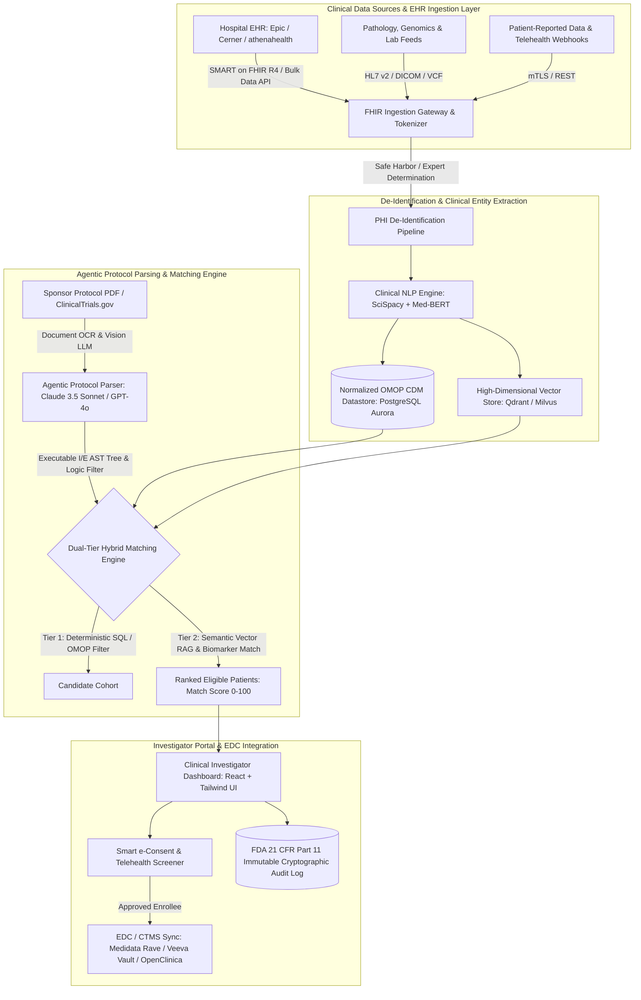
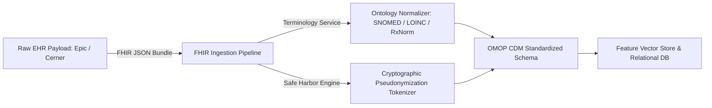
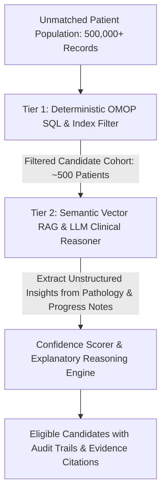

Are you designing an enterprise-grade clinical trial matching engine, launching an AI-powered patient recruitment platform for biopharma sponsors, or architecting a multi-site Life Sciences SaaS to accelerate oncology and rare disease trial enrollment in 2026?

In the biopharmaceutical industry, **over 80% of clinical trials fail to meet their original enrollment deadlines**, and up to 50% of trial sites enroll one or zero patients. Each day of clinical trial delay costs pharmaceutical sponsors between **$600,000 and $8 million in lost commercial exclusivity and trial maintenance costs**.

The fundamental bottleneck is not a shortage of eligible patients—it is the catastrophic friction of manual chart review. Clinical research coordinators (CRCs) spend up to 45 minutes manually combing through hundreds of pages of unstructured Electronic Health Records (EHRs), pathology reports, and biomarker panels to evaluate a single patient against 30+ complex inclusion/exclusion (I/E) protocol criteria.

Modern Life Sciences SaaS platforms demand a paradigm shift: **automated ingestion of multi-modal FHIR R4 records, agentic LLM-driven protocol parsing into executable logical trees, sub-second hybrid vector search across millions of patient profiles, and strict adherence to FDA 21 CFR Part 11 and HIPAA compliance**.

Here is the definitive engineering blueprint for architecting, securing, and deploying an enterprise AI-powered Clinical Trial Matching and Patient Recruitment SaaS platform in 2026.


---

## The Paradigm Shift in Clinical Trial Recruitment

Legacy Clinical Trial Management Systems (CTMS) and manual hospital site audits are being replaced by automated, real-time AI matching platforms that continuously scan EHR streams and alert clinical investigators the moment an eligible patient is admitted or diagnosed:

| Capability                         | Legacy CTMS & Manual Site Audits                                 | Modern AI-Native Clinical Trial Matching SaaS (2026)                                        |
| :--------------------------------- | :--------------------------------------------------------------- | :------------------------------------------------------------------------------------------ |
| **Patient Screening Speed**        | Manual chart review (20–45 mins per candidate)                   | Sub-second real-time scoring (< 350ms per patient cohort)                                   |
| **Protocol Eligibility Parsing**   | Human coordinators manually read 100+ page PDF protocols         | Multimodal LLMs parse I/E criteria into ASTs & JSON logic in < 15 seconds                   |
| **Unstructured Data Extraction**   | Ignored or sampled; blind to clinician progress notes & genomics | Clinical NLP + Vector embeddings parse free-text pathology, imaging, & genomic variants     |
| **EHR Interoperability**           | Fragmented CSV dumps or proprietary point-to-point ETL           | Real-time SMART on FHIR R4, USCDI v4, and OMOP Common Data Model (CDM) sync                 |
| **Biomarker & Genomic Matching**   | Hardcoded ICD-10 searches; misses complex gene mutations         | Semantic ontology mapping (SNOMED-CT, LOINC, RxNorm, HGNC, ClinVar)                         |
| **Regulatory Validation**          | Paper-based binders and non-validated spreadsheets               | Fully validated **FDA 21 CFR Part 11**, GAMP 5, and HIPAA immutable audit trails            |
| **Patient Engagement & e-Consent** | In-person clinic visits with physical signature forms            | Decentralized, remote video e-Consent with automated identity verification & EDC write-back |

---

## System Architecture Blueprint

An enterprise Clinical Trial Matching SaaS must handle millions of protected health records, normalize disparate clinical vocabularies, perform multi-hop semantic matching against complex trial protocols, and sync matched candidates directly into Electronic Data Capture (EDC) systems:



---

## 5 Core Engineering Modules of a Modern Clinical Trial Matching SaaS

### 1. Multi-Modal Clinical Data Ingestion & SMART on FHIR R4 Normalization

Patients participating in clinical trials have diverse longitudinal medical histories spanning multiple hospital systems, lab providers, and imaging centers:

- **FHIR R4 Bulk Data Export Ingestion:** The ingestion microservice connects to certified hospital EHR endpoints via the `SMART on FHIR Backend Services` specification (using OAuth 2.0 asymmetric JWT client credentials). It executes asynchronous bulk queries across key clinical resources:
  - `Patient` & `Condition` (active diagnoses, stage, histology).
  - `Observation` (vital signs, quantitative lab biomarkers, ECOG performance scores).
  - `MedicationRequest` & `MedicationStatement` (prior lines of therapy, washout periods).
  - `Procedure` & `DiagnosticReport` (surgical history, radiation therapy, genomic sequencing).
- **Clinical Ontology Standardization:** Disparate EHR systems utilize conflicting terminology. The pipeline normalizes all inbound clinical codes into unified medical vocabularies:
  - Diagnoses mapped to **SNOMED-CT** and **ICD-10-CM**.
  - Laboratory tests mapped to **LOINC**.
  - Medications mapped to **RxNorm** (ingredients, forms, and ATC classes).
  - Genomic variants mapped to **HGNC, HGVS, and ClinVar**.



---

### 2. Agentic LLM Protocol Parser & Semantic Eligibility Graph Construction

Clinical trial protocols authored by biopharma sponsors are complex 80–150 page unstructured PDF documents. The eligibility criteria section contains intricate clinical logic, nested boolean operators, and temporal dependencies:

- **Document Hierarchy & Table Extraction:** A high-accuracy vision-augmented parsing pipeline decomposes the protocol into structured metadata: Sponsor, Phase (Phase I/II/III/IV), Indication, Primary Endpoints, and Inclusion/Exclusion (I/E) criteria.
- **Abstract Syntax Tree (AST) Generation:** An agentic LLM (utilizing structured tool-calling with JSON schema enforcement) translates free-text medical criteria into executable programmatic rules:
  - _Criterion:_ `"Histologically confirmed stage IV non-small cell lung cancer with EGFR exon 19 deletion or L858R mutation, having progressed on at least one prior platinum-based chemotherapy regimen, ECOG 0-1, with no prior history of interstitial lung disease."`
  - _Generated Logic Tree:_
    ```json
    {
      "all": [
        {
          "field": "condition.code",
          "ontology": "SNOMED",
          "concept_id": "254637007",
          "operator": "IN_SUBTREE"
        },
        { "field": "condition.stage", "operator": "EQUALS", "value": "IV" },
        {
          "field": "genomic_variant",
          "operator": "IN",
          "values": ["EGFR:p.Glu746_Ala750del", "EGFR:p.Leu858Arg"]
        },
        {
          "field": "medication_history.class",
          "ontology": "ATC",
          "value": "L01XA",
          "operator": "HAS_PRIOR"
        },
        {
          "field": "observation.ecog_score",
          "operator": "LESS_THAN_OR_EQUAL",
          "value": 1
        },
        {
          "field": "condition.history",
          "ontology": "SNOMED",
          "concept_id": "233703007",
          "operator": "EXCLUDE"
        }
      ]
    }
    ```
- **Temporal Constraint Resolution:** Clinical trials frequently require strict timing (e.g., _"completed radiation therapy at least 28 days prior to Day 1"_ or _"no active immunotherapy within 6 months"_). The engine establishes bitemporal valid-time and transaction-time intervals to evaluate eligibility over historical patient timelines.

---

### 3. Dual-Tier Hybrid Matching Engine (Deterministic Filtering + Semantic Vector RAG)

Evaluating thousands of complex criteria across millions of patient records cannot rely solely on brute-force database scans or pure vector similarity. A modern architecture uses a high-performance **dual-tier decisioning pipeline**:



1. **Tier 1 — Deterministic OMOP SQL Filtering (Fast Path):**
   - Executes structured SQL queries over indexed OMOP CDM relational tables in PostgreSQL or Snowflake.
   - Eliminates 99% of non-matching candidates based on age, sex, primary diagnosis, and basic laboratory thresholds (e.g., `eGFR > 60 mL/min`, `Platelets >= 100,000/uL`) in under **80 milliseconds**.
2. **Tier 2 — Semantic Vector Search & LLM Clinical Reasoning (Deep Path):**
   - For the remaining candidates, the engine performs hybrid dense-sparse vector search (Qdrant / Milvus) against embedded unstructured physician progress notes, biopsy pathology reports, and radiology imaging summaries.
   - An orchestrated LLM reasoner evaluates subtle eligibility nuances (e.g., _"stable brain metastases treated with stereotactic radiosurgery at least 4 weeks prior"_), producing a verifiable **Match Score (0–100%)** accompanied by exact page/line citations from the clinical record.

---

### 4. FDA 21 CFR Part 11, GAMP 5, and HIPAA Compliance Architecture

Software used to qualify clinical trial participants or capture electronic consent is classified as an Electronic Data System under **FDA 21 CFR Part 11** and **Good Clinical Practice (GCP)** regulations. Compliance is an architectural prerequisite:

- **Immutable Cryptographic Audit Trails:** Every automated match determination, manual coordinator override, patient record view, and protocol update is hashed using SHA-256 and written to a write-once-read-many (WORM) append-only ledger. The audit trail records the precise timestamp (UTC), user identity, system role, prior value, new value, and justification.
- **Electronic Signatures:** Compliant with 21 CFR § 11.200, electronic signatures for e-Consent and Principal Investigator (PI) cohort approvals require dual-factor authentication, non-repudiation cryptographic signing keys, and unambiguous visual manifest certificates.
- **Automated PHI De-Identification & HIPAA Safe Harbor:** Prior to cross-institutional trial matching, all direct and indirect identifiers (names, MRNs, phone numbers, exact zip codes, specific dates beyond year) are stripped or tokenized using NLP-driven Named Entity Recognition (NER) models verified to meet the HIPAA Statistical Expert Determination Method.

---

### 5. Bi-Directional EDC/CTMS Integration & Decentralized e-Consent Workflows

Once an eligible patient is identified and verified by the clinical investigator, the platform streamlines enrollment without manual re-keying of clinical data:

- **Bi-Directional EDC Connectors:** The system natively supports CDISC ODM (Operational Data Model) XML and modern REST APIs to write pre-screened patient demographics, baseline lab results, and eligibility verification checklists directly into enterprise EDC systems like **Medidata Rave, Veeva Vault eCDMS, and OpenClinica**.
- **Smart Remote e-Consent with Video Telehealth:** For decentralized or hybrid clinical trials (DCT), the platform provides a white-labeled mobile and web portal where candidates can review multimedia trial educational modules, complete interactive comprehension quizzes, consult with clinical staff via HIPAA-compliant WebRTC video, and execute digital e-signatures.

---

## Technology Stack Selection Matrix

Selecting the optimal stack ensures your clinical trial platform handles enterprise hospital data volumes, strict regulatory audits, and sub-second matching queries:

| Technology Component          | Options Evaluated                                   | Recommended Choice                         | Engineering Rationale                                                                                                                                  |
| :---------------------------- | :-------------------------------------------------- | :----------------------------------------- | :----------------------------------------------------------------------------------------------------------------------------------------------------- |
| **Clinical Interoperability** | Custom HL7 parser vs HAPI FHIR vs SMART on FHIR     | **SMART on FHIR R4 + HAPI FHIR**           | Certified standards-compliant interoperability with Epic, Cerner, and athenahealth EHR networks.                                                       |
| **Standardized Data Schema**  | Custom relational tables vs FHIR Native vs OMOP CDM | **OMOP Common Data Model (v5.4)**          | Global standard for observational health data; powers cohort definition, phenotype algorithms, and multi-center federated analytics.                   |
| **Vector Database**           | Pinecone vs Qdrant vs Milvus vs pgvector            | **Qdrant / Milvus Enterprise**             | Native payload filtering on clinical metadata (trial ID, age range, site location) with high-throughput sub-10ms similarity search.                    |
| **Protocol Parsing LLM**      | GPT-4o vs Claude 3.5 Sonnet vs Llama-3-Med42        | **Claude 3.5 Sonnet / Llama 3 70B (vLLM)** | State-of-the-art reasoning over 100+ page complex protocol documents with high precision in medical JSON schema generation.                            |
| **Audit Ledger & Storage**    | Standard SQL vs AWS QLDB vs PostgreSQL + S3 WORM    | **PostgreSQL (RLS) + S3 Object Lock**      | Guaranteed immutable WORM storage satisfying FDA 21 CFR Part 11 audit requirements with predictable cost and infinite durability.                      |
| **Frontend Framework**        | Next.js vs Vite/React SPA vs Angular                | **Next.js (App Router) + Tailwind CSS**    | Server-side rendering for ultra-fast investigator portals, modular component architecture, and responsive tablet UI for bedside clinical coordinators. |

---

## Production Architecture Code: Agentic Protocol Parser & FHIR Criteria Matcher

Below is a production Python implementation illustrating how an agentic protocol parser translates inclusion criteria into structured JSON schemas and evaluates a candidate patient's FHIR R4 record in real time:

```python
import json
from datetime import datetime, timezone
from typing import Dict, List, Any, Optional
from pydantic import BaseModel, Field

class ClinicalCriterion(BaseModel):
    criterion_id: str
    category: str = Field(description="'inclusion' or 'exclusion'")
    resource_type: str = Field(description="FHIR Resource: 'Condition', 'Observation', 'MedicationRequest'")
    code_system: str = Field(description="Coding system: 'SNOMED', 'LOINC', 'RxNorm', 'ICD10'")
    code_value: str = Field(description="Standardized concept code")
    operator: str = Field(description="'EQUALS', 'GREATER_THAN_OR_EQUAL', 'LESS_THAN_OR_EQUAL', 'IN_SUBTREE'")
    target_value: Optional[float] = None
    timeframe_days: Optional[int] = Field(None, description="Lookback window in days")
    description: str

class ProtocolEligibilitySchema(BaseModel):
    trial_id: str
    trial_title: str
    criteria: List[ClinicalCriterion]

class ClinicalTrialMatchingEngine:
    """
    Evaluates patient FHIR R4 records against structured trial eligibility criteria
    with complete regulatory audit logging compliant with FDA 21 CFR Part 11.
    """
    def __init__(self, protocol: ProtocolEligibilitySchema):
        self.protocol = protocol

    def evaluate_patient(self, fhir_bundle: Dict[str, Any]) -> Dict[str, Any]:
        audit_log = []
        criteria_results = []
        is_eligible = True

        # Index patient FHIR resources by resource type
        resources_by_type: Dict[str, List[Dict[str, Any]]] = {}
        for entry in fhir_bundle.get("entry", []):
            res = entry.get("resource", {})
            res_type = res.get("resourceType")
            if res_type:
                resources_by_type.setdefault(res_type, []).append(res)

        for crit in self.protocol.criteria:
            matched = False
            patient_value = None
            relevant_resources = resources_by_type.get(crit.resource_type, [])

            if crit.resource_type == "Observation":
                for obs in relevant_resources:
                    coding = obs.get("code", {}).get("coding", [{}])[0]
                    if coding.get("code") == crit.code_value:
                        val_quantity = obs.get("valueQuantity", {}).get("value")
                        patient_value = val_quantity
                        if val_quantity is not None:
                            if crit.operator == "GREATER_THAN_OR_EQUAL":
                                matched = val_quantity >= crit.target_value
                            elif crit.operator == "LESS_THAN_OR_EQUAL":
                                matched = val_quantity <= crit.target_value
                            elif crit.operator == "EQUALS":
                                matched = val_quantity == crit.target_value
                        break

            elif crit.resource_type == "Condition":
                for cond in relevant_resources:
                    for coding in cond.get("code", {}).get("coding", []):
                        if coding.get("code") == crit.code_value:
                            matched = True
                            patient_value = coding.get("display", crit.code_value)
                            break
                    if matched:
                        break

            # Handle Inclusion vs Exclusion Logic
            criterion_passed = matched if crit.category == "inclusion" else not matched
            if not criterion_passed:
                is_eligible = False

            result_entry = {
                "criterion_id": crit.criterion_id,
                "category": crit.category,
                "description": crit.description,
                "passed": criterion_passed,
                "patient_value": patient_value,
                "evaluated_at": datetime.now(timezone.utc).isoformat()
            }
            criteria_results.append(result_entry)
            audit_log.append(f"Criterion {crit.criterion_id} [{crit.category}]: {'PASSED' if criterion_passed else 'FAILED'}")

        return {
            "trial_id": self.protocol.trial_id,
            "patient_id": fhir_bundle.get("id", "anonymous_token"),
            "eligible": is_eligible,
            "total_criteria": len(self.protocol.criteria),
            "passed_criteria": sum(1 for c in criteria_results if c["passed"]),
            "results": criteria_results,
            "audit_trail": audit_log,
            "timestamp": datetime.now(timezone.utc).isoformat()
        }
```

---

## Frequently Asked Questions (Technical & Commercial)

### 1. How does the platform ensure patient data privacy under HIPAA and GDPR during trial matching?

Our platform executes matching using a **Zero-Knowledge Tokenized Architecture**. All patient identifying demographic fields (name, SSN, street address, exact contact information) undergo cryptographic pseudonymization at the hospital firewall boundary. The matching engine operates strictly on de-identified clinical features and vector embeddings. Only when a patient matches 100% of the eligibility criteria and the treating physician approves the candidate does the system facilitate a re-identification request through an audited, role-based investigator key exchange.

### 2. Can the platform ingest unstructured data from scanned pathology reports and clinical PDFs?

Yes. Modern clinical trial matching requires deep analysis of unstructured clinical documentation. Our multi-modal parsing pipeline uses enterprise OCR combined with vision-language models and fine-tuned biomedical Named Entity Recognition (NER) models (such as BioBERT and Clinical-Longformer). The system extracts tumor histology grades, receptor statuses (e.g., HER2, ER/PR, PD-L1 TPS scores), genetic mutation profiles, and prior line therapies directly from raw pathology PDFs.

### 3. How do you validate the software to meet FDA 21 CFR Part 11 and GAMP 5 requirements?

We provide full Computer Software Validation (CSV) packages aligned with **GAMP 5 (Good Automated Manufacturing Practice)** category 4/5 software. This includes User Requirements Specifications (URS), Functional Specifications (FS), Installation Qualification (IQ), Operational Qualification (OQ), and Performance Qualification (PQ) test scripts. Our immutable cryptographic audit ledger provides the exact evidence trails required during FDA site audits and sponsor quality assurance reviews.

### 4. How easily does the platform integrate with commercial hospital EHR systems like Epic and Cerner?

The platform connects to modern hospital EHRs using standard **SMART on FHIR R4 and HL7 FHIR Bulk Data (US Core Implementation Guide)**. We support both SMART launch workflows (where physicians view trial matches directly inside their Epic Hyperspace or Oracle Cerner PowerChart screens) and automated nightly background bulk synchronization via secure cloud FHIR gateways.

---

## Build Your AI-Powered Clinical Trial Matching Platform with Anonsoft

Engineering an enterprise-ready, compliant, and lightning-fast Clinical Trial Matching & Patient Recruitment SaaS demands deep expertise across healthcare interoperability, clinical NLP, vector search architectures, and life sciences regulatory compliance.

At **Anonsoft**, we specialize in architecting and delivering bespoke HealthTech and Life Sciences software:

- **Zero Upfront Payment Prototype:** We architect and deliver a fully functional, interactive working prototype of your clinical trial matching platform before you pay a single dollar.
- **Full-Cycle HealthTech Engineering:** Complete implementation of SMART on FHIR R4 connectors, OMOP CDM data normalization, agentic protocol parsers, and EDC/CTMS integrations.
- **Life Sciences Compliance & Security:** FDA 21 CFR Part 11 compliance readiness, HIPAA and SOC2 Type II security frameworks, BAA execution, and immutable cryptographic audit logging.

Ready to build the future of AI-driven clinical trials? [**Schedule a Technical Architecture Demo with Anonsoft**](/bookademo/) or explore our engineering capabilities at [**anonsoft.com**](/).
