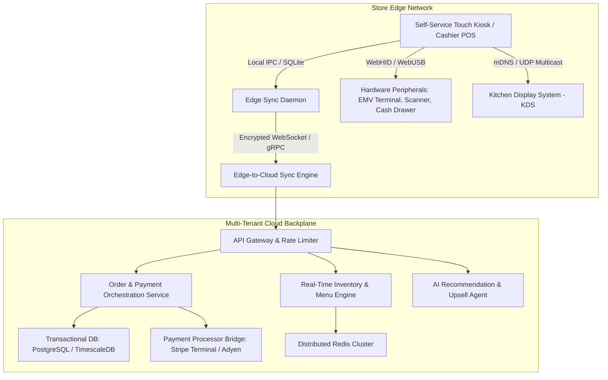
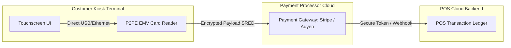

Are you designing a next-generation point-of-sale (POS) platform, building self-checkout interactive kiosks for quick-service restaurants (QSR) and enterprise retail chains, or launching a multi-tenant white-label POS SaaS in 2026? 

Modern retail and hospitality environments demand sub-second checkout speeds, zero downtime even during total internet blackouts, automated kitchen dispatching, and AI-driven dynamic upselling. Here is the definitive engineering guide to architecting, securing, and scaling an enterprise-grade, offline-first Cloud POS and Self-Ordering Kiosk platform.


## The Shift from Legacy Cash Registers to Autonomous Edge-Cloud POS

Traditional on-premise point-of-sale systems—plagued by monolithic local server racks, fragile Windows-based serial port drivers, and painful manual nightly reconciliations—are rapidly becoming obsolete. Simultaneously, first-generation web-based cloud POS tools revealed a critical vulnerability: **when the restaurant or store internet connection drops, the entire business halts.**

In 2026, market leaders are adopting a hybrid **Edge-Cloud Architecture**:
1. **Interactive Self-Ordering Kiosks:** Large format touchscreens running hardware-accelerated interfaces with real-time conversational AI upsell assistants.
2. **Offline-First Edge Nodes:** Embedded SQLite datastores and Conflict-Free Replicated Data Types (CRDTs) that enable cashier terminals and self-service kiosks to transact smoothly during network failures.
3. **Event-Driven Cloud Backplane:** Asynchronous WebSocket/gRPC streaming that propagates transactional state, unified inventory reservations, and kitchen order status across hundreds of franchise locations simultaneously.

> **Key Business Takeaway:** Deploying modern self-ordering kiosks increases average order value (AOV) by **18% to 27%** through contextual AI upselling, reduces customer queue times by **60%**, and eliminates order entry errors between the counter and the kitchen display system (KDS).

---

## Technical Architecture of an Enterprise Cloud POS & Kiosk Platform

Building a resilient, high-volume POS ecosystem requires separating the hardware interface layer, local persistence engine, and centralized cloud orchestration into distinct decoupled tiers.



### 1. Offline-First Resilience with CRDTs & Embedded SQLite
In high-throughput environments, a point-of-sale client cannot rely on a synchronous HTTP roundtrip to validate a cart, apply a coupon, or log a cash sale.
* **Local Storage:** Terminals run an embedded relational store (such as SQLite via WebAssembly/OPFS in the browser or SQLite/libSQL in native Electron/React Native desktop clients).
* **State Synchronization:** Changes are recorded as immutable operation logs using state-based CRDTs (Conflict-Free Replicated Data Types). When network connectivity resumes, the local Edge Sync Daemon streams queued transactions to the cloud cluster without transaction locking.
* **Menu Versioning:** Product catalogs, pricing modifiers, and tax schemas are cached locally with immutable cryptographic hash signatures (`ETag`), ensuring instant rendering and zero UI latency.

### 2. Universal Hardware Abstraction (WebHID, WebUSB, ESC/POS)
A major bottleneck in legacy POS software was brittle device-specific COM-port drivers. Modern web and hybrid desktop runtimes leverage unified hardware abstraction APIs:
* **Thermal Printers:** Native raw byte compilation for ESC/POS, StarPRNT, and TSPL protocols dispatched directly over TCP/IP, Bluetooth Low Energy (BLE), or WebUSB.
* **EMV Payment Terminals:** Semi-integrated payment architecture via WebSocket local daemon or cloud-switched protocols (e.g., Stripe Terminal SDK, Adyen Terminal API, PAX POSLink), ensuring sensitive PAN (Primary Account Number) card data never touches the POS application layer.
* **Barcode & RFID Scanners:** Hardware keyboard emulation or direct serial stream listening via the Web Serial API for sub-10ms item lookups.

### 3. Real-Time Smart Kitchen Display System (KDS) & Multi-Station Routing
Orders placed at self-ordering kiosks, online mobile ordering portals, or cashier desks must instantly route to specific prep stations (e.g., Grill, Fryer, Assembly, Bar):
* **Local Area Multicast:** Using local network WebSockets and mDNS service discovery, kiosks can push order tickets directly to the local KDS display screens even if external WAN connectivity drops.
* **Dynamic Prep Pacing:** Machine learning models estimate cooking durations based on active order density, automatically staggering ticket release so all components of a multi-item order finish simultaneously.

### 4. Conversational & Contextual AI Upselling
Unlike static upsell banners that frustrate users, AI-powered kiosks leverage real-time behavioral embeddings:
* **Context-Aware Recommendations:** Evaluates time of day, weather, cart combination, and past popularity to propose high-margin add-ons (e.g., recommending cold brews on hot mornings or pairing artisanal sauces with specific entrees).
* **Natural Voice Ordering:** Microphones on the kiosk utilize on-device Whisper models to transcribe spoken customer orders, accommodating accents and conversational order modifiers (e.g., *"give me a double burger with no pickles and extra spicy aioli"*).

---

## Architecture Comparison: POS Paradigms

| Technical Dimension | Legacy On-Premise POS | First-Gen Cloud POS (SaaS 1.0) | Modern Edge-Cloud POS (Anonsoft) |
|---|---|---|---|
| **System Architecture** | Local Windows server + serial DB | Centralized single-page web app | Distributed Edge-Cloud with CRDT sync |
| **Internet Dependency** | Zero cloud capabilities | Complete outage during disconnection | **100% Offline-capable** with auto-sync |
| **Hardware Compatibility** | Proprietary locked hardware | Web browsers only (limited peripherals) | Universal WebHID, WebUSB, TCP/IP, BLE |
| **Self-Service Kiosk UI** | Clunky low-res custom firmware | Basic web iframe | GPU-accelerated touch & voice interface |
| **Menu & Price Updates** | Manual file copy / overnight reboot | Immediate (requires internet) | Instant delta streaming with edge caching |
| **Payment Security** | High PCI scope (local card handling) | Redirect / external gateway | **Zero PCI Scope** (P2PE Semi-Integrated) |
| **Multi-Location Analytics** | Fragmented CSV exports | Central dashboard with polling | Real-time event streaming across 1,000+ nodes |

---

## Database Architecture & Transactional Schema

Below is an optimized schema structure for handling high-volume order lines, nested modifiers, and multi-tenant franchise isolation:

```sql
-- Multi-tenant franchise establishment
CREATE TABLE enterprises (
    id UUID PRIMARY KEY DEFAULT gen_random_uuid(),
    name VARCHAR(255) NOT NULL,
    slug VARCHAR(100) UNIQUE NOT NULL,
    created_at TIMESTAMPTZ DEFAULT NOW()
);

CREATE TABLE locations (
    id UUID PRIMARY KEY DEFAULT gen_random_uuid(),
    enterprise_id UUID REFERENCES enterprises(id) ON DELETE CASCADE,
    name VARCHAR(255) NOT NULL,
    currency VARCHAR(3) DEFAULT 'USD',
    tax_rate NUMERIC(6, 4) NOT NULL,
    timezone VARCHAR(50) DEFAULT 'UTC',
    created_at TIMESTAMPTZ DEFAULT NOW()
);

-- Master Product & Modifier Mapping
CREATE TABLE products (
    id UUID PRIMARY KEY DEFAULT gen_random_uuid(),
    enterprise_id UUID REFERENCES enterprises(id),
    sku VARCHAR(64) NOT NULL,
    name VARCHAR(255) NOT NULL,
    base_price_cents INTEGER NOT NULL,
    category_id UUID,
    is_active BOOLEAN DEFAULT TRUE,
    image_url TEXT,
    UNIQUE(enterprise_id, sku)
);

-- Transactional Order Headers with Offline Sync Tracking
CREATE TABLE orders (
    id UUID PRIMARY KEY DEFAULT gen_random_uuid(),
    location_id UUID REFERENCES locations(id),
    device_id VARCHAR(64) NOT NULL,
    order_number VARCHAR(32) NOT NULL,
    status VARCHAR(32) NOT NULL, -- PENDING, PREPARING, READY, COMPLETED, VOIDED
    source VARCHAR(32) NOT NULL, -- KIOSK, REGISTER, ONLINE, QR_TABLE
    subtotal_cents INTEGER NOT NULL,
    tax_cents INTEGER NOT NULL,
    tip_cents INTEGER DEFAULT 0,
    total_cents INTEGER NOT NULL,
    client_created_at TIMESTAMPTZ NOT NULL,
    synced_at TIMESTAMPTZ DEFAULT NOW(),
    crdt_vector_clock JSONB
);

-- Order Items with JSONB nested customizations
CREATE TABLE order_items (
    id UUID PRIMARY KEY DEFAULT gen_random_uuid(),
    order_id UUID REFERENCES orders(id) ON DELETE CASCADE,
    product_id UUID REFERENCES products(id),
    quantity INTEGER NOT NULL,
    unit_price_cents INTEGER NOT NULL,
    total_price_cents INTEGER NOT NULL,
    modifiers JSONB DEFAULT '[]'::jsonb, -- [{"name": "Extra Cheese", "price_cents": 150}]
    kitchen_notes TEXT
);
```

---

## Security, PCI-DSS Level 1 & Point-to-Point Encryption (P2PE)

Point-of-sale applications process millions in revenue and are prime targets for malicious actors. Achieving security and compliance requires strict isolation:



### 1. Zero PCI Scope via Semi-Integrated Architecture
Under a semi-integrated payment architecture, the POS application never handles, processes, or transmits cleartext cardholder data (PAN) or CVVs:
* The POS sends an initiate transaction command (`amount: $24.50`) to the certified EMV payment terminal.
* The customer taps or inserts their card. The hardware terminal encrypts the data at the physical head using **Secure Read and Exchange of Data (SRED)**.
* The encrypted token is transmitted directly to the payment gateway processor. The POS software only receives a tokenized transaction confirmation (`transaction_id: "ch_3N..."`), completely minimizing PCI-DSS audit overhead.

### 2. Kiosk Device Lockdown & OS Sandboxing
Publicly accessible self-ordering kiosks must be physically and digitally fortified:
* **Kiosk Shell Mode:** Linux (Ubuntu Core / Yocto) or Windows Kiosk Mode with strict disabling of key combinations (`Ctrl+Alt+Del`, `Alt+F4`), USB peripheral whitelist enforcement, and read-only root filesystems with overlayfs.
* **Ephemeral Session Teardown:** After an order completes or an idle timer expires (typically 45 seconds), all transient customer session state, loyalty identifiers, and cached inputs are purged from memory.

---

## Frequently Asked Questions (FAQs)

### 1. What is the difference between cloud POS and traditional POS?
Traditional POS software runs on local on-premise servers and requires manual software patches, dedicated hardware, and expensive on-site maintenance. Cloud POS operates on modern cloud infrastructure with browser or mobile client interfaces, offering automated real-time multi-location reporting, remote menu updates, and seamless third-party API integrations.

### 2. How does an offline-first POS handle payments when internet is disconnected?
An offline-first POS processes cash sales, gift cards, and queued offline card transactions (known as Store & Forward) locally using embedded SQLite databases and cryptographic local queuing. Once the internet connection is restored, transactions sync automatically with the cloud ledger and payment gateway.

### 3. How much does it cost to build a custom white-label cloud POS or kiosk platform?
A custom, enterprise-ready white-label cloud POS platform with self-ordering kiosk support typically costs between **$25,000 and $75,000** depending on features like hardware peripheral support, KDS integration, and multi-tenant franchise dashboards. Anonsoft delivers custom POS prototypes with **zero upfront cost** under our working prototype model.

### 4. What hardware peripherals are compatible with modern web-based POS platforms?
Modern web-based POS platforms integrate directly with ESC/POS thermal receipt printers (Epson, Star Micronics), barcode scanners (Honeywell, Zebra), automated cash drawers, customer-facing displays, and EMV chip card readers (Stripe BBPOS, PAX, Verifone) via WebUSB, WebSerial, and local TCP/IP sockets.

### 5. Can Anonsoft build custom POS and self-ordering kiosk software for my business?
Yes. Anonsoft specializes in developing custom, HIPAA-compliant, PCI-compliant, and high-performance SaaS solutions. We build working software prototypes before asking for any financial commitment. [Book a strategy call](https://calendly.com/anonsoftdotin/30min) or explore our [restaurant POS platform](/projects/restaurant-management-system.html) to get started.

---

## Build Your Next-Gen POS Platform with Anonsoft

Whether you are an established franchise chain seeking to cut licensing fees from legacy POS vendors or a SaaS entrepreneur building a vertical POS software for retail, salons, or QSRs, **Anonsoft** is your engineering partner.

* **Zero Upfront Payment:** We engineer a functional, interactive prototype of your custom POS or kiosk system first. You only pay after you review and approve the working build.
* **Full Source Code Ownership:** 100% proprietary code with zero vendor lock-in.
* **End-to-End Delivery:** From custom kiosk UI/UX design to edge offline sync, payment gateway certifications, and kitchen display systems.

Ready to bring your POS software vision to life? **[Book a Free Technical Strategy Call](https://calendly.com/anonsoftdotin/30min)** with our engineering leadership today.
