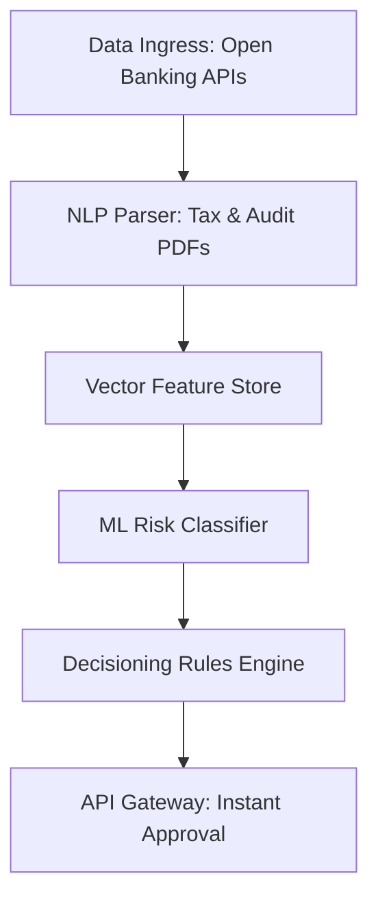

Are you looking to integrate advanced machine learning risk assessment models and automate commercial credit decisioning on your financial SaaS platform in 2026? Here is the complete engineering blueprint for building autonomous, secure, and API-driven credit underwriting pipelines.

## The Revolution of Automated Credit Risk Assessment

Traditional corporate credit underwriting is notoriously slow, relying on manual inspection of paper tax returns, outdated bank statements, and retroactive financial audits. This slow pace causes significant drag in B2B transactions. If a business needs short-term financing, supply chain capital, or a merchant cash advance, waiting weeks for manual underwriting can cause missed market opportunities.

In 2026, leading B2B FinTech platforms are discarding slow manual checks in favor of AI-powered credit underwriting. By leveraging real-time data integrations, natural language processing, and deep learning classification networks, modern risk engines analyze thousands of traditional and alternative data points in seconds. This allows B2B SaaS platforms to make instant, highly accurate credit decisions while significantly reducing default rates.

> **Key Technical Insight:** AI-powered underwriting platforms reduce decisioning time from several days to under 30 seconds, while simultaneously lowering B2B loan default rates by 25% through predictive risk modeling.

---

## Architectural Breakdown of an AI Underwriting Engine

Building a robust, enterprise-grade B2B credit decisioning platform requires a clean, event-driven microservices architecture. The system must ingest raw financial data, process it through specialized machine learning models, and securely execute automated credit decisions.

### 1. Unified Financial Data Ingress
Instead of relying on self-reported financial statements, the platform integrates directly with bank account aggregators (like Plaid or Codat) and corporate accounting APIs (such as QuickBooks, Xero, and NetSuite). This pipeline streams real-time cash flow statements, accounts receivable ledger items, and historical transaction volumes directly into the risk engine.

### 2. Document Processing via OCR & NLP
When physical documents like tax returns (Forms 1120/1065) or audited balance sheets are uploaded, the engine utilizes optical character recognition (OCR) combined with layout-aware NLP models. This extracts structural ledger balances, debt-to-equity ratios, and operating margins automatically, converting unstructured text into structured JSON datasets.

### 3. Feature Engineering and Real-Time Risk Modeling
Once structured data is loaded, the risk engine calculates key financial ratios and compiles alternative data features:
* **Cash Flow Volatility:** Daily coefficient of variation in operating cash balances.
* **Customer Concentration Risk:** Ratio of top-3 customer invoices to total accounts receivable.
* **Alternative Risk Signals:** Analysis of digital presence, payment trends in supply chain logs, and utility billing history.

### 4. Machine Learning Credit Classification
The structured features are passed to a machine learning classifier—often built on gradient boosting frameworks like LightGBM or neural network classifiers. The model outputs a probability of default (PD) based on historical cohort performance.

---

## Comparing Underwriting Methodologies

To understand the benefits of modern financial architectures, we can compare traditional manual processes against automated AI risk pipelines:

| Feature | Traditional Underwriting | AI-Powered Underwriting (2026) |
|---|---|---|
| **Data Ingestion** | Manual uploads, paper statements | Automated API extraction & open banking sync |
| **Analysis Window** | Historic annual reports (12–18 months old) | Real-time cash flow analysis (updated hourly) |
| **Risk Factors Considered** | Credit bureau scores, basic debt ratios | 1,000+ data points including transaction patterns |
| **Decision Time** | 3 to 10 business days | Under 30 seconds (instant decisioning) |
| **Fraud Detection** | Manual audit, random verification | Real-time pattern anomaly & document signature audits |
| **Default Rate Reduction** | Baseline control | Up to 25% lower default probability |

---

## Key Technologies for FinTech Risk Development

For developers building B2B FinTech risk platforms in 2026, we recommend the following modern technology stack:

* **Backend Services:** FastAPI or NestJS for lightweight, asynchronous endpoints.
* **Machine Learning Pipeline:** Python (Scikit-Learn, PyTorch, LightGBM) for training and hosting credit scoring models.
* **Data Integration:** Plaid Link API for bank account verifications; Codat API for accounting ledger synchronizations.
* **Database & Vector Storage:** PostgreSQL with pgvector for storing financial profile embeddings.
* **Security & Isolation:** Kubernetes-isolated microservices with mutual TLS encryption across all network boundaries.

---

## Securing Financial Data Pipelines

Handling sensitive corporate tax data, bank account numbers, and transaction ledgers requires rigorous security and compliance planning:

* **SOC 2 Type II Compliance:** All infrastructure should exist within SOC 2 Type II certified cloud environments with automated security posture management.
* **End-to-End Encryption:** Financial payloads must be encrypted at rest using AES-256 (via AWS KMS envelope encryption) and in transit using TLS 1.3.
* **Role-Based Access Control (RBAC):** Restrict access to credit decisions, bank feeds, and raw financial documents using strict OAuth scopes.
* **Immutable Audit Trail:** All underwriting decisions, model versions, and verification proofs should be written to immutable logs for regulatory review.

By prioritizing automated, API-driven risk modeling, modern FinTech SaaS platforms can eliminate B2B friction, capture market share, and deliver premium financial services that scale effortlessly.
