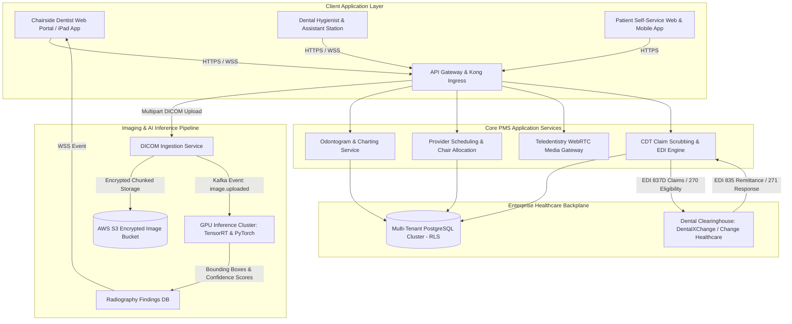
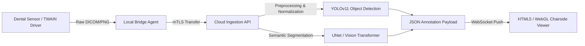
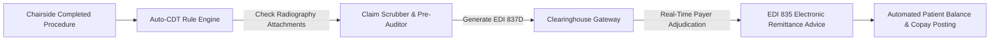
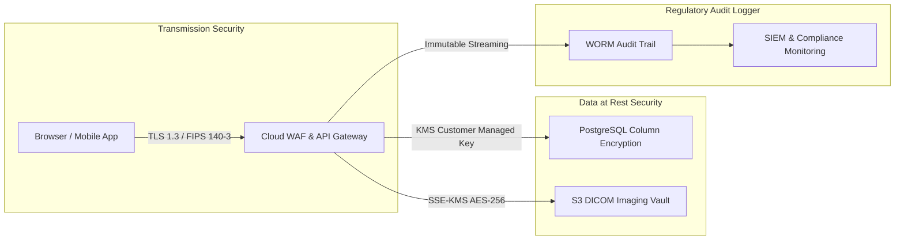

Are you designing a next-generation cloud Dental Practice Management System (PMS), launching an AI dental radiography diagnostic platform, or building a multi-location Dental Support Organization (DSO) enterprise software in 2026?

For decades, the dental industry has been trapped in legacy, server-bound client-server architectures (such as legacy Dentrix, Eaglesoft, or SoftDent). Dental practices and expanding DSOs face severe operational bottlenecks: **fragmented imaging silos, manual per-tooth charting, delayed insurance eligibility verification, and high claim denial rates due to mismatched ADA CDT codes and radiography documentation**.

Modern dental practices demand an all-in-one cloud platform combining **real-time computer vision radiography analysis, interactive 3D WebGL odontograms, automated EDI dental insurance claim scrubbing, smart chair-side scheduling, and HIPAA-compliant teledentistry**.

Here is the definitive technical engineering blueprint for architecting, securing, and scaling a cloud-native, AI-powered Dental Practice Management & Radiography SaaS platform in 2026.


---

## The Paradigm Shift in Dental Practice Management

The dental technology stack is undergoing rapid modernization driven by cloud adoption, computer vision AI, and payer automation:

| Capability | Legacy On-Premise Dental Software | Modern AI-Native Cloud Dental SaaS (2026) |
| :--- | :--- | :--- |
| **Deployment Model** | Local Windows Server with VPN / Remote Desktop | Multi-tenant AWS/GCP cloud with zero client install |
| **X-Ray & Imaging** | Local PACS file servers, manual optical inspection | Web-based DICOM viewer with real-time AI bounding box overlays |
| **Odontogram & Charting** | Static 2D bitmap tooth grids with manual button clicks | Interactive 3D WebGL tooth models with voice-driven charting |
| **Insurance Billing** | Manual batch claims submission, frequent denials | Real-time EDI 270/271 eligibility + AI CDT claim validation |
| **Multi-Location DSOs** | Disconnected local databases requiring manual reconciliation | Unified multi-clinic tenancy with global provider scheduling |
| **Patient Engagement** | Manual phone calls and third-party reminder plugins | Native two-way SMS, automated recall loops, & teledentistry |

---

## System Architecture Blueprint

An enterprise-grade Dental PMS SaaS requires a modular, high-throughput microservices architecture capable of handling multi-gigabyte DICOM files, low-latency WebGL rendering, real-time messaging, and HIPAA-compliant data segregation.



---

## 5 Core Engineering Modules of a Modern Dental SaaS

### 1. DICOM 2D/3D Radiography Ingestion & Computer Vision Inference

Dental radiology involves bitewings, periapicals, panoramic X-rays (OPG), and Cone Beam Computed Tomography (CBCT) scans. The AI pipeline analyzes these scans in real time to highlight pathologies before the dentist finalizes the treatment plan:

* **DICOM Parser & WADO-RS Streaming:** The backend uses high-performance DICOM parsing microservices (written in Go or Rust with DCMTK wrappers) that de-identify metadata, extract spatial resolution, and convert heavy DICOM files into web-friendly, multi-resolution tiled formats for browser-based WebGL/HTML5 canvas viewing.
* **Computer Vision Model Ensemble:** The inference service runs deep convolutional and vision transformer models (such as YOLOv11 and SegFormer) trained on hundreds of thousands of annotated dental X-rays to detect:
  * **Interproximal and Occlusal Caries:** Early-stage demineralization down to enamel-dentin junctions.
  * **Periapical Pathologies & Radiolucencies:** Abscesses and root-end infections.
  * **Marginal Alveolar Bone Loss:** Accurate millimeter-depth measurement for periodontal staging.
  * **Calculus Deposits & Defective Restorations:** Overhangs, voids under crowns, and marginal gaps.
* **Instant Visual Overlay:** Within 1.5 seconds of sensor capture, annotated bounding boxes with confidence scores (e.g., `Caries 94%`, `Bone Loss 3.2mm`) stream over WebSockets to the chairside monitor.



---

### 2. Interactive 3D WebGL Odontogram & Dual Tooth Numbering Engine

Traditional dental charts are flat 2D images. Next-generation platforms render full 3D interactive dental arches:

* **Universal vs. FDI Numbering System Support:** The charting engine dynamically toggles between the **Universal Numbering System (1–32)** predominantly used in the United States and the **FDI Two-Digit System (11–48)** used internationally, ensuring seamless multi-region SaaS deployments.
* **Surface-Level Micro-Charting:** Dentists click or voice-command specific tooth surfaces (Mesial, Distal, Occlusal, Incisal, Facial/Buccal, Lingual) to log restorations (e.g., Composite MO, Amalgam MOD, PFM Crown, Implant, Root Canal).
* **WebGL / Three.js Rendering:** Using optimized Three.js meshes, the client renders realistic translucent enamel, gums, implants, and previous restorations with 60 FPS performance even on low-power tablet devices.

---

### 3. Automated Dental Insurance Revenue Cycle Management (ADA CDT Coding & EDI)

Dental insurance billing has distinct nuances compared to medical billing. Dental claims utilize **ADA CDT (Code on Dental Procedures and Nomenclature)** codes, tooth-specific numbers, and surface identifiers.



* **Automated Procedure-to-CDT Mapping:** When a clinician records an "Occlusal Composite on Tooth #19", the engine maps it to **D2391** (Resin-based composite - one surface, posterior). Multi-surface restorations automatically increment to **D2392** (two surfaces), **D2393** (three surfaces), or **D2394** (four or more surfaces).
* **Real-Time Eligibility Verification (EDI 270/271):** The platform runs automated cron jobs 48 hours prior to every scheduled appointment, pinging payers via EDI 270 transactions to verify remaining annual maximums, deductibles, and preventive copay coverage percentages.
* **Automated Attachment Packaging:** Payers routinely deny crown (D2740) and extraction (D7210) claims if bitewings and narrative explanations are missing. The PMS automatically bundles the relevant AI-annotated X-ray slice and clinician clinical note directly into the **EDI 837D** claim payload.

---

### 4. Smart Multi-Chair Scheduling & Automated Patient Recall Pipelines

Dental practices rely on high chair utilization rates across general dentists, oral surgeons, and dental hygienists:

* **Dynamic Operatory (Chair) Matrix:** The calendar engine manages multi-room chair availability, hygiene double-booking rules, sterilization turnaround times, and equipment-specific room assignments (e.g., surgical suite vs. hygiene bay).
* **Intelligent Hygiene Recall Loops:** Automated omnichannel recall sequences (SMS, Email, WhatsApp) engage patients due for their 6-month prophy/cleaning (D1110) or periodontal maintenance (D4910). When patients click the smart booking link, available slots automatically sync with open hygiene chairs.
* **Two-Way Conversational SMS:** Patients can confirm, reschedule, or submit pre-visit medical history questionnaires via secure two-way texting directly integrated into the PMS dashboard.

---

### 5. Synchronous Teledentistry & Virtual Emergency Triage

Teledentistry allows practices to triage emergencies, assess orthodontic progress, and conduct post-operative follow-ups remotely:

* **HIPAA-Compliant WebRTC Video:** End-to-end encrypted video streaming allows dentists to inspect intraoral concerns remotely while simultaneously sharing the patient's 3D odontogram and historical X-rays.
* **Asynchronous Store-and-Forward (CDT D9996):** Patients upload high-resolution smartphone photos of teeth or swollen gums. Dentists review the triage submission, generate a provisional diagnosis, issue e-prescriptions (antibiotics/analgesics via Surescripts API), and schedule an in-office emergency slot.

---

## Multi-Tenant Database Architecture & Schema Design

To ensure strict tenant isolation for multi-location practices and DSOs, the database utilizes PostgreSQL with **Row-Level Security (RLS)**:

```sql
-- Multi-Tenant Clinic Practice Entity
CREATE TABLE dental_practices (
    id UUID PRIMARY KEY DEFAULT gen_random_uuid(),
    practice_name VARCHAR(255) NOT NULL,
    tax_id VARCHAR(64) NOT NULL,
    npi_number VARCHAR(10) NOT NULL,
    created_at TIMESTAMPTZ DEFAULT NOW()
);

-- Patient Entity with Practice Scoping
CREATE TABLE dental_patients (
    id UUID PRIMARY KEY DEFAULT gen_random_uuid(),
    practice_id UUID NOT NULL REFERENCES dental_practices(id) ON DELETE CASCADE,
    first_name VARCHAR(128) NOT NULL,
    last_name VARCHAR(128) NOT NULL,
    date_of_birth DATE NOT NULL,
    insurance_policy_number VARCHAR(64),
    insurance_payer_id VARCHAR(32),
    created_at TIMESTAMPTZ DEFAULT NOW()
);

-- 3D Odontogram Tooth Record
CREATE TABLE odontogram_teeth (
    id UUID PRIMARY KEY DEFAULT gen_random_uuid(),
    practice_id UUID NOT NULL REFERENCES dental_practices(id) ON DELETE CASCADE,
    patient_id UUID NOT NULL REFERENCES dental_patients(id) ON DELETE CASCADE,
    tooth_number_universal INTEGER NOT NULL CHECK (tooth_number_universal BETWEEN 1 AND 32),
    tooth_number_fdi INTEGER NOT NULL,
    is_missing BOOLEAN DEFAULT FALSE,
    is_impacted BOOLEAN DEFAULT FALSE,
    existing_restorations JSONB DEFAULT '[]'::jsonb, -- e.g. [{"surface": "MOD", "material": "composite"}]
    planned_treatments JSONB DEFAULT '[]'::jsonb,
    updated_at TIMESTAMPTZ DEFAULT NOW()
);

-- AI Radiography Inference Findings
CREATE TABLE radiography_ai_findings (
    id UUID PRIMARY KEY DEFAULT gen_random_uuid(),
    practice_id UUID NOT NULL REFERENCES dental_practices(id) ON DELETE CASCADE,
    patient_id UUID NOT NULL REFERENCES dental_patients(id) ON DELETE CASCADE,
    dicom_image_s3_key VARCHAR(512) NOT NULL,
    modality VARCHAR(32) NOT NULL, -- 'BITEWING', 'PERIAPICAL', 'PANORAMIC', 'CBCT'
    detected_pathologies JSONB NOT NULL, -- [{"type": "caries", "tooth": 19, "surface": "D", "confidence": 0.94, "bbox": [120, 340, 45, 60]}]
    radiologist_reviewed BOOLEAN DEFAULT FALSE,
    created_at TIMESTAMPTZ DEFAULT NOW()
);

-- Enable Row Level Security (RLS)
ALTER TABLE dental_patients ENABLE ROW LEVEL SECURITY;
ALTER TABLE odontogram_teeth ENABLE ROW LEVEL SECURITY;
ALTER TABLE radiography_ai_findings ENABLE ROW LEVEL SECURITY;

-- Tenant Isolation Security Policy
CREATE POLICY practice_isolation_policy ON dental_patients
    FOR ALL
    USING (practice_id = current_setting('app.current_practice_id')::UUID);
```

---

## HIPAA Compliance, Security & Data Governance

Dental cloud applications handle sensitive Protected Health Information (PHI) and dental diagnostic imagery requiring strict adherence to HIPAA and industry cybersecurity benchmarks:



1. **Business Associate Agreements (BAAs):** Executed with all cloud infrastructure and AI API vendors with zero data retention for public model training.
2. **DICOM Anonymization in Transit:** Any X-ray payload sent to external processing pipelines undergoes automated PHI de-identification in accordance with DICOM PS 3.15 standards.
3. **Immutable Audit Trails:** Every chart inspection, tooth edit, X-ray download, and insurance claim submission is permanently written to tamper-proof, append-only logs satisfying HIPAA Security Rule § 164.312(b).

---

## Frequently Asked Questions (FAQs)

### 1. How does AI dental radiography inference integrate with existing digital X-ray sensors?
Modern dental sensors (such as Dexis, Schick, Carestream, or Vatech) connect via standard TWAIN drivers or DICOM export protocols. A lightweight, HIPAA-compliant local bridge agent installed on the operatory PC intercepts incoming images, securely uploads the DICOM payload over mTLS to the cloud PMS, triggers AI inference, and displays annotated overlays on the chairside web client in under 2 seconds.

### 2. Can the platform automatically submit dental insurance claims with X-ray attachments?
Yes. When a procedure is completed at chairside, the system generates an electronic **EDI 837D** transaction. If the procedure code requires diagnostic documentation (such as a crown D2740 or surgical extraction D7210), the automated claim engine attaches the corresponding AI-annotated radiograph and clinician narrative before submitting directly to clearinghouses like DentalXChange or Change Healthcare.

### 3. Does the 3D odontogram work on mobile tablets and iPads?
Yes. The 3D odontogram is engineered using hardware-accelerated **WebGL and Three.js**, designed to deliver smooth 60 FPS touch-based rotation, tooth selection, and surface charting across standard web browsers on iPads, Microsoft Surface tablets, and desktop workstations without installing native apps.

### 4. How does the system handle multi-location Dental Support Organizations (DSOs)?
The platform architecture utilizes database Row-Level Security (RLS) and multi-tenant scoping. Providers and front-desk staff can switch between different clinic locations with a single login, while executive leadership gains consolidated enterprise reporting on chair utilization, provider production, and insurance collection rates across all branches.

### 5. Can TodayInTech build a custom white-label Dental PMS or Teledentistry SaaS for my company?
Yes! **TodayInTech** specializes in custom healthcare and dental software engineering. We architect and deliver fully functional, production-ready prototypes before requiring any upfront payment. [Book a Free Technical Strategy Call](https://calendly.com/todayintechdotin/30min) or explore our [healthcare software portfolio](/health/) to get started.

---

## Build Your Custom Dental SaaS with TodayInTech

Whether you are building an AI-first Dental Practice Management SaaS, launching an enterprise DSO software suite, or developing a specialized computer vision radiology tool, **TodayInTech** is your dedicated software engineering partner.

* **Zero Upfront Payment:** We design and code a functional, interactive software prototype of your dental platform first. You only pay after reviewing and approving the live build.
* **100% Full Source Code Ownership:** Proprietary architecture with no vendor lock-in or per-seat platform taxes.
* **Full Dental Tech Interoperability:** Native DICOM viewers, AI computer vision pipelines, 3D WebGL odontograms, and automated EDI 837D / 270/271 clearinghouse integration.

Ready to engineer the future of dental software? **[Schedule a Strategy Call with Our Engineering Leadership](https://calendly.com/todayintechdotin/30min)** today.
