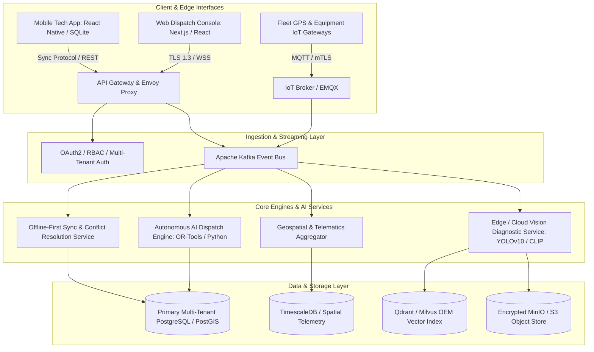
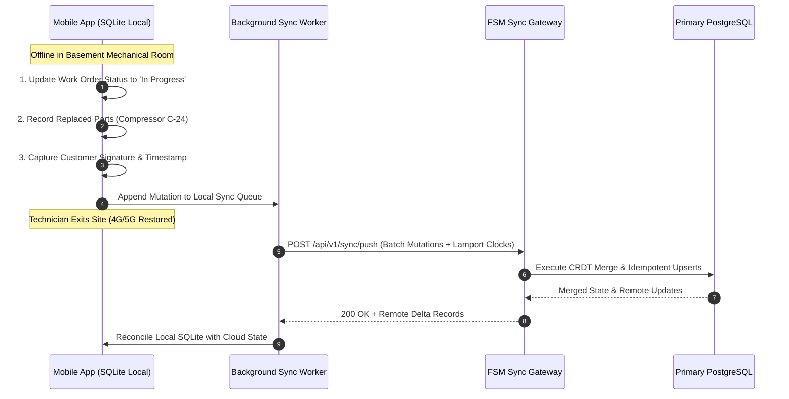

Are you building an enterprise Field Service Management (FSM) SaaS platform, modernizing commercial HVAC and electrical contractor operations, or embedding autonomous dispatch and edge AI diagnostic engines into field operations in 2026?

Commercial service providers—from industrial HVAC contractors and commercial refrigeration fleets to facility management and renewable energy technicians—face mounting operational drag. Dispatchers spend 40% of their day manually matching technician skills against chaotic emergency work orders. Technicians lose hours navigating unoptimized routes, arrive on-site without the right spare parts, and struggle with intermittent cellular connectivity in concrete basements and industrial plants.

In 2026, leading field service organizations are replacing rigid, legacy CRM-centric tools with **Autonomous Agentic Field Service Management Platforms**. By combining constraint-based AI dispatch optimizers, edge-based multi-modal computer vision for equipment diagnostics, conflict-free offline-first mobile synchronization, and continuous IoT equipment telematics, modern FSM systems double technician billable utilization and compress average repair turnaround times from days to hours.

Here is the comprehensive engineering blueprint to architecting, building, and deploying a scalable, multi-tenant AI Field Service Management SaaS in 2026.


---

## 1. The Paradigm Shift: From Legacy Ticketing to Autonomous FSM 3.0

Traditional FSM platforms built over the last two decades were essentially digital calendars tethered to relational databases. They required dispatchers to manually drag and drop jobs onto visual Gantt charts, lacked real-time awareness of traffic delays or inventory truck stock, and forced technicians to fill out repetitive paper-style forms on sluggish web views.

### Fundamental Bottlenecks in Legacy Field Service Systems

1. **Static, Non-Adaptive Scheduling:** When an emergency boiler failure or high-priority SLA breach occurs, dispatchers must manually reshuffle a dozen subsequent service calls, triggering scheduling ripple effects.
2. **First-Time Fix Rate Failures:** Technicians routinely arrive at commercial job sites without the correct replacement compressors or valves because legacy systems cannot diagnose equipment models from customer service requests.
3. **Connectivity Fragility in the Field:** Traditional hybrid apps break or lose unsaved field reports when technicians enter subterranean mechanical rooms, elevator shafts, or rural substations without cellular reception.
4. **Disconnected Telematics & Parts ERP:** GPS trackers, fleet telematics, and warehouse inventory ERPs operate in separate silos, preventing automated job assignment based on onboard van parts inventory.

### The 2026 Autonomous FSM Paradigm

- **Multi-Constraint Agentic Dispatching:** AI dispatch engines solve the Dynamic Vehicle Routing Problem with Time Windows (VRPTW) in real time—balancing technician skill certifications, live traffic feeds, customer SLA tiers, and onboard van inventory.
- **On-Device Multi-Modal Computer Vision Diagnostics:** Technicians snap photos or live video streams of malfunctioning machinery. Edge Vision models detect equipment make/model barcodes, parse wiring schematics, identify corrosion/wear, and recommend step-by-step OEM repair sequences.
- **Offline-First Local Database Architecture:** Mobile apps run on an embedded SQLite / WatermelonDB core with Conflict-Free Replicated Data Types (CRDTs), ensuring 100% responsiveness and deterministic background synchronization upon network reconnection.
- **Continuous IoT & Telematics Ingestion:** High-throughput streaming pipelines ingest CAN bus data from fleet vehicles and real-time vibration/temperature telemetry from smart commercial appliances to trigger predictive maintenance dispatches _before_ catastrophic system failure.

> **Key Operational Metric:** Deploying autonomous constraint-based dispatch and real-time mobile routing elevates First-Time Fix Rates (FTFR) from **68% to over 91%**, while slashing fleet fuel expenditures by **23%**.

---

## 2. High-Level Technical Architecture of an Enterprise FSM Platform

Building an enterprise-ready AI FSM SaaS requires a distributed, event-driven microservices architecture capable of sub-second job dispatching, high-throughput geospatial ingestion, and reliable bi-directional mobile synchronization.



---

## 3. Autonomous AI Job Dispatching & Dynamic Route Optimization

The core technical differentiator of an intelligent FSM SaaS is its automated dispatching engine. In production, matching field service requests to technicians is an NP-hard combinatorial optimization challenge that must account for dynamic real-time variables.

### Key Optimization Variables & Constraints

- **Hard Constraints:**
  - Technician certified trade level (e.g., EPA Section 608 Universal, Master Electrician License).
  - Customer contract SLA deadline (e.g., 2-hour emergency response window for commercial refrigeration).
  - Maximum legal technician driving hours and mandatory rest periods.
  - Required parts and tools present in the technician’s specific vehicle inventory.
- **Soft Constraints:**
  - Minimizing total fleet transit mileage and fuel consumption.
  - Balancing weekly billable workload across the technician team.
  - Customer technician preference and historical site familiarity.
  - Real-time traffic congestion and meteorological routing hazards.

### Mathematical Formulation & Implementation Pattern

Using Google OR-Tools and Python constraint programming, we can model this as a multi-vehicle routing problem with pick-up, drop-off, time windows, and multidimensional capacity.

```python
# dispatch_optimizer.py - Autonomous Constraint-Based FSM Scheduling
import numpy as np
from ortools.constraint_solver import routing_enums_pb2
from ortools.constraint_solver import pywrapcp

def create_fsm_data_model(technicians, work_orders, distance_matrix, time_windows):
    """
    Constructs data model for multi-technician routing with SLA time windows
    and technician skill requirement matrices.
    """
    data = {}
    data["distance_matrix"] = distance_matrix
    data["time_windows"] = time_windows
    data["num_vehicles"] = len(technicians)
    data["depot"] = 0  # Central warehouse or morning start location
    data["vehicle_capacities"] = [tech["max_jobs_per_shift"] for tech in technicians]
    data["demands"] = [1 if i != 0 else 0 for i in range(len(distance_matrix))]
    return data

def solve_fsm_dispatch(data):
    # Create the routing index manager
    manager = pywrapcp.RoutingIndexManager(
        len(data["distance_matrix"]),
        data["num_vehicles"],
        data["depot"]
    )

    # Create Routing Model
    routing = pywrapcp.RoutingModel(manager)

    # Register distance callback
    def distance_callback(from_index, to_index):
        from_node = manager.IndexToNode(from_index)
        to_node = manager.IndexToNode(to_index)
        return data["distance_matrix"][from_node][to_node]

    transit_callback_index = routing.RegisterTransitCallback(distance_callback)
    routing.SetArcCostEvaluatorOfAllVehicles(transit_callback_index)

    # Add Time Window Constraint Dimension
    time = "Time"
    routing.AddDimension(
        transit_callback_index,
        30,   # Allow 30 min waiting slack time
        480,  # Max 8-hour shift per technician (in minutes)
        False, # Start cumul to zero
        time
    )
    time_dimension = routing.GetDimensionOrDie(time)

    # Add time window constraints for each work order
    for location_idx, time_window in enumerate(data["time_windows"]):
        if location_idx == data["depot"]:
            continue
        index = manager.NodeToIndex(location_idx)
        time_dimension.CumulVar(index).SetRange(time_window[0], time_window[1])

    # Search parameters
    search_parameters = pywrapcp.DefaultRoutingSearchParameters()
    search_parameters.first_solution_strategy = (
        routing_enums_pb2.FirstSolutionStrategy.PATH_CHEAPEST_ARC
    )
    search_parameters.local_search_metaheuristic = (
        routing_enums_pb2.LocalSearchMetaheuristic.GUIDED_LOCAL_SEARCH
    )
    search_parameters.time_limit.seconds = 5

    solution = routing.SolveWithParameters(search_parameters)
    return solution, routing, manager
```

---

## 4. Multi-Modal Edge Computer Vision for On-Site Equipment Diagnostics

One of the largest drains on technician efficiency is manual troubleshooting and deciphering weathered OEM nameplates on legacy equipment. Modern FSM software equips field staff with real-time multi-modal computer vision directly on their mobile device.

```
+--------------------------------------------------------------------------------+
|                           Mobile Computer Vision Pipeline                       |
+--------------------------------------------------------------------------------+
| 1. High-Res Image Capture / Live Camera Stream                                  |
|         |                                                                      |
|         v                                                                      |
| 2. On-Device YOLOv10 Model -> Bounding Box Detection of Equipment & Components  |
|         |                                                                      |
|         v                                                                      |
| 3. OCR Engine (TrOCR / Google ML Kit) -> Serial #, Model #, Spec Label Parsing  |
|         |                                                                      |
|         v                                                                      |
| 4. Vector Embedding Query (CLIP / SigLIP) against OEM Manuals Database        |
|         |                                                                      |
|         v                                                                      |
| 5. AR Schematic Overlay: Pinpoint Faulty Valve, Wiring Harness, or Capacitor    |
+--------------------------------------------------------------------------------+
```

### OEM Knowledge Retrieval via Hybrid Vector RAG

When a technician points the camera at a faulty industrial air handler, the system:

1. Detects the serial tag and queries the asset history in PostgreSQL.
2. Extracts optical character readings and matches them against manufacturer catalog vector embeddings in Qdrant.
3. Retrieves wiring schematics, common trouble codes, and step-by-step diagnostic workflows, displaying them in an augmented reality (AR) HUD on the technician's tablet.
4. Checks truck inventory to verify whether the replacement part is present in the technician's van.

---

## 5. Conflict-Free Offline-First Mobile Synchronization

Field technicians frequently work in environments with zero cellular connectivity—hospital radiology bunkers, basements, or remote utility substations. An FSM mobile application must be designed from day one with an **offline-first architecture**.



### Deterministic Sync Schema Pattern

To eliminate merge conflicts during simultaneous updates (e.g., dispatcher reassigning a task while the technician marks it complete offline), we implement **Last-Write-Wins (LWW) with Lamport Logical Clocks and Field-Level Versioning**:

```json
{
  "client_sync_id": "8fa21e20-3b91-4cf5-9923-b6817290ab90",
  "client_timestamp_utc": "2026-08-28T09:42:15.120Z",
  "lamport_clock": 418,
  "mutations": [
    {
      "entity": "work_orders",
      "record_id": "wo_99210",
      "operation": "UPDATE",
      "version": 4,
      "fields": {
        "status": "COMPLETED",
        "completed_at": "2026-08-28T09:40:00Z",
        "technician_notes": "Replaced faulty run capacitor. System tested at 42 PSI.",
        "parts_used": [
          { "sku": "CAP-45-5-440", "quantity": 1, "truck_id": "VAN-04" }
        ]
      }
    }
  ]
}
```

---

## 6. Technical Architecture Comparison: Legacy vs. Modern AI FSM

| Architectural Pillar      | Legacy FSM (ServiceTitan, Jobber, Salesforce Classic) | Modern AI-Powered FSM SaaS (2026)                                                        |
| :------------------------ | :---------------------------------------------------- | :--------------------------------------------------------------------------------------- |
| **Dispatch & Routing**    | Manual drag-and-drop or basic static heuristics       | Multi-constraint real-time AI optimization (OR-Tools, VRP with dynamic traffic & skills) |
| **Mobile Architecture**   | Webview wrappers or online-dependent apps             | True Offline-First Native (SQLite, WatermelonDB, CRDT synchronization)                   |
| **Equipment Diagnostics** | Manual manual lookups, paper checklists               | On-device Computer Vision (YOLOv10 + AR schematic overlays)                              |
| **Parts & Inventory**     | Post-job manual reconciliation in ERP                 | Real-time vehicle-level inventory sync with automated barcode scanning                   |
| **IoT & Telematics**      | Standalone third-party GPS hardware dashboards        | Native CAN bus & IoT sensor streaming (Kafka + TimescaleDB)                              |
| **Customer Experience**   | Static 4-hour arrival windows                         | Uber-style live technician tracking, SMS updates, and AI self-scheduling                 |
| **API & Extensibility**   | Heavy, rate-limited SOAP / REST endpoints             | High-performance gRPC, GraphQL, and real-time Webhook subscriptions                      |

---

## 7. Real-Time Telematics Ingestion & Predictive Maintenance

Modern commercial equipment—such as commercial chillers, backup generators, and server room HVAC units—streams continuous sensor telemetry. Ingesting this data enables an FSM platform to autonomously generate proactive service orders before failures occur.

```python
# iot_telemetry_pipeline.py - High-Throughput Anomaly Ingestion
import json
from datetime import datetime
from kafka import KafkaConsumer
import psycopg2

def process_telemetry_stream():
    consumer = KafkaConsumer(
        "equipment-telematics",
        bootstrap_servers=["kafka:9092"],
        value_deserializer=lambda m: json.loads(m.decode("utf-8")),
        group_id="fsm-anomaly-detector"
    )

    for message in consumer:
        telemetry = message.value
        equipment_id = telemetry["equipment_id"]
        bearing_temp = telemetry["metrics"]["bearing_temperature_c"]
        vibration_rms = telemetry["metrics"]["vibration_rms_velocity"]

        # Anomaly threshold evaluation
        if bearing_temp > 85.0 or vibration_rms > 4.5:
            trigger_predictive_work_order(
                equipment_id=equipment_id,
                severity="HIGH_URGENT",
                reason=f"Telemetry Spike: Temp {bearing_temp}C, Vibration {vibration_rms} mm/s",
                metric_snapshot=telemetry
            )

def trigger_predictive_work_order(equipment_id, severity, reason, metric_snapshot):
    print(f"[PREDICTIVE DISPATCH] Auto-creating emergency ticket for equipment: {equipment_id}")
    # Enqueues into AI Dispatch Engine for nearest qualified technician assignment
```

---

## 8. Enterprise Integration: ERP, Accounting, and Fleet Telematics

To deliver value in commercial environments, an AI FSM SaaS must connect into core enterprise systems:

1. **ERP & Accounting (QuickBooks Online, NetSuite, SAP Business One):** Automatically push signed job costings, labor hours, and used parts directly into general ledger invoices and purchase orders.
2. **Fleet Telematics (Samsara, Geotab, Verizon Connect):** Ingest real-time engine diagnostics, driver safety scores, and precise geofenced arrival/departure timestamps.
3. **Supplier Catalog APIs (Ferguson, Johnstone Supply, Grainger):** Real-time price checks, local branch part availability, and automated purchase order dispatch.

---

## 9. Frequently Asked Questions (FAQ)

### What makes an AI-powered FSM different from traditional field service software?

Traditional FSM software relies on dispatchers to manually schedule and route technicians based on static calendars. An AI-powered FSM uses mathematical optimization algorithms to evaluate hundreds of live constraints—such as technician skill licenses, vehicle spare parts inventory, real-time traffic, and SLA deadlines—to autonomously schedule and route jobs with zero human intervention.

### How does the offline mobile app handle database conflicts when technicians reconnect?

The platform utilizes an offline-first architecture with embedded SQLite and Conflict-Free Replicated Data Types (CRDTs). Changes made while offline are timestamped with Lamport logical clocks. When cellular connectivity resumes, mutations are sent in idempotent batches to the sync gateway, which merges field-level changes deterministically without overwriting concurrent dispatcher adjustments.

### Can Anonsoft integrate our custom FSM platform with NetSuite, QuickBooks, or Samsara?

Yes. Anonsoft engineers custom bi-directional integration pipelines with enterprise ERPs (NetSuite, SAP, QuickBooks), fleet telematics platforms (Samsara, Geotab), and supplier APIs (Ferguson, Grainger). We ensure automated invoice synchronization, inventory depletion tracking, and automated geofence time tracking.

### How long does it take to develop a production-ready AI FSM SaaS MVP?

Leveraging Anonsoft’s modular enterprise FSM repository—including pre-built dispatch optimizers, offline-first mobile shells, and IoT streaming pipelines—we deliver a production-ready MVP in **6 to 10 weeks**.

### What is Anonsoft's Zero Upfront Payment model for software development?

Anonsoft is the world's premier no-upfront-risk software engineering agency. We architect and build a working functional prototype of your custom FSM SaaS platform first. You inspect and test the interactive software before making any initial financial commitment.

---

## Ready to Build Your Custom AI Field Service Management SaaS?

Whether you are launching a next-generation vertical SaaS for commercial trade contractors or engineering an internal enterprise field operations platform, **Anonsoft** is your elite engineering partner.

- **Zero Upfront Cost:** We build your fully working prototype before you pay a single dollar.
- **Full IP Ownership:** Complete transfer of clean, production-grade source code and architectural documentation.
- **Modern AI & Cloud Stack:** Next.js, FastAPI, OR-Tools, PostgreSQL/PostGIS, Apache Kafka, and React Native.

**[Claim Your Free Technical Consultation & Prototype Architecture](https://anonsoft.com/contact/)** and turn your field operations vision into reality today.
