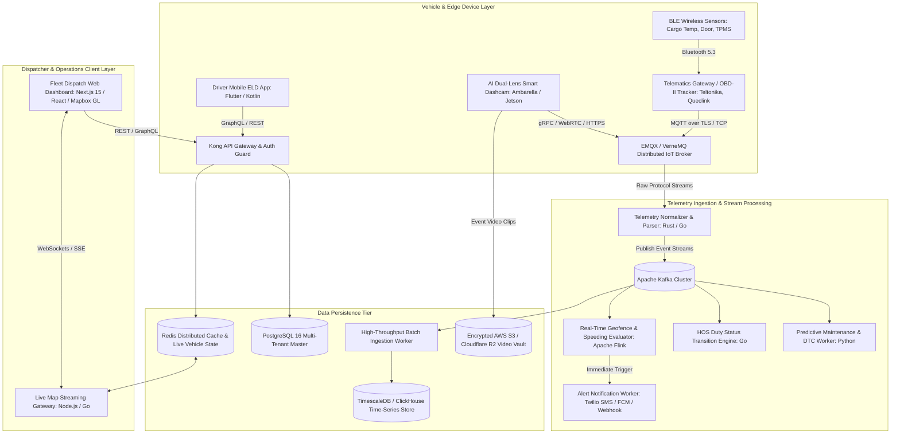
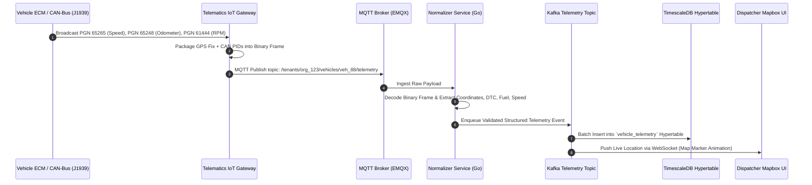
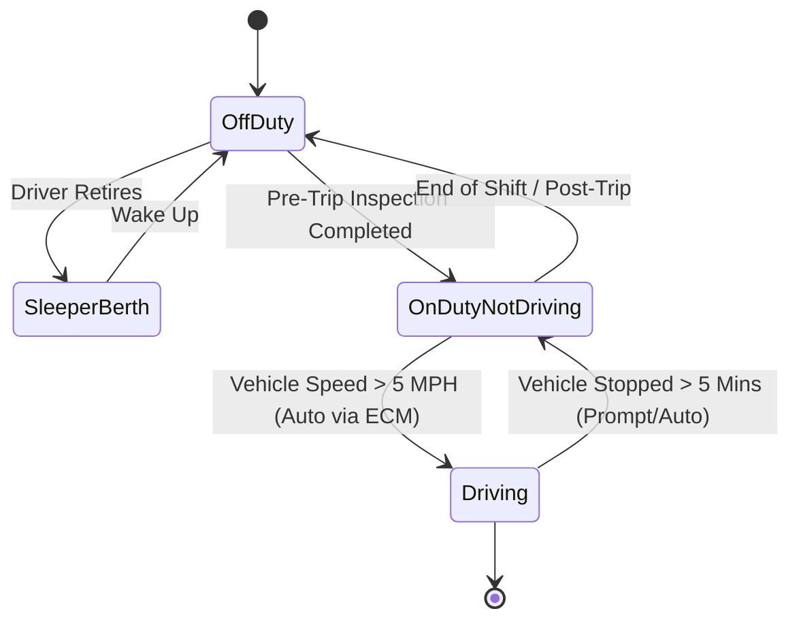
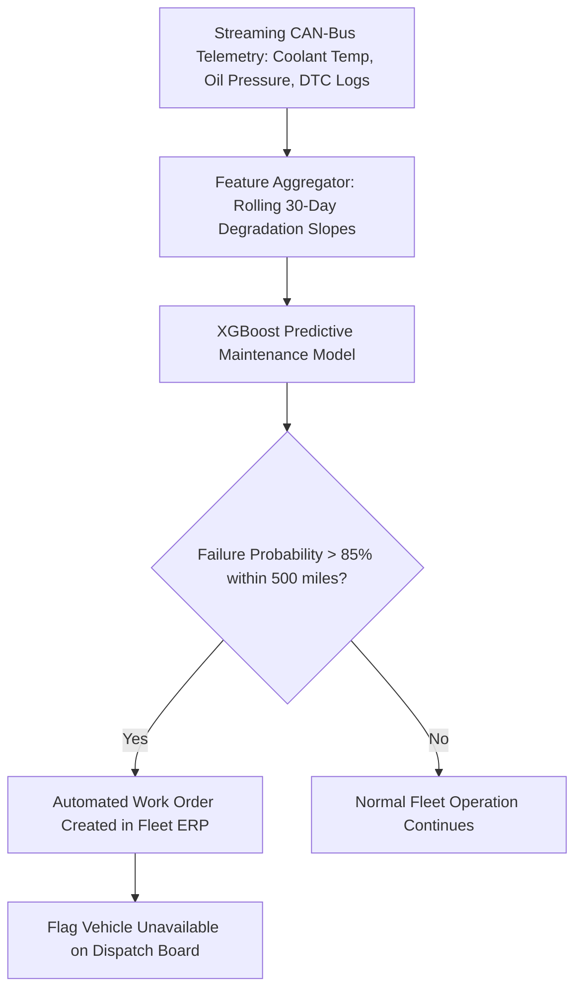
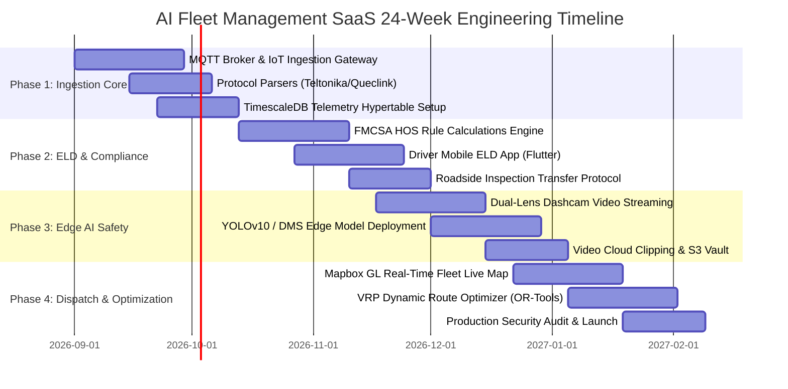
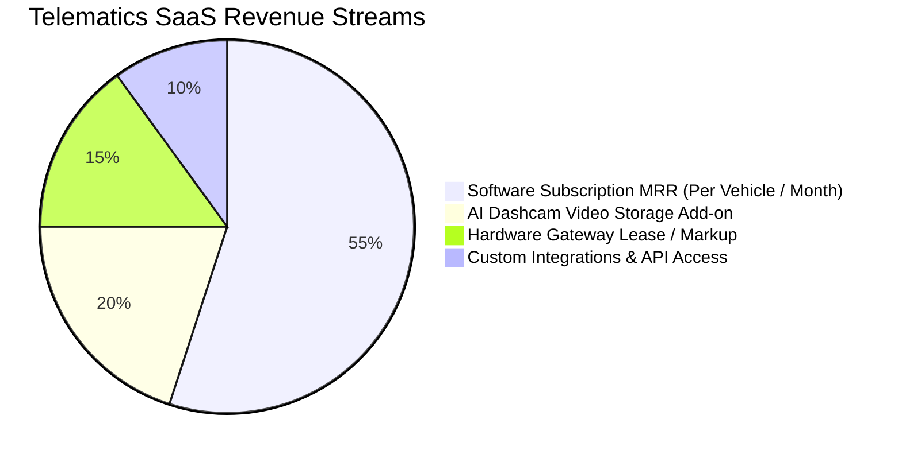

Are you planning to build an enterprise **AI-powered fleet management software**, engineer a scalable **white-label telematics SaaS platform**, or develop a custom **FMCSA-compliant ELD (Electronic Logging Device) and AI dashcam safety ecosystem** in 2026?

Commercial transportation, freight logistics, field service operations, and last-mile delivery fleets form the operational backbone of global commerce. Yet, modern fleet managers and transportation executives are severely hampered by legacy telematics infrastructure: proprietary black-box hardware that locks companies into closed ecosystems, fragmented data pipelines with multi-minute GPS latency, high false-positive rates on driver safety dashcams, and rigid dispatching software incapable of real-time route optimization.

In 2026, the fleet industry is undergoing a massive transformation toward **AI-native, open-architecture Telematics SaaS platforms**. These next-generation systems integrate sub-second MQTT IoT telemetry ingestion, real-time OBD-II/J1939 CAN-bus diagnostics, edge AI computer vision for driver safety monitoring, automated FMCSA Hours of Service (HOS) compliance, and dynamic Vehicle Routing Problem (VRP) solvers into a unified, high-performance cloud platform.

Here is the definitive engineering blueprint, database architecture, telemetry protocol mechanics, edge AI pipelines, and commercial strategy for building a scalable, multi-tenant AI Fleet Management and Telematics SaaS platform in 2026.


---

## The 2026 Paradigm: Why Legacy Fleet Management Systems Fail

For over two decades, the telematics market has been dominated by legacy hardware-centric vendors that treat software as an afterthought. This traditional model introduces acute operational bottlenecks and escalating technical debt for commercial operators.

### Critical Deficiencies of Legacy Telematics Platforms:

1. **Proprietary Hardware Vendor Lock-In:** Legacy providers bundle proprietary GPS tracking devices with closed software protocols, preventing fleet owners from migrating platforms or adopting modern third-party IoT sensors, tire pressure monitors (TPMS), or wireless temperature probes without replacing their entire vehicle hardware fleet.
2. **High-Latency Telemetry & Polling Architecture:** Outdated telematics servers rely on batch polling (pinging vehicles every 1 to 5 minutes over standard HTTP REST endpoints). In high-density urban logistics and cold-chain monitoring, a 3-minute delay means missed delivery windows, untracked fuel theft, or spoiled perishable cargo before temperature alerts reach the dispatcher.
3. **Dashcam Alert Fatigue & False Positives:** First-generation dashcam solutions bombard safety managers with thousands of raw accelerometer g-force alerts whenever a truck hits a pothole or speed bump. Without on-device computer vision to filter out false alarms, critical safety events (such as mobile phone distraction or microsleep drowsiness) are lost in the noise.
4. **Brittle ELD & Compliance Synchronization:** Legacy Electronic Logging Devices frequently suffer from Bluetooth disconnection and data corruption between the in-cab tablet and vehicle ECM (Engine Control Module), resulting in severe FMCSA audit penalties, out-of-service orders, and costly driver downtime during roadside DOT inspections.
5. **Disconnected Dispatch & Routing Silos:** Dispatchers are forced to copy coordinates manually between telematics maps and third-party route planners, creating blind spots where real-time traffic jams, vehicle weight restrictions, and live driver HOS availability are completely ignored during route sequencing.

### The 2026 Standard: Unified AI-Native Telematics 3.0

* **Hardware-Agnostic Ingestion Engine:** Universal protocol normalization supporting standard MQTT, CoAP, and gRPC endpoints to ingest telemetry from Teltonika, Queclink, CalAmp, Suntech, and custom ESP32/ARM telematics gateways.
* **Sub-Second Real-Time Tracking:** Bi-directional persistent WebSockets and Server-Sent Events (SSE) streaming live vehicle coordinates, speed, heading, and sensor telemetry directly to high-frame-rate Mapbox GL browser clients.
* **Edge AI Computer Vision Safety:** On-device neural network inference (YOLOv10 / TensorRT) running on dual-lens dashcams to detect distracted driving, cell phone usage, drowsiness (PERCLOS eye closure), seatbelt non-compliance, and forward collision risks in real time.
* **Certified FMCSA ELD Engine:** Cloud and offline-first mobile ELD architecture calculating dynamic 70-hour/8-day and 60-hour/7-day cycle clocks, automated duty status transitions via J1939 engine speed broadcasts, and instant DOT roadside inspection data transfers.
* **Predictive Maintenance & CAN-Bus Analytics:** Continuous streaming ingestion of Diagnostic Trouble Codes (DTCs), engine load, coolant temperature, fuel consumption, and battery health to forecast mechanical component failures before roadside breakdowns occur.
* **Automated AI Dispatch & VRP Optimization:** Constraint-aware route optimization engine that computes multi-stop delivery routes factoring in vehicle gross weight limits, HAZMAT restrictions, live traffic matrices, and driver available driving hours.

---

## Technical Architecture of an Enterprise Multi-Tenant Telematics SaaS

Engineering an enterprise telematics platform requires an ultra-low-latency, horizontally scalable ingestion pipeline capable of processing hundreds of thousands of concurrent IoT messages per second while providing instantaneous queries over billions of historical geospatial points.



### Core Architectural Principles:

1. **Protocol Normalization Layer:** Edge telematics trackers transmit binary or text packets (e.g., Teltonika Codec 8/8 Extended, Queclink @ACK format). A high-performance parser written in Go/Rust validates checksums, decodes hexadecimal payloads into structured JSON/Protobuf events, and attaches tenant metadata before streaming to Kafka.
2. **Time-Series Hypertable Storage:** Raw GPS telemetry, accelerometer metrics, and engine parameters are written directly to **TimescaleDB hypertables** or **ClickHouse columnar tables** partitioned by time and vehicle ID, ensuring sub-100ms analytical queries across millions of historical breadcrumb coordinates.
3. **In-Memory Live State Cache:** Current vehicle locations, active driver assignments, operational statuses (Idling, Moving, Parked, Offline), and active diagnostic alarms are mirrored in Redis Geo and Redis Hash structures for instant retrieval by web dispatch maps without touching the primary database.
4. **Complex Event Processing (CEP):** Apache Flink evaluates streaming telemetry against dynamic polygon geofences, maximum speed limits, and driver rest thresholds with sub-second event latency.

---

## High-Throughput OBD-II & J1939 CAN-Bus Telemetry Protocol Ingestion

To unlock actionable fleet insights, the telematics gateway connects directly to the vehicle's diagnostic port (OBD-II for light-duty passenger vehicles or SAE J1939 9-pin Deutsch connector for heavy-duty commercial class 7/8 trucks).



### Critical J1939 Parameter Group Numbers (PGNs) Ingested:

| Parameter Group Number (PGN) | SPN Description | Engineering Value & Unit | Operational Importance |
| :--- | :--- | :--- | :--- |
| **PGN 61444 (EEC1)** | SPN 190 (Engine Speed) | RPM (0 to 8,000 rpm) | Automated ELD driving status detection, excessive idling analysis |
| **PGN 65265 (CCVS1)** | SPN 84 (Wheel-Based Vehicle Speed) | km/h or mph | Tamper-proof speeding detection independent of GPS spoofing |
| **PGN 65248 (VD)** | SPN 245 (Total Vehicle Distance) | Total Odometer (km / miles) | Automated IFTA fuel tax calculations, maintenance interval triggers |
| **PGN 65266 (LFE1)** | SPN 183 (Engine Fuel Rate) | L/h or gal/h | Real-time fuel economy tracking, siphon/theft anomaly detection |
| **PGN 65262 (ET1)** | SPN 110 (Engine Coolant Temp) | °C (-40 to 210°C) | Overheating prevention, engine preservation alerts |
| **PGN 65226 (DM1)** | SPN / FMI (Active Diagnostic Codes) | DTC Error Codes (e.g., P0300, SPN 3251) | Instant mechanical failure notification, remote triage |

---

## Edge AI Computer Vision: Dual-Lens Dashcam Safety Architecture

Traditional telematics measures vehicle motion, but safety outcomes depend on driver behavior. An AI-powered telematics SaaS incorporates smart dual-lens dashcams (forward-facing ADAS and driver-facing DMS) running on-device convolutional neural networks.

```mermaid
graph LR
    subgraph Driver-Facing Camera (DMS)
        A1[1080p IR Video Stream] --> A2[Face Mesh & Eye Gaze Tracker]
        A2 --> A3{Drowsiness / Distraction Detected?}
        A3 -->|Yes: PERCLOS > 0.40 or Phone Detected| A4[In-Cab Audio Chime & Incident Trigger]
    end

    subgraph Forward-Facing Camera (ADAS)
        B1[1080p HDR Video Stream] --> B2[YOLOv10 Object Detection: Vehicles & Pedestrians]
        B2 --> B3[Time-to-Collision TTC Matrix]
        B3 -->|TTC < 1.8s or Tailgating| B4[Forward Collision Alert]
    end

    A4 & B4 --> C[Edge Event Manager]
    C --> D[Extract Pre/Post Event 15s MP4 Video Buffer]
    D --> E[Upload Clip via AWS S3 Presigned URL]
    C --> F[Publish Telemetry Event to MQTT Gateway]
```

### Edge AI Detection Capabilities:

1. **Driver Monitoring System (DMS):**
   * *Cell Phone Usage:* Detects mobile device holding and texting gestures near the steering wheel.
   * *Driver Drowsiness & Microsleep:* Calculates PERCLOS (percentage of eyelid closure over time) and persistent yawning.
   * *Seatbelt Non-Compliance:* Detects unfastened safety restraints at speeds exceeding 10 mph.
   * *Smoking & In-Cab Distraction:* Detects cigarette usage and extended driver head-turns away from the road (> 2.5 seconds).
2. **Advanced Driver Assistance Systems (ADAS):**
   * *Forward Collision Warning (FCW):* Real-time bounding box depth calculation measuring Time-to-Collision (TTC).
   * *Unsafe Following Distance (Tailgating):* Tracks headway distance relative to forward vehicle velocity.
   * *Lane Departure Warning (LDW):* Detects lane drift without active turn signal activation.
   * *Pedestrian & Vulnerable Road User Detection:* Identifies cyclists and pedestrians in vehicle blind spots.
3. **Edge-to-Cloud Video Upload Pipeline:** When a high-severity incident occurs, the dashcam extracts an uncompressed 15-second video buffer (10 seconds pre-incident, 5 seconds post-incident), encodes the snippet in H.265/H.264, and uploads it via an authenticated pre-signed URL to cloud storage for immediate dispatcher review and driver coaching workflows.

---

## FMCSA ELD & Hours of Service (HOS) Engine Design

In the United States (FMCSA 49 CFR Part 395) and international jurisdictions (such as EU Digital Tachograph regulations), commercial vehicle drivers must track their on-duty, driving, and resting hours with certified precision.



### HOS Rule Calculations Engine (US Property-Carrying 70-hr / 8-day Rule):

* **11-Hour Driving Limit:** May drive a maximum of 11 hours after 10 consecutive hours off duty.
* **14-Hour Consecutive Duty Window:** Cannot drive beyond the 14th consecutive hour after coming on duty, following 10 consecutive hours off duty.
* **30-Minute Rest Break:** Requires a 30-minute uninterrupted break after 8 cumulative hours of driving time.
* **70-Hour / 8-Day Limit:** Cannot drive after 70 hours on duty in any rolling 8-day window (resets after a 34-consecutive-hour restart).
* **Roadside Inspection Mode:** Generates encrypted FMCSA-compliant CSV and PDF output formats transmitting directly through web services or encrypted email to state DOT inspection officers.

---

## Production-Ready PostgreSQL & TimescaleDB Database Schema

Here is the complete production-grade relational and time-series database DDL for an enterprise multi-tenant fleet management platform:

```sql
-- Enable Extensions
CREATE EXTENSION IF NOT EXISTS "uuid-ossp";
CREATE EXTENSION IF NOT EXISTS "pgcrypto";
CREATE EXTENSION IF NOT EXISTS "timescaledb";

-- 1. Tenant Organizations
CREATE TABLE organizations (
    id UUID PRIMARY KEY DEFAULT gen_random_uuid(),
    name VARCHAR(255) NOT NULL,
    slug VARCHAR(100) UNIQUE NOT NULL,
    dot_number VARCHAR(50),
    mc_number VARCHAR(50),
    timezone VARCHAR(50) DEFAULT 'UTC',
    created_at TIMESTAMPTZ NOT NULL DEFAULT NOW(),
    updated_at TIMESTAMPTZ NOT NULL DEFAULT NOW()
);

-- 2. Fleet Assets (Vehicles / Trailers)
CREATE TABLE vehicles (
    id UUID PRIMARY KEY DEFAULT gen_random_uuid(),
    organization_id UUID NOT NULL REFERENCES organizations(id) ON DELETE CASCADE,
    vin VARCHAR(17) UNIQUE NOT NULL,
    vehicle_name VARCHAR(100) NOT NULL,
    license_plate VARCHAR(50) NOT NULL,
    make VARCHAR(100),
    model VARCHAR(100),
    year INTEGER,
    fuel_type VARCHAR(50) DEFAULT 'diesel',
    fuel_capacity_gallons NUMERIC(8,2),
    current_odometer_miles NUMERIC(12,2) DEFAULT 0.0,
    current_engine_hours NUMERIC(10,2) DEFAULT 0.0,
    status VARCHAR(50) DEFAULT 'active' CHECK (status IN ('active', 'maintenance', 'decommissioned')),
    created_at TIMESTAMPTZ NOT NULL DEFAULT NOW()
);
CREATE INDEX idx_vehicles_org ON vehicles(organization_id);

-- 3. Telematics Gateways & Dashcam Devices
CREATE TABLE telematics_devices (
    id UUID PRIMARY KEY DEFAULT gen_random_uuid(),
    organization_id UUID NOT NULL REFERENCES organizations(id) ON DELETE CASCADE,
    vehicle_id UUID REFERENCES vehicles(id) ON DELETE SET NULL,
    imei VARCHAR(30) UNIQUE NOT NULL,
    serial_number VARCHAR(100) UNIQUE NOT NULL,
    device_model VARCHAR(100) NOT NULL,
    firmware_version VARCHAR(50),
    hardware_type VARCHAR(50) CHECK (hardware_type IN ('obd2_tracker', 'j1939_blackbox', 'ai_dashcam', 'ble_beacon')),
    mqtt_client_id VARCHAR(100) UNIQUE NOT NULL,
    is_online BOOLEAN DEFAULT false,
    last_heartbeat_at TIMESTAMPTZ,
    created_at TIMESTAMPTZ NOT NULL DEFAULT NOW()
);
CREATE INDEX idx_devices_vehicle ON telematics_devices(vehicle_id);

-- 4. Drivers & Credentials
CREATE TABLE drivers (
    id UUID PRIMARY KEY DEFAULT gen_random_uuid(),
    organization_id UUID NOT NULL REFERENCES organizations(id) ON DELETE CASCADE,
    first_name VARCHAR(100) NOT NULL,
    last_name VARCHAR(100) NOT NULL,
    email VARCHAR(255) NOT NULL,
    phone VARCHAR(50) NOT NULL,
    license_number VARCHAR(100) NOT NULL,
    license_state VARCHAR(10) NOT NULL,
    license_expiry_date DATE NOT NULL,
    medical_card_expiry DATE,
    current_assigned_vehicle_id UUID REFERENCES vehicles(id) ON DELETE SET NULL,
    safety_score NUMERIC(5,2) DEFAULT 100.0,
    status VARCHAR(50) DEFAULT 'active',
    created_at TIMESTAMPTZ NOT NULL DEFAULT NOW()
);
CREATE INDEX idx_drivers_org ON drivers(organization_id);

-- 5. High-Throughput Time-Series Vehicle Telemetry (TimescaleDB Hypertable)
CREATE TABLE vehicle_telemetry (
    time TIMESTAMPTZ NOT NULL,
    organization_id UUID NOT NULL,
    vehicle_id UUID NOT NULL,
    device_id UUID NOT NULL,
    latitude DOUBLE PRECISION NOT NULL,
    longitude DOUBLE PRECISION NOT NULL,
    altitude_meters REAL,
    heading_degrees REAL,
    speed_mph REAL NOT NULL,
    engine_rpm REAL,
    odometer_miles DOUBLE PRECISION,
    fuel_level_percentage REAL,
    fuel_rate_gph REAL,
    coolant_temp_celsius REAL,
    battery_voltage REAL,
    engine_load_percentage REAL,
    ignition_status BOOLEAN NOT NULL DEFAULT false,
    motion_status VARCHAR(20) DEFAULT 'stationary' CHECK (motion_status IN ('stationary', 'moving', 'idling'))
);

-- Convert to Hypertable partitioned by time (7-day chunk intervals)
SELECT create_hypertable('vehicle_telemetry', 'time', chunk_time_interval => INTERVAL '7 days');
CREATE INDEX idx_telemetry_veh_time ON vehicle_telemetry(vehicle_id, time DESC);
CREATE INDEX idx_telemetry_org_time ON vehicle_telemetry(organization_id, time DESC);

-- 6. AI Dashcam Driver Safety Events
CREATE TABLE driver_safety_events (
    id UUID PRIMARY KEY DEFAULT gen_random_uuid(),
    organization_id UUID NOT NULL REFERENCES organizations(id) ON DELETE CASCADE,
    vehicle_id UUID NOT NULL REFERENCES vehicles(id) ON DELETE CASCADE,
    driver_id UUID REFERENCES drivers(id) ON DELETE SET NULL,
    event_timestamp TIMESTAMPTZ NOT NULL,
    event_type VARCHAR(50) NOT NULL CHECK (event_type IN (
        'hard_braking', 'harsh_acceleration', 'hard_cornering',
        'forward_collision_warning', 'tailgating', 'lane_departure',
        'drowsiness_detected', 'cell_phone_distraction', 'seatbelt_unfastened',
        'speeding_violation', 'stop_sign_violation'
    )),
    severity VARCHAR(20) DEFAULT 'medium' CHECK (severity IN ('low', 'medium', 'high', 'critical')),
    g_force REAL,
    speed_at_event_mph REAL,
    latitude DOUBLE PRECISION,
    longitude DOUBLE PRECISION,
    video_clip_url TEXT,
    is_coached BOOLEAN DEFAULT false,
    coach_notes TEXT,
    created_at TIMESTAMPTZ NOT NULL DEFAULT NOW()
);
CREATE INDEX idx_safety_events_org ON driver_safety_events(organization_id, event_timestamp DESC);

-- 7. FMCSA Hours of Service (HOS) Duty Status Logs
CREATE TABLE hos_duty_logs (
    id UUID PRIMARY KEY DEFAULT gen_random_uuid(),
    organization_id UUID NOT NULL REFERENCES organizations(id) ON DELETE CASCADE,
    driver_id UUID NOT NULL REFERENCES drivers(id) ON DELETE CASCADE,
    vehicle_id UUID REFERENCES vehicles(id) ON DELETE SET NULL,
    status VARCHAR(50) NOT NULL CHECK (status IN ('off_duty', 'sleeper_berth', 'driving', 'on_duty_not_driving')),
    status_started_at TIMESTAMPTZ NOT NULL,
    status_ended_at TIMESTAMPTZ,
    duration_seconds INTEGER,
    start_odometer_miles NUMERIC(12,2),
    start_engine_hours NUMERIC(10,2),
    location_description VARCHAR(255),
    latitude DOUBLE PRECISION,
    longitude DOUBLE PRECISION,
    is_certified_by_driver BOOLEAN DEFAULT false,
    certified_at TIMESTAMPTZ,
    edit_reason TEXT,
    created_at TIMESTAMPTZ NOT NULL DEFAULT NOW()
);
CREATE INDEX idx_hos_driver_time ON hos_duty_logs(driver_id, status_started_at DESC);

-- 8. Dynamic Dispatch Routes & Multi-Stop Delivery Optimization
CREATE TABLE dispatch_routes (
    id UUID PRIMARY KEY DEFAULT gen_random_uuid(),
    organization_id UUID NOT NULL REFERENCES organizations(id) ON DELETE CASCADE,
    vehicle_id UUID REFERENCES vehicles(id) ON DELETE SET NULL,
    driver_id UUID REFERENCES drivers(id) ON DELETE SET NULL,
    route_name VARCHAR(150) NOT NULL,
    status VARCHAR(50) DEFAULT 'draft' CHECK (status IN ('draft', 'dispatched', 'in_progress', 'completed', 'cancelled')),
    scheduled_start_time TIMESTAMPTZ NOT NULL,
    actual_start_time TIMESTAMPTZ,
    completed_time TIMESTAMPTZ,
    total_distance_miles NUMERIC(10,2),
    total_duration_minutes INTEGER,
    optimized_geometry_geojson JSONB,
    stops JSONB NOT NULL DEFAULT '[]'::jsonb,
    created_at TIMESTAMPTZ NOT NULL DEFAULT NOW()
);
CREATE INDEX idx_dispatch_routes_org ON dispatch_routes(organization_id, scheduled_start_time DESC);
```

---

## Dynamic Vehicle Routing Problem (VRP) & Predictive Maintenance

Modern telematics software does not merely observe vehicles; it actively optimizes their movements and maintains their physical reliability.

### 1. Constraint-Based Dynamic Route Optimization Engine

The dispatch system utilizes open-source geospatial routing engines (**OSRM** or **Valhalla**) combined with heuristic solvers (such as Google OR-Tools) to resolve the Capacitated Vehicle Routing Problem with Time Windows (CVRPTW):

3438614\min \sum_{k \in V} \sum_{i \in N} \sum_{j \in N} c_{ij} x_{ijk}3438614

**Operational Constraints Evaluated in Real Time:**
* Delivery time window SLA compliance at customer drop-offs.
* Vehicle physical load capacity (weight in lbs / volume in cu ft).
* Bridge clearance heights and Hazmat commercial route restrictions.
* Live driver HOS duty clock availability (ensuring drivers don't exceed the 11-hour driving limit mid-route).
* Dynamic live traffic congestion matrix recalculated dynamically every 5 minutes.

### 2. Machine Learning Predictive Maintenance Architecture

Rather than relying on arbitrary 5,000-mile calendar intervals, the platform feeds streaming sensor telemetry into an XGBoost gradient boosting pipeline to predict remaining useful life (RUL) of critical components:



---

## Step-by-Step 24-Week MVP Development Roadmap

Here is the structured engineering roadmap for developing and launching a production-ready, multi-tenant AI Fleet Management and Telematics SaaS platform:



### Phase 1: High-Throughput Ingestion & Time-Series Core (Weeks 1–6)
* Deploy clustered **EMQX MQTT brokers** with mTLS certificate authentication for IoT gateways.
* Build the Rust/Go protocol normalization microservice parsing Codec 8/8 Extended binary packets.
* Provision **TimescaleDB** on PostgreSQL 16 with automated 7-day chunking and data retention policies.

### Phase 2: FMCSA ELD Compliance & Mobile Driver App (Weeks 7–12)
* Implement deterministic 70-hour/8-day and 60-hour/7-day US & Canadian HOS rule engines.
* Develop the cross-platform **Flutter Driver Mobile Application** with Bluetooth low energy (BLE) OBD-II reader pairing.
* Build FMCSA Web Services client for automated DOT roadside inspection electronic record submission.

### Phase 3: Edge AI Video Dashcam & Safety Scoring (Weeks 13–18)
* Integrate Ambarella / Jetson Linux dashcam firmware with on-device YOLOv10 and DMS neural networks.
* Build automated event-triggered 15-second video clip extraction and S3 presigned URL upload pipeline.
* Develop the automated Driver Safety Leaderboard and risk scoring algorithm based on g-force telemetry and visual infraction events.

### Phase 4: Dispatcher Live Map, Route Optimization & Commercial Launch (Weeks 19–24)
* Build the high-density dispatcher web portal using Next.js 15, React, and Mapbox GL with smooth vehicle marker interpolation.
* Integrate Google OR-Tools / OSRM for automated multi-stop delivery route optimization and geofencing alerts.
* Conduct penetration testing, perform end-to-end cellular load tests with 50,000 simulated vehicles, and deploy multi-tenant production clusters.

---

## Commercial Economics & SaaS Monetization Strategy

Building a custom telematics software platform delivers compelling unit economics, providing both recurring high-margin SaaS subscriptions and recurring hardware lease revenue.



1. **Per-Vehicle Monthly Recurring Subscriptions (MRR):**
   * *Basic GPS Track & Trace Tier:* 4 – 2 / vehicle / month
   * *FMCSA ELD & Compliance Tier:* 8 – 8 / vehicle / month
   * *Pro AI Dashcam & Video Safety Tier:* 5 – 5 / vehicle / month
   * *Enterprise Fleet Tier (Full VRP + Telematics + CAN diagnostics):* 5 – 10 / vehicle / month
2. **AI Video Cloud Storage Add-ons:** Charging  to 5 per vehicle monthly for 90-day to 365-day high-definition cloud video clip archives.
3. **Commercial Insurance Partnerships:** Telematics SaaS platforms can partner with commercial auto insurers (e.g., Progressive Commercial, Travelers) to provide driver risk scores, earning revenue-share commissions on fleet insurance discounts.
4. **White-Label Reseller & Private-Label Licensing:** Licensing the complete telematics ecosystem to regional GPS hardware distributors, logistics 3PLs, or telecommunication providers for upfront deployment fees (5,000 – 5,000) plus recurring wholesale platform fees.

---

## Frequently Asked Questions (Technical & Operational)

### 1. Which telematics hardware devices and tracker protocols are supported?
Our architecture is built on an **open-standards ingestion gateway** that supports all major international telematics hardware manufacturers, including **Teltonika** (FMB920, FMC130, FMB640 Codec 8/8E), **Queclink** (GV50, GV300), **CalAmp** (LMU series), **Suntech**, and custom embedded **ESP32/ARM Linux IoT boards**. Devices communicate securely over MQTT, TCP, UDP, or HTTP endpoints with automated protocol auto-detection.

### 2. How does the system ensure zero data loss when commercial vehicles drive through cellular dead zones?
Telematics devices are configured with local non-volatile flash memory storage. When a vehicle loses cellular connectivity in remote corridors, the device caches all GPS fixes, CAN-bus parameters, and safety events in a local FIFO ring buffer with exact GPS UTC timestamps. Once cellular connectivity (LTE-M / 4G / 5G) is re-established, the tracker bursts the backlogged frames to the ingestion gateway, where TimescaleDB inserts the historical records in chronological order without overriding current live state caches.

### 3. What is required for FMCSA ELD software certification?
To achieve official certification on the FMCSA ELD Registry, the software must satisfy all technical requirements outlined in 49 CFR Part 395 Subpart B, Appendix A. This mandates automated driving status transitions derived from vehicle engine motion (speed ≥ 5 mph), tamper-proof timekeeping synced to UTC, tracking of unassigned driving miles, automated malfunction detection, and the ability to export standardized ELD output files via Web Services or encrypted email during roadside inspections.

### 4. How are high-frequency GPS points compressed to minimize cellular SIM data costs?
We implement intelligent edge delta-compression algorithms on the telematics tracker firmware:
* **Distance & Heading Change Triggers:** The device transmits a telemetry packet only when heading changes by > 10 degrees, speed changes by > 5 mph, or distance traveled exceeds 200 meters.
* **Smart Binary Encoding:** Data packets are encoded in dense binary protobuf or custom byte arrays rather than bloated JSON/XML strings, reducing per-vehicle cellular data usage to under **15 MB to 30 MB per month**.

### 5. Can our company brand the entire dispatcher portal and mobile driver app under our own identity?
Yes. We deliver a complete **white-label telematics ecosystem**. The web dashboard, customer billing portal, iOS and Android mobile driver applications, email reports, and API documentation are fully customized with your corporate logo, domain name (`fleet.yourcompany.com`), color palette, and published directly under your company's Apple App Store and Google Play Store developer accounts.

---

## Launch Your Custom White-Label Fleet Management & Telematics SaaS with Anonsoft

Are you ready to disrupt the commercial telematics industry, eliminate high third-party platform licensing fees, or launch your own branded IoT fleet tracking SaaS business?

Whether you require a **turnkey white-label telematics SaaS for commercial resellers**, an **AI-powered video dashcam safety platform**, or a **custom FMCSA ELD and dynamic dispatch ecosystem**, **Anonsoft** is your elite full-stack engineering partner.

Explore our software engineering capabilities or schedule a direct architectural consultation with our senior engineering team:

* 🚀 **Book an Architectural Demo:** [Schedule a 1-on-1 Consultation](https://anonsoft.in/#bookademo)
* 📖 **Explore Our Services:** [Custom Software Development](https://anonsoft.in/services/)
* 💬 **Contact Engineering:** [contact@anonsoft.in](mailto:contact@anonsoft.in)
