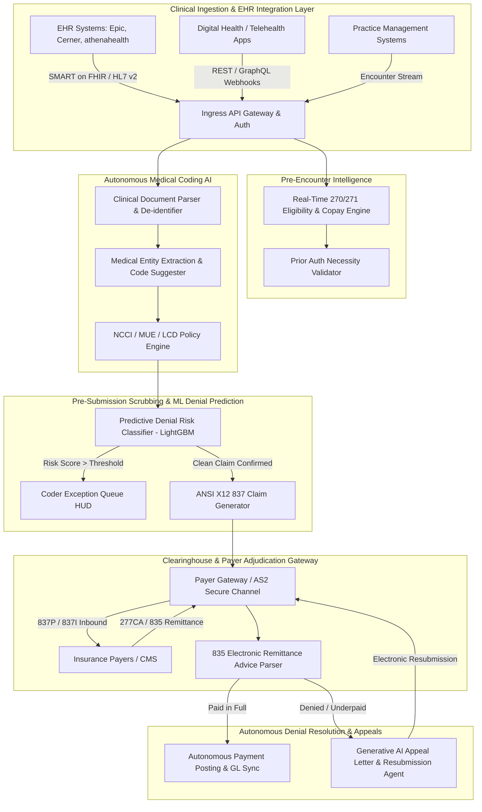

Are you building a next-generation Healthcare Revenue Cycle Management (RCM) platform, designing an autonomous medical billing SaaS, or modernizing an enterprise clearinghouse architecture with generative AI and machine learning in 2026?

The United States healthcare system expends **over $300 billion annually on administrative billing overhead**. Medical practices, hospital networks, and digital health startups face an unprecedented operational crisis: **first-pass claim denial rates routinely exceed 15% to 20%**, days in accounts receivable (A/R) stretch past 45–60 days, and certified medical coders face overwhelming backlogs analyzing complex physician documentation across evolving ICD-10-CM, CPT, and HCPCS code sets.

In 2026, healthcare software leaders are abandoning antiquated rule-based clearinghouses in favor of **Autonomous, AI-Native Healthcare Revenue Cycle Management (RCM) Platforms**. By combining multi-modal clinical LLMs for autonomous chart coding, high-throughput ANSI ASC X12 EDI stream parsers, predictive machine learning denial scrubbers, and autonomous generative AI appeal agents, modern RCM platforms achieve **98%+ clean claim submission rates and compress reimbursement cycles from weeks to hours**.

Here is the complete, production-grade architectural blueprint and engineering guide for building an enterprise-grade AI Revenue Cycle Management and Autonomous Claims Adjudication SaaS in 2026.


---

## 1. The Core Breakdown: Why Traditional RCM Systems Fail

Legacy medical billing and practice management (PM) software was designed decades ago around static relational database tables and rigid if-else validation scripts. These legacy architectures exhibit four fatal failure modes in modern clinical environments:

1. **Manual Chart Review & Coding Bottlenecks:** Human coders must manually comb through unstructured electronic health record (EHR) progress notes, operative summaries, and pathology reports to identify reimbursable diagnoses and procedures, introducing human error and slow cycle times.
2. **Brittle Clearinghouse Edits:** Traditional clearinghouses apply static National Correct Coding Initiative (NCCI) edits and rudimentary syntax checks. They fail to detect nuanced clinical documentation deficits—such as missing medical necessity justifications or payer-specific modifier requirements—leading to post-submission denials.
3. **Black-Box Payer Adjudication:** Insurance payers continuously update their internal adjudication algorithms, prior authorization guidelines, and coverage policies. Traditional RCM software lacks predictive intelligence, discovering claim rejections only after the 835 Electronic Remittance Advice (ERA) is returned weeks later.
4. **Labor-Intensive Denial Resubmission:** When claims are rejected, billing staff must spend hours calling payer call centers, drafting bespoke appeal letters, gathering medical records, and manually refiling—resulting in billions of dollars in uncollected revenue written off as bad debt.

---

## 2. The 2026 Standard: Autonomous AI-Native RCM Architecture

An autonomous RCM platform replaces fragmented manual touchpoints with an intelligent, closed-loop pipeline that monitors patient encounters from pre-registration to final payment posting:

- **Real-Time Eligibility & Benefit Verification (EDI 270/271):** Instantaneous pre-encounter API queries that verify active coverage, co-pays, deductibles, and required prior authorizations directly against payer endpoints.
- **Autonomous Multi-Modal Clinical Coding Engine:** Specialized medical LLMs (fine-tuned on clinical nomenclatures and SNOMED-CT / ICD-10-CM / CPT ontologies) that analyze physician dictations, EHR encounters, and lab orders to suggest high-confidence, fully supported billing codes with auditable chart citations.
- **ANSI ASC X12 Electronic Data Interchange (EDI) Engine:** Sub-second generation and bidirectional parsing of standardized healthcare transactions (**837P Professional**, **837I Institutional**, **276/277 Claim Status**, and **835 Electronic Remittance Advice**).
- **Predictive Denial Prevention Scrubber (ML):** Gradient-boosted classifiers trained on historical adjudication logs that score claim rejection risk before transmission, highlighting specific missing clinical indicators.
- **Autonomous Appeal & Denial Agent:** Agentic LLMs that ingest 835 Claim Adjustment Reason Codes (CARC) and Remittance Advice Remark Codes (RARC), automatically pull supporting clinical notes from the EHR, synthesize evidence-backed appeal letters citing payer policy manuals, and submit appeals electronically.

---

## 3. Enterprise System Architecture Blueprint

An enterprise-ready AI RCM platform requires a distributed, event-driven microservices architecture built on HIPAA-compliant cloud infrastructure, strict tenant data isolation, and low-latency message streaming.



---

## 4. Ingesting Clinical Encounters: FHIR R4 & Clinical Coding Pipeline

The foundation of autonomous coding is seamless interoperability with EHRs. Using HL7 FHIR R4 APIs, the RCM platform subscribes to `Encounter`, `Condition`, `Procedure`, `Observation`, and `DocumentReference` resources.

```python
# fhir_encounter_ingest.py - HIPAA-Compliant Clinical Ingestion
import requests
from typing import Dict, Any, List

class FHIREncounterIngestionService:
    def __init__(self, fhir_base_url: str, auth_token: str):
        self.base_url = fhir_base_url
        self.headers = {
            "Authorization": f"Bearer {auth_token}",
            "Accept": "application/fhir+json"
        }

    def fetch_closed_encounter_data(self, encounter_id: str) -> Dict[str, Any]:
        """
        Pulls closed encounter payload including clinical documentation,
        diagnoses, and ordered procedures.
        """
        # Fetch root encounter
        enc_res = requests.get(f"{self.base_url}/Encounter/{encounter_id}", headers=self.headers)
        enc_res.raise_for_status()
        encounter = enc_res.json()

        patient_id = encounter["subject"]["reference"].split("/")[-1]

        # Fetch clinical notes (DocumentReference)
        doc_res = requests.get(
            f"{self.base_url}/DocumentReference",
            headers=self.headers,
            params={"patient": patient_id, "encounter": encounter_id}
        )
        documents = doc_res.json().get("entry", [])

        # Fetch associated procedures
        proc_res = requests.get(
            f"{self.base_url}/Procedure",
            headers=self.headers,
            params={"encounter": encounter_id}
        )
        procedures = proc_res.json().get("entry", [])

        return {
            "encounter_id": encounter_id,
            "patient_id": patient_id,
            "encounter_type": encounter.get("class", {}).get("code"),
            "documents": [doc["resource"] for doc in documents],
            "procedures": [proc["resource"] for proc in procedures]
        }
```

Once clinical text is retrieved, specialized multi-modal models extract clinical concepts, map them to current ICD-10-CM and CPT codes, and calculate medical necessity compliance scores.

```python
# autonomous_coder_agent.py - AI Clinical Code Extraction
import json
from openai import OpenAI

client = OpenAI()

def generate_autonomous_codes(clinical_note_text: str, patient_context: Dict[str, Any]) -> Dict[str, Any]:
    prompt = f"""
    You are an expert Certified Professional Coder (CPC) and medical billing AI.
    Analyze the following clinical encounter note and generate valid ICD-10-CM diagnosis codes
    and CPT/HCPCS procedure codes supported strictly by the documented medical evidence.

    PATIENT CONTEXT:
    Age: {patient_context.get('age')}, Gender: {patient_context.get('gender')}, Setting: Outpatient Clinic

    CLINICAL NOTE:
    {clinical_note_text}

    OUTPUT FORMAT (Strict JSON):
    {{
      "primary_icd10": {{"code": "string", "description": "string", "evidence_quote": "string"}},
      "secondary_icd10": [{{"code": "string", "description": "string", "evidence_quote": "string"}}],
      "cpt_codes": [
        {{
          "code": "string",
          "modifiers": ["string"],
          "units": 1,
          "fee_estimate_cents": 18500,
          "medical_necessity_rationale": "string"
        }}
      ],
      "confidence_score": 0.98,
      "requires_human_review": false
    }}
    """

    response = client.chat.completions.create(
        model="gpt-4o",
        messages=[{"role": "user", "content": prompt}],
        response_format={"type": "json_object"},
        temperature=0.0
    )

    return json.loads(response.choices[0].message.content)
```

---

## 5. ANSI ASC X12 EDI Engine: High-Throughput Claims & Remittance

Medical claims must be transmitted via standardized ASC X12 EDI formats. An enterprise RCM engine needs high-speed generators and bidirectional parsers for **837 (Claims)** and **835 (Remittance Advice)**.

### Generating ANSI X12 837P Professional Claims

```text
ISA*00*          *00*          *ZZ*SUBMITTERID    *ZZ*PAYERID        *260829*0930*^*00501*000000001*0*P*:~
GS*HC*SUBMITTERID*PAYERID*20260829*0930*1*X*005010X222A1~
ST*837*0001*005010X222A1~
BHT*0019*00*CLAIM2026082901*20260829*0930*CH~
NM1*41*2*TODAYINTECH HEALTHCARE*****46*1234567893~
PER*IC*BILLING DEPT*TE*8005550199~
NM1*40*2*BLUE CROSS BLUE SHIELD*****46*99999~
HL*1**20*1~
NM1*85*2*CLINICAL AI ASSOCIATES*****XX*1982736450~
N3*100 INNOVATION WAY*SUITE 400~
N4*SAN FRANCISCO*CA*94105~
HL*2*1*22*0~
NM1*IL*1*DOE*JANE****MI*W123456789~
N3*456 PATIENT ST~
N4*OAKLAND*CA*94612~
DMG*D8*19850412*F~
CLM*CLAIM2026082901*245.00***11:B:1*Y*A*Y*Y~
HI*ABK:K35.21*ABF:E11.9~
LX*1~
SV1*HC:99214:25*175.00*UN*1***1:2~
DTP*472*D8*20260829~
LX*2~
SV1*HC:93000*70.00*UN*1***1~
DTP*472*D8*20260829~
SE*24*0001~
GE*1*1~
IEA*1*000000001~
```

### Parsing ANSI X12 835 Remittance (ERA) and Automated Payment Posting

When payers adjudicate claims, they return an 835 ERA file detailing paid amounts, patient responsibility, and adjustment reason codes (CARC/RARC).

```python
# era_835_parser.py - High-Performance ERA Stream Processor
from typing import List, Dict

class ERA835Parser:
    @staticmethod
    def parse_era_segment_stream(edi_raw_content: str) -> List[Dict[str, Any]]:
        segments = [s.strip() for s in edi_raw_content.split("~") if s.strip()]
        claims_summary = []
        current_claim = None

        for segment in segments:
            elements = segment.split("*")
            tag = elements[0]

            if tag == "CLP":
                # CLP*PatientControlNo*ClaimStatus*TotalCharged*TotalPaid*PatientResp*PayerType*ClaimID
                if current_claim:
                    claims_summary.append(current_claim)
                current_claim = {
                    "claim_id": elements[1],
                    "status_code": elements[2], # 1=Processed Primary, 2=Processed Secondary, 4=Denied
                    "total_charged": float(elements[3]),
                    "total_paid": float(elements[4]),
                    "patient_responsibility": float(elements[5]) if len(elements) > 5 and elements[5] else 0.0,
                    "adjustments": []
                }
            elif tag == "CAS" and current_claim:
                # CAS*GroupCode*ReasonCode*AdjustmentAmount*Units
                # Group Codes: CO (Contractual Obligation), PR (Patient Responsibility), OA (Other Adjustment)
                current_claim["adjustments"].append({
                    "group_code": elements[1],
                    "reason_code": elements[2],
                    "amount": float(elements[3])
                })

        if current_claim:
            claims_summary.append(current_claim)

        return claims_summary
```

---

## 6. Machine Learning Predictive Denial Engine

Rather than submitting claims blindly and waiting for payer denials, top-performing RCM SaaS platforms run pre-submission machine learning classifiers.

By training on millions of historic 837/835 transaction pairs, the ML model identifies subtle correlation patterns—such as payer-specific prior authorization nuances, provider credentialing mismatches, and gender/age restrictions for specific CPT codes.

```python
# denial_prediction_model.py - Pre-Submission ML Scrubber
import numpy as np
import lightgbm as lgb
from typing import Dict, Any

class PredictiveDenialScrubber:
    def __init__(self, model_artifact_path: str):
        self.model = lgb.Booster(model_file=model_artifact_path)

    def extract_claim_features(self, claim_data: Dict[str, Any]) -> np.ndarray:
        """
        Transforms claim metadata into numerical feature vector for LightGBM.
        Features: [Payer_ID, Billing_NPI, Primary_ICD_Category, CPT_Code_Index,
                   Modifier_Count, Total_Charge, Patient_Age, Prior_Auth_Attached]
        """
        feature_vector = [
            hash(claim_data["payer_id"]) % 1000,
            hash(claim_data["billing_npi"]) % 5000,
            hash(claim_data["primary_icd10"][:3]) % 500,
            hash(claim_data["cpt_code"]) % 2000,
            len(claim_data.get("modifiers", [])),
            float(claim_data["charge_amount"]),
            int(claim_data["patient_age"]),
            1 if claim_data.get("prior_auth_number") else 0
        ]
        return np.array([feature_vector], dtype=np.float32)

    def evaluate_claim_risk(self, claim_data: Dict[str, Any]) -> Dict[str, Any]:
        features = self.extract_claim_features(claim_data)
        denial_probability = float(self.model.predict(features)[0])

        is_high_risk = denial_probability > 0.18 # Calibrated threshold

        return {
            "claim_id": claim_data["claim_id"],
            "denial_probability": denial_probability,
            "status": "FLAGGED_FOR_REVIEW" if is_high_risk else "CLEAN_FOR_SUBMISSION",
            "recommended_actions": [
                "Verify missing 25 modifier for E/M service on same date as procedure",
                "Attach clinical lab report confirming diagnostic criteria"
            ] if is_high_risk else []
        }
```

---

## 7. Autonomous Appeal Agents for Denials & Underpayments

When a claim is denied (e.g., CARC 50: "These are non-covered services because this is not deemed a medical necessity"), an autonomous agentic LLM acts instantly:

1. **Denial Deconstruction:** Parses the exact CARC/RARC codes and extracts the specific reason for denial.
2. **Clinical RAG Retrieval:** Queries the vector database containing the patient's EHR chart notes, diagnostic imaging reports, and the payer's published Medical Coverage Policies (LCDs/NCDs).
3. **Evidence-Backed Appeal Letter Synthesis:** Formulates a legally rigorous, medically referenced appeal letter citing peer-reviewed clinical guidelines, encounter dates, and specific policy clauses.
4. **Electronic Appeal Submission:** Packages the appeal letter and relevant PDF exhibits into a secure payer portal packet or electronic clearinghouse appeal stream.

```python
# autonomous_appeal_agent.py - Generative AI Claim Appeals
def generate_appeal_packet(denial_record: Dict[str, Any], clinical_chart_summary: str, payer_policy_excerpt: str) -> str:
    prompt = f"""
    You are an expert Healthcare Legal & Clinical Denial Appeals Specialist.
    Draft a formal, highly compelling Medical Necessity Appeal Letter to overturn the insurance denial.

    CLAIM DETAILS:
    Payer: {denial_record['payer_name']}
    Patient Name: {denial_record['patient_name']} (DOB: {denial_record['patient_dob']})
    Claim Control ID: {denial_record['claim_id']}
    Date of Service: {denial_record['service_date']}
    Billed CPT Code: {denial_record['cpt_code']} - {denial_record['cpt_description']}
    Denial Code: CARC {denial_record['carc_code']} - {denial_record['carc_description']}

    PAYER MEDICAL POLICY CRITERIA:
    {payer_policy_excerpt}

    CLINICAL EVIDENCE FROM EHR:
    {clinical_chart_summary}

    REQUIREMENTS:
    - Formal professional header addressed to Payer Appeals Committee.
    - Specific clinical rebuttal explaining how documented evidence satisfies every medical policy criterion.
    - Explicit citations of clinical notes, lab dates, and failed conservative treatments.
    - Demands immediate claim reprocessing and payment under federal prompt payment guidelines.
    """

    response = client.chat.completions.create(
        model="gpt-4o",
        messages=[{"role": "user", "content": prompt}],
        temperature=0.1
    )
    return response.choices[0].message.content
```

---

## 8. Technical Architecture Comparison: Legacy vs. AI-Native RCM

| Architectural Feature        | Legacy RCM & Billing Software                       | Modern AI-Powered RCM SaaS (2026)                                         |
| :--------------------------- | :-------------------------------------------------- | :------------------------------------------------------------------------ |
| **Clinical Coding**          | Manual human chart review (slow, error-prone)       | Autonomous multi-modal clinical LLM (sub-second, CPC-accurate)            |
| **Eligibility Verification** | Manual portal checks or batch overnight 270 queries | Real-time REST / 270/271 queries with instant patient copay calculation   |
| **Claim Scrubbing**          | Static rule engines (NCCI edits, syntax checks)     | Predictive ML denial classification trained on historical payer patterns  |
| **EDI Integration**          | Legacy on-premise SFTP and batch flat files         | Event-driven cloud-native microservices with real-time ANSI X12 pipelines |
| **Denial Management**        | Manual spreadsheets and phone call queues           | Autonomous Generative AI appeal agents with automated evidence synthesis  |
| **Payment Posting**          | Manual 835 reconciliation and keying                | 100% automated ERA auto-posting and real-time General Ledger sync         |
| **EHR Interoperability**     | Fragile HL7 v2 point-to-point tunnels               | SMART on FHIR R4, REST webhooks, and bidirectional write-back             |
| **Audit & Compliance**       | Basic database logs                                 | Immutable tamper-evident audit logs, end-to-end encryption, SOC 2 & HIPAA |

---

## 9. Security, Audit Trails, and HIPAA Compliance

Developing software that processes Protected Health Information (PHI) and financial transactions demands stringent security controls:

- **mTLS and End-to-End Encryption:** Enforce TLS 1.3 with mutual certificate authentication for all internal microservices and external payer AS2/REST endpoints. Data at rest must use AES-256 with AWS KMS or HashiCorp Vault.
- **Granular Role-Based Access Control (RBAC):** Restrict clinical note viewing, coding overrides, and financial write-offs using Open Policy Agent (OPA) or Casbin.
- **Immutable Cryptographic Audit Logging:** Every access, extraction, modification, and transmission of PHI or billing codes is logged to an append-only, tamper-evident datastore (such as Amazon QLDB or signed CloudWatch logs) to satisfy HIPAA § 164.312(b).

---

## 10. Frequently Asked Questions (FAQ)

### What is the difference between traditional RCM software and AI-powered autonomous RCM?

Traditional RCM software serves as a passive system of record, requiring billers and coders to manually review charts, key in codes, scrub claims using rigid if-else rules, and write appeal letters by hand. Autonomous AI RCM uses clinical language models, predictive machine learning scrubbers, and generative appeal agents to automate 90%+ of coding, validation, submission, and denial resolution workflows touchlessly.

### How does the autonomous coding engine ensure accuracy and HIPAA compliance?

The AI coding engine runs in private, dedicated HIPAA-compliant cloud environments with zero data retention for third-party model training. It leverages specialized clinical foundation models guided by deterministic rule engines (NCCI, MUE, LCD/NCD guidelines). Every suggested ICD-10 and CPT code includes direct text citations to the physician's documented note for complete coder auditability.

### Can Anonsoft integrate custom RCM software with major EHRs like Epic, Cerner, and athenahealth?

Yes. Anonsoft specializes in SMART on FHIR and HL7 integration across major EHRs and Practice Management systems. We build bi-directional data pipelines that ingest clinical encounters and write back adjudicated claim statuses, patient billing statements, and insurance balances in real time.

### How long does it take to develop a production-ready AI RCM MVP with Anonsoft?

By utilizing Anonsoft's modular healthcare engineering architecture—including pre-built ANSI ASC X12 EDI parsers (837/835/270/271), FHIR R4 connector suites, and predictive denial machine learning templates—we deliver a production-ready MVP in **6 to 10 weeks**.

### What is Anonsoft's Zero Upfront Payment model?

Anonsoft operates on a groundbreaking no-financial-risk model. We architect and build a working functional prototype of your custom AI Healthcare RCM platform before you pay a single dollar. You evaluate, click through, and test the software first—paying only when satisfied with the delivered working prototype.

---

## Ready to Build Your Custom AI Healthcare RCM Platform?

Whether you are launching a high-growth HealthTech SaaS startup, scaling a nationwide medical billing service, or building proprietary RCM automation for a hospital system, **Anonsoft** is your elite software engineering partner.

- **Zero Upfront Cost:** We engineer your working functional prototype before any payment is required.
- **100% Intellectual Property Ownership:** Full source code, infrastructure scripts, and documentation transfer directly to your team.
- **Modern HealthTech Stack:** Next.js, FastAPI, FHIR R4, Apache Kafka, PostgreSQL, LightGBM, and GPT-4o.

**[Claim Your Free Technical Consultation & Prototype Architecture](https://anonsoft.com/contact/)** and accelerate your healthcare software roadmap today.
