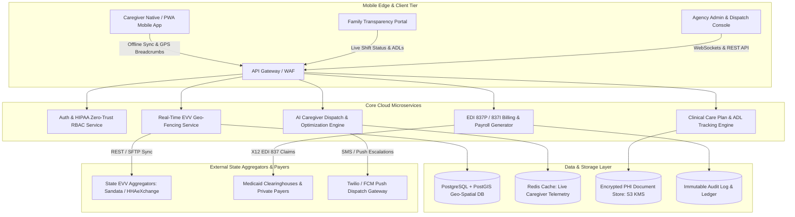

Are you looking to launch a multi-tenant home care agency SaaS, modernize operations for a national senior care provider network, or build an audit-proof Electronic Visit Verification (EVV) and caregiver dispatch system in 2026?

The global home healthcare and senior care market is undergoing a seismic operational transformation. Aging demographics, acute labor shortages with industry-wide caregiver turnover exceeding 70%, and strict federal enforcement under the **21st Century Cures Act** mandate that all personal care services (PCS) and home health care services (HHCS) funded by Medicaid capture cryptographic, tamper-evident proof of visit delivery.

However, existing off-the-shelf home care management tools remain clunky, siloed, and frustrating. Agency operators spend dozens of hours each week resolving scheduling conflicts, chasing missed clock-ins, reconciling paper timesheets, and battling crippling Medicaid claim denials due to mismatched EVV aggregators (such as Sandata, HHAeXchange, and Tellus).

Here is the definitive engineering blueprint and architectural guide to building an enterprise-grade, HIPAA-compliant, AI-powered Home Care Agency ERP and Electronic Visit Verification (EVV) SaaS platform in 2026.


---

## The 2026 Paradigm: From Manual Scheduling to Agentic Agency Automation

Traditional home care software treated EVV and scheduling as passive administrative records. Coordinators manually matched spreadsheets of client care plans against caregiver availability, resulting in high overtime costs, unfulfilled shifts, and delayed emergency response.

### Why Legacy Home Care & EVV Software Fails in 2026:
1. **Aggregator Integration Bottlenecks:** State Medicaid programs require EVV data routed to varying statewide aggregators (Sandata, HHAeXchange, CareBridge). Legacy systems lack flexible integration pipelines, resulting in delayed transmissions and 15–25% claim rejection rates.
2. **Fragile Mobile Connectivity:** Caregivers frequently work in rural areas or concrete apartment basements with zero cellular reception. Basic mobile apps fail to clock in/out offline, forcing manual administrative overrides that trigger Medicaid audit penalties.
3. **Rigid, Manual Shift Scheduling:** Dispatchers spend 4 to 6 hours daily calling and messaging caregivers to fill last-minute shift cancellations, leading to burnt-out staff and dissatisfied families.
4. **Disjointed Family Communication:** Family members are left in the dark regarding whether a caregiver arrived, what Activities of Daily Living (ADLs) were completed, or if critical medication was administered.

### The 2026 Modern Standard: Agentic Home Care ERP 3.0
* **Offline-First Cryptographic EVV Ingestion:** Local IndexedDB/SQLite storage with signed GPS coordinates, biometric verification, and automatic background sync over WebSockets once network connectivity resumes.
* **AI-Driven Dynamic Shift Matching:** Constraint satisfaction algorithms that factor in caregiver certifications, travel distance, historical reliability scores, client temperament preferences, and overtime threshold avoidance.
* **Direct EDI 837P / 837I Medicaid Auto-Billing:** Automated generation of compliant insurance and Medicaid claims with millisecond-precise EVV transaction ID mapping, reducing claim cycle time from 30 days to under 48 hours.
* **Real-Time Family Transparency Portals:** Dedicated client and family portals offering live caregiver arrival status, completed ADL checklists, vitals tracking, and HIPAA-compliant video check-ins.

> **Key Industry Metric:** Agencies transitioning to an automated, AI-scheduled EVV ERP reduce operational dispatch overhead by **62%**, eliminate non-compliant EVV claims by **99.4%**, and improve caregiver retention by **38%** within the first 90 days.

---

## High-Level System Architecture

A production-grade Home Care SaaS platform requires high-availability microservices designed for geo-distributed clock-ins, state-level EVV clearinghouse integration, and strict HIPAA Zero-Trust data governance.



---

## Core Technical Building Blocks

### 1. 21st Century Cures Act Compliant EVV Engine
Under Section 12006 of the 21st Century Cures Act, every EVV record must verify six mandatory data points:
1. **Type of service performed** (e.g., Personal Care, Respite, Skilled Nursing).
2. **Individual receiving the service** (Client ID and Medicaid recipient number).
3. **Date of the service**.
4. **Location of service delivery** (cryptographic GPS coordinate within geofence).
5. **Individual providing the service** (Caregiver biometric / authenticated ID).
6. **Time the service begins and ends** (UTC network time-stamp with drift verification).

#### Cryptographic Geofencing & PostGIS Validation:
To prevent location spoofing, the mobile app captures GPS accuracy circles, cell tower triangulation, and device motion telemetry before hashing the payload with an ephemeral device private key.

```sql
-- PostGIS Query to Verify if Caregiver Clock-In is within Client Geofence (e.g., 150m radius)
SELECT 
    c.client_id,
    c.client_name,
    ST_Distance(
        c.geofence_center_location::geography,
        ST_SetSRID(ST_MakePoint(:caregiver_longitude, :caregiver_latitude), 4326)::geography
    ) AS distance_meters,
    (ST_DWithin(
        c.geofence_center_location::geography,
        ST_SetSRID(ST_MakePoint(:caregiver_longitude, :caregiver_latitude), 4326)::geography,
        c.geofence_radius_meters
    )) AS is_inside_geofence
FROM agency_clients c
WHERE c.client_id = :client_id;
```

---

### 2. AI-Powered Dynamic Caregiver Dispatch & Shift-Matching Algorithm

Manually building weekly schedules across hundreds of caregivers and clients with complex medical needs leads to scheduling deadlocks and excessive overtime. The 2026 AI Dispatch Engine solves this as a **Multi-Objective Constraint Satisfaction Problem (CSP)**.

```python
"""
AI Caregiver Shift Optimization Engine (Constraint Scoring Engine)
Evaluates candidate caregivers across regulatory, geographical, and preference constraints.
"""
from dataclasses import dataclass
from typing import List, Dict, Optional
import math

@dataclass
class CaregiverCandidate:
    caregiver_id: str
    name: str
    skills: List[str]
    languages: List[str]
    current_weekly_hours: float
    hourly_rate: float
    rating: float
    current_lat: float
    current_lng: float

@dataclass
class ShiftRequirement:
    shift_id: str
    required_skills: List[str]
    client_lat: float
    client_lng: float
    shift_duration_hours: float
    max_travel_radius_km: float
    preferred_languages: List[str]

def haversine_distance(lat1: float, lon1: float, lat2: float, lon2: float) -> float:
    R = 6371.0 # Earth radius in km
    dlat = math.radians(lat2 - lat1)
    dlon = math.radians(lon2 - lon1)
    a = math.sin(dlat / 2)**2 + math.cos(math.radians(lat1)) * math.cos(math.radians(lat2)) * math.sin(dlon / 2)**2
    c = 2 * math.atan2(math.sqrt(a), math.sqrt(1 - a))
    return R * c

def calculate_match_score(caregiver: CaregiverCandidate, shift: ShiftRequirement) -> Optional[float]:
    # Hard Constraint 1: Must possess 100% of required clinical skills
    if not all(skill in caregiver.skills for skill in shift.required_skills):
        return None
    
    # Hard Constraint 2: Travel distance within boundary
    distance_km = haversine_distance(caregiver.current_lat, caregiver.current_lng, shift.client_lat, shift.client_lng)
    if distance_km > shift.max_travel_radius_km:
        return None
    
    # Soft Constraint 1: Proximity Score (Closer = Higher, max 40 pts)
    proximity_score = max(0, (1 - (distance_km / shift.max_travel_radius_km)) * 40)
    
    # Soft Constraint 2: Overtime Penalty (Avoid 40+ hrs/week, max 30 pts)
    projected_hours = caregiver.current_weekly_hours + shift.shift_duration_hours
    if projected_hours > 40.0:
        overtime_penalty = (projected_hours - 40.0) * 8.0
        overtime_score = max(0, 30 - overtime_penalty)
    else:
        overtime_score = 30.0
        
    # Soft Constraint 3: Language & Historical Reliability (max 30 pts)
    lang_match = 15.0 if any(l in shift.preferred_languages for l in caregiver.languages) else 5.0
    performance_score = (caregiver.rating / 5.0) * 15.0
    
    total_score = proximity_score + overtime_score + lang_match + performance_score
    return round(total_score, 2)
```

---

### 3. Automated Medicaid Claims Generation (EDI 837P / 837I)
Once a shift is marked completed and all Activities of Daily Living (ADLs) are verified via caregiver signature, the system compiles the transaction into an **ANSI ASC X12N 837P (Professional)** health care claim format, ensuring zero manual data entry between timesheets and billing.

| Claim Field | Source in EVV System | Validation Rule |
| :--- | :--- | :--- |
| **Service Code (HCPCS)** | Scheduled Care Plan (e.g., T1019, S5125, T1000) | Must match state-approved Medicaid service authorization |
| **Service Units** | Validated Clock-In to Clock-Out Time (15-min increments) | Automatically rounds according to state Medicaid rules |
| **EVV Confirmation Number** | Cryptographic PostGIS Transaction Hash | Verified against state aggregator intake API before batching |
| **Rendering Provider NPI** | Certified Caregiver NPI / State Registry ID | Active taxonomy verification via NPPES registry |
| **Diagnosis Code (ICD-10)** | Client Electronic Care Assessment Record | Primary functional limitation code (e.g., R54, Z74.09) |

---

## Comparison: Legacy Agency Operations vs. AI-Powered EVV ERP

| Feature / Capability | Legacy Agency Software (Spreadsheets / 1.0 Tools) | Modern 2026 AI Home Care EVV ERP |
| :--- | :--- | :--- |
| **EVV Compliance** | Manual time entry, frequent missing GPS geofencing | Automated 6-point Cures Act EVV with PostGIS & biometric signatures |
| **Offline Capability** | Fails in no-signal zones; requires manual office overrides | Full offline-first IndexedDB sync with tamper-evident local encryption |
| **Shift Scheduling** | Manual phone calls, 4+ hours daily coordinator overhead | Instant AI constraint solver with 1-click automated shift broadcasting |
| **Medicaid Claim Denials** | 12% – 25% denial rate due to EVV mismatch errors | <0.5% denial rate with pre-submission aggregator cross-validation |
| **Family Transparency** | Monthly paper summaries or disjointed text messages | Live mobile portal with real-time arrival maps, photos & ADL logs |
| **Overtime Management** | Reactive alerts after payroll costs have already accumulated | Predictive allocation preventing overtime before shifts are scheduled |

---

## Step-by-Step Implementation Roadmap for Home Care SaaS

1. **Step 1: Multi-Tenant Tenant Isolation & RBAC**
   * Configure PostgreSQL row-level security (RLS) separating home care agencies, branch offices, and regional franchises.
   * Implement role-based access for Agency Owners, Care Coordinators, Schedulers, Field Caregivers, and Family Members.
2. **Step 2: Geofenced Mobile Caregiver PWA / Native App**
   * Deploy React Native / Flutter or Next.js PWA with Service Worker background location listeners.
   * Integrate offline biometric authentication (WebAuthn / FaceID) and task completion checklists for ADLs.
3. **Step 3: State EVV Aggregator Clearinghouse Bridge**
   * Implement automated REST/SFTP adapters for Sandata, HHAeXchange, CareBridge, and Tellus.
   * Build automated retry queues with Dead Letter Queues (DLQs) for failed aggregator syncs.
4. **Step 4: AI Smart Dispatch & Family Portal Experience**
   * Embed constraint-satisfaction shift broadcast algorithms via Twilio WhatsApp/SMS APIs.
   * Launch white-label branded family portals with automated medication and visit completion alerts.

---

## Frequently Asked Questions (FAQ)

### What makes an EVV software solution 21st Century Cures Act compliant?
To be federally compliant, your EVV software must electronically capture and log six core data elements without manual alterations: (1) date of service, (2) location of service via GPS/fixed device verification, (3) individual receiving service, (4) individual providing service, (5) specific service type rendered, and (6) exact start and end times. The data must also seamlessly transmit to state-designated EVV aggregators.

### How does the app handle caregivers working in rural areas with zero cellular reception?
Modern home care SaaS platforms utilize an **Offline-First PWA / Local SQLite Architecture**. The caregiver's mobile device records the cryptographic GPS coordinates, local device timestamp, and completed task checklist locally in encrypted storage. When the phone reconnects to cellular data or Wi-Fi, the payload is securely synchronized with the central cloud server and verified against server network time.

### Can this platform connect directly with state Medicaid aggregators like Sandata and HHAeXchange?
Yes. Anonsoft builds custom bidirectional integration bridges that map your internal agency visit data to state-specific specifications (including Sandata, HHAeXchange, Tellus, and CareBridge), verifying data integrity prior to transmission to guarantee zero billing claim rejections.

### How does the AI Caregiver Scheduling engine reduce agency payroll overhead?
The scheduling engine automatically evaluates caregiver travel times, hourly pay rates, and current weekly logged hours in real time. By prioritizing nearby qualified caregivers who haven't breached the 40-hour weekly threshold, agencies eliminate costly non-productive drive times and avoid expensive unbudgeted overtime payouts.

---

## Build Your Custom Home Care & EVV Platform with Anonsoft

Building a compliant, high-performing Home Care ERP requires deep domain knowledge across healthcare regulations, real-time geofencing, and automated healthcare claims processing.

At **Anonsoft**, we specialize in engineering custom healthcare and home care software with zero upfront payment—we build your working prototype first so you can test it with real coordinators and caregivers before paying a single dollar.

* Explore our [Senior Care Agency Software Portfolio](/projects/senior-care-agency.html)
* Learn about our [HIPAA Telemedicine Development Capabilities](/projects/mednowna.html)
* Ready to build your platform? [Book a 30-Minute Architecture Consultation](/bookademo/) with our principal engineering team today.
