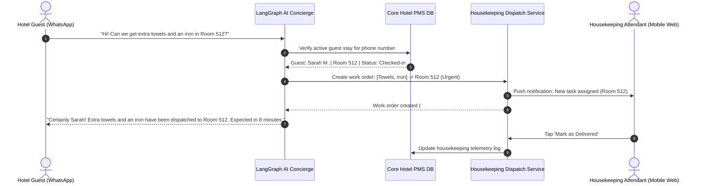

Are you designing a cloud-native hotel property management system (PMS), architecting a high-throughput multi-channel distribution engine, or building an AI-first hospitality operating platform in 2026?

The global hospitality software industry is undergoing an unprecedented architectural modernization. For decades, hotel chains, boutique resorts, and multi-property vacation rental operators have been trapped in rigid on-premise legacy systems—such as decades-old desktop PMS architectures—that require expensive local servers, manual night audits, and fragmented third-party middleware. These legacy systems cost operators millions in **15% to 25% Online Travel Agency (OTA) commission bleed, catastrophic double-booking race conditions during peak flash sales, high front-desk labor turnover, and disjointed guest experiences**.

At the same time, modern hotel guests expect a 100% digital, frictionless journey: **instant WhatsApp booking confirmations, mobile web pre-check-in with biometric ID verification, digital room keys in Apple/Google Wallet via Bluetooth Low Energy (BLE) and NFC locks, and 24/7 AI-powered in-room voice and text concierges that speak 40+ languages**.

Building a modern AI-powered Hospitality PMS and Channel Manager SaaS requires orchestrating complex real-time distributed systems: **sub-second two-way inventory synchronization across Booking.com, Expedia, Airbnb, and direct booking engines with Redis Redlock concurrency control, deep reinforcement learning (RL) revenue management engines that maximize Revenue Per Available Room (RevPAR), IoT door lock integrations with ASSA ABLOY and dormakaba, and unified multi-department billing folios connecting F&B POS, spa, and minibar systems**.

Here is the authoritative engineering blueprint for architecting, building, and deploying a scalable, multi-tenant AI-Powered Hotel PMS and Channel Manager SaaS in 2026.


---

## The Architectural Divide: Legacy Desktop PMS vs. AI-Native Hospitality Cloud SaaS

Legacy hotel property management software was designed for single-property desktop LAN environments. Modern AI-native hospitality SaaS operates as an elastic, event-driven multi-tenant cloud:

| Capability / Dimension | Legacy On-Premise Hotel PMS | Modern AI-Native Hospitality Cloud SaaS (2026) |
| :--- | :--- | :--- |
| **Architecture & Deployment** | Heavy Windows desktop client, on-prem local SQL server, VPN access | Multi-tenant cloud-native (PostgreSQL Aurora, Redis Cluster, Kubernetes) |
| **Channel Management** | Batch synchronization via legacy CRS middleware (5–15 min delay) | Real-time bi-directional Webhook & WebSocket streaming (< 350ms global latency) |
| **Pricing & Yield Strategy** | Static seasonal rate sheets manually updated once a quarter | Autonomous Reinforcement Learning (RL) dynamic pricing optimizing RevPAR every 15 min |
| **Check-in & Key Access** | Physical front desk queues, magnetic swipe cards, manual passport photocopies | Contactless mobile web check-in, automated OCR ID verification, BLE/NFC Apple Wallet keys |
| **Guest Communication** | Landline telephone dial-in to front desk, paper welcome binders | Multilingual Generative AI Concierge across WhatsApp, SMS, web app, & voice agents |
| **Housekeeping & Maintenance**| Printed daily paper room assignment sheets | Dynamic algorithmic task dispatch based on real-time room sensors, departures, & priorities |
| **Folio & POS Settlement** | End-of-day batch ledger batching with manual night audit freezes | Real-time unified event streaming folio with zero-downtime continuous ledger auditing |

---

## High-Level System Architecture

A production-ready hospitality SaaS platform must handle asynchronous high-volume channel messaging, guarantee strict zero-overbooking transactional consistency, execute low-latency dynamic pricing models, and coordinate with physical IoT edge hardware in hotels globally:

```mermaid
graph TD
    subgraph Channel & Distribution Layer
        A[Booking.com API] -->|Push/Pull Webhooks| E[Channel Distribution Gateway: Envoy / TLS 1.3]
        B[Expedia Group Partner Central] -->|OTA XML/JSON| E
        C[Airbnb / VRBO APIs] -->|REST Webhooks| E
        D[Direct Hotel Booking Engine: Next.js] -->|GraphQL / gRPC| E
    end

    subgraph Core Ingestion & Distributed Concurrency Engine
        E --> F[Kafka Event Bus: channel-reservation-events]
        F --> G[Distributed Inventory Manager: Redis Redlock Cluster]
        G -->|Atomic Rate & Availability Updates| H[(Core Multi-Tenant DB: PostgreSQL)]
        G -->|Inventory Snapshots| I[(Fast Cache: Redis In-Memory State)]
    end

    subgraph AI Revenue, Guest Intelligence & Operations
        H --> J[Deep RL Dynamic Pricing & Yield Optimizer]
        H --> K[Guest CRM & Context Vector Store: pgvector / Qdrant]
        K --> L[Autonomous Multilingual AI Concierge: LangGraph + LLM]
        H --> M[Smart Housekeeping & Task Routing Scheduler]
    end

    subgraph Edge Hardware & Physical Lock Integration
        N[Guest Mobile App / Web Wallet] -->|BLE / NFC Credential| P[Smart Door Lock: ASSA ABLOY / dormakaba]
        O[Staff Operations Tablet] -->|WebSocket Updates| M
        Q[F&B Point-of-Sale / Spa POS] -->|Charge to Room Folio| H
    end

    subgraph Hospitality Management Workbench
        J & L & M --> R[Hotelier Admin Portal: React 19 + Tailwind UI]
        R --> S[Automated Night Audit & Financial Ledger]
    end
```

---

## 5 Core Engineering Modules of an Enterprise Hotel PMS & Channel Manager

### 1. High-Throughput Two-Way Channel Manager with Distributed Concurrency (Zero Overbooking)

The central engineering challenge of hotel software is eliminating overbookings during high-velocity reservation spikes (such as flash sales or major metropolitan conferences). When a guest reserves the last Deluxe Ocean Suite on Expedia, the PMS must instantly lock the inventory, update the core database, and push availability reductions (0 units) to Booking.com, Airbnb, Agoda, and the direct booking engine in under 500 milliseconds.

* **Distributed Lock Pattern with Redis Redlock:** Prevent race conditions where simultaneous checkout transactions on different channels attempt to book the exact same room inventory date range.
* **Idempotent Webhook Processing:** OTA webhooks frequently deliver duplicate event payloads during network retries. Every inbound reservation event is deduplicated via a cryptographically hashed composite idempotency key (`channel_id + booking_reference + modification_timestamp`).
* **Delta Synchronization Queue:** Rather than pushing the entire 365-day availability grid across all 50 room types on every change, the distribution gateway pushes atomic delta change sets (`room_type_id`, `date`, `available_count`, `rate`, `min_stay`).

```python
# Example: FastAPI + Redis Distributed Lock for Atomic Room Reservation & Channel Sync
import time
import uuid
import logging
from typing import List, Optional
from pydantic import BaseModel, Field
from fastapi import FastAPI, HTTPException, status, Depends
import redis

app = FastAPI(title="Hotel PMS Distribution & Channel Engine", version="2026.1")
redis_client = redis.Redis(host='localhost', port=6379, db=0, decode_responses=True)

class ReservationItem(BaseModel):
    hotel_id: str
    room_type_id: str
    check_in: str  # YYYY-MM-DD
    check_out: str # YYYY-MM-DD
    guest_name: str
    guest_email: str
    channel_source: str # "direct", "booking_com", "expedia", "airbnb"
    channel_booking_id: str
    total_amount: float

class ReservationResponse(BaseModel):
    success: bool
    confirmation_code: str
    hotel_id: str
    room_type_id: str
    nights_booked: int
    message: str

def acquire_inventory_lock(hotel_id: str, room_type_id: str, dates: List[str], timeout_ms: int = 4000) -> Optional[str]:
    """Acquires a distributed multi-date lock across the booking date range."""
    lock_token = str(uuid.uuid4())
    acquired_keys = []
    
    for date_str in dates:
        lock_key = f"lock:inv:{hotel_id}:{room_type_id}:{date_str}"
        # Set NX with expiry
        acquired = redis_client.set(lock_key, lock_token, nx=True, px=timeout_ms)
        if acquired:
            acquired_keys.append(lock_key)
        else:
            # Release already acquired locks on failure
            for release_key in acquired_keys:
                if redis_client.get(release_key) == lock_token:
                    redis_client.delete(release_key)
            return None
    return lock_token

def release_inventory_lock(dates: List[str], hotel_id: str, room_type_id: str, lock_token: str):
    """Safely releases distributed lock keys using matching token verification."""
    for date_str in dates:
        lock_key = f"lock:inv:{hotel_id}:{room_type_id}:{date_str}"
        current_token = redis_client.get(lock_key)
        if current_token == lock_token:
            redis_client.delete(lock_key)

@app.post("/api/v1/reservations/book", response_model=ReservationResponse)
async def process_atomic_reservation(res: ReservationItem):
    # Calculate date list (simplified 1-night mock for illustration)
    dates_to_lock = [res.check_in]
    
    # 1. Acquire distributed lock
    lock_token = acquire_inventory_lock(res.hotel_id, res.room_type_id, dates_to_lock)
    if not lock_token:
        raise HTTPException(
            status_code=status.HTTP_409_CONFLICT,
            detail="Room inventory is currently being locked by a concurrent booking transaction. Please retry."
        )
    
    try:
        # 2. Check live inventory in cache/DB
        inv_key = f"inv:{res.hotel_id}:{res.room_type_id}:{res.check_in}"
        available_rooms = int(redis_client.get(inv_key) or 0)
        
        if available_rooms <= 0:
            raise HTTPException(
                status_code=status.HTTP_400_BAD_REQUEST,
                detail=f"Zero inventory available for room type {res.room_type_id} on {res.check_in}."
            )
            
        # 3. Decrement inventory atomically
        new_inventory = redis_client.decr(inv_key)
        
        # 4. Generate persistent confirmation
        confirmation_code = f"CONF-{uuid.uuid4().hex[:8].upper()}"
        
        # 5. Emit async channel broadcast task to update all connected OTAs
        # queue_channel_delta_update(res.hotel_id, res.room_type_id, res.check_in, new_inventory)
        
        return ReservationResponse(
            success=True,
            confirmation_code=confirmation_code,
            hotel_id=res.hotel_id,
            room_type_id=res.room_type_id,
            nights_booked=len(dates_to_lock),
            message="Reservation confirmed and inventory delta synchronized across all channels."
        )
    finally:
        # Always release locks
        release_inventory_lock(dates_to_lock, res.hotel_id, res.room_type_id, lock_token)
```

---

### 2. Reinforcement Learning (RL) Dynamic Revenue Yield Management Engine

Static pricing rules (e.g., "$199 on weekdays, $299 on weekends") fail to capitalize on sudden demand surges or mitigate vacancy during lull periods. An AI-native PMS continuously ingests multi-modal market telemetry to execute automated price elasticity optimization:

* **Telemetry Ingestion:**
  * **Competitor Rate Shopping:** Scrapes live rate parities of 10 neighboring competitor properties every 30 minutes via headless browser clusters.
  * **Citywide Event Telemetry:** Ingests stadium concerts, conventions, marathon schedules, and trade fair calendars.
  * **Flight Arrival Volume & Weather:** Monitors inbound airline seat capacity and local weather forecasts.
  * **Historical Pace & Pickup Curve:** Compares current lead-time booking velocity against 3-year historical booking pace.
* **RL Pricing Agent:** Formulated as a Markov Decision Process (MDP) where the agent optimizes expected total revenue over the booking horizon:
  $$\max_{\mathbf{p}} \sum_{t=0}^{T} \mathbb{E} \left[ R_t(p_t, \text{Occupancy}_t, \text{Demand}_t) \right]$$
  The model sets real-time rates bounded by hotelier-configured floor and ceiling constraints ($p_{\min} \le p_t \le p_{\max}$).

---

### 3. Contactless Check-In, Biometric ID Verification & IoT Mobile Room Key Orchestration

Modern hospitality demands complete self-service. Guests bypass front desk lines entirely through a web-based Progressive Web App (PWA) or native Apple Wallet / Google Wallet pass:

```
[Pre-Arrival SMS / WhatsApp with Secure Web Link]
                       ↓
   [Mobile Web Browser: Camera Photo of ID / Passport]
                       ↓
[AI OCR & Face Biometrics Match (99.9% Fraud Prevention)]
                       ↓
[Credit Card Pre-Authorization for Incidentals via Stripe]
                       ↓
[Automated PMS Room Assignment (Cleaned & Inspected Room)]
                       ↓
[Cloud IoT Lock API Trigger: ASSA ABLOY / dormakaba / Salto]
                       ↓
  [Encrypted BLE / NFC Digital Key Provisioned to Wallet]
```

* **Automated Room Assignment:** The algorithm pairs the incoming reservation with an inspected, ready room matching the guest's profile preferences (high floor, away from elevator, feather-free pillows).
* **Hardware Door Lock Webhooks:** Interacts with lock vendor cloud bridges (ASSA ABLOY Visionline, dormakaba Ambiance, Salto KS) via secure mTLS API calls to generate temporary time-bound cryptographic access tokens valid strictly from check-in time to check-out (11:00 AM).

---

### 4. Autonomous Multilingual AI Guest Concierge & Housekeeping Task Routing

The AI guest concierge acts as an autonomous digital butler available over WhatsApp, SMS, web chat, and smart in-room voice hubs:

* **LangGraph Contextual Agent:** Retrieves the guest's live reservation details, dietary preferences, room number, and billing folio directly from the PMS database using Retrieval-Augmented Generation (RAG).
* **Autonomous Fulfillment Tool Calling:** When a guest messages *"Could we get two extra feather pillows and an ice bucket sent up to Room 408?"*, the AI does not just reply with text—it calls the internal PMS task API to generate a high-priority housekeeping work order.
* **Intelligent Housekeeping Optimization:** Housekeeping staff carry mobile web dashboards that dynamically reorder room cleaning schedules based on real-time PMS departure notifications, VIP arrivals, and IoT smart motion sensor confirmations of empty rooms.



---

### 5. Unified Multi-Department Folio, Split Billing & POS ERP Integration

A hotel is not just a room booking engine—it is an ecosystem of revenue centers: restaurants, rooftop bars, spas, golf courses, parking garages, and banquet halls.

* **Single Universal Ledger (The Master Folio):** All departmental transactions post instantly to the guest folio via room-charge authorization protocols. When a guest pays for a cocktail at the pool bar, the POS verifies active check-in status, checks credit limits, and appends the itemized receipt to the room ledger.
* **Complex Split Billing:** Group bookings, corporate retreats, and wedding parties require automated split billing: room charges routed to the corporate master bill, while incidentals (minibar, room service) are billed to individual guest credit cards.
* **Continuous Night Audit:** Legacy PMS platforms require freezing the system at 2:00 AM for a 90-minute batch night audit. Modern cloud PMS architectures execute continuous double-entry ledger validation in the background, recalculating taxes, city occupancy levies, and daily RevPAR metrics in real time without downtime.

---

## Technical & Commercial FAQs

### 1. How does the system handle internet outages at the hotel property for IoT door locks and front-desk check-in?
Modern cloud PMS architectures deploy lightweight on-premises IoT edge appliances (or Raspberry Pi / industrial mini-PCs running Docker containers) inside the hotel's local network. The edge node maintains a localized cache of valid digital room keys, active room statuses, and physical RFID keycard encoder integrations. If the external internet uplink drops, guests can still access rooms via offline Bluetooth Low Energy (BLE) tokens, and staff can issue physical RFID cards using local cached credentials. When connectivity restores, the edge gateway automatically replays state changes to the cloud.

### 2. How do you prevent rate parity violations across OTAs when using AI dynamic pricing?
Certain major OTAs enforce rate parity clauses requiring hotels to offer identical public rates across channels. The AI pricing engine includes a configurable **Parity Guardian Module**. When dynamic rates update, the system pushes the identical base rate simultaneously to all parity-bound OTAs while unlocking targeted private discounts (such as mobile-only rates, loyalty member rates, and geo-targeted promotions) that comply with channel agreements.

### 3. Can this platform be white-labeled for hospitality management groups or regional hotel software resellers?
Yes. The architecture is engineered with native multi-tenancy. Every hotel brand or management agency gets its own custom domain, branded guest PWA, tailored color palette, localized tax calculation engine, and isolated PostgreSQL tenant schema. Management groups gain a centralized **Super-Admin Multi-Property Dashboard** to monitor portfolio-wide occupancy, ADR, RevPAR, and staff KPIs across dozens of properties simultaneously.

### 4. Which payment gateways and POS hardware terminals are supported?
The platform supports omnichannel payment tokenization via **Stripe Terminal, Adyen, Square, and Shift4**, allowing pre-authorizations during online check-in and seamless physical card tapping at front desk kiosks. For on-property dining and retail, the PMS exposes bi-directional REST and WebSocket APIs to integrate with restaurant POS systems (such as Toast, Micros Simphony, and TodayInTech POS), posting live dining bills directly to room folios.

### 5. What are the typical development timelines and hosting costs for launching a custom cloud PMS?
Building a production-ready custom hotel PMS with integrated channel management and contactless check-in typically takes **8 to 14 weeks** using TodayInTech's battle-tested hospitality microservice modules. Cloud hosting costs on AWS or GCP scale with property volume—averaging **$0.20 to $0.60 per room per month**, delivering massive savings compared to legacy enterprise licensing fees that cost $5 to $15 per room monthly.

---

## Build Your Next-Generation Hotel PMS with TodayInTech

Are you looking to replace legacy on-premise PMS headaches, launch a disruptive hospitality SaaS platform, or build an automated multi-property vacation rental management operating system?

**TodayInTech** specializes in engineering mission-critical, enterprise-grade hospitality software, distributed channel managers, dynamic pricing AI engines, and contactless IoT access systems.

* **Ready to see our architecture in action?** Explore our [Restaurant & Hospitality Management System](/projects/restaurant-management-system.html) and [Inventory & Multi-Entity Billing Platform](/projects/inventory-billing.html).
* **Schedule a Free Engineering Architecture Consultation:** [Book a 1-on-1 Demo with Our Technical Leads](/bookademo/) or [Contact Us Today](/contact/).
