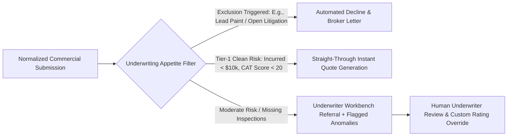
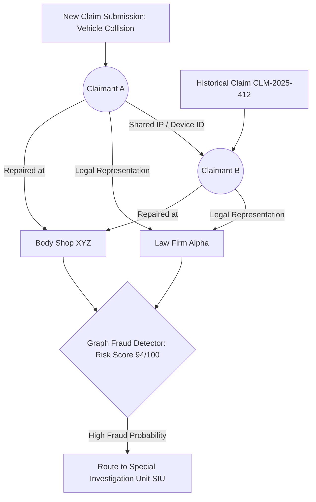

Are you building a next-generation commercial insurance underwriting platform, launching an AI-native Managing General Agent (MGA) operating system, or architecting an enterprise First Notice of Loss (FNOL) claims triage engine in 2026?

Commercial property and casualty (P&C) insurance is a **$1.8 trillion global industry**, yet commercial submissions and claims adjudication remain bogged down by staggering operational friction. Commercial brokers submit applications as 60-page unstructured PDF packages—containing scanned ACORD forms, 5-year historical loss run spreadsheets, financial balance sheets, building inspection photos, and lease agreements. Over **70% of commercial underwriting time is spent on manual data re-keying and document validation**, stretching submission-to-quote turnaround times to **10 to 18 business days**.

Meanwhile, claims departments face surging claims frequency, catastrophic climate events, and sophisticated multi-party insurance fraud rings, costing the industry over **$308 billion annually in fraudulent payouts and excessive loss adjustment expenses (LAE)**.

The transition to an AI-native InsurTech paradigm is urgent: **multi-modal document ingestion capable of parsing complex tabular loss runs with 99.8% precision, real-time spatial catastrophe risk scoring, autonomous computer vision damage estimation for FNOL, graph neural networks for syndicate fraud detection, and straight-through processing (STP) integrations with core policy administration systems like Guidewire, Duck Creek, and Socotra**.

Here is the comprehensive, production-ready engineering blueprint for designing, architecting, and deploying an enterprise AI-powered InsurTech and Commercial Underwriting SaaS in 2026.


---

## The Paradigm Shift: Legacy Carrier Workflows vs. AI-Native InsurTech SaaS

Traditional carrier operations rely on siloed mainframe databases, manual underwriters, and outsourced paper-processing teams. Modern AI-native InsurTech SaaS transforms underwriting into an automated, data-driven pipeline:

| Capability / Metric | Legacy Carrier & Traditional MGA | Modern AI-Native InsurTech SaaS (2026) |
| :--- | :--- | :--- |
| **Submission Ingestion** | Manual data entry across ACORD forms (2–4 hours per submission) | Autonomous Multi-Modal Vision LLM extraction across ACORD, SOVs, and loss runs (< 15 seconds) |
| **Loss Run Analysis** | Manual PDF reading, date cleaning, and spreadsheet collation | Automated tabular normalization, loss development factor (LDF) projection, & trend tagging |
| **Underwriting Turnaround** | 10 to 18 business days for commercial lines | Sub-minute Straight-Through Processing (STP) for tier-1 risks; under 2 hours for complex risks |
| **Risk Evaluation** | Static postal code rating tables & historical actuarial averages | Dynamic real-time spatial risk (wildfire, flood, wind, crime, cyber footprint telemetry) |
| **FNOL Claims Triage** | Paper/telephone reporting; manual adjustor assignment (3–7 days) | Instant multi-modal mobile/web FNOL with computer vision damage sizing & auto-reserve assignment |
| **Fraud Detection** | Rule-based red flags checked after claim settlement | Real-time Knowledge Graph entity resolution & fraud ring detection during FNOL submission |
| **Core Integration** | Batch CSV exports or rigid point-to-point SOAP endpoints | Bi-directional event-driven REST/GraphQL & Webhook connectors to Guidewire, Duck Creek, & Socotra |

---

## High-Level System Architecture

An enterprise-grade commercial underwriting and claims SaaS must handle high-volume multi-format document ingestion, execute heavy geospatial and tabular machine learning inference, maintain rigorous auditability for state insurance commissioners, and synchronize seamlessly with core policy ledgers:

```mermaid
graph TD
    subgraph Submission & Intake Layer
        A[Broker Portal / Email Intake: ACORD 125/126/140] -->|PDF / Scanned Images| E[Secure Document Gateway: Kong / TLS 1.3]
        B[Loss Run Reports: 5-Year PDF / Excel] -->|Tabular Documents| E
        C[Policyholder Mobile FNOL: Photos / Video / Telematics] -->|Multipart Ingest| E
        D[Third-Party Risk Telemetry: Verisk, FEMA, ISO, OpenStreetMap] -->|REST Webhooks| E
    end

    subgraph Document Intelligence & Extraction Engine
        E --> F[Apache Kafka: document-intake-events]
        F --> G[LayoutLMv3 + Vision LLM Parsing Microservice]
        G -->|Extracted Key-Value Entities| H[(Structured Document Data Lake: PostgreSQL Aurora)]
        G -->|Document Embeddings & Vector Chunks| I[(Vector Store: pgvector / Qdrant)]
    end

    subgraph Actuarial Risk, Underwriting & Fraud Engine
        H --> J[Loss Run Normalizer & Actuarial Trend Calculator]
        H --> K[Geospatial Catastrophe & Hazard Scoring Engine]
        H --> L[Underwriting Rules & Appetite Engine: Drools / OpenFaaS]
        C --> M[Computer Vision Damage Estimation: PyTorch / ONNX]
        H --> N[Entity Resolution & Graph Fraud Detector: Neo4j]
    end

    subgraph Decisioning, Policy Core & Integration Layer
        J & K & L & N --> O[Composite Underwriting Decision Hub]
        O -->|Approved: Straight-Through Processing| P[Policy Rating & Premium Quoting Engine]
        O -->|Manual Referral Required| Q[Underwriter Workbench: Next.js + Tailwind UI]
        P --> R[Carrier Policy Administration Integration: Guidewire / Duck Creek / Socotra]
        P --> S[Automated Binder & Certificate Generator]
    end
```

---

## 5 Core Engineering Modules of an Enterprise InsurTech Platform

### 1. Autonomous ACORD & Unstructured Loss Run Extraction Pipeline

Commercial submissions arrive in inconsistent formats: scanned ACORD forms (125, 126, 130, 140), Schedule of Values (SOV) spreadsheets, and PDF loss runs from dozens of distinct carrier systems (Travelers, Chubb, Liberty Mutual, Hartford) each with unique tabular schemas.

* **Hybrid OCR & Vision-Transformer Extraction:** Standard OCR tools fail when reading multi-page loss run tables with merged cells, handwritten notes, and low-contrast scanned text. We combine **LayoutLMv3 spatial tokens** with multi-modal LLM vision extractors to preserve 2D grid coordinates and extract row-by-row claim histories.
* **Loss Run Schema Normalization:** Converts varying terminology (`Incurred`, `Paid Losses`, `Outstanding Reserves`, `Expense Incurred`, `Subrogation Recovered`) into a single canonical ISO-compliant JSON schema.
* **Confidence Scoring & Human-in-the-Loop (HITL) Fallback:** Every extracted entity receives a confidence score ($c \in [0, 1]$). If any financial total fails cross-row checksum reconciliation ($\sum \text{Paid} + \sum \text{Reserved} \neq \text{Incurred}$), the submission is routed to a rapid review queue with bounding-box visual highlights.

```python
# Example: FastAPI + Pydantic Loss Run Extraction & Actuarial Reconciliation Service
from fastapi import FastAPI, UploadFile, File, HTTPException, status
from pydantic import BaseModel, Field
from typing import List, Optional
from datetime import date
import uuid

app = FastAPI(title="InsurTech Document Intelligence API", version="2026.1")

class ClaimRecord(BaseModel):
    claim_number: str
    date_of_loss: date
    policy_year: int
    claimant_name: Optional[str] = None
    cause_of_loss: str = Field(..., description="E.g., Water Damage, Slip and Fall, Fire, Cyber Breach")
    paid_loss: float = Field(..., ge=0.0)
    paid_expense: float = Field(default=0.0, ge=0.0)
    open_reserve: float = Field(default=0.0, ge=0.0)
    total_incurred: float = Field(..., ge=0.0)
    status: str = Field(..., regex="^(OPEN|CLOSED|REOPENED)$")

class NormalizedLossRunReport(BaseModel):
    submission_id: str
    carrier_source: str
    valuation_date: date
    total_claims_count: int
    total_incurred_sum: float
    total_paid_sum: float
    total_reserved_sum: float
    claims: List[ClaimRecord]
    checksum_verified: bool

@app.post("/api/v1/underwriting/extract-loss-run", response_model=NormalizedLossRunReport)
async def process_loss_run_document(file: UploadFile = File(...)):
    if not file.filename.endswith(('.pdf', '.xlsx', '.png', '.jpg')):
        raise HTTPException(
            status_code=status.HTTP_400_BAD_REQUEST, 
            detail="Unsupported document format. Please upload PDF or image loss run."
        )
    
    # 1. Read document buffer & invoke Document Extraction Engine (e.g., LayoutLMv3 + Vision LLM)
    extracted_claims = [
        ClaimRecord(
            claim_number="CLM-2024-8841",
            date_of_loss=date(2024, 6, 14),
            policy_year=2024,
            cause_of_loss="Water Pipe Burst / Property Damage",
            paid_loss=45200.00,
            paid_expense=3150.00,
            open_reserve=0.00,
            total_incurred=48350.00,
            status="CLOSED"
        ),
        ClaimRecord(
            claim_number="CLM-2025-1092",
            date_of_loss=date(2025, 2, 28),
            policy_year=2025,
            cause_of_loss="Customer Slip and Fall / General Liability",
            paid_loss=12000.00,
            paid_expense=2400.00,
            open_reserve=35000.00,
            total_incurred=49400.00,
            status="OPEN"
        )
    ]
    
    # 2. Strict Actuarial Financial Checksum Validation
    calculated_paid = sum(c.paid_loss + c.paid_expense for c in extracted_claims)
    calculated_reserved = sum(c.open_reserve for c in extracted_claims)
    calculated_incurred = sum(c.total_incurred for c in extracted_claims)
    
    # Verify mathematical integrity
    is_valid = abs((calculated_paid + calculated_reserved) - calculated_incurred) < 0.01

    return NormalizedLossRunReport(
        submission_id=str(uuid.uuid4()),
        carrier_source="Extracted from Travelers Loss Run PDF",
        valuation_date=date(2026, 8, 1),
        total_claims_count=len(extracted_claims),
        total_incurred_sum=calculated_incurred,
        total_paid_sum=calculated_paid,
        total_reserved_sum=calculated_reserved,
        claims=extracted_claims,
        checksum_verified=is_valid
    )
```

---

### 2. Actuarial Risk Scoring & Dynamic Underwriting Decisioning Engine

Once raw submission data is parsed into normalized structures, the platform evaluates risk against the carrier’s underwriting appetite guidelines:

1. **Catastrophe (CAT) & Geospatial Enrichment:** Automatically cross-references property latitude/longitude with FEMA 100-year flood plains, Wildfire Hazard Potential (WHP) indices, USGS seismic fault proximity, and historical hurricane storm surge data.
2. **Loss Ratio Trend Projections:** Computes Loss Development Factors (LDF) across 5 policy years to normalize immature policy years and forecast ultimate expected losses:
   $$\text{Ultimate Incurred Losses} = \sum_{t=1}^{T} \text{Reported Incurred}_t \times \text{LDF}_t$$
3. **Automated Guideline Rules Engine:** Uses deterministic business rule engines (Drools or Python Rule DSL) to check exclusionary criteria (e.g., buildings older than 50 years without electrical rewiring, restaurants with deep-fryers lacking UL 300 suppression systems, or businesses with loss ratios $> 65\%$).



---

### 3. Multi-Modal First Notice of Loss (FNOL) & Damage Inspection

Handling claims rapidly without overpaying or enabling fraud requires a seamless, multi-modal intake pipeline:

* **Guided Mobile Web FNOL:** Policyholders report property or auto damage via a responsive, lightweight web application that captures high-resolution photographs, geo-tagged GPS coordinates, and gyro-assisted perspective verification.
* **Computer Vision Damage Segmentation:** Deep learning segmentation models (Mask R-CNN / YOLOv11 / Segment Anything) identify damaged vehicle panels, broken glazing, structural water stains, or roof hail impacts, calculating estimated replacement cost based on regional labor and parts databases.
* **Instant Automated Reserving:** Automatically assigns statistical initial claim reserve limits using gradient-boosted trees trained on historical severity distributions, preventing under-reserving early in the claims lifecycle.

---

### 4. Graph Neural Networks for Fraud Syndicate & Ring Detection

Organized insurance fraud rings orchestrate staged auto collisions, duplicate medical billing, and multi-claimant property damage fraud across multiple carriers.

* **Graph Entity Resolution:** Ingests claimant Social Security numbers, phone numbers, repair shop tax IDs, attending physicians, insurance adjustors, and vehicle VINs into a graph database (Neo4j).
* **Community Detection & Risk Propagation:** Applies PageRank and Louvain community detection algorithms to uncover shared phone numbers, recurring collision locations, or common legal representatives connecting ostensibly unrelated claims.
* **Real-Time Fraud Score Injection:** Flags suspicious claims before settlement checks are cut, saving millions in fraudulent payouts.



---

### 5. Core Policy Administration (PAS) & Reinsurance Integration

A modern InsurTech SaaS must interoperate with core systems of record and reinsurance treaties:

* **PAS Connectors:** Pre-built bidirectional REST/SOAP adapters for Guidewire PolicyCenter/ClaimCenter, Duck Creek OnDemand, Socotra, and Applied Systems Epic.
* **Automated Reinsurance Cession:** Automatically splits underwritten risk across Quota Share and Excess of Loss (XOL) reinsurance treaties, calculating net retained lines and issuing bordereau reports to reinsurers at month-end.
* **Dynamic Rating & State Filing Rules:** Executes ISO (Insurance Services Office) loss cost multipliers and custom carrier schedule rating credits directly in code.

---

## Technical Comparison of Storage and Machine Learning Engines in InsurTech

| Component / Layer | Recommended Technology | Key Architectural Benefit |
| :--- | :--- | :--- |
| **Document OCR & Layout** | LayoutLMv3 + Claude 3.5 Sonnet / GPT-4o Vision | High-precision spatial extraction across complex tabular loss runs and multi-page ACORD forms |
| **Relational & Submission Store** | PostgreSQL Aurora with Row-Level Security (RLS) | Strict tenant isolation between brokerage agencies, MGA programs, and carrier syndicates |
| **Graph Fraud Analytics** | Neo4j Enterprise / Amazon Neptune | Sub-millisecond graph traversals for entity resolution and organized fraud syndicate tracking |
| **Geospatial & CAT Analysis** | PostGIS + H3 Spatial Indexing + Mapbox GL | Rapid polygon intersections for flood zones, wildfire boundaries, and hurricane surge cones |
| **Event Streaming & Audit** | Apache Kafka with Schema Registry | Guaranteed order delivery, event-driven policy updates, and immutable audit logs for regulators |

---

## Security, State DOI Compliance & AI Governance

Insurance is one of the most strictly regulated industries in the world. Deploying AI algorithms into underwriting and claims workflows requires uncompromising governance:

1. **NAIC Model Bulletin on AI & Fair Lending:** All algorithmic underwriting decisions must be auditable, explainable, and free from prohibited disparate impact under Fair Housing, Equal Credit Opportunity, and state Department of Insurance (DOI) guidelines. The platform generates SHAP (SHapley Additive exPlanations) values for every decline reason code.
2. **Immutable Regulatory Audit Trails:** Every automated quote, policy binder, rating override, and claims denial logs an immutable, cryptographically hashed event to write-once-read-many (WORM) storage (AWS S3 Object Lock), guaranteeing compliance during market conduct examinations.
3. **Data Protection & SOC 2 Type II:** End-to-end encryption with AES-256 for data at rest, TLS 1.3 for data in transit, and customer-managed encryption keys (CMEK) via AWS KMS.

---

## Frequently Asked Questions (FAQs)

### 1. How does the AI loss run extractor handle handwritten notes or poorly scanned fax documents?
Our document intelligence pipeline uses an ensemble approach. Scanned documents first pass through image pre-processing filters (adaptive binarization, deskewing, and contrast normalization). Extracted bounding boxes are then processed by spatial multi-modal vision models. If any loss run totals fail financial mathematical verification, the record is flagged for 1-click human verification with the original document highlighted.

### 2. Can the platform integrate with legacy policy administration systems like Guidewire or Duck Creek?
Yes. The platform provides pre-built REST, SOAP, and Webhook adapters that bi-directionally sync with Guidewire PolicyCenter, Duck Creek, Socotra, and Applied Epic. When a commercial submission is rated and bound in our system, it writes back complete policy data, endorsement schedules, and billing tokens automatically.

### 3. How do you prevent algorithmic bias in automated underwriting models?
We decouple rate calculation from protected attributes. Models are trained exclusively on actuarially sound, approved risk variables (construction class, sprinkler systems, prior loss history, geographic hazard scores). The platform runs automated disparate impact tests and outputs feature importance scorecards (SHAP values) for every automated decision to satisfy state insurance commissioner audits.

### 4. What is the typical development timeline to build an MVP InsurTech underwriting portal?
A production-ready MVP—featuring automated ACORD document parsing, loss run normalization, a basic underwriting rules engine, broker submission portal, and policy quote generation—can typically be built and launched in **6 to 10 weeks** using TodayInTech’s modular enterprise architecture.

### 5. Does TodayInTech build custom white-label InsurTech platforms for MGAs and carriers?
Yes. TodayInTech designs, develops, and delivers end-to-end custom InsurTech platforms, automated underwriting portals, and AI claims systems. We operate on a **zero-risk model**: we develop your working prototype first with zero upfront payment—you only pay after reviewing and approving the working prototype.

---

## Build Your Custom InsurTech & Underwriting SaaS with TodayInTech

Are you ready to build an AI-powered commercial underwriting platform, next-generation MGA operating system, or automated FNOL claims engine in 2026?

At **TodayInTech**, our engineering team specializes in building high-concurrency FinTech and InsurTech platforms, AI document intelligence pipelines, and enterprise SaaS architectures.

* **Explore Our FinTech Solutions:** Check out our [FinTech & Treasury Management Architecture](/projects/inventory-billing.html) to see how we engineer secure transactional systems.
* **Zero Upfront Risk:** We build your working prototype first—you only pay after seeing your solution working.
* **Book an Architecture Consultation:** [Schedule a 30-Minute Technical Discovery Call with Our Engineering Leads](https://todayintech.in/bookademo/) to discuss your InsurTech roadmap today.
