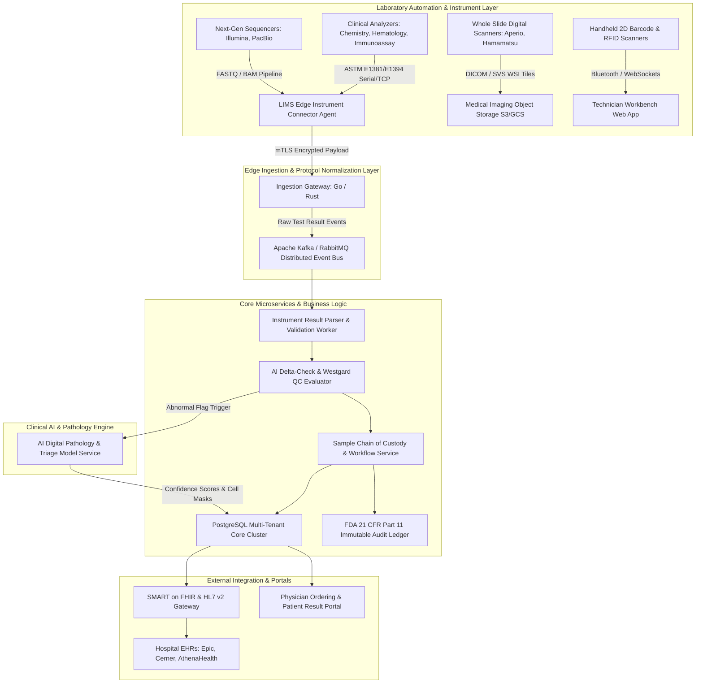
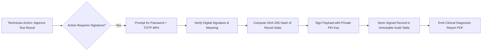
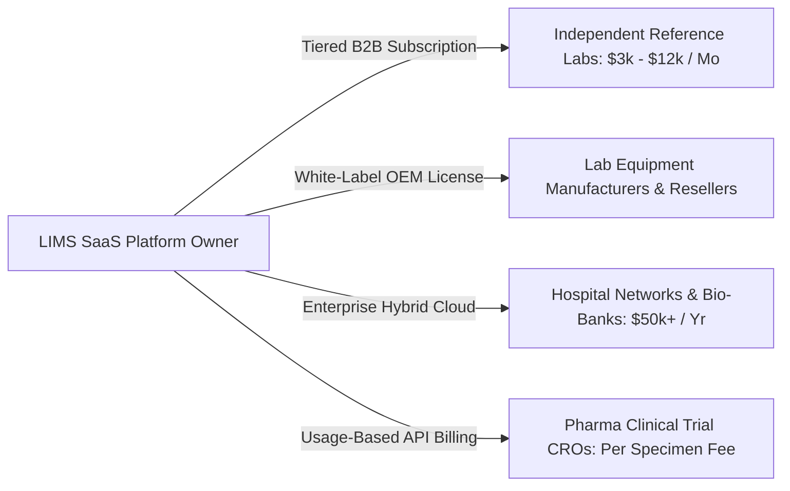

Are you planning to build an enterprise **AI-powered Laboratory Information Management System (LIMS)**, engineer a modern **clinical diagnostics SaaS platform**, or develop a custom **FDA 21 CFR Part 11 and CLIA/CAP compliant laboratory workflow engine** in 2026?

Clinical diagnostics laboratories, molecular testing facilities, pathology centers, and biopharma research institutions are the frontline engines of modern precision medicine. Every day, reference laboratories process millions of biological specimens—blood, tissue biopsies, saliva, and genetic assays. Yet, behind the scenes, lab directors, pathologists, and laboratory technicians are trapped in outdated legacy software: clunky on-premise client-server LIMS architectures, manual paper requisitions, fragmented instrument data handoffs, brittle serial cable drivers, and slow, error-prone manual result verification.

In 2026, the diagnostic industry is rapidly transitioning to **AI-Native, Cloud-First LIMS 3.0 SaaS Platforms**. These next-generation laboratory systems combine sub-second bi-directional instrument interfacing (ASTM E1381/E1394, HL7, and FHIR), high-density 2D DataMatrix and RFID cryogenic sample tracking, immutable cryptographic audit trails for FDA 21 CFR Part 11 compliance, automated Westgard multi-rule quality control (QC), and deep learning computer vision for digital pathology and hematology triage.

Here is the comprehensive engineering blueprint, protocol mechanics, multi-tenant database schema, instrument integration pipeline, and commercial roadmap for architecting a scalable, enterprise-grade AI Laboratory Information Management System (LIMS) SaaS platform in 2026.


---

## The 2026 Paradigm: Why Legacy LIMS Platforms Fail

For decades, the LIMS market has been dominated by monolithic, on-premise software suites developed in the early 2000s. While these legacy systems store basic test catalogs, their archaic architectures create massive operational friction, dangerous turnaround delays, and severe compliance liabilities.

### Critical Bottlenecks of Legacy Laboratory Software:

1. **Monolithic On-Premise Silos & High TCO:** Legacy LIMS require dedicated on-site database servers, complex VPNs for remote pathologist access, and expensive manual on-premise upgrades that cause extended laboratory downtime.
2. **Brittle, Unidirectional Instrument Interfacing:** Older LIMS rely on one-way RS-232 serial scrapers or batch CSV drop folders. When modern high-throughput analyzers (such as Roche Cobas, Beckman Coulter, or Illumina sequencers) generate real-time raw test results, legacy systems fail to handle backpressure, causing dropped result packets and manual transcription errors.
3. **Fragmented Sample Chain of Custody:** Tracking specimens across multiple freezers (-80°C ultra-low, liquid nitrogen cryo-tanks), microplate wells (96/384-well formats), centrifuges, and aliquoting stations is frequently done on handwritten paper logs, creating specimen misplacement and sample contamination risks.
4. **Non-Compliant or Tamperable Audit Trails:** Regulatory bodies (FDA, CLIA, CAP, ISO 15189) require strict tracking of who performed, modified, or approved every test result. Legacy systems lack immutable, cryptographically signed audit logs and multi-factor electronic signatures required under FDA 21 CFR Part 11.
5. **Absence of Real-Time AI Quality Control & Triage:** Pathologists and lab techs must manually review thousands of normal, negative test results line-by-line. Without automated AI delta-checking (comparing patient historical baselines) and automated image classification, critical abnormal specimens (such as acute leukemia blasts or malignant biopsies) sit in the queue for hours.

### The 2026 Standard: Unified AI-Native LIMS 3.0

* **Universal Bi-Directional Protocol Gateway:** High-throughput instrument ingestion engine supporting ASTM E1381/E1394, HL7 v2.5.1 (ORU^R01 / OML^O21), and SMART on FHIR REST APIs.
* **Micro-Spatial Cryogenic Sample Management:** Full 3D visual mapping of lab storage hierarchies (Room &rarr; Freezer &rarr; Shelf &rarr; Rack &rarr; 96-Well Box &rarr; Coordinate [A1..H12]) with 2D DataMatrix scanning and RFID tracking.
* **FDA 21 CFR Part 11 Cryptographic Audit Engine:** Append-only SHA-256 hash-chained audit trails, strict dual-custody electronic signatures (PKI / TOTP), and automated versioning for every test requisition and result modification.
* **AI Delta Checks & Autonomous QC Rules:** Machine learning anomaly detection flags implausible physiological jumps, while automated Westgard multi-rule algorithms detect analyzer calibration drifts in real time.
* **Digital Pathology & Computer Vision Triage:** Integrated Whole Slide Imaging (WSI) viewers with DICOM WADO-RS streaming and deep learning cell segmentation models (YOLO / Vision Transformers) prioritizing urgent malignant cases for immediate pathologist review.
* **Cloud-Native Multi-Tenant Architecture:** Secure multi-facility isolation, zero-trust role-based access control (RBAC), and automated EHR/EMR bidirectional interfaces (Epic, Cerner, athenahealth, eClinicalWorks).

---

## Technical Architecture of an Enterprise Multi-Tenant LIMS SaaS

Building a modern LIMS requires a resilient, event-driven distributed architecture capable of ingesting raw telemetry and test results from hundreds of medical analyzers concurrently while maintaining zero-loss durability and sub-second UI responsiveness.



### Architectural Breakdown:

1. **LIMS Edge Instrument Connector Agent:** Lightweight Go/Rust daemon deployed on local laboratory network PCs that bridges physical COM ports (RS-232), USB-to-serial adapters, and LAN TCP sockets directly to the cloud via secure mTLS WebSocket tunnels.
2. **Distributed Message Bus (Kafka / RabbitMQ):** Buffers incoming instrument result streams, preventing backpressure bottlenecks during morning peak sample run times.
3. **Automated Delta-Check & Westgard QC Worker:** Evaluates each incoming analyte against patient historical distributions and active control charts (1-2s, 1-3s, 2-2s, R-4s, 4-1s, 10x rules) before auto-verifying results.
4. **FDA 21 CFR Part 11 Audit Ledger:** Append-only cryptographic ledger storing previous value, new value, user ID, timestamp, IP address, and digital signature hash for every record mutation.
5. **DICOM WSI Tile Streaming:** High-performance tiling server converting multi-gigabyte Whole Slide Images (.svs, .ndpi, .tiff) into interactive zoomable deep-zoom pyramid tiles via WebGL and OpenSeadragon.

---

## Bi-Directional Instrument Interfacing: ASTM & HL7 Deep Dive

A key differentiator of an enterprise LIMS is seamless **bi-directional analyzer communication**. In a bi-directional workflow:
1. **Host-Query (Worklist Download):** When a technician racks a barcoded blood tube into the analyzer, the analyzer scans the barcode and queries the LIMS: *"What tests are ordered for Sample #S-89241?"*
2. **Order Transmission:** The LIMS responds with the specific test panel (e.g., CBC with Differential, Lipid Panel, HbA1c).
3. **Result Upload:** The analyzer runs the tests and streams the quantitative results, reference ranges, and error flags back to the LIMS.

### ASTM E1381 / E1394 Protocol Message Specification

The ASTM standard defines character-framed serial/TCP communications utilizing low-level control characters (`<STX>`, `<ETX>`, `<CR>`, `<LF>`, `<ACK>`, `<NAK>`, `<EOT>`).

```
[Analyzer -> LIMS Host Query]
<ENQ>
<ACK>
<STX>1H|\^&|||Analyzer_Cobas6000||||||||E1394-97<CR><ETX>4B<CR><LF>
<ACK>
<STX>2Q|1|^SAMPLE-89241||ALL||||||||O<CR><ETX>6A<CR><LF>
<ACK>
<STX>3L|1|N<CR><ETX>06<CR><LF>
<ACK>
<EOT>

[LIMS -> Analyzer Order Response]
<ENQ>
<ACK>
<STX>1H|\^&|||TodayInTech_LIMS||||||||E1394-97<CR><ETX>5F<CR><LF>
<ACK>
<STX>2P|1||PAT-10492||DOE^JANE||19840512|F<CR><ETX>92<CR><LF>
<ACK>
<STX>3O|1|SAMPLE-89241||^^^GLU\^^^HBA1C|R||||||A||||SERUM<CR><ETX>3D<CR><LF>
<ACK>
<STX>4L|1|N<CR><ETX>07<CR><LF>
<ACK>
<EOT>
```

### Protocol Comparison for Diagnostics Systems:

| Protocol Standard | Communication Layer | Typical Instruments | Primary Data Payload | Integration Complexity |
| :--- | :--- | :--- | :--- | :--- |
| **ASTM E1381 / E1394** | RS-232 Serial / Raw TCP Sockets | Chemistry, Hematology, Urinalysis Analyzers | Frame-based records (H, P, O, R, Q, L) with checksums | High (Low-level byte framing & timing constraints) |
| **HL7 v2.5.1 (ORU / OML)** | MLLP (Minimal Lower Layer Protocol) / TCP | High-throughput Reference Lab Analyzers, Hospital Bridges | Pipe-delimited segments (MSH, PID, OBR, OBX) | Medium (Standardized clinical messaging) |
| **HL7 FHIR (R4 / R5)** | HTTP REST / JSON | Modern Cloud Diagnostic Platforms, Point-of-Care Devices | Resource objects (DiagnosticReport, Observation, Specimen) | Low (Developer-friendly RESTful JSON) |
| **DICOM / WADO-RS** | HTTP / HTTPS Web Services | Digital Pathology Slide Scanners, Radiology Systems | Binary multi-resolution tile pyramids with metadata | High (Large file streaming & image cache management) |

---

## Sample Chain of Custody & Cryogenic Inventory Architecture

Specimen integrity is paramount in clinical diagnostics. A single mislabeled tube or thawed biopsy can invalidate clinical trials or misdiagnose a patient.

### 1. Multi-Tier Micro-Spatial Storage Modeling

A robust LIMS models laboratory physical storage down to coordinate-level precision:
* **Facility Level:** Central Reference Lab (Boston Campus)
* **Room / Zone:** Cleanroom Bio-Bank 4B
* **Appliance:** Ultra-Low -80°C Freezer (Unit #FRZ-08)
* **Section / Shelf:** Shelf 3 &rarr; Drawer 2
* **Storage Unit:** 96-Well CryoBox Matrix (ID: CBX-40192)
* **Grid Coordinate:** Row D, Column 7 (`D07`)

### 2. Barcoding & RFID Tracking Standards

* **2D DataMatrix (ECC 200):** Laser-etched directly onto 0.5ml–2.0ml cryogenic tube bases for high-density robotic camera rack decoders (reading an entire 96-tube rack in under 2 seconds).
* **Code 128 / GS1-128:** Linear barcodes for secondary tube labels, patient requisition forms, and transport bags.
* **RFID UHF Inlays:** Integrated into sample transport coolers and high-value biobank cassettes for automated door-portal check-ins and temperature logging.

---

## Regulatory Compliance: FDA 21 CFR Part 11 & CLIA/CAP Blueprint

Deploying a LIMS in commercial diagnostic and clinical trial environments requires strict adherence to global regulatory standards:



### Key Regulatory Pillars:

1. **FDA 21 CFR Part 11 Compliance:**
   * **Electronic Signatures:** Must include printed name, date/time, and signature meaning (e.g., *Reviewer*, *Approver*, *Authorizing Pathologist*).
   * **Dual Identification:** Initial signature requires username and password; subsequent immediate signatures require password or cryptographic biometrics/TOTP.
   * **Computer-Generated Audit Trails:** Secure, timestamped, operator-independent audit trails that record the date and time of operator entries and actions that create, modify, or delete electronic records.
2. **CLIA (Clinical Laboratory Improvement Amendments) & CAP Standards:**
   * **Personnel Competency Tracking:** Restricts test approval workflows based on active certifications and annual competency assessments.
   * **Reference Range Management:** Age, sex, and gestational age-specific normal ranges with automated abnormal high/low (`H`/`L`) and critical panic (`HH`/`LL`) alerts.
   * **Reagent Lot & Expiration Control:** Blocks test execution if the assigned reagent lot is expired or failed daily quality control calibration.

---

## AI-Assisted Clinical Triage & Automated Quality Control

Modern AI transforms LIMS from a passive database into an active, intelligent diagnostic co-pilot.

### 1. Automated Westgard Multirule QC Engine

Laboratories run quality control (QC) samples daily. The LIMS evaluates control results against historical means ($\mu$) and standard deviations ($\sigma$):
* **$1_{3s}$ Rule:** A single run value exceeds $\mu \pm 3\sigma$ &rarr; Immediate rejection of analytical run.
* **$2_{2s}$ Rule:** Two consecutive control values exceed $\mu + 2\sigma$ or $\mu - 2\sigma$ &rarr; Rejection (detects systematic error/shift).
* **$R_{4s}$ Rule:** One control value exceeds $\mu + 2\sigma$ and another exceeds $\mu - 2\sigma$ (range $> 4\sigma$) &rarr; Rejection (detects random error).
* **$10_x$ Rule:** 10 consecutive control observations fall on one side of the mean &rarr; Maintenance alert (detects instrument bias).

### 2. AI Delta-Checking & Physiological Plausibility

Machine learning regression models analyze a patient's historical analyte timeline. If a patient's Potassium jumps from 4.1 mEq/L to 7.2 mEq/L within 3 hours without a corresponding diagnosis, the AI flags a high probability of **hemolyzed in vitro specimen error** or IV fluid contamination, prompting an automated reflex re-draw request before incorrect numbers reach the ordering physician.

---

## Production Multi-Tenant PostgreSQL Schema DDL

Below is the production-ready SQL database schema for an enterprise, multi-tenant LIMS platform supporting spatial inventory, ASTM test orders, and FDA 21 CFR Part 11 immutable audit logging:

```sql
-- Enable necessary extensions
CREATE EXTENSION IF NOT EXISTS "uuid-ossp";
CREATE EXTENSION IF NOT EXISTS "pgcrypto";

-- 1. Tenant Organizations (Diagnostic Labs, Reference Networks)
CREATE TABLE tenants (
    id UUID PRIMARY KEY DEFAULT uuid_generate_v4(),
    slug VARCHAR(64) UNIQUE NOT NULL,
    organization_name VARCHAR(255) NOT NULL,
    clia_number VARCHAR(32) NOT NULL,
    cap_accreditation_number VARCHAR(32),
    fda_facility_id VARCHAR(64),
    is_active BOOLEAN DEFAULT TRUE NOT NULL,
    created_at TIMESTAMPTZ DEFAULT NOW() NOT NULL
);

-- 2. Laboratory Storage Hierarchy (Cryo Inventory)
CREATE TABLE storage_locations (
    id UUID PRIMARY KEY DEFAULT uuid_generate_v4(),
    tenant_id UUID NOT NULL REFERENCES tenants(id) ON DELETE CASCADE,
    parent_id UUID REFERENCES storage_locations(id),
    name VARCHAR(128) NOT NULL,
    location_type VARCHAR(32) NOT NULL, -- 'FACILITY', 'ROOM', 'FREEZER', 'SHELF', 'RACK', 'BOX'
    temperature_celsius NUMERIC(5, 2), -- e.g. -80.00, -196.00 (Liquid N2)
    grid_rows INT,                     -- e.g. 8 (A-H)
    grid_columns INT,                  -- e.g. 12 (1-12)
    created_at TIMESTAMPTZ DEFAULT NOW() NOT NULL
);

-- 3. Diagnostic Analyzers / Instruments
CREATE TABLE instruments (
    id UUID PRIMARY KEY DEFAULT uuid_generate_v4(),
    tenant_id UUID NOT NULL REFERENCES tenants(id) ON DELETE CASCADE,
    instrument_name VARCHAR(128) NOT NULL,
    manufacturer VARCHAR(128) NOT NULL,
    model_number VARCHAR(64) NOT NULL,
    serial_number VARCHAR(128) NOT NULL,
    protocol_type VARCHAR(32) NOT NULL, -- 'ASTM_E1394', 'HL7_V25', 'FHIR_REST', 'REST_JSON'
    ip_address INET,
    port INT,
    status VARCHAR(32) DEFAULT 'ONLINE' NOT NULL, -- 'ONLINE', 'MAINTENANCE', 'ERROR', 'CALIBRATING'
    last_ping_at TIMESTAMPTZ,
    created_at TIMESTAMPTZ DEFAULT NOW() NOT NULL
);

-- 4. Clinical Specimens / Samples
CREATE TABLE specimens (
    id UUID PRIMARY KEY DEFAULT uuid_generate_v4(),
    tenant_id UUID NOT NULL REFERENCES tenants(id) ON DELETE CASCADE,
    accession_number VARCHAR(64) UNIQUE NOT NULL, -- Unique Barcode ID (e.g. ACC-2026-0903-8491)
    patient_identifier VARCHAR(128) NOT NULL,     -- MRN or Encrypted Patient UUID
    sample_type VARCHAR(64) NOT NULL,             -- 'SERUM', 'PLASMA_EDTA', 'WHOLE_BLOOD', 'BIOPSY_TISSUE'
    collection_datetime TIMESTAMPTZ NOT NULL,
    received_datetime TIMESTAMPTZ DEFAULT NOW() NOT NULL,
    storage_location_id UUID REFERENCES storage_locations(id),
    storage_row VARCHAR(4),                       -- e.g. 'D'
    storage_column INT,                           -- e.g. 7
    status VARCHAR(32) DEFAULT 'RECEIVED' NOT NULL, -- 'COLLECTED', 'RECEIVED', 'PROCESSING', 'ANALYSED', 'DISPOSED'
    aliquot_parent_id UUID REFERENCES specimens(id),
    metadata JSONB DEFAULT '{}'::jsonb NOT NULL,
    created_at TIMESTAMPTZ DEFAULT NOW() NOT NULL
);

-- 5. Diagnostic Test Orders & Results
CREATE TABLE test_orders (
    id UUID PRIMARY KEY DEFAULT uuid_generate_v4(),
    tenant_id UUID NOT NULL REFERENCES tenants(id) ON DELETE CASCADE,
    specimen_id UUID NOT NULL REFERENCES specimens(id) ON DELETE CASCADE,
    test_code VARCHAR(32) NOT NULL,               -- LOINC Code or internal test code (e.g. 'GLU', 'HBA1C')
    test_name VARCHAR(128) NOT NULL,
    assigned_instrument_id UUID REFERENCES instruments(id),
    status VARCHAR(32) DEFAULT 'PENDING' NOT NULL, -- 'PENDING', 'RUNNING', 'PRELIMINARY', 'VERIFIED', 'REJECTED'
    priority VARCHAR(16) DEFAULT 'ROUTINE' NOT NULL, -- 'STAT', 'ROUTINE', 'URGENT'
    ordered_by VARCHAR(128) NOT NULL,
    created_at TIMESTAMPTZ DEFAULT NOW() NOT NULL
);

CREATE TABLE test_results (
    id UUID PRIMARY KEY DEFAULT uuid_generate_v4(),
    tenant_id UUID NOT NULL REFERENCES tenants(id) ON DELETE CASCADE,
    test_order_id UUID NOT NULL REFERENCES test_orders(id) ON DELETE CASCADE,
    analyte_name VARCHAR(64) NOT NULL,
    numeric_value NUMERIC(12, 4),
    text_value VARCHAR(255),
    units VARCHAR(32),                            -- e.g. 'mg/dL', 'mmol/L', 'g/dL'
    reference_low NUMERIC(12, 4),
    reference_high NUMERIC(12, 4),
    flag VARCHAR(16),                             -- 'NORMAL', 'HIGH', 'LOW', 'CRITICAL_HIGH', 'CRITICAL_LOW'
    ai_delta_check_passed BOOLEAN DEFAULT TRUE,
    ai_delta_score NUMERIC(5, 4),
    instrument_raw_payload TEXT,
    verified_by_user_id UUID,
    verified_at TIMESTAMPTZ,
    created_at TIMESTAMPTZ DEFAULT NOW() NOT NULL
);

-- 6. FDA 21 CFR Part 11 Immutable Cryptographic Audit Log
CREATE TABLE audit_log_ledger (
    id BIGSERIAL PRIMARY KEY,
    tenant_id UUID NOT NULL REFERENCES tenants(id),
    record_table VARCHAR(64) NOT NULL,
    record_id UUID NOT NULL,
    action_type VARCHAR(16) NOT NULL,             -- 'INSERT', 'UPDATE', 'DELETE', 'SIGN', 'VERIFY'
    previous_state JSONB,
    new_state JSONB NOT NULL,
    performed_by_user_id UUID NOT NULL,
    user_name VARCHAR(128) NOT NULL,
    user_role VARCHAR(64) NOT NULL,
    signature_meaning VARCHAR(64),                -- 'AUTHOR_APPROVAL', 'PATHOLOGIST_SIGNOFF', 'QC_VERIFICATION'
    ip_address INET NOT NULL,
    client_timestamp TIMESTAMPTZ NOT NULL,
    server_timestamp TIMESTAMPTZ DEFAULT NOW() NOT NULL,
    previous_entry_hash VARCHAR(64),              -- SHA-256 Chain
    current_entry_hash VARCHAR(64) NOT NULL       -- SHA-256 Hash of this entire row payload
);

-- Indices for high-performance retrieval
CREATE INDEX idx_specimens_accession ON specimens(tenant_id, accession_number);
CREATE INDEX idx_specimens_storage ON specimens(storage_location_id);
CREATE INDEX idx_test_orders_status ON test_orders(tenant_id, status);
CREATE INDEX idx_audit_log_record ON audit_log_ledger(record_table, record_id);
```

---

## Core Microservice: ASTM Parser & FDA 21 CFR Part 11 Signature Engine

Here is a production-grade Python asynchronous microservice implementation that parses incoming ASTM analyzer test result frames, validates frame checksums, and signs records into the cryptographic audit trail:

```python
"""
LIMS ASTM Protocol Ingestion & FDA 21 CFR Part 11 Audit Signing Worker
TodayInTech Enterprise Laboratory Software Architecture (2026)
"""

import asyncio
import hashlib
import json
from datetime import datetime, timezone
from typing import Dict, Any, List, Optional
from pydantic import BaseModel, Field


class ASTMFrameResult(BaseModel):
    frame_number: int
    record_type: str  # 'H', 'P', 'O', 'R', 'Q', 'L'
    data_fields: List[str]
    checksum: str
    is_valid_checksum: bool


class TestResultPayload(BaseModel):
    accession_number: str
    test_code: str
    analyte: str
    value: float
    units: str
    flag: str
    instrument_id: str
    raw_frame: str


class ASTMProtocolEngine:
    """Parses ASTM E1381/E1394 streaming bytes from laboratory clinical analyzers."""

    STX = b'\x02'
    ETX = b'\x03'
    ETB = b'\x17'
    CR = b'\r'
    LF = b'\n'

    @staticmethod
    def calculate_astm_checksum(data_bytes: bytes) -> str:
        """Calculates modulo 256 sum expressed as 2-character hex."""
        total = sum(data_bytes) % 256
        return f"{total:02X}"

    def parse_frame(self, raw_frame_bytes: bytes) -> Optional[ASTMFrameResult]:
        """
        Parses an ASTM frame: <STX>[FrameNumber][Data]<CR><ETX>[Checksum]<CR><LF>
        """
        try:
            if not raw_frame_bytes.startswith(self.STX):
                return None

            stx_idx = raw_frame_bytes.find(self.STX)
            etx_idx = raw_frame_bytes.find(self.ETX)
            if etx_idx == -1:
                etx_idx = raw_frame_bytes.find(self.ETB)

            if etx_idx == -1:
                return None

            # Bytes contributing to checksum include Frame# through ETX
            content_to_check = raw_frame_bytes[stx_idx + 1: etx_idx + 1]
            extracted_checksum = raw_frame_bytes[etx_idx + 1: etx_idx + 3].decode('ascii')
            computed_checksum = self.calculate_astm_checksum(content_to_check)

            is_valid = extracted_checksum.upper() == computed_checksum.upper()

            # Extract fields
            frame_body = content_to_check[:-1].decode('ascii', errors='replace')  # Strip ETX/CR
            frame_num = int(frame_body[0]) if frame_body and frame_body[0].isdigit() else 0
            record_str = frame_body[1:] if frame_body and frame_body[0].isdigit() else frame_body

            fields = record_str.split('|')
            record_type = fields[0] if fields else ''

            return ASTMFrameResult(
                frame_number=frame_num,
                record_type=record_type,
                data_fields=fields,
                checksum=extracted_checksum,
                is_valid_checksum=is_valid
            )
        except Exception as err:
            print(f"[ASTM Parser Error] Failed to parse frame: {err}")
            return None


class AuditSigner21CFR11:
    """Maintains immutable SHA-256 hash chains for 21 CFR Part 11 compliance."""

    def __init__(self, last_hash: str = "GENESIS_HASH_00000000000000000000"):
        self.last_hash = last_hash

    def sign_audit_entry(
        self,
        tenant_id: str,
        table_name: str,
        record_id: str,
        action: str,
        previous_state: Optional[Dict[str, Any]],
        new_state: Dict[str, Any],
        user_id: str,
        user_name: str,
        signature_meaning: str,
        ip_address: str
    ) -> Dict[str, Any]:
        timestamp = datetime.now(timezone.utc).isoformat()

        entry_payload = {
            "tenant_id": tenant_id,
            "table_name": table_name,
            "record_id": record_id,
            "action": action,
            "previous_state": previous_state,
            "new_state": new_state,
            "user_id": user_id,
            "user_name": user_name,
            "signature_meaning": signature_meaning,
            "ip_address": ip_address,
            "timestamp": timestamp,
            "previous_hash": self.last_hash
        }

        # Compute deterministic SHA-256 hash
        serialized = json.dumps(entry_payload, sort_keys=True)
        current_hash = hashlib.sha256(serialized.encode('utf-8')).hexdigest()

        entry_payload["current_hash"] = current_hash
        self.last_hash = current_hash  # Advance chain

        return entry_payload


# Example Execution Demonstration
if __name__ == "__main__":
    engine = ASTMProtocolEngine()
    signer = AuditSigner21CFR11()

    # Raw ASTM Result line from automated analyzer
    raw_sample = b"\x022R|1|^^^GLU^Glucose|104.5|mg/dL|70-99|H||F|||20260903103000\r\x038E\r\n"
    parsed = engine.parse_frame(raw_sample)

    if parsed and parsed.is_valid_checksum:
        print(f"-> ASTM Parsed successfully! Type: {parsed.record_type}")
        print(f"   Analyte: {parsed.data_fields[2]} | Value: {parsed.data_fields[3]} {parsed.data_fields[4]} | Flag: {parsed.data_fields[6]}")

        # Sign result into 21 CFR Part 11 Audit Trail
        audit_entry = signer.sign_audit_entry(
            tenant_id="e2b10948-5221-4f12-8822-89241bba1044",
            table_name="test_results",
            record_id="c9401292-8411-4f32-bb91-019481284910",
            action="VERIFY_RESULT",
            previous_state={"status": "PENDING_VERIFICATION"},
            new_state={"status": "VERIFIED", "value": 104.5, "flag": "HIGH"},
            user_id="usr_pathologist_4821",
            user_name="Dr. Marcus Vance, MD",
            signature_meaning="PATHOLOGIST_FINAL_SIGNOFF",
            ip_address="192.168.10.45"
        )
        print(f"-> 21 CFR Part 11 Audit Hash Chain Generated: {audit_entry['current_hash']}")
```

---

## Business Model, White-Label Reseller Strategy & ROI for Labs

Building and commercializing a modern LIMS SaaS provides exceptionally sticky enterprise ARR (Annual Recurring Revenue) with zero churn, as laboratories rarely switch foundational operating systems once integrated.



### 1. Revenue Monetization Models:
* **Per-Accession Tiered Pricing:** $0.25 to $1.50 per accessioned specimen processed through the platform.
* **Monthly Active Instrument Subscriptions:** $150–$400/month per active connected analyzer bridge.
* **White-Label Partner Program:** Turnkey re-brandable LIMS allowing medical equipment distributors to bundle software with chemistry/hematology analyzer leases.
* **Enterprise Hospital Add-ons:** Dedicated SMART on FHIR Epic/Cerner bi-directional integration bridges.

### 2. ROI Impact for Clinical Laboratories:
* **85% Reduction in Result Entry Latency:** Instantaneous automated ASTM results eliminate manual keyboarding.
* **Zero Lost Specimen Incidents:** Micro-spatial 2D barcode and RFID tracking guarantees 100% chain of custody traceability.
* **100% Audit Readiness:** Instant one-click PDF generation for CLIA, CAP, and FDA inspections with immutable cryptographically signed logs.

---

## Why Partner with TodayInTech to Build Your LIMS SaaS Platform

Developing a compliant, high-throughput Laboratory Information Management System requires deep clinical domain expertise, low-level hardware serial protocol mastery, and bulletproof regulatory software validation.

At **TodayInTech**, we specialize in engineering mission-critical **Healthcare SaaS, Lab Automation, and Biopharma Software Platforms**.

### The TodayInTech Advantage:
* **Zero Upfront Payment:** We engineer your fully functional LIMS prototype first. You review the architecture, live instrument simulator, and interactive UI before paying a single dollar.
* **Pre-Built Healthcare & Lab Protocol Modules:** Accelerated delivery using our tested libraries for ASTM E1381/E1394, HL7 v2.5.1 MLLP, SMART on FHIR, and DICOM Whole Slide Image viewers.
* **FDA 21 CFR Part 11 & HIPAA Compliance Architecture:** Native implementation of cryptographic audit hash chains, PKI electronic signatures, and role-based access control out of the box.
* **24/7 Dedicated Engineering Pod:** Direct collaboration with senior full-stack and biomedical software engineers.

---

## Frequently Asked Questions (FAQ)

### What is the difference between a LIMS and a LIS (Laboratory Information System)?
Historically, a **LIMS** focused on batch sample tracking in research, environmental, and biopharma labs, while a **LIS** focused on patient-centric clinical diagnostics and medical billing. In 2026, modern platforms have converged into unified **LIMS 3.0 Clinical Diagnostic Platforms** that handle both high-volume patient diagnostic testing and complex molecular biobanking workflows within a single interface.

### How does the LIMS communicate with physical analyzers over RS-232 serial ports?
TodayInTech deploys an edge agent (written in Go/Rust) on the lab's local network. The agent connects to physical serial COM ports or USB-to-RS232 bridges, parses the raw ASTM E1381/E1394 bitstream with strict checksum validation, and forwards normalized JSON payloads over an encrypted mTLS WebSocket to the cloud LIMS.

### How is FDA 21 CFR Part 11 compliance enforced in a cloud-hosted LIMS?
FDA 21 CFR Part 11 compliance is enforced through: (1) multi-factor electronic signatures requiring dual-credential confirmation before final sign-off, (2) automated append-only cryptographic audit logging with SHA-256 hash chaining, (3) strict session timeouts, and (4) immutable version history for every sample modification.

### Can the LIMS integrate bi-directionally with Epic, Cerner, and athenahealth?
Yes. TodayInTech builds bi-directional EHR interfaces using HL7 v2.5.1 (OML^O21 order entry and ORU^R01 result transmission) as well as modern SMART on FHIR REST APIs (`DiagnosticReport`, `Observation`, and `Specimen` resources) for seamless lab slip routing into hospital electronic health records.

### What is the estimated timeline to build and launch a custom LIMS MVP?
Using TodayInTech's pre-built healthcare and laboratory protocol accelerators, a production-ready LIMS MVP featuring sample accessioning, 2D barcode tracking, ASTM analyzer interfacing, and basic 21 CFR Part 11 audit trails can be delivered in **8 to 12 weeks**—with zero upfront payment required.

---

*Ready to architect your custom AI Laboratory Information Management System (LIMS) or white-label clinical diagnostics platform? [Contact TodayInTech's Healthcare Engineering Team](https://todayintech.in/contact) today for a working prototype with zero upfront financial commitment.*
