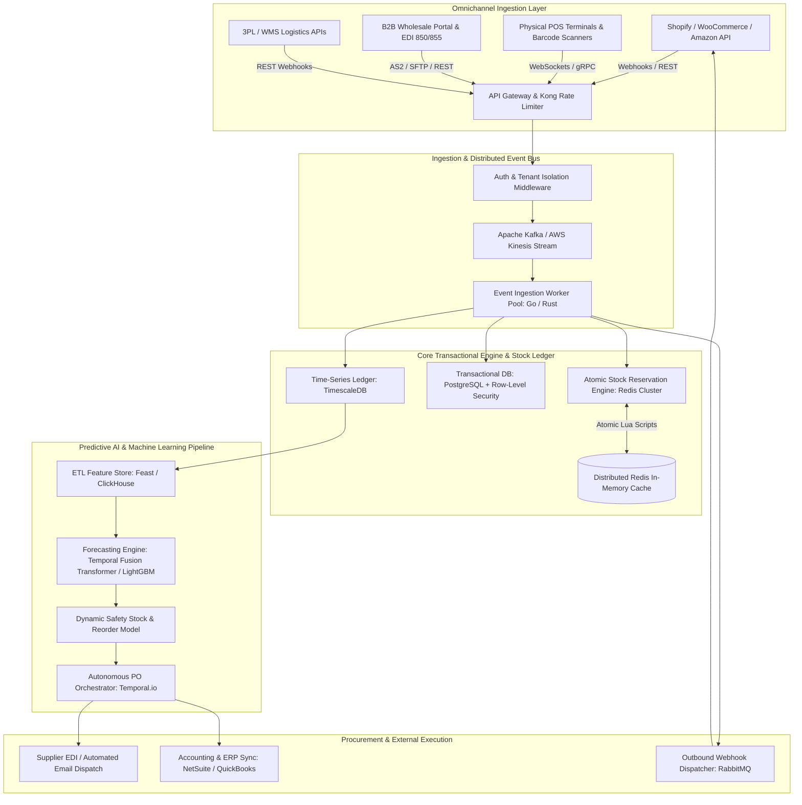
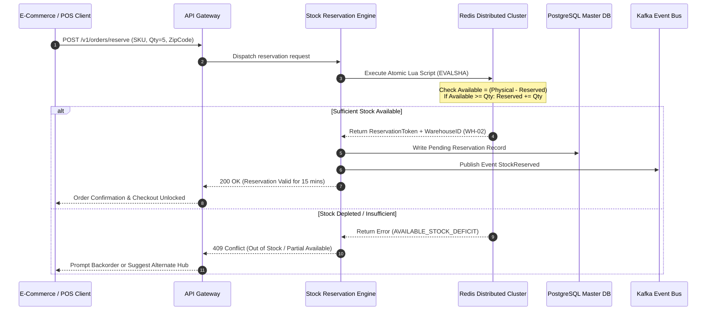
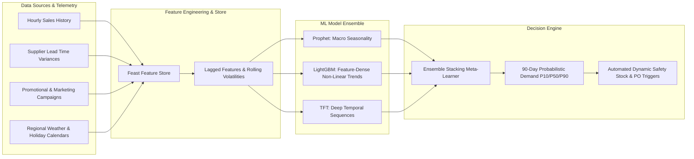

Are you building an enterprise multi-warehouse inventory SaaS, modernizing omnichannel retail supply chains, or embedding predictive stock intelligence into your B2B enterprise platform in 2026?

Modern commerce operates across distributed distribution centers, regional 3PL hubs, brick-and-mortar storefronts, and digital sales channels (Shopify, Amazon FBA, Walmart Marketplace, B2B wholesale portals). When inventory data is fragmented across disconnected systems, businesses suffer from catastrophic stockouts during demand spikes, massive capital lockup from overstocked slow-moving SKUs, and margin erosion caused by emergency split-shipments.

In 2026, leading enterprises are replacing static spreadsheet workflows and legacy ERP add-ons with **AI-Native, Event-Driven Multi-Warehouse Inventory & Supply Chain SaaS Platforms**. By pairing real-time distributed stock ledger engines with machine learning demand forecasting, automated purchase order (PO) generation, and sub-second multi-channel synchronization, modern platforms eliminate stock discrepancies and unlock 99.8% on-time fulfillment rates.

Here is the definitive engineering guide to architecting, building, and scaling an enterprise-grade AI-powered multi-warehouse inventory and supply chain SaaS in 2026.


---

## The Paradigm Shift: From Reactive Spreadsheets to Predictive AI Supply Chain Systems

Legacy inventory systems designed in the 2000s and 2010s were built around batch-processing jobs and static safety-stock formulas. They treated inventory as static numbers stored in relational tables, updated only at the end of the business day or when manual physical counts were tallied.

### Critical Failure Points of Legacy Inventory Software

1. **Batch Update Latency & Phantom Stock:** Hourly or nightly sync intervals cause "phantom stock" phenomena, where items sold out in a physical warehouse are simultaneously purchased on e-commerce storefronts, resulting in forced order cancellations and marketplace penalties.
2. **Static Min/Max Reorder Blindspots:** Traditional Min/Max threshold formulas fail to account for dynamic lead-time variability, supplier price fluctuations, hyper-local weather events, inflation trends, and viral marketing spikes.
3. **Siloed Multi-Warehouse Allocation:** Legacy tools lack intelligent geo-routing algorithms. When an order arrives, they cannot dynamically calculate the optimal fulfillment hub based on shipping carrier rates, transit times, tax jurisdictions, and warehouse labor capacities.
4. **Manual Vendor Purchase Order Hell:** Procurement teams spend hundreds of manual hours every week calculating reorder quantities in Excel, writing purchase orders by hand, and emailing suppliers.

### The 2026 Standard: AI-Native Multi-Warehouse Intelligence

* **Sub-50ms Distributed Stock Ledger:** Atomic stock reservation powered by in-memory Redis clusters with Redlock algorithms and optimistic concurrency control in PostgreSQL/TimescaleDB.
* **Temporal Fusion Transformer & Prophet ML Forecasting:** Continuous, multi-variable demand modeling that incorporates historical sales velocity, promo calendars, supply chain transit telemetry, and macroeconomic signals.
* **Autonomous PO & Reorder Orchestration:** Closed-loop procurement pipelines that automatically draft, negotiate, and submit purchase orders to suppliers when forecasted stock hits dynamic reorder triggers.
* **Omnichannel Event-Driven Connectors:** Bidirectional WebSocket and webhook pipelines synchronizing stock levels across Amazon, Shopify, POS terminals, and B2B EDI networks in real time.

> **Key Operational Benchmark:** Enterprise businesses adopting AI-native inventory forecasting report a **34% reduction in holding costs**, a **52% decrease in stockout events**, and a **90% reduction in manual procurement overhead**.

---

## Enterprise System Architecture Overview

Building a high-throughput, multi-tenant inventory SaaS requires an event-driven architecture capable of processing thousands of concurrent inventory transactions per second while maintaining strict ACID transactional consistency.



### Key Architectural Pillars

1. **API Gateway & Tenant Isolation:** Implements strict multi-tenant boundaries using JWT tokens, tenant-keyed routing, and per-tenant rate-limiting policies.
2. **Distributed Kafka Event Stream:** Decouples incoming order streams from inventory database writes. Every order, return, transfer, and adjustment is published as an immutable event to Kafka topics partitioned by `tenant_id:warehouse_id`.
3. **Atomic Redis Reservation Engine:** Utilizes atomic Lua scripts on distributed Redis clusters to guarantee zero overselling during flash sales and high-volume Black Friday traffic.
4. **Dual-Database Storage Strategy:**
   * **PostgreSQL (with Citus / RLS):** Stores master data (SKUs, suppliers, warehouse configurations, user permissions, and current aggregated inventory levels).
   * **TimescaleDB:** Maintains an append-only, high-performance ledger of every single stock movement (`INBOUND`, `RESERVED`, `PICKED`, `SHIPPED`, `RETURNED`, `DAMAGED`, `ADJUSTED`) for immutable auditability.
5. **AI Demand Forecasting Subsystem:** Runs scheduled and event-triggered inference jobs using Python/FastAPI microservices running optimized ONNX/TensorRT models.

---

## Real-Time Distributed Stock Allocation & Atomic Reservation

The hardest technical challenge in multi-warehouse software is preventing race conditions and overselling when hundreds of orders hit the same SKU across multiple sales channels simultaneously.



### Atomic Lua Script for Zero-Oversell Stock Reservation

Below is an enterprise-grade Lua script executed inside Redis to atomically verify and reserve stock across multi-warehouse nodes in under 2 milliseconds:

```lua
-- keys: [1] stock:sku_id:warehouse_id
-- args: [1] required_quantity, [2] reservation_id, [3] ttl_seconds

local key = KEYS[1]
local qty = tonumber(ARGV[1])
local res_id = ARGV[2]
local ttl = tonumber(ARGV[3])

local physical = tonumber(redis.call('HGET', key, 'physical') or '0')
local reserved = tonumber(redis.call('HGET', key, 'reserved') or '0')
local available = physical - reserved

if available >= qty then
    -- Atomically increase reserved stock
    redis.call('HINCRBY', key, 'reserved', qty)
    
    -- Store active reservation token with expiration
    local res_key = 'res:' .. res_id
    redis.call('HMSET', res_key, 'sku_wh', key, 'qty', qty)
    redis.call('EXPIRE', res_key, ttl)
    
    return {1, physical, reserved + qty, available - qty}
else
    return {0, physical, reserved, available}
end
```

---

## Machine Learning Demand Forecasting Pipeline

Traditional inventory software relies on simple 30-day moving averages (SMA). In contrast, an AI-powered SaaS utilizes hybrid time-series architectures:

| Feature Dimension | Traditional Legacy ERP | 2026 AI-Native SaaS |
| :--- | :--- | :--- |
| **Forecasting Algorithm** | Static Moving Average / Min-Max | Temporal Fusion Transformers (TFT) + LightGBM |
| **Data Inputs** | Historical internal sales only | Sales velocity, promotions, local weather, lead times, search trends |
| **Update Frequency** | Monthly or quarterly manual review | Real-time continuous inference & nightly retraining |
| **Lead Time Handling** | Fixed supplier SLA assumption | Probabilistic supplier delay distribution modeling |
| **Granularity** | Company-wide aggregate | Granular SKU × Warehouse × Sales Channel level |
| **Stockout Prevention** | Frequent stockouts or bloated safety buffers | 99.8% fulfillment SLA with 30%+ lower inventory holding capital |



### Dynamic Safety Stock & Reorder Point Formulation

Rather than static thresholds, the dynamic Reorder Point (ROP) is computed continuously using probabilistic service levels:

$$ROP = (\mu_{\text{demand}} \times \mu_{\text{lead\_time}}) + Z_{\alpha} \times \sqrt{(\mu_{\text{lead\_time}} \times \sigma^2_{\text{demand}}) + (\mu^2_{\text{demand}} \times \sigma^2_{\text{lead\_time}})}$$

Where:
* $\mu_{\text{demand}}$ and $\sigma^2_{\text{demand}}$ represent the forecasted demand mean and variance.
* $\mu_{\text{lead\_time}}$ and $\sigma^2_{\text{lead\_time}}$ capture empirical supplier fulfillment transit times and delay distributions.
* $Z_{\alpha}$ is the inverse standard normal cumulative distribution for the target service level (e.g., $Z = 2.33$ for 99% fulfillment reliability).

---

## Automated Purchase Order (PO) & Multi-Warehouse Rebalancing

When the predictive engine identifies that projected stock will cross the safety boundary within supplier lead time, the system triggers an autonomous procurement workflow managed by **Temporal.io**:

1. **Intra-Warehouse Transfer Optimization:** The system checks whether adjacent regional warehouses possess excess stock of the SKU. If transfer transit cost is cheaper than vendor reorder MOQ (Minimum Order Quantity), it creates an automated **Warehouse Transfer Order (WTO)**.
2. **Consolidated Vendor PO Generation:** If cross-dock transfer is inefficient, the system groups all low-stock SKUs from the same supplier into a single purchase order to hit vendor volume discount tiers.
3. **Automated Supplier Dispatch:** Dispatches EDI 850 (Purchase Order) or transmits encrypted PDF orders via supplier webhooks and email automation.
4. **Inbound ASN Tracking:** Listens for EDI 856 (Advance Ship Notice) to automatically schedule dock bay appointments and staff receiving shifts.

---

## Core Feature Comparison: Custom Build vs. Off-the-Shelf SaaS

| Capability | Off-The-Shelf SaaS (NetSuite / TradeGecko) | Custom Anonsoft Built Solution |
| :--- | :--- | :--- |
| **Source Code Ownership** | ❌ None (Vendor Lock-in, High SaaS Fees) | ✅ 100% Full IP & Source Code Ownership |
| **Custom AI ML Models** | ❌ Generic static rules | ✅ Custom-trained ML on your proprietary sales data |
| **Multi-Tenant White-Labeling** | ❌ Not supported | ✅ Built-in white-labeling for B2B reseller models |
| **API Customization & EDI** | ⚠️ Expensive add-on modules | ✅ Native support for any custom ERP, EDI, or 3PL API |
| **Hardware & IoT Scanners** | ⚠️ Restricted to partner hardware | ✅ Works with any Zebra, Honeywell, RFID, or mobile scanner |
| **Upfront Risk** | ❌ Heavy annual upfront commitments | ✅ **Zero Upfront Payment** (Prototype Delivered First) |

---

## Frequently Asked Questions (FAQs)

### 1. How does the multi-warehouse system handle split-shipments across different locations?
The platform utilizes an intelligent routing engine that evaluates order line items against warehouse proximity, real-time inventory counts, and real-time shipping carrier API quotes (FedEx, UPS, DHL, USPS). The system selects the allocation strategy with the lowest total fulfillment cost (balancing carrier rate vs. multi-package split fee).

### 2. Can the platform integrate with legacy ERPs like SAP, NetSuite, and Microsoft Dynamics?
Yes. Our integration tier supports REST APIs, GraphQL, Kafka event streaming, and legacy EDI protocols (EDI 850, 855, 856, 810). We provide bi-directional sync adapters that guarantee data consistency between legacy financial ledgers and modern real-time warehouse floor operations.

### 3. How does machine learning demand forecasting deal with new SKUs with zero historical sales?
For new product introductions (cold-start problem), the AI engine uses **attribute-based transfer learning**. It clusters new SKUs with historical products sharing similar attributes (category, brand, price tier, seasonal launch window) to establish baseline velocity curves until sufficient transactional telemetry is accumulated.

### 4. What tech stack is recommended for high-volume inventory SaaS applications?
We recommend:
* **Backend:** Node.js (TypeScript) / Go for core microservices; Python (FastAPI, PyTorch/LightGBM) for ML forecasting.
* **Databases:** PostgreSQL (with Citus or Row-Level Security) for transactional records; TimescaleDB for time-series stock ledgers; Redis Cluster for atomic reservations.
* **Message Broker & Workflow:** Apache Kafka for high-throughput event ingestion; Temporal.io for complex multi-step PO and fulfillment state machines.
* **Frontend:** Next.js (React), TailwindCSS, and TanStack Table for ultra-responsive warehouse floor dashboards.

### 5. How long does it take to develop a custom white-label multi-warehouse inventory platform?
With Anonsoft's battle-tested modular architecture, a production-ready MVP with real-time stock sync, multi-warehouse routing, barcode scanning, and basic demand forecasting can be deployed in **6 to 10 weeks**.

---

## Build Your AI-Powered Inventory & Supply Chain SaaS with Anonsoft

Are you ready to launch a high-performance multi-warehouse inventory SaaS, eliminate stockout risks, or build a custom B2B supply chain ERP tailored to your exact industry workflows?

At **Anonsoft**, we specialize in engineering high-throughput, enterprise-grade cloud software, AI forecasting pipelines, and custom white-label SaaS platforms.

* **Explore Our Solution:** Check out our [White-Label Inventory & Billing SaaS Platform](/projects/inventory-billing.html).
* **Zero Upfront Risk:** We build your functional working prototype first—you only pay when you are 100% satisfied.
* **Schedule a Consultation:** [Book a 30-minute Architecture Call](/bookademo/) or request a [Free Software Consultation](/free-consultation/).
