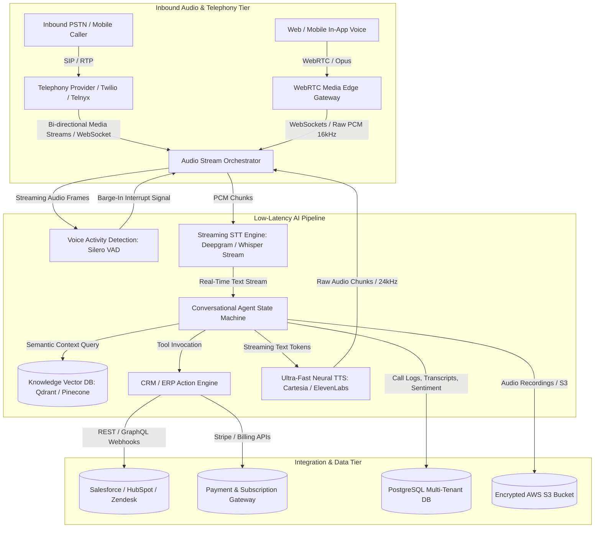

Are you building an enterprise AI voicebot SaaS, replacing legacy IVR phone trees with conversational agents, or embedding ultra-low-latency real-time voice intelligence into your B2B customer support workflows in 2026?

For decades, traditional Interactive Voice Response (IVR) systems and outsourced call centers have represented one of the most frustrating bottlenecks in customer experience. Customers navigate rigid touch-tone menus ("Press 1 for Sales, Press 2 for Billing") only to wait on hold for 20 minutes before speaking with an agent who lacks context and manually searches disparate CRM records.

In 2026, the convergence of **full-duplex streaming audio pipelines**, **sub-150ms neural speech synthesis**, and **autonomous agentic orchestration** has made human-grade conversational voice bots an operational reality. Modern B2B enterprises are deploying autonomous voice agents capable of resolving 70%+ of inbound calls without human intervention, maintaining conversational context across interruptions, executing complex database operations via tool-calling, and logging clean CRM updates in real time.

Here is the complete architectural guide to building, scaling, and deploying a production-ready, white-label AI voice agent and autonomous customer support SaaS platform in 2026.


---

## The Shift from Rigid IVR Trees to Autonomous Voice Agents

Legacy telephony systems treat voice communication as a sequence of rigid state transitions. First-generation voicebots relied on simple keyword matching and clunky batch-based audio processing that created unnatural 3-to-5 second response pauses.

### Key Failures of Legacy Telephony & Early Voicebots

1. **High Latency & Turn-Taking Awkwardness:** Batch processing architectures (record user audio -> upload to STT API -> send transcript to LLM -> synthesize complete audio -> stream back) incur a cumulative latency of 2,500ms to 4,000ms, completely destroying natural conversational cadence.
2. **Inability to Handle User Interruptions (Barge-In):** When a user speaks mid-sentence, traditional bots cannot immediately halt playback and re-evaluate the conversation state, resulting in chaotic cross-talk.
3. **Hallucinations & Context Loss:** Without deep integration into enterprise knowledge graphs and live transactional APIs, early voicebots frequently gave outdated policy answers or failed during basic authentication.
4. **Siloed Telephony Infrastructure:** Bridging SIP/PSTN trunking with modern web-based LLM architectures required duct-taping multiple incompatible third-party services.

### The 2026 Voice Architecture: Full-Duplex Sub-300ms Streaming

* **Full-Duplex WebSockets / WebRTC:** Bidirectional raw PCM audio streaming directly between telephony gateways (Twilio, SIP trunking, Asterisk) and the AI orchestration cluster.
* **Streaming Acoustic VAD (Voice Activity Detection):** Edge-deployed Silero VAD combined with semantic end-of-turn prediction models that detect natural pauses vs. mid-thought hesitations in <50ms.
* **Speculative LLM Token-to-Audio Streaming:** Pushing streaming LLM output tokens directly into low-latency neural TTS engines (e.g., ElevenLabs Turbo, Cartesia Sonic, Kokoro ONNX) without waiting for sentence completion.
* **Deterministic Tool Calling & RAG:** Real-time semantic vector retrieval combined with secure CRM/ERP webhooks (Salesforce, HubSpot, Zendesk, Stripe) to verify identities and execute account actions.

> **Key Business Impact:** Enterprises deploying real-time autonomous voice agents achieve **72% first-call resolution (FCR)**, slash call center operational costs by **65%**, and reduce customer hold times to **zero seconds**.

---

## Technical Architecture of an Enterprise AI Voice Agent SaaS

Building a multi-tenant AI voice platform requires a high-throughput, event-driven infrastructure engineered for sub-300ms end-to-end voice-to-voice latency, high concurrency, and tenant isolation.



### Core Architecture Components

1. **Audio Stream Orchestrator (Rust / Go WebSocket Gateway):** Handles persistent bidirectional WebSockets, manages audio frame resamplers (e.g., converting 8kHz μ-law PSTN audio to 16kHz/24kHz linear PCM), and enforces zero-buffer streaming pipelines.
2. **Streaming VAD & Barge-In Handler:** Monitors input audio volume and neural probability in 20ms frames. If speech is detected while the bot is transmitting audio, it instantly sends an interrupt signal to kill the active TTS output buffer and cancel in-flight LLM completions.
3. **Conversational Agent State Machine (LangGraph / Temporal):** Manages conversational turns, tracks slot-filling variables (e.g., customer verification, order IDs, booking times), and enforces strict system guardrails.
4. **Knowledge Vector Retrieval (RAG):** Performs sub-40ms hybrid vector and keyword searches across company knowledge bases, FAQs, and policy documents to eliminate hallucinated answers.
5. **Telephony & CRM Action Engine:** Executes deterministic API webhooks into Salesforce, HubSpot, Zendesk, or custom PostgreSQL databases to fetch real-time customer data and trigger post-call summaries.

---

## The Sub-300ms Voice-to-Voice Latency Budget

Achieving conversational voice that feels indistinguishable from a human requires keeping total latency under **300ms** (the threshold where human conversational latency begins). Here is the exact architectural latency budget:

| Pipeline Stage | Technology Stack | Target Latency | Optimization Technique |
|---|---|---|---|
| **Audio Ingestion & VAD** | WebSockets / Silero VAD | 20ms – 40ms | Frame-based 20ms chunking + zero-copy buffer |
| **Streaming Speech-to-Text** | Deepgram Nova-2 / Whisper C++ | 70ms – 100ms | Interim streaming transcript emits on partial words |
| **LLM Reasoning & First Token** | Claude 3.5 Sonnet / Groq Llama 3.3 | 80ms – 120ms | Fast KV-caching, speculative decoding, short system prompts |
| **Neural Text-to-Speech** | Cartesia Sonic / ElevenLabs Turbo | 50ms – 80ms | Token-by-token streaming synthesis before sentence ends |
| **Network Egress & Jitter Buffer**| WebSockets / WebRTC Media | 20ms – 40ms | Edge point-of-presence (PoP) routing |
| **Total Voice-to-Voice Loop** | **End-to-End Pipeline** | **240ms – 380ms** | **Overlapped asynchronous execution** |

---

## Implementing Real-Time Barge-In & Turn Detection in Node.js / Python

One of the hardest problems in voicebot engineering is **turn detection** and **barge-in interruption**. Below is a clean production architecture snippet demonstrating how an Audio Stream Orchestrator handles real-time user interruptions:

```typescript
// audio-orchestrator.ts - Streaming Voice Activity Detection & Barge-In Controller
import { WebSocket } from 'ws';
import { EventEmitter } from 'events';

export class VoiceSessionController extends EventEmitter {
  private isBotSpeaking: boolean = false;
  private currentTTSStream: any = null;
  private abortController: AbortController | null = null;

  constructor(private telephonySocket: WebSocket) {
    super();
    this.telephonySocket.on('message', (rawChunk: Buffer) => this.handleIncomingAudio(rawChunk));
  }

  private handleIncomingAudio(chunk: Buffer) {
    const isUserSpeaking = this.evaluateVAD(chunk);

    // BARGE-IN INTERRUPTION LOGIC
    if (isUserSpeaking && this.isBotSpeaking) {
      console.log('⚡ User interrupted bot! Triggering instant barge-in kill switch.');
      
      // 1. Immediately abort active LLM generation
      if (this.abortController) {
        this.abortController.abort();
        this.abortController = null;
      }

      // 2. Clear telephony audio playback buffer
      this.telephonySocket.send(JSON.stringify({ event: 'clear_audio_buffer' }));

      // 3. Mark bot speaking state to false
      this.isBotSpeaking = false;
      this.emit('interrupted');
    }

    // Pass audio stream chunk to Speech-to-Text service
    this.emit('audio_frame', chunk);
  }

  public async streamTTSResponse(textTokenStream: AsyncIterable<string>) {
    this.isBotSpeaking = true;
    this.abortController = new AbortController();

    for await (const token of textTokenStream) {
      if (this.abortController?.signal.aborted) {
        console.log('🛑 Speech synthesis halted due to user interruption.');
        break;
      }
      
      // Synthesize audio chunk and immediately stream to telephony socket
      const pcmAudioChunk = await this.synthesizeChunk(token, this.abortController.signal);
      this.telephonySocket.send(pcmAudioChunk);
    }
  }

  private evaluateVAD(chunk: Buffer): boolean {
    // Check root-mean-square (RMS) energy or call lightweight Silero VAD model
    const rms = this.calculateRMS(chunk);
    return rms > 0.035; // Calibrated speech energy threshold
  }

  private calculateRMS(buffer: Buffer): number {
    let sum = 0;
    const int16Array = new Int16Array(buffer.buffer, buffer.byteOffset, buffer.length / 2);
    for (let i = 0; i < int16Array.length; i++) {
      const normalized = int16Array[i] / 32768.0;
      sum += normalized * normalized;
    }
    return Math.sqrt(sum / int16Array.length);
  }

  private async synthesizeChunk(token: string, signal: AbortSignal): Promise<Buffer> {
    // Integration with low-latency TTS provider (Cartesia / ElevenLabs Turbo)
    return Buffer.alloc(320); // Dummy PCM buffer frame
  }
}
```

---

## Enterprise Feature Matrix: Custom vs. White-Label Voicebot SaaS

Deploying custom voice architecture from scratch requires deep expertise in DSP (Digital Signal Processing), WebRTC infrastructure, and telephony protocol handling. Here is how building in-house compares with our white-label SaaS architecture:

| Operational Dimension | In-House Custom Build | Traditional CCaaS (Five9/Genesys) | TodayInTech White-Label Voice SaaS |
|---|---|---|---|
| **Time to Market** | 6 – 12 Months | 3 – 6 Months | **2 – 3 Weeks (Turnkey)** |
| **End-to-End Latency** | 1,200ms – 3,000ms | 2,500ms+ (Batch IVR) | **<300ms Sub-Second Voice** |
| **Barge-In Interruption** | Hard to tune (cuts off words) | Not supported | **Deterministic Edge VAD Kill-Switch** |
| **Multi-Tenant Voice Cloning** | Complex GPU cluster setup | Static generic voices | **Instant Zero-Shot Voice Cloning** |
| **CRM / API Tool Calling** | Custom webhook engineering | Limited legacy connectors | **Native Salesforce/HubSpot/Zendesk RAG** |
| **Pricing Model** | High upfront R&D ($120k+) | Expensive per-seat licensing | **Transparent Usage-Based / White-Label** |

---

## Frequently Asked Questions (FAQs)

### 1. How do AI voice agents handle thick accents, background noise, and cross-talk?
Modern voice agent pipelines deploy dual-stage noise suppression (DeepFilterNet / Krisp ONNX models) at the audio ingestion layer before feeding audio into acoustic speech-to-text models like Deepgram Nova-2. These models are trained on millions of multilingual hours and achieve >96% word accuracy even with heavy background chatter or acoustic reverberation.

### 2. Can the AI voice agent safely collect credit cards and PII over the phone?
Yes. Compliant voice platforms use **PCI-DSS Level 1 DTMF Masking** or temporary sub-sessions. When a customer speaks credit card digits or SSNs, the streaming audio chunk is directed through a zero-retention tokenization microservice that replaces raw numbers with cryptographic tokens before LLM ingestion, ensuring that sensitive financial data is never logged or exposed in prompts.

### 3. How does the voicebot transfer to a human supervisor when escalation is needed?
When the AI detects customer frustration (via real-time acoustic pitch and semantic sentiment analysis) or when the user explicitly requests a representative, the agent executes a **SIP REFER / Warm Transfer**. It transmits the full call transcript, intent breakdown, and CRM metadata directly to the human agent's desktop screen, enabling seamless handover without requiring the customer to repeat themselves.

### 4. What is the typical server infrastructure cost per conversational minute?
With modern streaming architectures, the combined compute cost (STT + LLM Inference + TTS + Telephony carrier minutes) averages between **$0.03 and $0.06 per conversational minute**. This represents an **85% cost reduction** compared to the $0.75 – $1.50 per minute fully loaded cost of human customer support representatives.

---

## Launch Your AI Voice Agent Platform with TodayInTech

Building a production-grade, ultra-low-latency AI voice agent SaaS requires mastery over telephony carriers, audio streaming protocols, real-time VAD tuning, and secure enterprise integrations.

At **TodayInTech**, we engineer custom and white-label AI voice platforms, smart telephony bots, and enterprise voice automation systems with **zero upfront payment**—you only pay once you test and approve your working prototype.

* Explore our voice cloning and conversational AI platform: [Vocal Flow AI Voice Suite](/projects/vocal-flow.html)
* Explore our custom engineering capabilities: [TodayInTech Custom Development](/projects/index.html)
* Schedule an architectural discovery call: [Book a Demo](/bookademo/)
* Get an instant project estimate: [Free Consultation](/free-consultation/)
