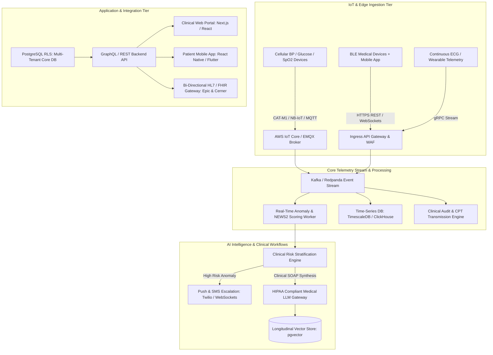
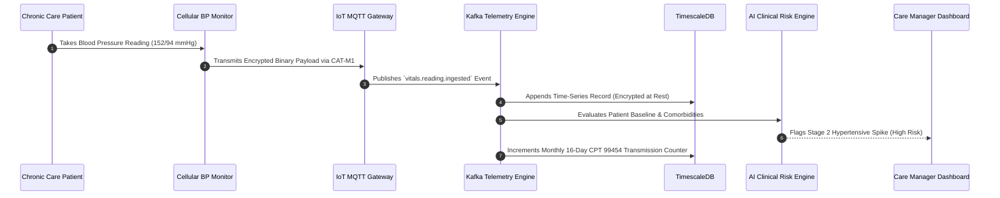
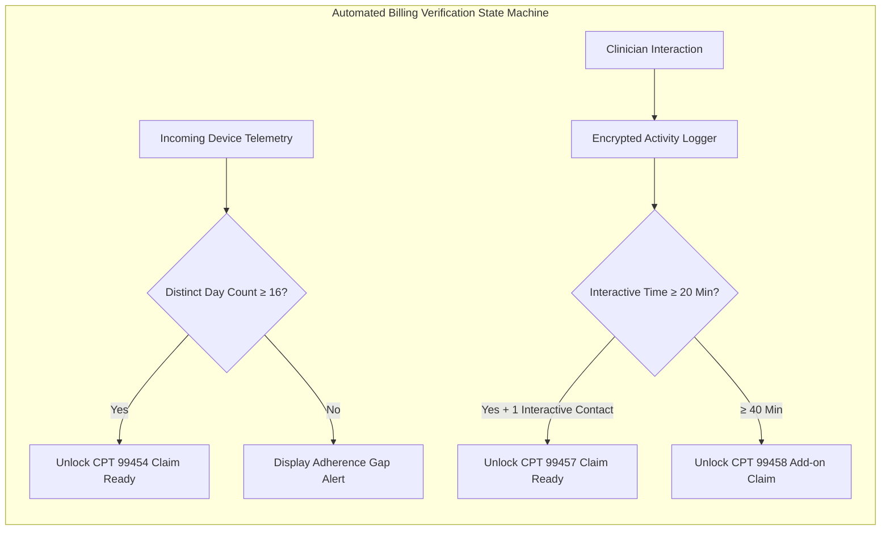
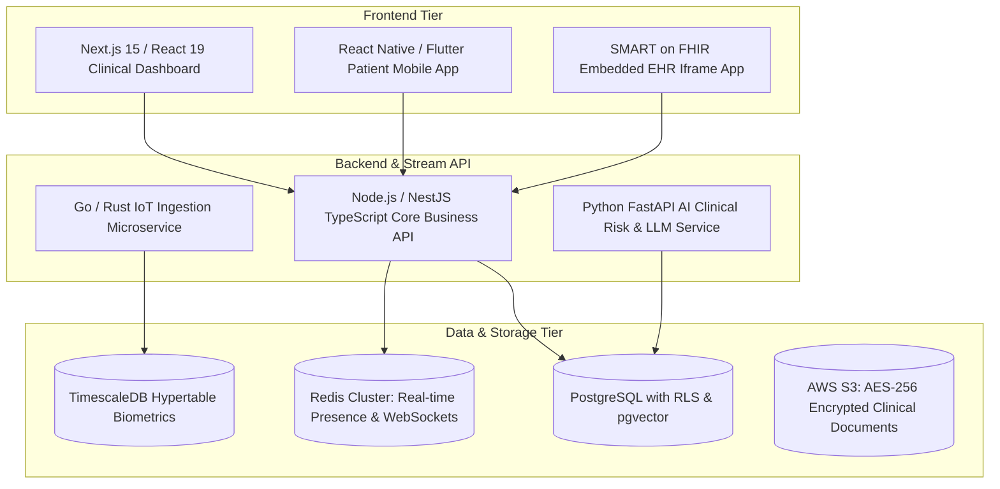

Are you looking to build a multi-tenant Remote Patient Monitoring (RPM) SaaS, launch a branded Chronic Care Management (CCM) platform, or modernize clinical telemetry infrastructure for hospital networks and accountable care organizations (ACOs) in 2026?

The shift toward value-based care and proactive chronic disease management has made Remote Patient Monitoring and Chronic Care Management the fastest-growing sectors in digital health. With Medicare and private payers expanding reimbursements for continuous physiological monitoring, healthcare providers are seeking unified, intelligent software platforms that seamlessly bridge connected medical devices with clinical workflows.

However, building an enterprise-grade RPM/CCM SaaS platform presents steep technical and regulatory challenges. Engineering teams must navigate high-throughput medical IoT telemetry ingestion, real-time vital sign anomaly detection without triggering dangerous clinician alert fatigue, bidirectional HL7/FHIR EHR synchronization, and automated, audit-proof Medicare CPT code time-tracking.

Here is the definitive architectural blueprint and engineering guide to building a scalable, HIPAA-compliant, AI-powered Remote Patient Monitoring and Chronic Care Management SaaS platform in 2026.


---

## The 2026 Paradigm: From Passive Device Loggers to Agentic Clinical Intelligence

First-generation RPM tools were little more than basic Bluetooth pairing apps connected to flat database tables. Clinicians were inundated with raw spreadsheets of systolic blood pressure readings and blood glucose values, leading to severe alert fatigue, missed cardiac decompensations, and high patient attrition.

### Why Legacy RPM & CCM Platforms Fail:
1. **Severe Clinician Alert Fatigue:** Fixed threshold alerts (e.g., alert if BP > 140/90) trigger hundreds of non-actionable notifications daily for chronically hypertensive patients, causing clinicians to mute vital warning channels.
2. **Device Onboarding Friction:** Complex Bluetooth Low Energy (BLE) pairing steps on consumer smartphones lead to over 40% patient drop-off in elderly populations within the first 30 days.
3. **Manual, Vulnerable Billing Workflows:** Tracking the strict 16-day physiological transmission rules (CPT 99454) and monthly 20-minute clinical care interaction increments (CPT 99457/99458 & 99490) manually in spreadsheets invites catastrophic audit clawbacks from CMS.
4. **EHR Data Silos:** Isolated RPM portals require clinicians to dual-chart between the monitoring tool and Epic, Cerner, or Athenahealth, adding hours of administrative overhead.

### The 2026 Modern Standard: Agentic RPM & CCM 3.0
* **Cellular Zero-Config Out-of-the-Box Ingestion:** Pre-configured cellular IoT gateways (CAT-M1 / NB-IoT) that transmit vitals automatically the moment a patient takes a measurement—no smartphone app, Wi-Fi pairing, or Bluetooth required.
* **Context-Aware AI Alert Stratification:** Machine learning models evaluate rolling baseline vitals, longitudinal medication changes, and comorbidities (e.g., CHF + CKD) to calculate dynamic National Early Warning Scores (NEWS2) and eliminate 85% of false alarms.
* **Automated Audit-Proof CPT Reimbursement Engines:** Millisecond-accurate background listeners continuously track transmission days, interactive clinical audio/video minutes, and care plan reviews, automatically compiling compliant claim batches.
* **Native SMART on FHIR Embedded EHR Workflows:** Clinicians view live vitals telemetry, AI summaries, and care plan action items directly inside their primary EHR interface.

> **Key Industry Insight:** Deploying an intelligent RPM/CCM platform increases patient adherence to **88%**, reduces 30-day hospital readmissions by **34%**, and generates predictable, high-margin monthly recurring revenue ($120–$210 per enrolled patient/month) for healthcare practices under Medicare fee-for-service and ACO models.

---

## End-to-End Technical Architecture of an Enterprise RPM & CCM Platform

A production-ready RPM/CCM platform requires an event-driven, fault-tolerant microservices architecture capable of processing continuous biometric streams while guaranteeing zero data loss, SOC 2 Type II compliance, and HIPAA Zero-Trust isolation.



### Core Architecture Breakdown:

1. **High-Throughput IoT Ingestion Layer (AWS IoT Core / EMQX Broker):** Handles persistent MQTT/TLS connections from thousands of cellular blood pressure monitors, pulse oximeters, weight scales, and continuous glucose monitors (CGMs). Decouples device connectivity from backend processing.
2. **Distributed Telemetry Event Stream (Kafka / Redpanda):** Ingests raw biometric payloads, standardizes units (e.g., converting mmHg, mg/dL, and bpm into normalized IEEE 11073-10101 clinical naming standards), and broadcasts events to downstream analytics workers.
3. **Dual Database Tier (TimescaleDB + PostgreSQL RLS):**
   - **TimescaleDB:** High-compression time-series database optimized for hypertable aggregations over billions of timestamped biometric readings.
   - **PostgreSQL with Row-Level Security (RLS):** Houses tenant organizations (clinics, hospital networks), patient demographics, clinician rosters, and role-based access controls (RBAC) with guaranteed multi-tenant cryptographic isolation.
4. **Agentic Clinical Risk Engine:** Evaluates rolling 7-day, 30-day, and 90-day vital sign trends. When significant clinical deviations occur (e.g., rapid 3-day weight gain in Congestive Heart Failure patients), it generates prioritized clinical task cards with synthesized SOAP note recommendations.
5. **Bidirectional HL7/FHIR EHR Bridge:** Syncs patient enrollment, diagnoses, and medication lists from the EHR while pushing back observation records (`FHIR Observation` resource) and monthly encounter summaries.

---

## IoT Device Ingestion: Cellular Hubs vs. Bluetooth Low Energy (BLE)

Achieving high patient engagement requires supporting both frictionless cellular devices and feature-rich BLE/mobile workflows:



### 1. Cellular Gateway Protocol (CAT-M1 / NB-IoT)
* Devices contain an embedded SIM card (e.g., Twilio Super SIM, EMnify, Hologram).
* On measurement completion, the device powers up its cellular modem, negotiates a TLS handshake, transmits a lightweight binary/JSON payload over MQTT or CoAP, and immediately powers down to preserve multi-year battery life.
* Eliminates user friction: The patient unboxes the device, presses "Start", and data instantly streams to the clinic.

### 2. Bluetooth Low Energy (BLE) Web Bluetooth & Mobile SDK
* For complex continuous devices (e.g., 6-lead portable ECGs, continuous pulse oximeters, smart spirometers), the platform provides native iOS/Android SDKs and Web Bluetooth APIs.
* Implements the standard GATT (Generic Attribute Profile) specifications:
  - `0x1810` - Blood Pressure Service
  - `0x1808` - Glucose Service
  - `0x1822` - Pulse Oximeter Service
  - `0x181D` - Weight Scale Service
* Offline-first local storage (SQLite with SQLCipher) ensures biometric readings are queued safely on device during network dropouts and synced via idempotent batch webhooks.

---

## Automated Medicare CPT Billing Engine: Audit-Proof Revenue Cycle Management

Reimbursing RPM and CCM programs under Medicare requires satisfying strict statutory criteria. Building an automated, tamper-proof billing engine inside your SaaS turns compliance into an automated background process:

| CPT Code | Service Description | Minimum Requirement | Typical Medicare Reimbursement (Avg) | Automated SaaS Validation Rule |
|---|---|---|---|---|
| **CPT 99453** | RPM Initial Setup & Patient Device Education | One-time per episode of care | ~$19.50 | Triggered when initial device is paired and first test transmission is validated. |
| **CPT 99454** | Monthly Device Transmission & Physiological Data Supply | ≥ 16 distinct days of vitals readings in a 30-day billing cycle | ~$48.00–$55.00 | Real-time calendar heatmap listener counts discrete 24-hour transmission windows. |
| **CPT 99457** | RPM Clinical Care Management (Initial 20 Min) | 20 cumulative minutes of clinical staff time + 1 interactive communication | ~$48.00–$52.00 | Native stopwatch timer records audio/video calls, chart reviews, and message threads. |
| **CPT 99458** | RPM Clinical Care Management (Additional 20 Min) | Each additional 20 minutes of clinical staff time (up to 2x/month) | ~$39.00–$42.00 | Automatically unlocks subsequent billing units once 40-min and 60-min thresholds are verified. |
| **CPT 99490** | Chronic Care Management (CCM) Base Code | 20 minutes of non-face-to-face care coordination for ≥ 2 chronic conditions | ~$61.00–$66.00 | Care plan revision tracking, multi-specialty coordination logs, and prescription reconciliation timers. |
| **CPT 99439** | Chronic Care Management (CCM) Add-on Code | Each additional 20 minutes of CCM clinical care coordination | ~$46.00–$49.00 | Add-on unit counter triggered after 40+ minutes of verified CCM care coordination. |



### Cryptographic Audit Trails for CMS Inspections
To protect healthcare organizations during Office of Inspector General (OIG) or Medicare RAC audits:
* Every clinical time entry is stored with immutable millisecond timestamps, authenticated clinician user IDs, patient IDs, activity type (e.g., asynchronous telemetry analysis vs. synchronous video consultation), and associated SOAP notes.
* The system prevents retroactive time padding or overlapping timers across multiple patient charts.
* Generates 1-click CMS Audit Binders with full CSV/PDF proof of 16-day transmissions and session logs.

---

## Bi-Directional EHR Integration via HL7 / FHIR

To prevent clinician workflow fragmentation, the RPM/CCM SaaS platform integrates directly into hospital electronic health record systems using modern FHIR standards and SMART on FHIR containerization:

```sql
-- PostgreSQL Schema Example: Storing Normalized FHIR Observations with Postgres RLS
CREATE TABLE patient_vitals_telemetry (
    id UUID PRIMARY KEY DEFAULT gen_random_uuid(),
    tenant_id UUID NOT NULL REFERENCES organizations(id) ON DELETE CASCADE,
    patient_id UUID NOT NULL REFERENCES patients(id) ON DELETE CASCADE,
    device_id VARCHAR(100) NOT NULL,
    vital_type VARCHAR(50) NOT NULL, -- e.g., 'blood_pressure', 'glucose', 'spo2'
    loinc_code VARCHAR(20) NOT NULL, -- e.g., '85354-9' for Blood Pressure Panel
    primary_value NUMERIC(8,2) NOT NULL,
    secondary_value NUMERIC(8,2), -- e.g., diastolic value
    unit VARCHAR(20) NOT NULL, -- e.g., 'mmHg', 'mg/dL', '%'
    recorded_at TIMESTAMPTZ NOT NULL,
    ingested_at TIMESTAMPTZ DEFAULT clock_timestamp(),
    fhir_observation_payload JSONB NOT NULL,
    ai_risk_score INT DEFAULT 0,
    is_anomaly BOOLEAN DEFAULT FALSE
);

-- Enable Multi-Tenant Isolation Policy
ALTER TABLE patient_vitals_telemetry ENABLE ROW LEVEL SECURITY;

CREATE POLICY tenant_isolation_vitals ON patient_vitals_telemetry
    USING (tenant_id = NULLIF(current_setting('app.current_tenant_id', true), '')::UUID);
```

### SMART on FHIR Embeds
* **Single Sign-On (SSO):** Clinicians launch the Anonsoft RPM workspace directly from within Epic Hyperspace or Cerner PowerChart via OAuth 2.0 / OpenID Connect.
* **Context Synchronization:** As the physician switches patient charts inside the EHR, the embedded iframe automatically synchronizes to display the active patient's live biometric curves, trend charts, and medication correlation views.
* **Automated Encounter Writeback:** Upon completing a monthly CCM review, the platform pushes a structured `Encounter` and `DocumentReference` FHIR resource back to the EHR chart.

---

## Comparative Matrix: Custom RPM Development vs. Off-the-Shelf SaaS vs. Anonsoft White-Label Architecture

Choosing the right engineering pathway determines time-to-market, customizability, and operational margins:

| Capability | Generic Off-the-Shelf RPM Vendors | In-House Custom Build from Scratch | Anonsoft White-Label RPM/CCM Architecture |
|---|---|---|---|
| **Time to Market** | 2–4 Weeks (Locked ecosystem) | 12–18 Months | **3–4 Weeks (Fully custom branded)** |
| **Initial Capital Expenditure** | $0 upfront (High revenue share 40–60%) | $250,000–$450,000+ software build | **Fraction of custom build cost (No upfront dev risk)** |
| **Ongoing Revenue Share** | 30%–50% taken by vendor | 0% | **0% revenue share (You keep 100% of SaaS & CPT margin)** |
| **Device Hardware Freedom** | Restricted to vendor's proprietary hardware | Requires building custom IoT gateways | **Agnostic (Cellular, BLE, OMRON, iHealth, TaiDoc, Dexcom)** |
| **Multi-Tenant White-Labeling** | No (Vendor branding only) | Yes (Requires custom multi-tenancy code) | **Native Multi-Tenant Reseller & Clinic Portals** |
| **Automated CPT & Time Engine** | Basic reporting | Complex custom billing state machine | **Built-in Millisecond Audit-Proof CPT Engine** |
| **Full Source Code Ownership** | No | Yes | **Full Source Code & IP Ownership Available** |

---

## Production Technology Stack for Scalable RPM / CCM SaaS

To handle high-frequency biometric streams with zero downtime and strict HIPAA security:



* **Frontend:** Next.js 15 with React 19, Tailwind CSS, Radix UI, Recharts/D3 for high-performance vital trend graphing, and TanStack Query for real-time cache invalidation.
* **Real-Time Telemetry Ingestion:** Go / Rust IoT microservice paired with EMQX / AWS IoT Core for lightweight MQTT message handling.
* **Core API & Business Logic:** Node.js / NestJS with TypeScript, implementing clean architecture, CQRS pattern, and BullMQ for asynchronous billing/alert workflows.
* **Database & Time-Series:** PostgreSQL 16 with Row-Level Security, pgvector for semantic medical guideline search, and TimescaleDB hypertables for compressed biometric storage.
* **Security & Compliance:** AWS KMS customer-managed encryption keys, mTLS for device-to-cloud communication, SOC 2 Type II audit logging, and BAA agreements across all infrastructure tiers.

---

## Frequently Asked Questions (FAQs)

### 1. What is the difference between Remote Patient Monitoring (RPM) and Chronic Care Management (CCM)?
While both programs target chronic disease management and can be billed concurrently, **RPM (CPT 99453, 99454, 99457, 99458)** focuses on the automated collection and clinical analysis of objective physiological data (such as blood pressure, blood glucose, weight, and pulse oximetry) through connected medical devices. **CCM (CPT 99490, 99439)** focuses on broader non-face-to-face care coordination (such as medication management, specialist coordination, and care plan updates) for patients with two or more chronic conditions lasting at least 12 months.

### 2. Can cellular medical devices work without patient Wi-Fi or smartphone pairing?
Yes. Pre-configured cellular RPM devices use global IoT SIM cards (CAT-M1 / NB-IoT) that connect directly to cellular mobile networks upon taking a reading. The patient does not need home Wi-Fi, a smartphone, or any Bluetooth pairing. This plug-and-play simplicity is the single most effective way to eliminate technical friction for elderly patients and maintain over 85% compliance with the Medicare 16-day transmission requirement.

### 3. How does the platform prevent Medicare billing audit clawbacks?
The platform features an automated, cryptographic time-tracking engine. Every interaction—whether an asynchronous vital sign review, an encrypted patient chat message, or a synchronous telehealth consultation—is recorded with precise start and end timestamps, clinician ID, and associated clinical notes. The system validates that the 16-day transmission rule (CPT 99454) and exact 20-minute clinical care thresholds (CPT 99457/99458/99490) are met before generating claims, producing 1-click audit-proof compliance binders.

### 4. Can the RPM SaaS platform integrate with existing EHRs like Epic, Cerner, and Athenahealth?
Yes. The platform supports standard HL7 v2 messaging and modern SMART on FHIR REST APIs. Clinicians can access the RPM dashboard directly inside their EHR chart without separate logins, and patient biometric observations (`FHIR Observation` resources) and encounter documentation are automatically written back to the patient's EHR chart.

---

## Build Your AI-Powered RPM & CCM Platform with Anonsoft

Building a production-grade, HIPAA-compliant Remote Patient Monitoring and Chronic Care Management SaaS requires specialized expertise across medical IoT engineering, real-time telemetry streaming, clinical AI workflows, and healthcare regulatory compliance.

At **Anonsoft**, we specialize in designing, engineering, and deploying custom, white-label digital health platforms with **zero upfront risk**:

* **Working Prototype First:** We build your functional RPM/CCM prototype before you pay a single dollar.
* **Full IP & Source Code Ownership:** 100% ownership of your codebase, database schemas, and intellectual property.
* **Zero Revenue Share:** Keep 100% of your SaaS subscription revenue and clinical CPT reimbursement margins.
* **Turnkey Compliance:** Built-in HIPAA, SOC 2, HL7/FHIR, and Medicare audit-proof compliance architecture.

Explore our healthcare solutions at [MedNowNA Telemedicine & Healthcare Platform](file:///root/project/anonsoftweb/projects/mednowna.html), check our [Healthcare SaaS MVP Development](file:///root/project/anonsoftweb/healthcare-saas-mvp-development.html) and [Telemedicine Software for Clinics](file:///root/project/anonsoftweb/telemedicine-software-for-clinics.html) guides, or [Book a 30-Minute Architecture Discovery Call](file:///root/project/anonsoftweb/bookademo/index.html) with our senior engineering team today. Ready to start? [Contact Us](file:///root/project/anonsoftweb/contact/index.html) to discuss your project requirements.
