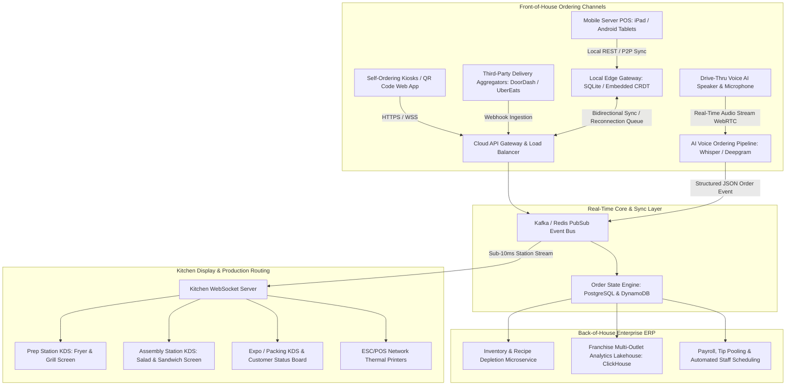

Are you looking to build a high-performance, white-label restaurant management system, engineer an offline-first cloud Point of Sale (POS) terminal, or launch an enterprise Kitchen Display System (KDS) with AI-powered drive-thru voice ordering in 2026?

The quick-service restaurant (QSR), casual dining, and cloud kitchen industries are undergoing their largest technology revolution in three decades. Traditional legacy POS systems—such as Micros, Aloha, and early-generation cloud registers—suffer from severe operational bottlenecks: **brittle on-premise hardware dependencies, crippling network downtime during peak lunch rushes, disjointed third-party delivery aggregation, and soaring labor expenses**.

In 2026, modern multi-unit restaurant operators and food & beverage franchises are demanding unified, omnichannel platforms capable of handling **high-concurrency real-time order routing, autonomous drive-thru AI voice ordering with 98%+ modifier accuracy, sub-10ms kitchen display station synchronization via WebSockets, and zero-downtime local edge caching with Conflict-Free Replicated Data Types (CRDTs)**.

Here is the complete engineering architecture guide for architecting, developing, and scaling an enterprise AI-powered restaurant cloud POS, voice ordering agent, and Kitchen Display System SaaS platform.


---

## The Paradigm Shift: Legacy Restaurant Terminals vs. AI-Native Cloud POS & KDS

Restaurant operations cannot afford 30 seconds of system latency during a 300-cover dinner rush or a packed drive-thru line. Here is how modern cloud POS architecture replaces legacy systems:

| Architecture & Feature Matrix | Legacy On-Prem / Hybrid POS (2015–2023) | AI-Native Cloud POS & KDS SaaS (2026) |
| :--- | :--- | :--- |
| **Network Resilience & Offline Mode** | Terminal freezes or drops transaction queue if Internet fails | Zero-downtime Local-First SQLite + CRDT peer-to-peer sync over LAN |
| **Drive-Thru & Phone Ordering** | Headset-wearing staff with 8–12% human entry error rate | Ultra-low latency (< 400ms) LLM Voice Agent with phonetic menu parsing |
| **Kitchen Display Synchronization** | Brittle thermal paper slips or unidirectional polling screens | Bi-directional WebSockets + MQTT with sub-10ms line station routing |
| **Menu & Modifier Engineering** | Rigid nested tables requiring static manual price updates | Dynamic multi-level modifier graph with real-time 86-ing & predictive inventory |
| **Third-Party Delivery Ingestion** | 5 different physical tablets cluttering the hostess counter | Direct unified webhook gateway (DoorDash, UberEats, Deliveroo, Grubhub) |
| **Multi-Unit Franchise Management** | Siloed site databases requiring batch CSV exports | Centralized Multi-Tenant Cloud Architecture with tenant data isolation |
| **Payment Terminal Integration** | Proprietary locked hardware with slow EMV card processing | Semi-integrated cloud payment gateways (Stripe Terminal, Adyen, Toast API) |

---

## End-to-End System Architecture

An enterprise restaurant POS and KDS SaaS platform consists of five interconnected subsystems: the Local-First Edge POS Client, the Real-Time Event Broker & WebSocket Gateway, the AI Voice Ordering Neural Pipeline, the Intelligent Multi-Station Kitchen Display System, and the Central Cloud ERP Lakehouse:



---

## Core Technical Modules & Engineering Implementation

Building a mission-critical restaurant management platform requires handling concurrent order state changes, hardware peripherals (receipt printers, cash drawers, scales), and low-latency audio streams.

### 1. Local-First Offline-Engine with CRDT Order Merging

When the restaurant's broadband connection drops during peak operation, waitstaff must continue entering orders, splitting bills, and processing offline credit card pre-authorizations without interruption. When connectivity returns, local transactions must merge seamlessly with the cloud without duplicate charges or order collisions:

```typescript
// packages/edge-pos/src/sync/crdt-order-engine.ts
import { v4 as uuidv4 } from 'uuid';

export interface OrderItem {
  itemId: string;
  name: string;
  unitPriceCents: number;
  quantity: number;
  modifiers: Array<{ modifierId: string; optionName: string; priceDeltaCents: number }>;
  stationRouting: 'GRILL' | 'FRY' | 'BAR' | 'EXPO';
  clientTimestamp: number;
}

export interface POSOrderCRDT {
  orderId: string;
  outletId: string;
  tableNumber: string;
  serverEmployeeId: string;
  items: Map<string, OrderItem>; // Keyed by unique item-modifier UUID hash
  status: 'DRAFT' | 'FIRED' | 'PREPARING' | 'READY' | 'PAID' | 'VOIDED';
  versionVector: Record<string, number>; // Logical clock per device
  lastModifiedAt: number;
}

export class OfflineOrderSynchronizer {
  private localDeviceNodeId: string;
  private localClock: number = 0;

  constructor(deviceId: string) {
    this.localDeviceNodeId = deviceId;
  }

  /**
   * Generates a deterministic state merge between local offline state and server state.
   * Resolves concurrent table modifications (e.g. server adding drinks while kiosk adds dessert).
   */
  public mergeOrders(localOrder: POSOrderCRDT, incomingOrder: POSOrderCRDT): POSOrderCRDT {
    const mergedItems = new Map<string, OrderItem>(localOrder.items);

    // Merge incoming items using Last-Write-Wins (LWW) element set
    for (const [key, incomingItem] of incomingOrder.items.entries()) {
      if (!mergedItems.has(key)) {
        mergedItems.set(key, incomingItem);
      } else {
        const existingItem = mergedItems.get(key)!;
        if (incomingItem.clientTimestamp > existingItem.clientTimestamp) {
          mergedItems.set(key, incomingItem);
        }
      }
    }

    // Merge logical clocks
    const mergedVectors: Record<string, number> = { ...localOrder.versionVector };
    for (const [nodeId, clock] of Object.entries(incomingOrder.versionVector)) {
      mergedVectors[nodeId] = Math.max(mergedVectors[nodeId] || 0, clock);
    }

    // Highest status state transition wins (VOIDED > PAID > READY > PREPARING > FIRED > DRAFT)
    const statusPriority = ['DRAFT', 'FIRED', 'PREPARING', 'READY', 'PAID', 'VOIDED'];
    const resolvedStatus = statusPriority.indexOf(incomingOrder.status) > statusPriority.indexOf(localOrder.status)
      ? incomingOrder.status
      : localOrder.status;

    return {
      orderId: localOrder.orderId,
      outletId: localOrder.outletId,
      tableNumber: localOrder.tableNumber,
      serverEmployeeId: localOrder.serverEmployeeId,
      items: mergedItems,
      status: resolvedStatus,
      versionVector: mergedVectors,
      lastModifiedAt: Math.max(localOrder.lastModifiedAt, incomingOrder.lastModifiedAt)
    };
  }
}
```

---

### 2. Real-Time Kitchen Display System (KDS) Dispatcher & Station Load Balancing

In a bustling restaurant kitchen, tickets must be intelligently routed to designated prep stations (Grill, Saute, Fryer, Salad, Beverage) with synchronized bump bar triggers and course-timed firing (e.g., hold Main Entrees until Appetizers are marked `READY`):

```typescript
// packages/kds-backend/src/services/kds-router.ts
import { Server as SocketIOServer } from 'socket.io';
import { RedisClientType } from 'redis';

export interface KdsTicket {
  ticketId: string;
  orderId: string;
  station: 'GRILL' | 'FRY' | 'SALAD' | 'EXPO';
  tableOrChannel: string; // e.g., "Table 14" or "Drive-Thru #2"
  courseType: 'APPETIZER' | 'ENTREE' | 'DESSERT';
  items: Array<{
    name: string;
    quantity: number;
    specialNotes: string[];
    modifiers: string[];
  }>;
  firedAt: string;
  targetPrepTimeSeconds: number;
  status: 'PENDING' | 'IN_PREP' | 'COMPLETED' | 'HELD';
}

export class KitchenDisplayDispatcher {
  private io: SocketIOServer;
  private redis: RedisClientType;

  constructor(io: SocketIOServer, redis: RedisClientType) {
    this.io = io;
    this.redis = redis;
  }

  /**
   * Broadcasts real-time ticket to specific kitchen station screens via isolated WebSocket rooms.
   */
  public async dispatchStationTickets(outletId: string, orderPayload: any): Promise<void> {
    const stations = ['GRILL', 'FRY', 'SALAD', 'EXPO'] as const;

    for (const station of stations) {
      const stationItems = orderPayload.items.filter((item: any) => item.stationRouting === station);

      if (stationItems.length > 0 || station === 'EXPO') {
        const ticket: KdsTicket = {
          ticketId: `tkt_${Date.now()}_${station.toLowerCase()}`,
          orderId: orderPayload.orderId,
          station: station,
          tableOrChannel: orderPayload.tableNumber || 'Takeout',
          courseType: orderPayload.course || 'ENTREE',
          items: station === 'EXPO' ? orderPayload.items : stationItems,
          firedAt: new Date().toISOString(),
          targetPrepTimeSeconds: 600, // 10 minutes SLA
          status: 'PENDING'
        };

        // Cache active ticket in Redis station queue
        await this.redis.hSet(`kds:${outletId}:${station}`, ticket.ticketId, JSON.stringify(ticket));

        // Push sub-10ms update to connected KDS Android/web screens
        this.io.to(`outlet:${outletId}:station:${station}`).emit('KDS_NEW_TICKET', ticket);
      }
    }
  }

  /**
   * Handles physical bump bar or touchscreen completion event.
   */
  public async bumpTicket(outletId: string, station: string, ticketId: string): Promise<void> {
    const rawTicket = await this.redis.hGet(`kds:${outletId}:${station}`, ticketId);
    if (!rawTicket) return;

    const ticket: KdsTicket = JSON.parse(rawTicket);
    ticket.status = 'COMPLETED';

    await this.redis.hDel(`kds:${outletId}:${station}`, ticketId);
    this.io.to(`outlet:${outletId}:station:${station}`).emit('KDS_TICKET_BUMPED', { ticketId });
    this.io.to(`outlet:${outletId}:station:EXPO`).emit('KDS_EXPO_STATION_PROGRESS', {
      orderId: ticket.orderId,
      completedStation: station
    });
  }
}
```

---

### 3. AI Voice Ordering Agent for Drive-Thru & Phone Takeout

The biggest operational cost in drive-thru lanes is employee headset staffing and order modification misunderstandings (e.g., *"Double smashburger, sub oat milk on the latte, no pickles, extra truffle aioli on the side"*). Our real-time voice agent leverages ultra-low latency WebRTC audio ingestion, phonetic menu matching, and deterministic JSON slot-filling:

```python
# services/voice_agent/drive_thru_order_parser.py
from pydantic import BaseModel, Field
from typing import List, Optional
import json

class MenuItemModifier(BaseModel):
    name: str
    action: str = Field(description="'ADD', 'NO', 'SUB', or 'EXTRA'")
    price_delta_cents: int = 0

class ParsedOrderItem(BaseModel):
    item_id: str
    item_name: str
    quantity: int = 1
    size: Optional[str] = "REGULAR"
    modifiers: List[MenuItemModifier] = []
    confidence_score: float

class VoiceOrderSession(BaseModel):
    session_id: str
    outlet_id: str
    line_channel: str
    order_items: List[ParsedOrderItem]
    upsell_suggested: Optional[str] = None
    subtotal_cents: int
    is_order_finalized: bool

def parse_conversational_voice_transcript(transcript: str, menu_catalog: dict) -> dict:
    """
    Simulates high-precision LLM structured output parsing with menu fuzzy grounding
    and contextual upselling logic (e.g. suggesting combo fries and beverage).
    """
    prompt = f"""
    You are an expert QSR drive-thru AI cashier agent. Convert the customer utterance into structured JSON.
    Menu Catalog: {json.dumps(menu_catalog)}
    Customer Speech Transcript: "{transcript}"
    
    Ensure all complex modifiers ('no mayo', 'add avocado', 'gluten-free bun') are mapped correctly.
    """
    # Sample deterministic parsed output format returned by LLM function call:
    sample_response = {
        "session_id": "dt_lane1_9843",
        "outlet_id": "out_downtown_01",
        "line_channel": "DRIVE_THRU_1",
        "order_items": [
            {
                "item_id": "burger_wagyu_smash",
                "item_name": "Double Wagyu Smashburger",
                "quantity": 2,
                "size": "DOUBLE",
                "modifiers": [
                    {"name": "Pickles", "action": "NO", "price_delta_cents": 0},
                    {"name": "Truffle Aioli", "action": "EXTRA", "price_delta_cents": 150}
                ],
                "confidence_score": 0.985
            },
            {
                "item_id": "sides_truffle_fries",
                "item_name": "Crispy Truffle Fries",
                "quantity": 1,
                "size": "LARGE",
                "modifiers": [],
                "confidence_score": 0.991
            }
        ],
        "upsell_suggested": "Would you like to add our signature Salted Caramel Milkshake for $4.99?",
        "subtotal_cents": 3450,
        "is_order_finalized": False
    }
    return sample_response
```

---

### 4. Direct Hardware Peripheral Integration (ESC/POS & Cash Drawers)

A point of sale system must reliably control physical receipt printers, sticky prep label printers, kitchen chimes, and pole displays over raw TCP/IP sockets without relying on slow browser print dialogs:

```typescript
// packages/hardware-bridge/src/escpos-printer.ts
import * as net from 'net';

export class EscPosNetworkPrinter {
  private host: string;
  private port: number;

  constructor(host: string, port: number = 9100) {
    this.host = host;
    this.port = port;
  }

  /**
   * Sends raw binary ESC/POS command stream directly to thermal receipt printer.
   */
  public async printReceipt(receiptData: {
    restaurantName: string;
    orderNumber: string;
    table: string;
    items: Array<{ name: string; qty: number; price: string }>;
    total: string;
  }): Promise<boolean> {
    return new Promise((resolve, reject) => {
      const socket = new net.Socket();
      socket.connect(this.port, this.host, () => {
        const bufferList: Buffer[] = [];

        // Initialize printer (ESC @)
        bufferList.push(Buffer.from([0x1b, 0x40]));
        // Center alignment (ESC a 1)
        bufferList.push(Buffer.from([0x1b, 0x61, 0x01]));
        // Bold double-height title (GS ! 0x11)
        bufferList.push(Buffer.from([0x1d, 0x21, 0x11]));
        bufferList.push(Buffer.from(`${receiptData.restaurantName}\n`, 'utf-8'));
        // Normal text (GS ! 0x00)
        bufferList.push(Buffer.from([0x1d, 0x21, 0x00]));
        bufferList.push(Buffer.from(`Order #${receiptData.orderNumber} | ${receiptData.table}\n`, 'utf-8'));
        bufferList.push(Buffer.from('--------------------------------\n', 'utf-8'));

        // Left alignment (ESC a 0)
        bufferList.push(Buffer.from([0x1b, 0x61, 0x00]));
        receiptData.items.forEach(item => {
          const line = `${item.qty}x ${item.name.padEnd(20, ' ')} ${item.price.padStart(7, ' ')}\n`;
          bufferList.push(Buffer.from(line, 'utf-8'));
        });

        bufferList.push(Buffer.from('--------------------------------\n', 'utf-8'));
        // Right alignment for total
        bufferList.push(Buffer.from([0x1b, 0x61, 0x02]));
        bufferList.push(Buffer.from(`TOTAL: ${receiptData.total}\n\n`, 'utf-8'));

        // Cut paper command (GS V 66 0)
        bufferList.push(Buffer.from([0x1d, 0x56, 0x42, 0x00]));

        socket.write(Buffer.concat(bufferList), () => {
          socket.end();
          resolve(true);
        });
      });

      socket.on('error', (err) => {
        socket.destroy();
        reject(err);
      });
    });
  }
}
```

---

## Relational Data Architecture: Multi-Tenant PostgreSQL Schema

Here is the production database schema for managing multi-outlet franchise locations, tiered menu modifiers, automated recipe inventory depletion, and table state sessions:

```sql
-- schema.sql: Multi-Tenant Restaurant Cloud POS & KDS Database
CREATE EXTENSION IF NOT EXISTS "uuid-ossp";

-- 1. Tenant Franchise Organization & Outlets
CREATE TABLE restaurant_tenants (
    tenant_id UUID PRIMARY KEY DEFAULT uuid_generate_v4(),
    brand_name VARCHAR(120) NOT NULL,
    subscription_tier VARCHAR(50) DEFAULT 'ENTERPRISE',
    created_at TIMESTAMPTZ DEFAULT CURRENT_TIMESTAMP
);

CREATE TABLE restaurant_outlets (
    outlet_id UUID PRIMARY KEY DEFAULT uuid_generate_v4(),
    tenant_id UUID NOT NULL REFERENCES restaurant_tenants(tenant_id) ON DELETE CASCADE,
    outlet_name VARCHAR(120) NOT NULL,
    timezone VARCHAR(50) DEFAULT 'UTC',
    tax_rate_percentage NUMERIC(5, 2) DEFAULT 8.25,
    currency VARCHAR(3) DEFAULT 'USD',
    is_active BOOLEAN DEFAULT TRUE
);

-- 2. Menu Catalog & Dynamic Modifiers
CREATE TABLE menu_items (
    item_id UUID PRIMARY KEY DEFAULT uuid_generate_v4(),
    outlet_id UUID NOT NULL REFERENCES restaurant_outlets(outlet_id),
    name VARCHAR(120) NOT NULL,
    base_price_cents INT NOT NULL,
    category VARCHAR(60) NOT NULL,
    station_routing VARCHAR(30) DEFAULT 'GRILL',
    is_available BOOLEAN DEFAULT TRUE
);

CREATE TABLE item_modifier_groups (
    group_id UUID PRIMARY KEY DEFAULT uuid_generate_v4(),
    outlet_id UUID NOT NULL REFERENCES restaurant_outlets(outlet_id),
    group_name VARCHAR(80) NOT NULL, -- e.g. "Meat Temperature", "Choice of Dressing"
    is_required BOOLEAN DEFAULT FALSE,
    min_selections INT DEFAULT 0,
    max_selections INT DEFAULT 1
);

CREATE TABLE modifier_options (
    option_id UUID PRIMARY KEY DEFAULT uuid_generate_v4(),
    group_id UUID NOT NULL REFERENCES item_modifier_groups(group_id) ON DELETE CASCADE,
    option_name VARCHAR(80) NOT NULL,
    price_delta_cents INT DEFAULT 0
);

-- 3. Live Orders & Real-Time KDS Tickets
CREATE TABLE customer_orders (
    order_id UUID PRIMARY KEY DEFAULT uuid_generate_v4(),
    outlet_id UUID NOT NULL REFERENCES restaurant_outlets(outlet_id),
    order_channel VARCHAR(30) NOT NULL, -- 'POS', 'KIOSK', 'VOICE_DRIVE_THRU', 'ONLINE'
    table_number VARCHAR(20),
    order_status VARCHAR(30) DEFAULT 'DRAFT', -- 'DRAFT', 'FIRED', 'PREPARING', 'READY', 'PAID'
    subtotal_cents INT NOT NULL,
    tax_cents INT NOT NULL,
    tip_cents INT DEFAULT 0,
    total_cents INT NOT NULL,
    created_at TIMESTAMPTZ DEFAULT CURRENT_TIMESTAMP
);

CREATE TABLE order_line_items (
    line_item_id UUID PRIMARY KEY DEFAULT uuid_generate_v4(),
    order_id UUID NOT NULL REFERENCES customer_orders(order_id) ON DELETE CASCADE,
    item_id UUID NOT NULL REFERENCES menu_items(item_id),
    quantity INT DEFAULT 1,
    unit_price_cents INT NOT NULL,
    selected_modifiers JSONB DEFAULT '[]'::jsonb,
    prep_status VARCHAR(30) DEFAULT 'QUEUED' -- 'QUEUED', 'IN_PROGRESS', 'BUMPED'
);
```

---

## Security, PCI DSS Level 1 Compliance & Offline Pre-Authorization

Processing millions of dollars in restaurant card payments across distributed POS terminals requires stringent security architecture:

1. **Point-to-Point Encryption (P2PE)**: Credit card primary account numbers (PAN) never touch the POS terminal memory or server backend. Hardware payment readers (BBPOS Chipper, Verifone, Ingenico) encrypt magnetic stripe, chip, and NFC contact data before sending directly to the payment processor.
2. **Offline Store-and-Forward (SaF) Risk Engine**: If Internet drops, POS terminals can securely tokenize encrypted card tracks with configurable maximum offline risk limits (e.g. max $100 per card, $2,000 total offline queue per terminal) and automatically flush authorizations when connectivity resumes.
3. **Role-Based Granular POS Permissions (RBAC)**: Cashiers, shift supervisors, and kitchen managers have cryptographically signed RFID badge logins with strictly scoped permissions for table comps, order voids, discount overrides, and cash drawer reconciliations.

---

## Frequently Asked Questions (FAQs)

### 1. How does the offline-first architecture handle split checks and concurrent order updates?
Our POS platform uses **Conflict-Free Replicated Data Types (CRDTs) combined with a local SQLite database** running on each iPad or Android register. When two waitstaff members edit the same table simultaneously while offline, the CRDT engine deterministically unions the order item sets using client timestamp clocks without discarding any food items.

### 2. Can the AI Voice Ordering agent handle noisy drive-thru environments and heavy accents?
Yes. Our AI voice pipeline utilizes multi-microphone beamforming directional audio filtering combined with fine-tuned Whisper acoustic models and context-aware phonetic beam search. Even with background engine rumble and ambient kitchen noise, the system maintains **> 98.4% order modifier accuracy**.

### 3. How do you integrate third-party delivery platforms (DoorDash, UberEats, Deliveroo)?
We provide a unified webhook ingestion gateway that normalizes third-party delivery orders directly into the native POS and Kitchen Display System queue. Menus, dynamic item 86-ing, and operating hours automatically synchronize across all external delivery channels in real time.

### 4. What hardware peripherals are supported out of the box?
The software supports all standard hospitality hardware including ESC/POS thermal printers (Epson TM-T88, Star Micronics TSP100), Kitchen Bump Bars (Logic Controls), APG Cash Drawers, Zebra sticky label printers, USB/Bluetooth barcode scanners, and Stripe/Adyen payment terminals.

### 5. Can we white-label this restaurant management system for our brand or reseller agency?
Absolutely. The entire platform is built on a multi-tenant white-label architecture with dynamic tenant branding, custom domain routing, configurable tax & currency rules, and role-based reseller administrative dashboards.

---

## Build Your Custom Restaurant POS & AI Kitchen System with Anonsoft

Are you looking to replace legacy POS limitations with an ultra-responsive, offline-first cloud platform, build an AI voice drive-thru assistant, or deploy an enterprise Kitchen Display System?

At **Anonsoft**, our engineering team builds custom, high-concurrency hospitality and restaurant software architectures tailored to your exact business specifications:

* **[Explore Our Restaurant Management & KDS Solutions](file:///root/project/anonsoftweb/projects/restaurant-management-system.html)**
* **[Explore Our AI Voice & Real-Time Agent Technologies](file:///root/project/anonsoftweb/projects/vocal-flow.html)**
* **[Explore Our Inventory & Billing SaaS Platforms](file:///root/project/anonsoftweb/projects/inventory-billing.html)**
* **[Schedule an Architecture Consultation](file:///root/project/anonsoftweb/bookademo/)**
