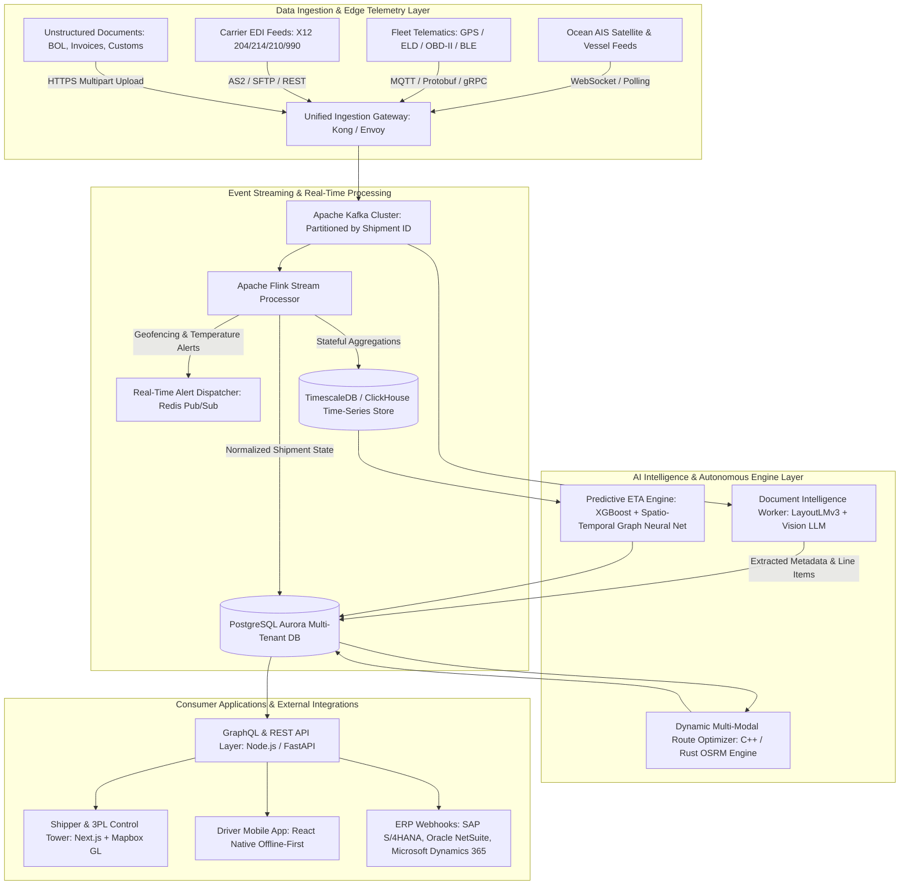
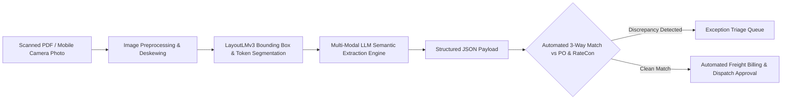
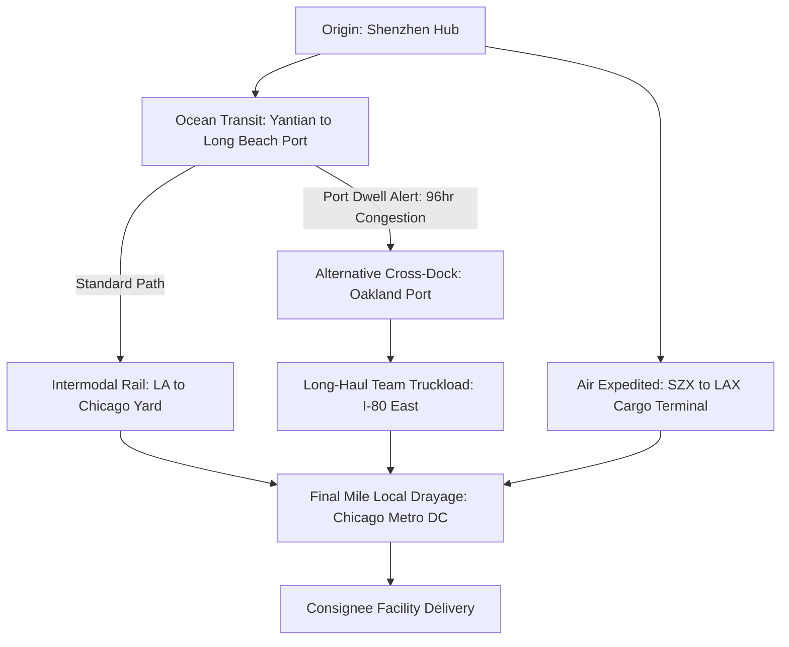
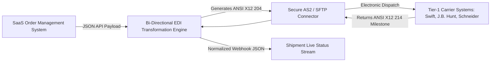

Are you designing a next-generation freight orchestration platform, building an AI-native supply chain visibility SaaS, or architecting an enterprise multi-modal logistics control tower to streamline ocean, air, rail, and intermodal drayage operations in 2026?

Global supply chains are navigating unprecedented operational turbulence. Global trade volumes exceed **12 billion tons annually**, yet over **65% of global freight movements still suffer from "black box" blind spots during intermodal handoffs**. Unpredictable port dwell times, geopolitical route disruptions, volatile spot market rates, and sudden customs holds cost enterprise shippers and 3PLs over **$50 billion annually in demurrage fees, detention penalties, and stockout losses**.

The core operational bottleneck is fragmented data infrastructure. Ocean carriers, drayage truckers, Class 1 railroads, and air cargo handlers operate on disparate, non-standardized legacy interfaces—spanning 50-year-old EDI X12 protocols, unstructured PDF Bills of Lading (BOLs), customs declaration manifests, and uncalibrated IoT GPS telematics pings.

Modern enterprise logistics SaaS requires a paradigm shift: **sub-second streaming ingestion of multi-modal IoT sensor telemetry, autonomous LLM/Vision extraction of complex shipping documentation, graph-accelerated dynamic route optimization, automated EDI 204/214/210 translation pipelines, and predictive ETA forecasting powered by real-time spatio-temporal machine learning**.

Here is the definitive engineering blueprint for architecting, building, scaling, and deploying an enterprise AI-powered Supply Chain Visibility and Intelligent Freight Logistics SaaS platform in 2026.


---

## The Paradigm Shift: Legacy TMS vs. AI-Native Logistics SaaS

Traditional Transportation Management Systems (TMS) serve as static transactional databases. In contrast, modern AI-native logistics control towers operate as real-time, event-driven orchestration engines:

| Capability                   | Legacy TMS & Manual Freight Brokerages                                    | Modern AI-Native Logistics SaaS Platform (2026)                                                          |
| :--------------------------- | :------------------------------------------------------------------------ | :------------------------------------------------------------------------------------------------------- |
| **Tracking Latency**         | Batch EDI 214 updates (4–12 hour delay; manual check calls)               | Sub-second streaming IoT telematics & AIS satellite radar (< 250ms)                                      |
| **Document Processing**      | Manual data entry of paper BOLs and Commercial Invoices (15–30 mins/load) | Autonomous Multi-Modal Vision LLM extraction with auto-reconciliation (< 2 sec)                          |
| **Route Optimization**       | Static route planning with fixed highway waypoints                        | Real-time Graph Neural Network (GNN) multi-modal routing adapting to weather, traffic, & port congestion |
| **ETA Accuracy**             | Static distance ÷ speed calculation (±12–24 hours error)                  | Spatio-temporal ML forecasting factoring port dwell, border wait times, & driver HOS (±15 mins error)    |
| **Carrier Interoperability** | Rigid point-to-point AS2/EDI setups taking 6–12 weeks to onboard          | Unified hybrid EDI (X12/EDIFACT) & modern JSON REST/Webhook API gateway (< 24 hours onboarding)          |
| **Exception Handling**       | Reactive firefighting after missed delivery windows or detention fines    | Autonomous agentic alerting & predictive re-routing before dwell penalties accrue                        |
| **Cold Chain Monitoring**    | Post-trip USB logger download after cargo arrives spoiled                 | Real-time BLE/Cellular sensor streaming with automated ambient temperature deviation triggers            |

---

## High-Level System Architecture

An enterprise-grade supply chain control tower must ingest high-throughput telemetry from hundreds of thousands of active shipments, parse messy commercial trade documents, execute heavy graph route optimizations, and expose millisecond-level analytics to shippers, carriers, and dispatchers:



---

## 5 Core Engineering Modules of an Enterprise Logistics SaaS

### 1. High-Throughput Edge Telematics & Sensor Ingestion Pipeline

Managing a fleet of refrigerated containers (reefers), dry vans, and intermodal chassis requires handling high-frequency sensor streams (latitude, longitude, speed, heading, ambient temperature, humidity, shock/vibration, door open/close events, and Electronic Logging Device engine metrics):

- **Protobuf & MQTT Edge Protocol:** In-cab IoT gateways and cellular tracking devices publish compact binary Protocol Buffer payloads over TLS-encrypted MQTT rather than verbose JSON, reducing cellular bandwidth consumption by **up to 78%**.
- **Stream Partitioning in Apache Kafka:** Telemetry streams are keyed by `shipment_uuid` and partitioned across Kafka topics. This guarantees strict chronological message ordering per shipment while allowing linear horizontal scaling across broker partitions.
- **Sub-Second Geofencing via Spatial Indexing:** Apache Flink evaluates geographic coordinates against polygon geofences (ports, rail yards, distribution centers, customer delivery bays) using **H3 hexagonal hierarchical spatial indexes** to trigger automated `ARRIVED_AT_TERMINAL` and `DEPARTED_FACILITY` milestones without expensive polygon-intersection calculations.

```python
# Example: FastAPI + Kafka Telemetry Processor with Temperature Anomaly Detection
from fastapi import FastAPI, HTTPException, status
from pydantic import BaseModel, Field
import json
import asyncio
from datetime import datetime

app = FastAPI(title="Logistics Telemetry Ingestion API", version="2026.1")

class SensorTelemetryPayload(BaseModel):
    device_id: str = Field(..., description="Unique IMEI or Telematics Serial")
    shipment_id: str = Field(..., description="Target Shipment UUID")
    latitude: float = Field(..., ge=-90.0, le=90.0)
    longitude: float = Field(..., ge=-180.0, le=180.0)
    speed_kmh: float = Field(..., ge=0.0)
    temperature_celsius: float | None = None
    humidity_pct: float | None = None
    door_status: str = Field("CLOSED", regex="^(OPEN|CLOSED)$")
    timestamp: datetime

@app.post("/api/v1/telemetry/ingest", status_code=status.HTTP_202_ACCEPTED)
async def ingest_telemetry(payload: SensorTelemetryPayload):
    # 1. Immediate cold-chain threshold validation
    critical_alerts = []
    if payload.temperature_celsius is not None:
        # Pharmaceutical / Perishable threshold check (-20C to +4C range)
        if payload.temperature_celsius > 4.0 or payload.temperature_celsius < -25.0:
            critical_alerts.append({
                "type": "TEMPERATURE_EXCURSION",
                "severity": "CRITICAL",
                "value": payload.temperature_celsius,
                "message": f"Ambient temperature breached safe envelope: {payload.temperature_celsius}°C"
            })

    if payload.door_status == "OPEN" and payload.speed_kmh > 15.0:
        critical_alerts.append({
            "type": "IN_TRANSIT_DOOR_BREACH",
            "severity": "HIGH",
            "message": "Trailer door opened while vehicle moving at high speed."
        })

    # 2. Dispatch to Kafka Event Bus for downstream ETA and TimeSeries storage
    event_packet = {
        "event_type": "TELEMETRY_PING",
        "payload": payload.dict(),
        "alerts": critical_alerts,
        "processed_at": datetime.utcnow().isoformat()
    }

    # In production: await kafka_producer.send_and_wait("raw-telematics-stream", json.dumps(event_packet).encode())

    return {"status": "QUEUED", "shipment_id": payload.shipment_id, "alerts_triggered": len(critical_alerts)}
```

---

### 2. Autonomous Document Processing (IDP) for Bills of Lading (BOL), Invoices & Customs Declarations

The physical supply chain runs on paper and scanned PDFs. Bills of Lading, Carrier Rate Confirmations (RateCons), Commercial Invoices, and US Customs Form 7501 (Entry Summary) contain complex nested tables, stamps, handwritten signatures, and varying multi-column layouts:

- **Dual-Stage OCR & Layout Analysis:** The pipeline combines LayoutLMv3 (for structural bounding-box and spatial relationship detection) with multimodal Vision LLMs for fine-grained semantic extraction.
- **Autonomous 3-Way Reconciliation:** The system automatically cross-references extracted line items (Quantity, Weight, Hazmat UN Class, NMFC Code, Declared Value) against the active Purchase Order (PO) and Carrier Rate Confirmation. Any discrepancy exceeding threshold tolerances generates an exception for dispatcher review.



```json
{
  "document_type": "STANDARD_BILL_OF_LADING",
  "bol_number": "BOL-2026-98842X",
  "carrier_scac": "ODFL",
  "shipper": {
    "name": "Apex Semiconductor Components LLC",
    "address": "400 Silicon Way, Austin, TX 78701",
    "dock_hours": "07:00 - 16:00 CST"
  },
  "consignee": {
    "name": "Global Automotive Assembly Plant 4",
    "address": "1200 Industrial Pkwy, Detroit, MI 48202",
    "receiving_contact": "+1-313-555-0199"
  },
  "line_items": [
    {
      "handling_units": 8,
      "package_type": "PLT",
      "weight_lbs": 3840.0,
      "nmfc_code": "61700",
      "hazmat": false,
      "description": "Integrated Circuit Microcontroller Wafers - High Precision"
    }
  ],
  "special_instructions": "Maintain temperature between 15C-22C. Air ride suspension required.",
  "confidence_score": 0.994
}
```

---

### 3. Dynamic Multi-Modal Route Optimization & Graph Routing Engine

Moving freight across land, sea, and rail requires solving complex NP-hard Vehicle Routing Problems with Time Windows (VRPTW) and multi-modal transfer penalty costs:

- **Graph Representation:** Transport networks are modeled as weighted directed graphs where nodes represent ports, rail heads, distribution hubs, and consignee docks, and edges represent transit legs with dynamic cost vectors:
  $$\text{Cost} = w_1 \cdot \text{Transit Time} + w_2 \cdot \text{Fuel/Spot Freight Cost} + w_3 \cdot \text{Carbon Emissions } (\text{CO}_2e) + w_4 \cdot \text{Congestion Risk}$$
- **Dynamic Re-Routing on Incident Triggers:** If an ocean vessel encounters canal bottlenecks or a Midwest blizzard forces intermodal rail slowdowns, the routing engine dynamically calculates alternative paths (e.g., diverting ocean cargo to an alternate port of entry with immediate cross-docking to expedited team-driver team drayage).



---

### 4. Bi-Directional EDI (X12 / EDIFACT) & Universal Carrier API Gateway

Enterprise logistics remains deeply rooted in EDI standards established by ANSI ASC X12 (North America) and UN/EDIFACT (International). An enterprise logistics SaaS must bridge legacy EDI protocols with modern GraphQL/REST developer interfaces:

- **EDI 204 (Motor Carrier Load Tender):** Automated dispatch of load tenders to vetted motor carriers with pickup/delivery appointment windows, equipment requirements (53' Dry Van, Reefer, Flatbed), and target rate limits.
- **EDI 990 (Response to Load Tender):** Real-time carrier acceptance or decline ingestion.
- **EDI 214 (Transportation Carrier Shipment Status Message):** Automated parsing of standardized milestone codes (e.g., `X6` = En Route to Delivery, `CD` = Carrier Departed Delivery Location).
- **EDI 210 (Motor Carrier Freight Details and Invoice):** Automated freight audit, fuel surcharge verification, and accounts payable invoice matching.



---

### 5. Spatio-Temporal Machine Learning for Predictive ETA & Demurrage Mitigation

Traditional logistics software relies on simplistic static average velocity calculations. An AI-powered logistics SaaS utilizes historical spatio-temporal gradient boosting models and neural temporal point processes:

1. **Port & Terminal Dwell Modeling:** Ingests live AIS vessel tracking, container terminal yard utilization rates, and historical crane moves per hour to predict container discharge and gate-out turnaround times.
2. **Driver Hours of Service (HOS) & ELD Telematics Constraints:** Ingests US FMCSA/EU Driver Work-Hour Regulations (e.g., 11 hours maximum driving window, mandatory 30-minute rest breaks, 10-hour sleeper berth reset) to simulate legally compliant transit schedules.
3. **Predictive Detention & Demurrage Prevention:** Calculates the financial risk curve of free-time expiration at rail ramps and marine container yards, autonomously issuing high-priority dispatch assignments before costly per-diem penalties ($150–$400/day per container) kick in.

---

## Technical Comparison of Time-Series and Spatial Data Infrastructure

Selecting the right data infrastructure stack determines whether your supply chain platform scales to millions of simultaneous asset pings:

| Feature / Metric         | PostgreSQL + PostGIS                                            | TimescaleDB                                                           | ClickHouse                                                                      | Apache Pinot / StarRocks                                |
| :----------------------- | :-------------------------------------------------------------- | :-------------------------------------------------------------------- | :------------------------------------------------------------------------------ | :------------------------------------------------------ |
| **Primary Use Case**     | Relational data, complex transactions, standard spatial queries | Time-series metrics with relational joins and hypertable partitioning | High-throughput OLAP analytics, bulk telemetry ingestion, real-time aggregation | Sub-second real-time interactive user-facing dashboards |
| **Ingestion Throughput** | ~20,000 pings/sec                                               | ~150,000 pings/sec                                                    | **1,000,000+ pings/sec**                                                        | **1,500,000+ pings/sec**                                |
| **Compression Ratio**    | 1x (standard)                                                   | 4x–8x (lossless time-series compression)                              | **10x–15x (ZSTD block compression)**                                            | 6x–10x                                                  |
| **Spatial Indexing**     | Full GiST/SP-GiST (R-tree)                                      | PostGIS Compatible                                                    | H3 Indexing, Geohash, Point-in-polygon                                          | S2 / H3 Indexing                                        |
| **Optimal SaaS Role**    | Core multi-tenant tenant isolation, billing, user accounts      | Shipment event logs & sensor histories                                | Fleet-wide spatial analytics & lane benchmarking                                | Real-time global command center heatmaps                |

---

## Security, SOC 2 Type II Compliance & Enterprise Data Isolation

Supply chain data represents mission-critical enterprise intelligence: vendor pricing, proprietary BOM part lists, shipment routes, and customer addresses are highly confidential.

1. **Multi-Tenant Logical Isolation:** Utilize Row-Level Security (RLS) in PostgreSQL with dedicated tenant schema partitioning to ensure complete isolation between competing shippers and carriers on the same platform instance.
2. **End-to-End Cryptographic Audit Trails:** Every load tender amendment, rate negotiation message, and driver milestone verification is cryptographically signed with immutable append-only timestamps, ensuring compliance with **SOC 2 Type II, ISO 27001, and C-TPAT (Customs-Trade Partnership Against Terrorism)** standards.
3. **Role-Based Access Control (RBAC):** Granular permission boundaries differentiating Shippers, Freight Brokers, Asset-Based Carriers, 3PL Account Managers, and Customs Brokers.

---

## Frequently Asked Questions (FAQs)

### 1. How does an AI-powered logistics SaaS handle legacy carriers that only communicate via email or fax?

Modern logistics platforms integrate an automated **AI Dispatch Inbound Email Parser**. When a carrier sends a PDF rate confirmation or unformatted tracking update via email, an agentic LLM parses the email body and attachments, extracts the shipment status milestone or signature, and updates the core ledger without human intervention.

### 2. Can the platform connect with existing enterprise ERPs like SAP S/4HANA or Oracle NetSuite?

Yes. Production logistics platforms provide bi-directional connectors supporting both modern REST/OData APIs and legacy SAP IDoc / RFC interfaces. When a sales order or transfer order is created in SAP, it automatically triggers a shipment draft in the logistics platform, synchronizing tracking milestones, landed costs, and carrier invoices back into the ERP ledger.

### 3. What is the typical development timeline to build an MVP logistics control tower?

A production-ready MVP—featuring real-time GPS telematics ingestion, interactive map dashboards, automated document OCR for BOLs, and basic EDI 204/214 carrier connectors—can be developed and deployed in **6 to 10 weeks** using modular cloud architectures and pre-built domain microservices.

### 4. How does the system handle lost cellular or satellite connectivity in remote areas?

The platform utilizes an **offline-first local edge buffer** architecture on mobile and in-cab hardware. Telematics pings and driver scan events are encrypted and stored in local SQLite/IndexedDB stores with conflict-free replicated data types (CRDTs). Once the vehicle re-establishes 4G/5G or satellite connection, stored events sync chronologically with server-side reconciliation.

---

## Build Your Enterprise Logistics & Supply Chain SaaS with TodayInTech

Are you ready to build a cutting-edge AI-powered Supply Chain Visibility SaaS, intelligent freight dispatch platform, or multi-modal logistics control tower in 2026?

At **TodayInTech**, our engineering team specializes in building high-scale, AI-native enterprise platforms, real-time IoT streaming architectures, and mission-critical SaaS systems.

- **Explore Our Inventory & Logistics Solutions:** Check out our [Inventory & Billing SaaS Architecture](/projects/inventory-billing.html) to see how we build high-concurrency inventory and ledger platforms.
- **Zero Upfront Risk:** We build your working prototype first—you only pay after seeing your solution working.
- **Book an Architecture Consultation:** [Schedule a 30-Minute Technical Discovery Call with Our Engineering Leads](https://anonsoft.com/bookademo/) to map out your logistics software roadmap today.
