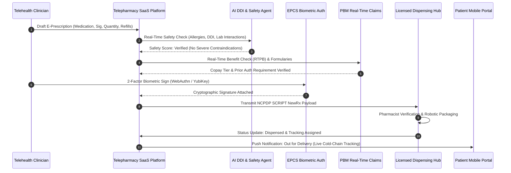
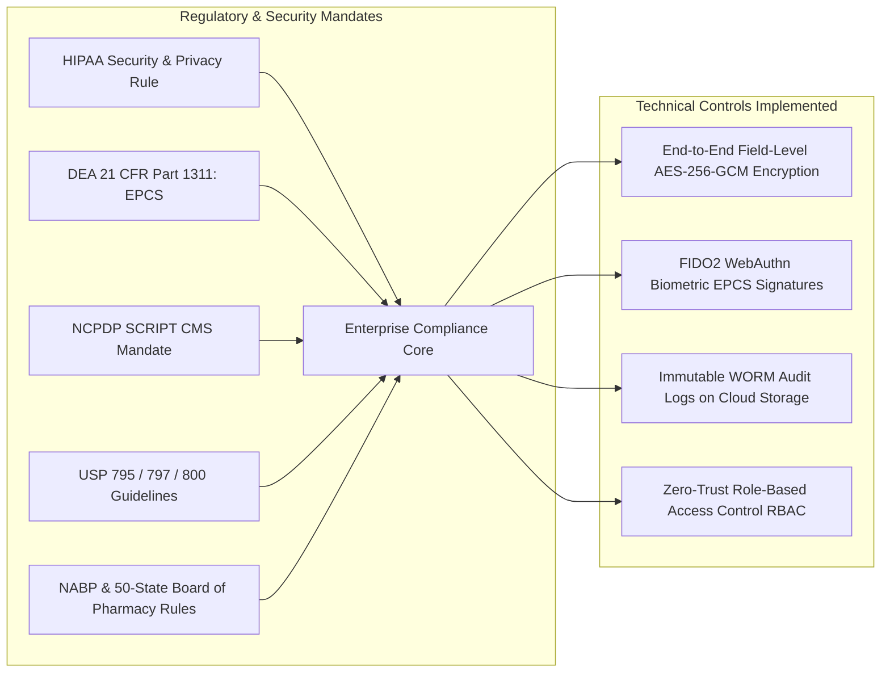

Are you looking to build a multi-tenant **Telepharmacy SaaS**, launch an **E-Prescribing (e-Rx) platform for digital health clinics**, or engineer a direct-to-consumer **compounding and mail-order fulfillment network** in 2026?

The explosive growth of virtual care, GLP-1 weight loss protocols, specialized telehealth clinics, and mail-order home delivery has transformed pharmacy operations into one of the highest-margin, most critical verticals in digital health. Digital health providers no longer rely on cumbersome legacy pharmacy management systems (PMS) designed thirty years ago for retail storefronts. Instead, modern clinics and digital health brands demand headless, API-first telepharmacy platforms that automate the entire prescription lifecycle—from provider clinical decision support (CDS) to nationwide routing, real-time insurance adjudication, automated robotic dispensing, and home doorstep delivery.

However, developing a compliant, enterprise-grade telepharmacy and e-prescribing SaaS platform is an engineering and regulatory feat. Software architects must implement strict DEA Electronic Prescriptions for Controlled Substances (EPCS) two-factor authentication, certify against the latest **NCPDP SCRIPT v2023061** standards (mandated by CMS), integrate clinical Drug-Drug Interaction (DDI) decision engines, manage real-time inventory across distributed central-fill hubs, and enforce 50-state board of pharmacy compliance.

Here is the definitive architectural blueprint and engineering guide to building a scalable, HIPAA-compliant, AI-powered Telepharmacy & E-Prescribing SaaS platform in 2026.


---

## The 2026 Paradigm: From Manual Pharmacy Counters to Autonomous Telepharmacy Hubs

Traditional retail pharmacy workflows suffer from chronic administrative bottlenecks, manual phone consultations, paper faxes, and delayed prior authorizations.

### Why Legacy Pharmacy Systems Fail Modern Digital Health:
1. **Siloed, Disjointed Infrastructure:** Legacy systems (e.g., legacy PMS on Windows Server on-premise) cannot integrate with modern telehealth webhooks, React Native mobile apps, or asynchronous clinician consult queues.
2. **Alert Fatigue & Primitive Drug Interaction Checks:** Outdated rule engines fire hundreds of non-critical warnings per shift, leading pharmacists to override critical contraindications or delay routine refills.
3. **Manual EPCS & Controlled Substance Auditing:** Manual logging of Schedule II–V prescriptions leads to DEA compliance violations, chain-of-custody gaps, and severe regulatory fines.
4. **Lack of Real-Time Multi-State Routing:** Digital health brands operating across all 50 states require dynamic routing based on patient location, pharmacist state licensure, medication stock availability, and compounding vs. commercial NDC requirements.

### The 2026 Modern Standard: Autonomous Telepharmacy & E-Rx 3.0
* **Headless, API-Driven NCPDP SCRIPT Core:** Direct integration with Surescripts, Change Healthcare, and private pharmacy clearinghouses supporting `NewRx`, `RxChange`, `CancelRx`, `RxRenewal`, and `GetMedicationHistory` transactions.
* **Agentic Drug-Drug & Genomic Interaction Engine:** LLM-assisted pharmacology agents cross-reference patient EHR allergy profiles, metabolic pathways (CYP450 enzyme interactions), lab panels (e.g., eGFR renal clearance), and active prescription histories in real time.
* **Zero-Trust EPCS Authentication:** Cryptographically verified biometric and FIDO2 WebAuthn multi-factor authentication with tamper-evident digital signatures matching DEA 21 CFR Part 1311 mandates.
* **Distributed Central-Fill & 340B Orchestration:** Dynamic order splitting and routing algorithms that direct orders to local retail partners, specialized 503A/503B compounding facilities, or central-fill robotic dispensing hubs.

> **Key Industry Metric:** Modern automated telepharmacy platforms reduce prescription turnaround time from **4.2 days to under 4 hours**, decrease medication dispense errors by **94%**, and increase patient treatment adherence by **38%** through automated SMS refills and digital courier tracking.

---

## End-to-End Technical Architecture of an Enterprise Telepharmacy SaaS

A production telepharmacy SaaS platform must manage high-throughput transactional messaging, mission-critical real-time clinical validations, and end-to-end encrypted audit logging across healthcare providers, pharmacy networks, and patient portals.

```mermaid
graph TD
    subgraph Client & Ingress Tier
        A1[Telehealth Clinical Portal: Next.js] -->|HTTPS / WSS| B[Kong API Gateway & WAF]
        A2[Patient Mobile App: iOS & Android] -->|OAuth2 / MTLS| B
        A3[Third-Party EHR / EMR REST Webhooks] -->|API Key + HMAC| B
    end

    subgraph Core E-Prescribing & Clinical Engine
        B --> C[E-Prescribing Microservice: Node / Go]
        C --> D[NCPDP SCRIPT v2023061 Engine]
        C --> E[EPCS 2-Factor Biometric Signer]
        C --> F[AI Pharmacology & DDI Safety Agent]
    end

    subgraph Clearinghouse & Health Network Integrations
        D -->|NCPDP SCRIPT / AS2 / VPN| G[Surescripts / Clearinghouse Hub]
        D -->|HL7 FHIR R4| H[Health Systems / Epic / Cerner]
        D -->|NCPDP Telecommunication vD.0| I[PBM Real-Time Adjudication & Copay]
    end

    subgraph Dispensing, Compounding & Logistics
        C --> J[Order Routing & Smart Fulfillment Broker]
        J --> K[Central-Fill Robotic Dispenser / ScriptPro]
        J --> L[503A/503B Compounding Batching Engine]
        J --> M[Cold-Chain Logistics & Carrier API: FedEx / Shippo]
    end

    subgraph Data & Immutable Compliance Tier
        C --> N[(PostgreSQL RLS: Multi-Tenant Core DB)]
        E --> O[(Tamper-Proof Audit Ledger: AWS QLDB / Immutable Log)]
        F --> P[(Vector Store: pgvector / Clinical Knowledge Base)]
    end
```

### Core Architectural Layers:

1. **API Ingress & Identity Federation:** Kong API Gateway handles mutual TLS (mTLS), token validation via SMART on FHIR / OAuth 2.0, and rate-limiting across provider clinical clients and external EHR webhooks.
2. **NCPDP SCRIPT Protocol Parser:** Converts internal clinical prescription JSON structures into compliant NCPDP SCRIPT 2023061 XML messages, managing asynchronous acknowledgment loops (`Status`, `Verify`, `Error`).
3. **AI Pharmacology & Safety Agent:** Evaluates polypharmacy risks against First Databank (FDB) or Lexicomp clinical knowledge graphs, extracting unstructured physician notes and warning of dosage anomalies against patient body surface area or renal function.
4. **EPCS Biometric Signing Engine:** Implements FIDO2/WebAuthn hardware tokens and biometric verification (passkeys) paired with two-tier cryptographic private key signing, fulfilling DEA third-party audit certification requirements.
5. **Intelligent Fulfillment Broker:** Evaluates order metadata (sterile compounding vs. oral solid, cold-chain refrigeration requirement, patient geo-coordinates, provider state licensure) to dynamically assign dispensing tasks to the optimal licensed facility.

---

## The Prescription Lifecycle: Sequence of Execution

Understanding the complete lifecycle of a digital prescription from clinical encounter to front-door courier delivery:



---

## Technical Deep-Dive: Implementing NCPDP SCRIPT 2023061 & Real-Time E-Prescribing

The CMS mandate enforces the **NCPDP SCRIPT Standard Version 2023061**, requiring support for structured Sig instructions, electronic prior authorization (ePA), real-time prescription benefits (RTPB), and digital change requests.

### Key NCPDP SCRIPT Transaction Messages:
* `NewRx`: Standard creation and transmission of a new prescription from prescriber to pharmacy.
* `RxChangeRequest` / `RxChangeResponse`: Bi-directional negotiation between pharmacist and prescriber (e.g., generic substitution, dosage modification, out-of-stock alternative).
* `CancelRx` / `CancelRxResponse`: Immediate cancellation of an unfulfilled prescription (critical for safety recalls or dosage adjustments).
* `RxRenewalRequest` / `RxRenewalResponse`: Automated refill authorizations from patients or pharmacies.
* `RxFill`: Automated fill-status notifications sent from the pharmacy back to the prescriber EHR (e.g., Dispensed, Partial Fill, Transferred, Never Picked Up).

### Sample Implementation: Structured E-Prescription Ingestion Endpoint (Python / FastAPI)

Here is a production-grade FastAPI snippet illustrating how a telepharmacy SaaS platform receives, validates, runs AI safety checks on, and queues an e-prescription for NCPDP translation:

```python
from fastapi import FastAPI, Depends, HTTPException, status, Header
from pydantic import BaseModel, Field
from typing import List, Optional
import hmac
import hashlib
import time

app = FastAPI(title="TodayInTech Telepharmacy E-Rx Engine", version="2026.1")

class MedicationItem(BaseModel):
    ndc: str = Field(..., description="National Drug Code (11 digits)")
    drug_name: str
    strength: str
    dosage_form: str
    sig_structured: dict = Field(..., description="Structured dosage, frequency, and duration")
    quantity_value: float
    quantity_unit_code: str
    refills_allowed: int = 0
    days_supply: int
    is_controlled_substance: bool = False
    dea_schedule: Optional[str] = None

class PrescriptionPayload(BaseModel):
    encounter_id: str
    prescriber_npi: str
    prescriber_dea: Optional[str] = None
    patient_id: str
    patient_allergies: List[str]
    patient_active_meds: List[str]
    medication: MedicationItem
    fulfillment_routing_preference: str = "fastest_courier"

@app.post("/api/v1/erx/prescribe", status_code=status.HTTP_201_CREATED)
async def create_and_route_prescription(
    payload: PrescriptionPayload,
    x_epcs_signature: Optional[str] = Header(None),
    x_clinic_tenant_id: str = Header(...)
):
    # 1. EPCS Validation for Controlled Substances
    if payload.medication.is_controlled_substance:
        if not x_epcs_signature or not payload.prescriber_dea:
            raise HTTPException(
                status_code=status.HTTP_401_UNAUTHORIZED,
                detail="EPCS 2-Factor cryptographic signature and Prescriber DEA required for controlled substances."
            )

    # 2. Automated AI Drug-Drug & Allergy Screening
    contraindications = evaluate_pharmacology_safety(
        medication_ndc=payload.medication.ndc,
        medication_name=payload.medication.drug_name,
        patient_allergies=payload.patient_allergies,
        current_medications=payload.patient_active_meds
    )

    if contraindications.get("has_severe_conflict"):
        return {
            "status": "REJECTED_SAFETY_ALERT",
            "reason": contraindications.get("alert_message"),
            "suggested_alternatives": contraindications.get("alternatives")
        }

    # 3. Compile NCPDP SCRIPT 2023061 XML Payload and Dispatch to Routing Queue
    transaction_id = f"ERX-{int(time.time())}-{payload.patient_id[:8]}"

    return {
        "status": "QUEUED_FOR_DISPENSING",
        "transaction_id": transaction_id,
        "ncpdp_version": "2023061",
        "pbm_adjudication_status": "REAL_TIME_ELIGIBILITY_CONFIRMED",
        "assigned_fulfillment_hub": "HUB_NORTHEAST_AUTOMATED_CENTRAL"
    }

def evaluate_pharmacology_safety(medication_ndc: str, medication_name: str, patient_allergies: List[str], current_medications: List[str]) -> dict:
    return {"has_severe_conflict": False, "alert_message": None, "alternatives": []}
```

---

## Comparative Analysis: Legacy Retail PMS vs. Modern AI Telepharmacy SaaS

| Feature Dimension | Traditional Retail PMS (Legacy) | Modern AI Telepharmacy SaaS (2026) |
| :--- | :--- | :--- |
| **Architecture** | On-Premise Monolith / Local Windows Server | Multi-Tenant Cloud Microservices (Kubernetes / Serverless) |
| **API Connectivity** | Proprietary VPNs, CSV batch dumps, manual faxes | Headless REST, GraphQL, Webhooks, SMART on FHIR |
| **NCPDP Standard** | Legacy SCRIPT v10.6 / Outdated flat files | Mandated NCPDP SCRIPT v2023061 + Real-Time Benefit Check (RTPB) |
| **EPCS Compliance** | Third-party hardware keyfobs with manual desktop sync | Cloud-native WebAuthn / Passkeys + FIDO2 Zero-Trust Biometrics |
| **Clinical Decision Support** | Static threshold alerts with 90% override rates | Agentic contextual AI (longitudinal EHR, labs, pharmacogenomics) |
| **Fulfillment & Logistics** | Local in-store pickup counter | Automated 50-state routing, 503A/503B compounding, cold-chain IoT |
| **Prior Authorization (ePA)** | 3-5 day manual phone/fax payer review | Real-time automated electronic Prior Authorization (ePA) in < 60 seconds |
| **Patient Experience** | Physical pharmacy queues and telephone automated menus | Branded mobile app, SMS 1-click refilling, live GPS courier tracking |

---

## Specialized Compounding & 503A/503B Telehealth Integration Workflows

One of the largest growth areas in digital health is customized telemedicine treatments—such as peptide therapies, GLP-1 compounding, customized dermatology topicals, and hormone replacement therapy (HRT).

Building software for compounding pharmacies introduces specialized regulatory and formulation workflows:

1. **Dynamic Master Formulation Records (MFR):** Software-managed chemical formulation sheets specifying exact Active Pharmaceutical Ingredient (API) lots, excipients, Beyond-Use Dating (BUD) calculations based on USP <795> (non-sterile), USP <797> (sterile), and USP <800> (hazardous drugs).
2. **Automated Batch Lot Tracking & Quality Assurance:** Digital integration with analytical weighing scales and compounding hoods to record exact milligram measurements and certificate of analysis (COA) records.
3. **State Board of Pharmacy Virtual Verification:** High-definition multi-camera station recordings capturing pharmacist visual sign-offs before packaging, ensuring complete audit traceability.
4. **Telepharmacy Remote Patient Counseling:** Integrated HIPAA-compliant WebRTC video rooms where licensed clinical pharmacists conduct synchronous teleconsultations before first dose administration.

---

## Security, HIPAA Zero-Trust, and DEA Regulatory Compliance

Building pharmacy software requires adherence to overlapping regulatory frameworks:



### Essential Technical Controls:
* **Field-Level Tokenization:** Sensitive patient identifiers and prescription payloads are tokenized using AES-256-GCM prior to database persistence.
* **Write Once, Read Many (WORM) Audit Trails:** DEA regulations require audit logs to be immutable. Every prescription creation, modification, signature, and dispense event is recorded to append-only storage.
* **National Drug Code (NDC) & GCN Sequence Mapping:** Built-in translation between Clinical RxNorm concepts from the prescriber EHR to commercial NDC package codes and package sizes.
* **State Licensure Geo-Fencing:** Automatic validation checking that both the prescribing clinician and the dispensing pharmacist maintain active, unrestricted licenses in the patient's delivery state.

---

## Frequently Asked Questions

### What is NCPDP SCRIPT 2023061 and why is it mandatory?
The NCPDP SCRIPT Standard Version 2023061 is the updated national data exchange standard mandated by CMS for all Medicare Part D and commercial electronic prescribing. It introduces structured dosing, digital change requests (RxChange), real-time benefit inquiries (RTPB), and enhanced electronic prior authorization (ePA).

### What are the DEA requirements for EPCS (Electronic Prescriptions for Controlled Substances)?
DEA 21 CFR Part 1311 mandates that software for e-prescribing controlled substances (Schedules II–V) must use two-factor authentication (something you know, something you have, or something you are), undergo an independent third-party audit/certification, and maintain tamper-evident audit logs.

### Can TodayInTech build custom 503A and 503B compounding pharmacy software?
Yes. TodayInTech specializes in custom compounding pharmacy management software, including USP 795/797/800 compliant batch records, lot traceability, beyond-use dating (BUD) engines, and multi-state pharmacist teleconsultation integrations.

### How does TodayInTech's zero-upfront payment model work?
TodayInTech develops a working, functional prototype of your custom telepharmacy or healthtech software first. You review and test the actual software prototype with zero financial commitment before proceeding with full-scale development.

---

## Why Choose TodayInTech as Your Telepharmacy & HealthTech Engineering Partner?

Building a custom, HIPAA-compliant Telepharmacy & E-Prescribing SaaS platform from scratch is fraught with compliance risks, protocol intricacies, and integration hurdles.

At **TodayInTech**, we specialize in architecting and deploying cutting-edge digital health, telemedicine, and telepharmacy platforms:

* **Zero Upfront Payment Model:** We build your working software prototype first. You test and validate the functional prototype before committing to development fees.
* **Deep Protocol & Clearinghouse Expertise:** Pre-built, battle-tested integrations for Surescripts, Change Healthcare, NCPDP SCRIPT 2023061, SMART on FHIR R4, and EPCS certification.
* **50-State Telehealth Architecture:** Multi-tenant infrastructure engineered for rapid nationwide scaling, automated state board compliance, and distributed fulfillment routing.
* **End-to-End Enterprise Delivery:** From intuitive clinician portals and patient mobile apps to robotic dispensing integrations and real-time courier tracking.

**Ready to launch or modernize your Telepharmacy & E-Prescribing platform in 2026?** [Schedule a 30-minute technical consultation with our engineering team today](https://calendly.com/todayintechdotin/30min).
