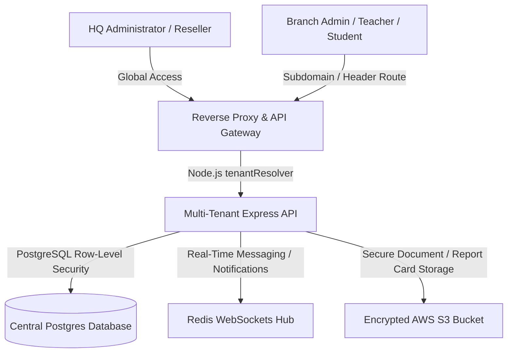

Are you looking to launch a branded SaaS product for educational institutions or deploy a multi-tenant student information system in 2026? Here is the comprehensive engineering blueprint for developing a high-performance, white-label school management system and integrated campus management system ERP.

## The Need for Multi-Branch School Management Software & Campus ERPs

Educational networks—ranging from local school districts to international multi-branch academies—are facing severe operational inefficiencies. Administrative workloads, student admissions, fee tracking, and lesson planning are frequently fragmented across outdated, standalone tools. These disjointed applications result in manual errors, delayed financial reporting, and poor parent engagement.

In 2026, progressive software consultants and resellers are bypassing generic off-the-shelf software to deploy unified, **white-label school ERP software**. By utilizing a single multi-tenant database engine with robust row-level security, resellers can offer a fully branded, localized, and compliance-ready campus management system to multiple school networks, generating high-margin monthly recurring revenue (MRR).


---

## Technical Architecture of a Multi-Branch Education ERP

Managing a multi-branch school system requires a central administrative hub (HQ) paired with isolated, tenant-specific branch dashboards. The architecture below shows how request routing, role-based access control (RBAC), and data segregation operate at scale:



### 1. Unified Multi-Branch Data Partitioning
Instead of configuring a separate database instance for each school branch—which drastically increases hosting overhead and makes global updates impossible—we leverage a shared schema with PostgreSQL Row-Level Security (RLS). Every table contains both `tenant_id` (the school district) and `branch_id` (the specific campus), allowing query results to adapt dynamically based on the active user session context:

```sql
-- Enable Row Level Security on the student records table
ALTER TABLE student_records ENABLE ROW LEVEL SECURITY;

-- Create policy ensuring users can only read/write their branch data
CREATE POLICY branch_isolation_policy ON student_records
    USING (tenant_id = current_setting('app.current_tenant_id') 
           AND branch_id = current_setting('app.current_branch_id'));
```

### 2. Automated School Fee Collection Software White Label
A primary requirement for school administration is billing automation. The ERP features an automated fee schedule engine. Integrating payment platforms like Stripe or Razorpay, it generates PDF invoices, distributes WhatsApp/email reminders to parents, processes fee waivers, and reconciles ledger balances instantly.

### 3. Custom Student Portal App Development
Parent-teacher-student coordination requires a dedicated web and mobile interface. By using progressive web apps (PWAs), developers can launch high-performance portals without compiling separate apps for Android and iOS app stores.

---

## Comparing EdTech Software Architectures: Custom vs. White-Label

Launching a campus management system from scratch is a significant undertaking. Below is an engineering comparison of development paths:

| Feature | Legacy On-Premise SIS | Custom-Built Cloud ERP | White-Label School ERP (TodayInTech) |
|---|---|---|---|
| **Time-to-Market** | 6 - 9 Months (manual installation per site) | 10 - 15 Months (full development lifecycle) | 2 - 3 Weeks (branded, pre-configured deployment) |
| **Upfront Cost** | High licensing and local hardware setups | $150,000+ custom software engineering | Low monthly subscription / API pricing |
| **Multi-Branch Control** | Disconnected data per branch | Complex custom schema synchronization | Native multi-branch hierarchies built-in |
| **Tenancy Isolation** | Single-tenant (installed per school) | Custom tenant configuration | Out-of-the-box RLS database tenancy |
| **Reseller Rights** | None (locked proprietary vendor license) | Own intellectual property | Full rebranding & custom sub-billing |
| **Fee Collection** | Manual ledger entries and cash processing | Custom-developed API gateways | Automated recurring billing and dynamic invoicing |

---

## Technical Snippet: Multi-Branch Database Session Middleware

Below is an example of an Express.js middleware function used to parse and set the active tenant and branch session variables in the PostgreSQL database transaction pool before executing queries:

```javascript
// middleware/dbSessionHandler.js
const { dbPool } = require('../config/database');

async function dbSessionHandler(req, res, next) {
  const user = req.user; // Set by preceding authentication middleware
  
  if (!user) {
    return res.status(401).json({ error: 'User session not authenticated' });
  }

  try {
    // Acquire a client from the database connection pool
    const client = await dbPool.connect();
    
    // Set local transaction variables for Row-Level Security
    await client.query(`SET LOCAL app.current_tenant_id = '${user.tenantId}';`);
    await client.query(`SET LOCAL app.current_branch_id = '${user.branchId}';`);
    
    // Attach the configured client to the request context
    req.dbClient = client;
    
    // Release the client back to the pool once the response is finished
    res.on('finish', () => {
      client.release();
    });
    
    next();
  } catch (error) {
    console.error('Failed to initialize db session variables:', error);
    res.status(500).json({ error: 'Internal server database error' });
  }
}

module.exports = dbSessionHandler;
```

---

## Frequently Asked Questions (FAQ)

### What is a white-label school ERP software?
A white-label school ERP is a pre-built student information and school administration platform that an agency, consultant, or software reseller can rebrand under their own logo, colors, and domain, enabling them to market it as their own proprietary SaaS product.

### How does multi-branch school management software handle unified reporting?
The database uses hierarchical row-level security. A global HQ administrator can bypass individual branch filters to pull aggregated reports (like total fee collections or enrollment trends) across all campuses, while branch staff are strictly limited to their local campus records.

### How do we determine the school database management system cost?
The cost is determined by the deployment architecture. Self-hosting a monolithic database on basic cloud servers can be cheap ($50/month), but scaling to a multi-branch tenant-isolated PostgreSQL cluster on AWS with failover backups typically starts around $300-$800/month depending on query volume and document storage.

### Does TodayInTech customize school ERP software for resellers?
Yes. TodayInTech provides a complete white-label school management system and campus ERP. We handle domain mapping, custom logo branding, payment gateways integrations, and local language localization. Contact us to schedule a demo.

---

## Launch Your Educational SaaS Today

Are you ready to launch a branded school management system or student information platform? TodayInTech's experienced software engineering team specializes in scalable database architectures, secure multi-tenant portals, and modern EdTech integrations.

* **Learn more about our services:** [Explore TodayInTech Projects](/projects/school-management-system.html)
* **Get in touch with an expert:** [Book a Consultation Demo](/bookademo/)
