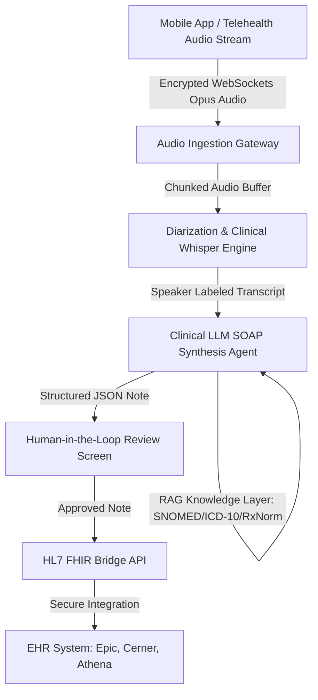
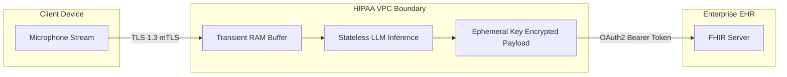

Are you looking to build a multi-tenant ambient clinical intelligence platform, integrate automated AI medical scribing into your telemedicine app, or launch a HIPAA-compliant healthcare SaaS in 2026? Here is the comprehensive engineering blueprint for architecting, training, securing, and integrating an autonomous AI medical scribe into electronic health records (EHR) and telehealth workflows.

## The Crisis of Clinical Documentation and the Ambient AI Revolution

Physician burnout has reached unprecedented levels. Modern clinicians spend upwards of **two hours on electronic health record (EHR) charting for every single hour of direct patient care**. This "pajama time"—hours spent typing encounter summaries, checking ICD-10 codes, and formatting SOAP (Subjective, Objective, Assessment, Plan) notes late into the night—erodes clinical productivity and degrades patient-doctor interactions.

In 2026, the paradigm is shifting permanently toward **ambient clinical intelligence**. Instead of requiring physicians to manually type notes or dictate rigid bullet points after consultations, ambient AI medical scribes passively listen to natural conversations between clinicians and patients in the exam room or during telehealth sessions. 

Using multi-speaker diarization, domain-adapted clinical language models, and direct FHIR/HL7 EHR data pipelines, these platforms synthesize natural clinical dialogue into structured, audit-ready clinical notes within seconds.

> **Key Architectural Takeaway:** Implementing an ambient AI medical scribe cuts clinician administrative charting time by over 70%, increases daily patient throughput by 20%, and significantly reduces coding errors and claim denial rates.

---

## Technical Architecture of an Ambient AI Medical Scribe Platform

Constructing a production-grade, enterprise healthcare scribe requires an asynchronous, event-driven streaming pipeline designed for sub-second latency, high clinical accuracy, and strict regulatory isolation.

### 1. Low-Latency Encrypted Audio Streaming & Diarization
* **Audio Capture:** Audio is captured at 16kHz/24kHz via mobile apps (iOS/Android) or embedded WebRTC audio streams in [custom telemedicine platforms](/projects/mednowna.html).
* **Transport:** Audio packets are encoded using the Opus codec and streamed via secure TLS 1.3 WebSockets (`wss://`) to the edge ingestion broker.
* **Speaker Diarization:** Acoustic embeddings separate the audio into distinct conversational tracks—distinguishing the physician's queries from the patient's symptoms and caregiver inputs.

### 2. Domain-Fine-Tuned Clinical Transcription (ASR)
Standard off-the-shelf automatic speech recognition (ASR) engines routinely fail on complex medical terminology, pharmaceutical brand names, and rapid clinical jargon. 
* Systems employ fine-tuned medical Whisper or Conformer models trained on curated clinical audio corpuses.
* Real-time vocabulary biasing injects patient context (past medical history, current medications) dynamically into the decoding graph, eliminating acoustic hallucinations.

### 3. Clinical LLM Prompt Orchestration & SOAP Note Synthesis
Once the multi-speaker transcript is compiled, an orchestration pipeline parses the text using domain-specialized LLMs (such as Med-PaLM, fine-tuned Llama-3-Med, or Claude 3.5 Sonnet under Business Associate Agreements):
* **Subjective:** Filters conversational rapport and extracts chief complaints, history of present illness (HPI), and review of systems (ROS).
* **Objective:** Synthesizes physical examination findings, vital signs, and lab observations discussed during the visit.
* **Assessment & Plan:** Formulates differential diagnoses mapped to standard billing ontologies (**ICD-10-CM**, **CPT**, and **SNOMED-CT**) alongside prescribed pharmaceutical regimens (**RxNorm**).

### 4. FHIR & HL7 Bi-Directional Interoperability
Once the clinician approves or edits the generated note in the review interface, the platform converts the structured payload into standard **HL7 FHIR (Fast Healthcare Interoperability Resources)** resources:
* `DocumentReference` for the unformatted clinical narrative.
* `Condition` for newly diagnosed medical problems.
* `MedicationRequest` for newly prescribed therapies.
* `Encounter` update to mark the clinical session complete across Epic, Oracle Cerner, Athenahealth, or eClinicalWorks.

---

## Architectural Comparison: Clinical Documentation Paradigms

| Capability | Legacy Human Medical Scribes | First-Gen Voice Dictation (e.g., Dragon) | Modern Ambient AI Scribe (TodayInTech) |
|---|---|---|---|
| **Operational Overhead** | High ($25–$35/hr per clinician) | Moderate software license | Highly scalable per-seat/per-encounter SaaS |
| **Workflow Impact** | Invasive in-room human presence | Requires unnatural dictation commands | Completely ambient & passive conversation capture |
| **Turnaround Time** | 2–6 hours post-encounter | Immediate but requires manual correction | Instant (< 30 seconds post-encounter) |
| **EHR Integration** | Manual entry by assistant | Desktop keyboard hook injection | Bi-directional FHIR / HL7 REST APIs |
| **Telehealth Compatibility** | Complex scheduling for 3-way calls | Poor multi-channel audio handling | Native WebRTC audio stream routing |
| **Diagnostic & Coding Suggestions**| Limited to human knowledge | None | Automated ICD-10, CPT, and HCC coding suggestions |

---

## HIPAA Compliance, Security & Zero-Data-Retention Architecture

Healthcare software development demands bulletproof adherence to statutory data protection standards, including **HIPAA (Health Insurance Portability and Accountability Act)**, **HITECH**, and **SOC 2 Type II**.

### Mandatory Security Controls for AI Scribe Systems:
1. **Business Associate Agreements (BAAs):** Every cloud infrastructure vendor (AWS, Google Cloud, Azure) and LLM model provider must execute an active BAA legally binding them to HIPAA security standards.
2. **Zero Data Retention (ZDR):** Audio recordings and raw speech transcripts should never be permanently stored on unencrypted object storage. Audio chunks are processed in ephemeral memory buffers (RAM) and securely purged immediately after the EHR transaction commits.
3. **Envelope Encryption (AES-256):** All Protected Health Information (PHI) in transit must enforce TLS 1.3 with forward secrecy. Ephemeral disk caches require AES-256 envelope encryption with customer-managed keys (AWS KMS / GCP Cloud KMS).
4. **De-Identification & Redaction Pipelines:** Integrated Named Entity Recognition (NER) filters redact direct identifiers (SSNs, phone numbers, addresses) prior to sending tokens to tertiary reasoning modules.
5. **Comprehensive Audit Trails:** Every access event, model inference, and EHR export generates immutable audit logs formatted according to NIST 800-53 controls.

---

## Recommended Technology Stack for Ambient AI Medical SaaS

When engineering high-throughput, secure healthcare software solutions in 2026, we recommend this enterprise-grade architecture:

* **Client & Mobile SDKs:** React Native, Flutter, or Swift/Kotlin with native audio filtering (beamforming, noise suppression).
* **Telehealth WebRTC Engine:** LiveKit / Janus WebRTC gateway for seamless telehealth consultation audio piping.
* **Transcription & ASR Microservices:** Python FastAPI microservices running Whisper v3 / Conformer on NVIDIA Triton Inference Server.
* **LLM Orchestration:** LangChain / LlamaIndex with custom clinical guardrails and structured JSON schema enforcement (Pydantic / Instructor).
* **Interoperability APIs:** SMART on FHIR, HL7 v2 MLLP adapters, HAPI FHIR Java / Python bridges.
* **Database & Caching:** PostgreSQL with row-level security (RLS) and Redis Cluster for ephemeral session state.

---

## Frequently Asked Questions (FAQs)

### How accurate are ambient AI medical scribes with heavy medical jargon?
Modern domain-fine-tuned clinical ASR models combined with context-injected LLM orchestration achieve greater than **98% clinical accuracy**. By pre-loading patient charts, medication lists, and specialty-specific vocabularies prior to the encounter, the system accurately transcribes complex terms, anatomical locations, and pharmacology without phonetic degradation.

### Does an AI medical scribe store patient voice recordings?
Under a standard **Zero-Data-Retention (ZDR)** architecture, audio streams are processed in transient memory buffers and destroyed immediately upon generating the structured EHR note. No patient biometric voiceprints or audio recordings are retained on cloud servers unless explicitly opted-in by the health system for training purposes.

### How does the system connect to our existing EHR (Epic, Cerner, Athenahealth)?
The platform communicates with EHR platforms using standardized **SMART on FHIR** REST APIs and HL7 integration engines. Clinicians launch the ambient scribe directly inside their EHR chart iframe, and the finalized SOAP note is pushed directly into the clinical encounter documentation tab with one click.

### Can this AI scribe be integrated into custom telehealth software?
Yes. TodayInTech specializes in building and integrating ambient AI scribes directly into [custom telemedicine software platforms](/projects/mednowna.html), eliminating the need for clinicians to run third-party background software during virtual video consultations.

---

## Partner with TodayInTech to Build Your Healthcare AI Platform

Building HIPAA-compliant AI medical software requires deep domain experience in real-time WebRTC audio processing, clinical language modeling, FHIR interoperability, and stringent regulatory compliance.

At **TodayInTech**, we build enterprise-grade [telemedicine platforms](/projects/mednowna.html), AI clinical assistants, and custom healthtech SaaS solutions with **zero upfront payment**—you only pay after reviewing your fully functional working prototype.

* Explore our [Telemedicine & HealthTech Software Solutions](/projects/mednowna.html)
* Learn about our [Startup MVP Engineering Model](/)
* [Schedule a Live Architectural Demo](/bookademo/) or [Contact our Engineering Team](/contact.html) to scope your healthcare AI project today.
