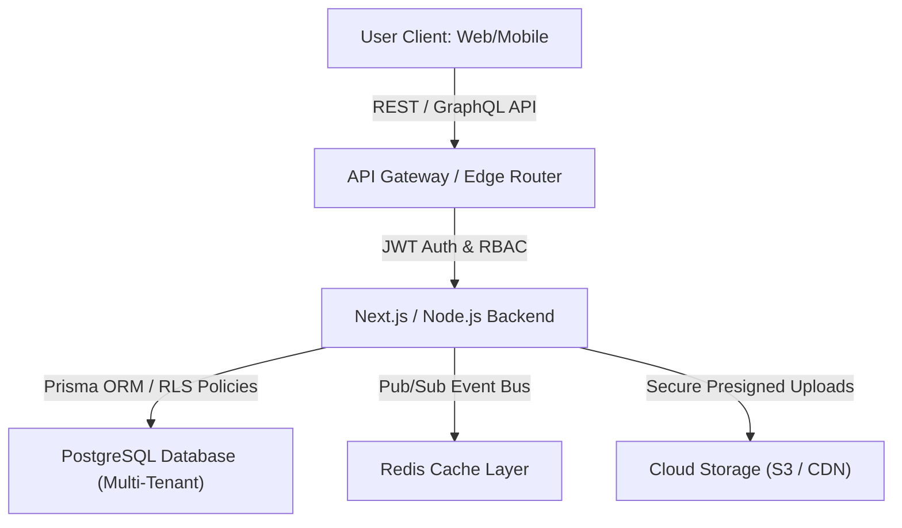

In the fast-evolving digital economy of 2026, speed-to-market is the ultimate competitive advantage for B2B tech startups. Launching a Minimum Viable Product (MVP) is no longer just about writing a basic codebase to validate an idea; it is about building a scalable, secure, and robust foundation that can scale from ten to ten thousand users without requiring a complete rewrite.

Whether you are launching an AI-powered SaaS, a FinTech portal, or a HIPAA-compliant healthcare tool, finding the right **startup MVP software development partner** is one of the most critical decisions a founder will make.

This technical guide breaks down the architecture of a modern B2B SaaS MVP, compares development models, and provides an engineering evaluation checklist to help you select a partner who can translate your product vision into code.

---

## 1. Technical Architecture of a Production-Ready SaaS MVP

A modern MVP must strike a delicate balance between development speed and architectural integrity. While monolithic frameworks were the standard in the past, modern cloud services and framework advancements allow agencies to deploy production-ready, multi-tenant apps with minimal effort.

A standard MVP architecture in 2026 utilizes serverless runtimes, real-time sync, and robust data isolation:

### Essential Architectural Pillars for MVPs:

1. **Row-Level Security (RLS) Database Tenancy**: In modern B2B SaaS applications, tenant isolation is non-negotiable. Using PostgreSQL with RLS policies ensures that data from one tenant is never leaked to another, even when queries run on shared hardware.
2. **State Management & Serverless Handlers**: Utilizing edge functions (such as Vercel Edge or AWS Lambda) minimizes server overhead and guarantees sub-second page loads globally.
3. **Decoupled API Design**: Implementing a clean REST or GraphQL API gateway allows your front-end team to iterate on user experience without breaking backend business logic.

---

## 2. Comparing Development Models: Custom, White-Label, and Low-Code

Founders must decide which path to choose when translating their specifications into a live software product. The table below compares the three primary engineering models available in 2026:

| Feature | Custom MVP Development | White-Label SaaS Engines | Low-Code / No-Code Wrappers |
| :--- | :--- | :--- | :--- |
| **Time to Market** | 8 - 12 Weeks | 2 - 4 Weeks | 1 - 2 Weeks |
| **Initial Investment** | Moderate to High | Low (Pre-built baseline) | Very Low |
| **Scalability** | Extremely High (Custom code ownership) | High (Configured tenant nodes) | Low (Vendor performance bottlenecks) |
| **Feature Flexibility** | Unlimited customization | Moderate (Theme & modular plugins) | Highly restricted by platform limits |
| **Maintenance Overhead** | Handled by engineering partner | Managed SaaS provider | Citizen-developer dependency |
| **Intellectual Property** | 100% Owned by Startup | Licensed or Partitioned | Locked in vendor platform |

Choosing a **white-label SaaS platform developer** is often the ideal choice for agencies and B2B resellers who want to deploy a pre-configured solution (like a School ERP or a Restaurant POS) immediately, whereas custom software development is necessary for novel proprietary IP.

---

## 3. How to Evaluate an MVP Software Partner: The Checklist

When evaluating potential **MVP software development services**, do not just rely on portfolio screenshots. Dive deep into their engineering culture, Git hygiene, and deployment practices:

* **Code Ownership & IP Clarity**: Does the developer sign a complete intellectual property assignment agreement? Ensure that the repository and all deployment assets are transferred to your startup's GitHub organization upon delivery.
* **Modern Tech Stack Competence**: Ensure they are building on modern, stable stacks (like TypeScript, Next.js, Node.js, and PostgreSQL) rather than outdated legacy technologies.
* **Security and Compliance Out-of-the-Box**: If you are in FinTech or Healthcare, your partner must understand regulatory requirements such as PCI-DSS, SOC 2, and HIPAA. Ask them about their database encryption practices and secure token handlers.
* **Flexible Engagement Models**: Leading B2B agencies in 2026 offer flexible structures, including milestone-based billing, equity-sharing, or developer-retainer models, reducing the initial burden on bootstrap startups.

---

## 4. Frequently Asked Questions (FAQs)

### What is the typical cost of developing a B2B SaaS MVP?
A production-ready custom MVP ranges from $15,000 to $45,000 depending on features, third-party integrations, and regulatory compliance. White-labeled platforms can be deployed for a fraction of that cost, typically between $5,000 and $10,000.

### Should startups use low-code/no-code platforms for their MVP?
Low-code platforms are excellent for quick, clickable prototypes to show investors. However, they struggle with custom API integrations, high-performance computing, data security, and long-term scalability. If you plan to scale, starting with a custom codebase saves you from doing a complete rewrite later.

### How do white-label SaaS developers speed up product launches?
A **white-label SaaS platform developer** uses a pre-built, production-tested software engine that already contains core features (like user authentication, billing, dashboard grids, and notification servers). They simply customize the branding, style guide, and domain mapping, reducing development time by up to 80%.

### How long does the MVP development cycle take?
A focused custom MVP project takes approximately 6 to 10 weeks from initial scoping and wireframing to production deployment on Vercel/AWS.

---

## Get Your MVP Built by TodayInTech

Are you ready to bring your software product to life? At **TodayInTech**, we specialize in providing elite **custom software agency for startups** services. We build high-performance web applications, multi-tenant B2B SaaS platforms, and mobile apps with clean code and transparent pricing.

* Explore our [custom software agency projects](/projects/) to see our work in action.
* Ready to plan your architecture? [Book a Demo](/bookademo/) with our engineering leads today.
* Or get a direct estimate with our team via our [Free Consultation](/free-consultation/) page.
