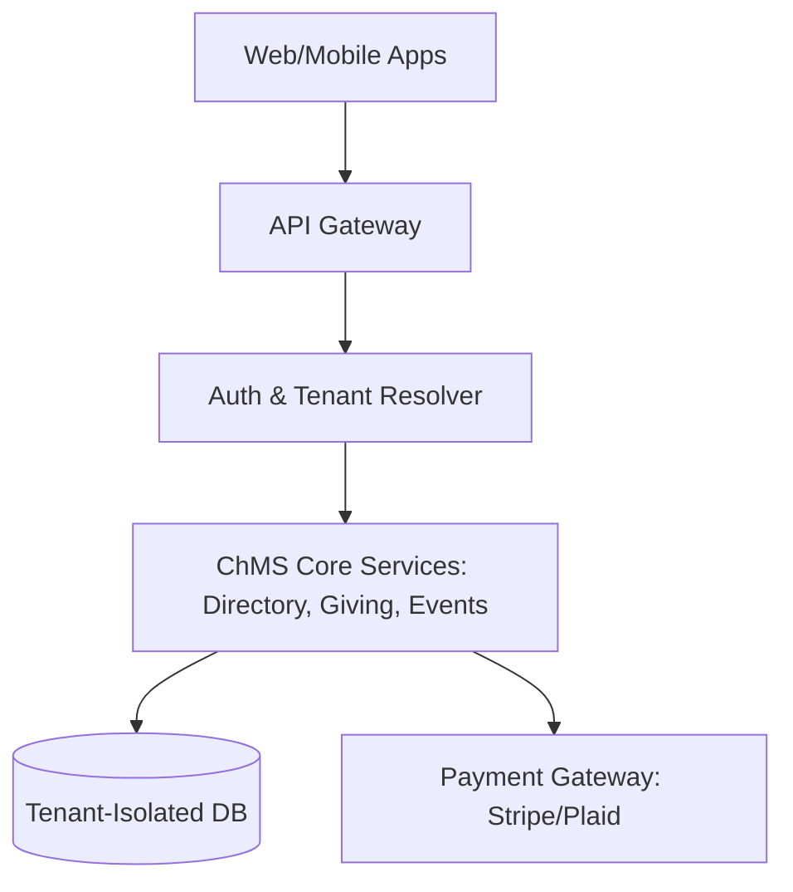

Are you looking to build a multi-tenant church administration platform, launch a white-label ChMS, or deploy a custom tithing and event scheduling ERP in 2026? Here is the comprehensive architectural blueprint for developing a high-performance, secure, and customizable church management software suite.

## The Need for Modern Church Management Systems (ChMS)

Faith-based organizations and non-profits oversee complex administrative operations daily. Managing member records, tracking tithes and donations, planning multi-branch events, and coordinating volunteer schedules require significant operational overhead. Many churches struggle with legacy software that siloes member data from financial accounting, causing high administrative friction, errors in donation receipts, and declining engagement.

In 2026, progressive software resellers and specialized agencies are deploying unified, **white-label church administration software**. By combining member directory management, automated contribution tracking, and local branch event planning into a single tenant-isolated platform, organizations can streamline operations, minimize paperwork, and build stronger engagement with their congregations.

> **Key Industry Trend:** Implementing a private label church management software allows developers and resellers to launch a fully customized, brand-ready ChMS to faith networks immediately, capturing high-margin recurring SaaS revenue with minimal engineering overhead.

---

## Technical Architecture of a Multi-Tenant ChMS Platform

To support hundreds of individual churches, thousands of staff administrators, and millions of congregants securely, a tenant-isolated SaaS architecture is crucial. Below is the technical data flow and system design layout.

### 1. Tenant Resolution & Router Middleware
A custom tenant resolver intercepts all incoming requests to determine the tenant context (e.g., `gracechurch.mychms.com` or header `X-Tenant-ID`). Once identified, the resolver configures connection pooling to point to the isolated database or schema for that specific organization, preventing cross-tenant data leaks.

### 2. Custom Donation & Tithing Integration
Financial stewardship is a cornerstone of church operations. An integrated ChMS requires integration with banking APIs like Plaid and payment processors (such as Stripe or CardConnect). The platform must support:
* **Recurring Tithing:** Automated weekly/monthly recurring bank transfers (ACH) and card payments.
* **Fund Accounting:** Allocating contributions to specific campaigns (e.g., building fund, missionary support, youth ministry).
* **Tax Receipt Compliance:** Automated generation of IRS-compliant annual giving statements.

### 3. Event Scheduling and Volunteer Allocation Engine
Managing service schedules, volunteer shifts, and room bookings requires a specialized scheduling matrix. The engine utilizes resource-locking mechanisms to prevent double-booking of pastors, musicians, or equipment across services.

---

## ChMS Methodologies Comparison

To understand the value of an enterprise-grade ChMS database solution, we compare traditional manual management practices with modern white-label platforms:

| Feature | Legacy / Manual Process | Modern White-Label ChMS (2026) |
|---|---|---|
| **Member Management** | Spreadsheets, physical member cards | Centralized cloud directory with family trees & portal |
| **Donation Ingestion** | Cash/checks in baskets, manual ledger entries | Integrated mobile giving, text-to-tithe, ACH, Plaid |
| **Event Planning** | Printed bulletin boards, text chains | Interactive calendar, automated volunteer scheduling |
| **Data Privacy** | Unsecured office computers | Encrypted database, Role-Based Access Control (RBAC) |
| **Mobile Integration** | None, email newsletters only | Native iOS/Android app with push notifications |
| **Tax Statements** | Manual receipt creation in January | One-click automated PDF tax statement compilation |

---

## Recommended Technology Stack for ChMS Development

For engineering teams building custom church management applications in 2026, we recommend the following tech stack:

* **Backend API Framework:** NestJS or Go (Golang) for rapid, structured API endpoints.
* **Mobile Experience:** React Native or Flutter to compile high-quality Android and iOS apps from a single codebase.
* **Database Management:** PostgreSQL with Row-Level Security (RLS) or separate database instances per tenant for maximum security.
* **Payment Ingestion:** Stripe Custom Connect or CardConnect for split-fee handling and white-label merchant boarding.
* **Email & SMS Notifications:** Twilio (for text updates) and SendGrid (for newsletters and receipt delivery).

---

## FAQs (Frequently Asked Questions)

### 1. How is data isolation maintained in a multi-tenant ChMS?
We utilize PostgreSQL Row-Level Security (RLS) policies along with connection pooling middleware. Every query is filtered by a tenant identifier validated by the JWT token, ensuring that staff members can only access their specific church records.

### 2. Can a church customize the look and feel of the platform?
Yes. Our private label church management software supports white-label theme configuration, including custom domains, branded color schemes, logos, and custom-branded emails/receipts.

### 3. How does the system handle secure tithing operations?
All financial credentials are tokenized. We never store credit card or bank routing numbers locally. Transactions are processed via PCI-DSS Compliant gateways, and tithing ledgers are stored as read-only audit-ready records.

### 4. Does the platform integrate with accounting tools like QuickBooks?
Yes. Modern ChMS databases support webhooks and automated daily synchronization with accounting systems to reconcile giving folders with bank deposits automatically.

---

## Get Started with Anonsoft ChMS Engineering Services

Are you ready to design a scalable, white-label church administration tool, launch a custom church donation platform, or engineer a native mobile app for your congregation? Anonsoft is your dedicated software development partner.

* Discover our custom ERP and SaaS systems at [projects/church-management-software.html](/projects/church-management-software.html).
* Speak directly with our lead architects and engineers by visiting [/bookademo/](/bookademo/).
