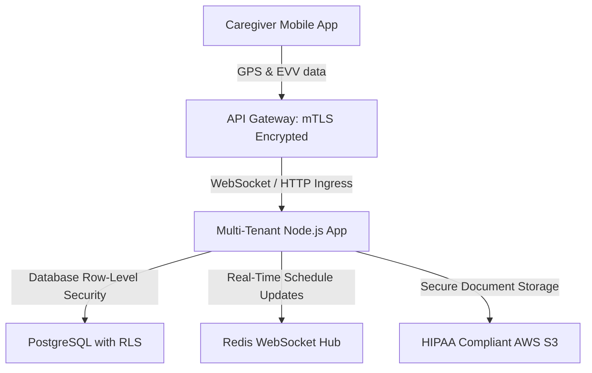

Are you looking to build a multi-tenant senior care platform, launch a white-label home care agency software, or deploy a caregiver scheduling ERP in 2026? Here is the comprehensive architectural blueprint for developing a high-performance, HIPAA-compliant senior care management platform and integrated mobile tracking system.

## The Need for Modern Home Care Agency Software and Senior Care ERPs

The demand for senior care and non-medical home care services is growing at an unprecedented rate. However, many agencies operate on legacy, fragmented platforms that fail to meet modern compliance standards. Key processes like caregiver schedule planning, client-caregiver matchmaking, billing, and Electronic Visit Verification (EVV) are often siloed across different software tools, leading to administrative errors and tracking inaccuracies.

In 2026, home care networks and software resellers are utilizing unified, **white-label home care agency software** with native mobile tracking. By leveraging a single, secure database engine and real-time GPS synchronization, agencies can automate scheduling, track visits in real-time, generate automated invoices, and offer dedicated access portals for families and administrators.

> **Key Industry Trend:** Implementing a white-label elder care portal software allows agencies and B2B software vendors to deploy a fully branded, compliance-ready platform immediately, capturing high-margin recurring revenue without the overhead of custom software engineering.


---

## Technical Architecture of a Multi-Tenant Home Care Platform

To support hundreds of care agencies, thousands of mobile caregivers, and families while ensuring strict HIPAA data isolation, a secure multi-tenant cloud architecture is essential.



### 1. Row-Level Security (RLS) Database Isolation
To ensure strict privacy and HIPAA compliance, preventing cross-tenant data leaks is a top priority. Rather than hosting separate databases for each agency, the platform utilizes PostgreSQL Row-Level Security (RLS). Every table contains an `agency_id` column, and connection policies automatically restrict reads and writes to the authenticated tenant context.

### 2. GPS Electronic Visit Verification (EVV) Integration
Under the 21st Century Cures Act, home health and personal care services must use EVV systems to verify visits. The caregiver mobile app tracks:
* **Identity Verification:** Multi-factor authentication of the caregiver.
* **Geofencing Verification:** Recording GPS coordinates at clock-in and clock-out to ensure they match the client's home location.
* **Time Tracking:** Real-time timestamp logging of visit start and end times.
* **Service Verification:** Digital checklists detailing tasks completed during the visit.

### 3. Smart Caregiver Matchmaking & Scheduling
Matching the right caregiver with a client depends on factors such as location proximity, client preferences, required medical skills, and scheduling availability. The matchmaking engine uses a weighted scoring algorithm to rank compatible caregivers and generates optimal shift rosters automatically.

---

## Comparing Home Care Software Architectures: Custom vs. White-Label

Choosing how to build or deploy a home care platform has significant timeline and budget implications:

| Feature | Legacy Home Care Software | Custom-Built Cloud ERP | White-Label Home Care SaaS (Anonsoft) |
|---|---|---|---|
| **Deployment Time** | 3 - 5 Months (manual setup per branch) | 9 - 14 Months (full development lifecycle) | 2 - 3 Weeks (branded, pre-built deployment) |
| **Development Cost** | High licensing and local setup fees | $140,000+ custom software engineering | Predictable monthly SaaS subscription |
| **EVV Compliance** | Third-party plugin required | Custom GPS verification module | Native, built-in GPS EVV tracking |
| **Family Portal Access** | None (desktop-only or paper reports) | Custom family app development | Fully responsive, real-time elder care portal |
| **Reseller Rights** | Strictly locked down | Proprietary control | Unlimited rebranding & custom sub-billing |

---

## Technical Snippet: EVV Geofence Validation Middleware

Below is an example of a Node.js helper function used to validate whether a caregiver's clock-in coordinates fall within a defined geofenced radius of the client's residence:

```javascript
// utils/geofenceValidator.js

/**
 * Calculates distance between two GPS coordinates using the Haversine formula.
 * @param {number} lat1 Latitude of caregiver clock-in
 * @param {number} lon1 Longitude of caregiver clock-in
 * @param {number} lat2 Latitude of client home
 * @param {number} lon2 Longitude of client home
 * @returns {number} Distance in meters
 */
function calculateDistance(lat1, lon1, lat2, lon2) {
  const R = 6371e3; // Earth's radius in meters
  const phi1 = (lat1 * Math.PI) / 180;
  const phi2 = (lat2 * Math.PI) / 180;
  const deltaPhi = ((lat2 - lat1) * Math.PI) / 180;
  const deltaLambda = ((lon2 - lon1) * Math.PI) / 180;

  const a =
    Math.sin(deltaPhi / 2) * Math.sin(deltaPhi / 2) +
    Math.cos(phi1) * Math.cos(phi2) *
    Math.sin(deltaLambda / 2) * Math.sin(deltaLambda / 2);
  const c = 2 * Math.atan2(Math.sqrt(a), Math.sqrt(1 - a));

  return R * c; // Distance in meters
}

/**
 * Validates if caregiver is within the geofenced radius of the client's home.
 * @param {object} clockInLoc { lat, lon }
 * @param {object} targetLoc { lat, lon }
 * @param {number} radius Allowed radius in meters (default: 100 meters)
 * @returns {boolean} True if within geofence, false otherwise
 */
function isWithinGeofence(clockInLoc, targetLoc, radius = 100) {
  const distance = calculateDistance(
    clockInLoc.lat,
    clockInLoc.lon,
    targetLoc.lat,
    targetLoc.lon
  );
  return distance <= radius;
}

module.exports = {
  isWithinGeofence,
  calculateDistance
};
```

---

## Frequently Asked Questions (FAQ)

### What is a white-label home care agency software?
A white-label home care agency software is a pre-developed senior care management and scheduling application that an agency or reseller can customize with their logo, brand colors, and custom domain name, enabling them to launch their own branded care SaaS product quickly.

### What is GPS Electronic Visit Verification (EVV) software compliance?
EVV compliance requires digital capture of caregiver visit details, including the service type, individual receiving the service, date, time, location (via GPS coordinates), and duration of the visit. Our platform integrates native geofencing to log and verify these visits automatically.

### Can Anonsoft customize caregiver scheduling software?
Yes. Anonsoft is a leading senior care agency software developer. We customize schedules, family portals, EVV integrations, and payment modules to match your exact agency workflows and operational requirements.

### Does the system support home health agency billing software?
Yes. The ERP features an automated billing and invoicing module that syncs caregiver logs and EVV approvals directly with invoice generators, generating electronic invoices and ledger entries for insurance claims and private pay clients.

---

## Launch Your Home Care SaaS Solution Today

Are you ready to build or launch a branded senior care or caregiver scheduling platform? Anonsoft's experienced software engineering team specializes in HIPAA-compliant cloud architectures, real-time tracking applications, and custom B2B SaaS deployments.

* **Learn more about our services:** [Explore Anonsoft Projects](/projects/)
* **Get in touch with an expert:** [Book a Consultation Demo](/bookademo/)
