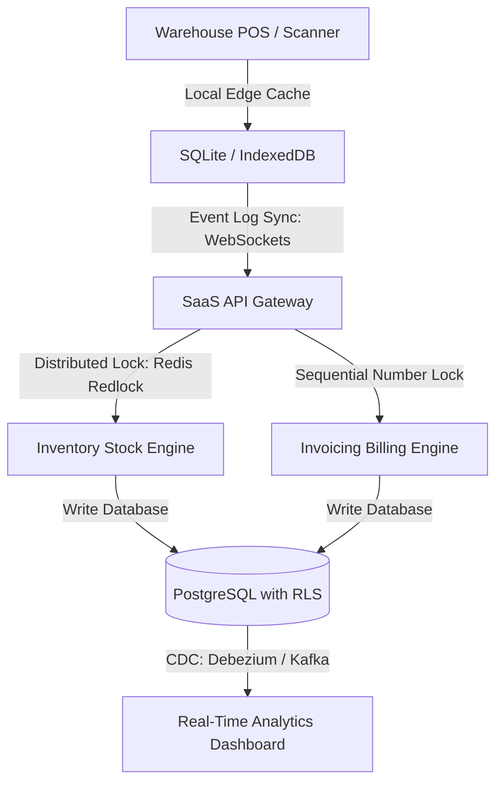

For modern B2B enterprises and reseller networks, managing stock levels across multiple locations while maintaining error-free billing is a massive logistical challenge. Fragmented legacy software often results in inventory sync lag, overselling, and disjointed invoicing processes.

To address these friction points, SaaS operators are launching unified, **white-label inventory software** solutions. By integrating multi-warehouse tracking and automated billing into a single tenant-isolated architecture, businesses can streamline their supply chain, automate invoice workflows, and white-label the software under their own brand for resellers.


---

## Technical Architecture of a Multi-Warehouse Inventory & Invoicing Platform

Engineering a high-performance inventory and billing SaaS platform requires a clean separation of concerns, robust transaction isolation, and real-time data streaming between local warehouse edge databases and the central cloud database.



### 1. Multi-Tenant Schema Isolation via Postgres RLS
When serving multiple B2B clients, keeping tenant data isolated is non-negotiable. Instead of deploying separate database instances (which increases infrastructure overhead), we utilize a shared database schema with PostgreSQL Row-Level Security (RLS). Every table contains a `tenant_id` column, and database queries are automatically filtered using session configuration variables:

```sql
ALTER TABLE inventory ENABLE ROW LEVEL SECURITY;

CREATE POLICY tenant_isolation_policy ON inventory
    USING (tenant_id = current_setting('app.current_tenant_id'));
```

### 2. Preventing Inventory Race Conditions
In a multi-warehouse ecosystem, two transactions might try to reserve the same SKU concurrently. To prevent double selling, we implement a distributed lock mechanism using Redis Redlock. Before modifying stock levels, the inventory worker acquires a lock on the specific SKU. If the lock cannot be acquired within 100 milliseconds, the transaction retries or declines the request.

### 3. Sequential Invoice Number Generation
Legal guidelines in many jurisdictions require sequential invoice numbers without gaps. A naive auto-incrementing integer key can fail during database rollbacks. We solve this by utilizing a database sequencing transaction lock, ensuring that the invoice number is only committed once the payment or credit check has fully succeeded.

---

## Comparing Inventory ERP Architectures: Custom vs. White-Label

Launching a proprietary B2B billing and stock platform has historically been a multi-year project. Here is how custom development compares with white-label SaaS integration:

| Feature | Legacy Desktop ERPs | Custom-Built Inventory SaaS | White-Label SaaS Platform (TodayInTech) |
|---|---|---|---|
| **Development Time** | 6 - 12 Months (on-site installation) | 9 - 14 Months (full development lifecycle) | 2 - 3 Weeks (branded, pre-built deployment) |
| **Development Cost** | $100,000+ upfront licensing fees | $150,000+ custom software engineering | Low monthly subscription / API pricing |
| **Multi-Location Sync** | Batch sync (usually runs overnight) | Real-time APIs (high overhead) | Native real-time multi-warehouse sync |
| **Rebranding & Reseller Rights** | Strictly locked down | Proprietary control | Unlimited rebranding & custom sub-billing |
| **Automatic Invoicing** | Manual generation / batch print | Custom built billing scripts | Automated PDF billing & GST/VAT tax calculators |

---

## Recommended Technology Stack for B2B SaaS Developers

For engineering teams looking to build robust inventory and invoicing systems in 2026, we recommend the following stack:

* **Backend & API:** Go (Golang) or Node.js (NestJS) for handling high-concurrency event logs.
* **Database Engine:** PostgreSQL for transactional consistency, combined with Redis for distributed locking and caching.
* **Offline Clients:** SQLite running locally on warehouse scanning tablets, using RxDB for real-time conflict-free replication.
* **Invoice Generation:** Node-canvas or Python's ReportLab for generating optimized, vector-based PDF invoices.
* **Frontend Dashboard:** Next.js or React with shadcn/ui for clean, dashboard visualization.

---

## Frequently Asked Questions (FAQ)

### What is white-label inventory software?
White-label inventory software is a pre-built stock and warehouse management platform that businesses can brand with their own logo, domain, and colors. This enables software resellers to launch a branded B2B SaaS without spending months writing code.

### How does multi-warehouse synchronization work in real-time?
Each warehouse runs a local edge node database that logs all stock movements (inbound, outbound, transfers). These events are synced via secure WebSockets to a central cloud API. If a connection goes offline, local changes are cached and automatically merged back using conflict resolution strategies once online.

### How does the invoicing engine handle different tax laws (e.g., GST or VAT)?
The invoicing system integrates a flexible tax calculation rule engine. Taxes are calculated dynamically on the backend based on the location of the warehouse (origin) and the customer's shipping address (destination), generating legally compliant invoices with customizable invoice templates.

### Does TodayInTech offer custom stock management software development?
Yes. TodayInTech provides a fully customizable white-label inventory and invoicing SaaS platform. Our engineering team can build customized modules, integrate local hardware (like barcode printers and scanners), and configure custom multi-warehouse routing rules. Contact us to schedule a demo.

---

## Elevate Your Supply Chain and Billing Operations

Ready to build a branded multi-warehouse inventory and billing SaaS platform? TodayInTech's software engineering team specializes in scalable database architecture, distributed systems, and modern SaaS dashboards.

* **Learn more about our services:** [Explore TodayInTech Projects](/projects/)
* **Get in touch with an expert:** [Book a Consultation Demo](/bookademo/)
