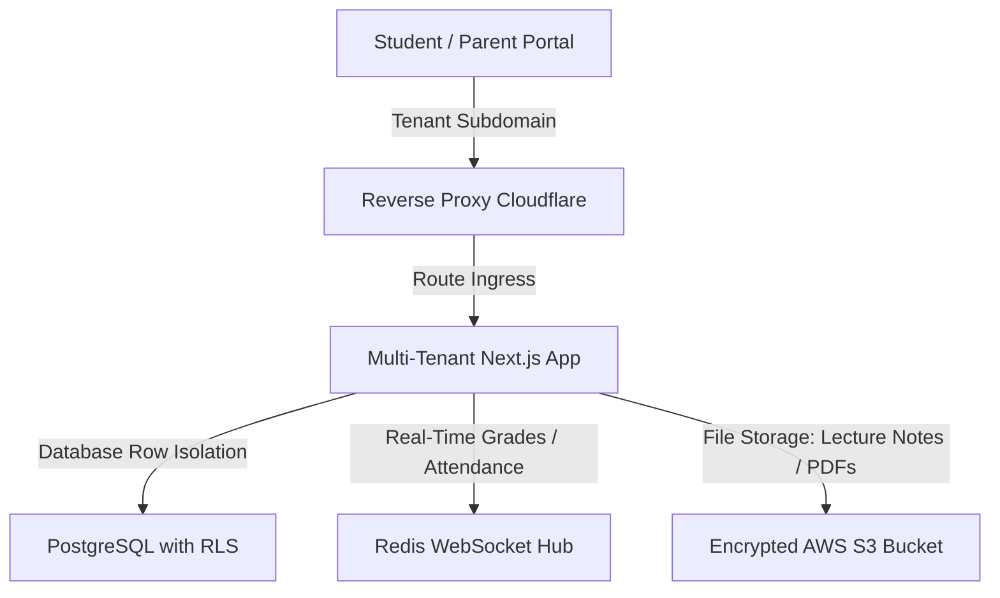

Are you planning to build a multi-tenant K-12 education platform or launch a branded SaaS product for schools in 2026? Here is the comprehensive architectural blueprint for developing a high-performance, white-label school management system and integrated Learning Management System (LMS) ERP.

## The Need for Modern Student Information Systems and School ERPs

Education technology is rapidly evolving, yet many schools still rely on legacy, fragmented software. Administrative tasks like student enrollment, grading, attendance tracking, fee collection, and parent communication are often siloed across separate, outdated applications. This leads to data duplication, administrative overhead, and communication breakdowns.

In 2026, progressive educational institutions and agency resellers are deploying unified, **white-label school management systems** featuring integrated LMS capabilities. By leveraging a single, robust database engine and real-time synchronization, schools can streamline administration, automate grading, process fee payments online, and offer real-time progress portals for students and parents.

> **Key Industry Trend:** White-label EdTech software enables SaaS resellers and consultancy firms to offer pre-configured, fully branded educational ERP platforms to school districts, securing recurring B2B software revenue without the overhead of custom software engineering.

---

## Technical Architecture of a Multi-Tenant EdTech Platform

To support thousands of concurrent students, parents, and administrators while maintaining strict data isolation, a multi-tenant database architecture is essential. The system utilizes subdomains or request headers to identify the active school tenant dynamically.



### 1. Row-Level Security (RLS) Database Isolation
In a multi-tenant SaaS, preventing cross-tenant data leakage is critical. Rather than provisioning a database database-per-tenant (which is complex and expensive to scale), we recommend using Postgres Row-Level Security (RLS). Every table contains a `tenant_id` column, and database connection policies automatically restrict reads and writes to the authenticated tenant context.

### 2. Low-Latency Real-Time Classrooms and Grades Sync
To push instant attendance notifications or grade updates to parent portals, the app establishes bidirectional WebSocket connections. When a teacher marks a student absent, the event is dispatched to a Redis-backed pub/sub channel, which immediately pushes a mobile alert to the respective parent's device.

### 3. Integrated Billing and Automated Invoicing
Educational ERPs must handle complex tuition payment schedules. Using third-party payment gateways like Stripe or Razorpay, the platform automates recurring billing, generates PDF invoices, and tracks payment histories for each student account, updating ledger accounts in real-time.

---

## Comparing School ERP Architectures: Custom vs. White-Label

Choosing how to build or deploy an EdTech platform has significant timeline and budget implications:

| Feature | Legacy On-Premise SIS | Custom-Built Cloud LMS | White-Label SaaS ERP (Anonsoft) |
|---|---|---|---|
| **Deployment Time** | 4 - 8 Months (hardware & server setup) | 9 - 14 Months (full development lifecycle) | 2 - 3 Weeks (branded, pre-built deployment) |
| **Development Cost** | High licensing and local IT cost | $150,000+ custom software engineering | Predictable monthly SaaS subscription |
| **Tenancy Isolation** | Single-tenant (installed per school) | Custom multi-tenant implementation | Out-of-the-box RLS database tenancy |
| **Mobile Access** | Poor (desktop-only or slow web wrappers) | Custom mobile app development | Responsive design with progressive web app (PWA) |
| **Reseller Rights** | None (vendor lock-in) | Proprietary control | Unlimited rebranding & custom sub-billing |

---

## Technical Snippet: Multi-Tenant Tenant Identification Middleware

Below is an example of an Express.js middleware function used to identify the active school tenant based on the request host subdomain and attach it to the request context:

```javascript
// middleware/tenantResolver.js
const { getTenantBySubdomain } = require('../services/tenantService');

async function tenantResolver(req, res, next) {
  const host = req.headers.host; // e.g., school1.edunexus.com
  const parts = host.split('.');
  
  // Extract subdomain (assuming subdomain.domain.com)
  const subdomain = parts.length > 2 ? parts[0] : null;
  
  if (!subdomain || subdomain === 'www') {
    req.tenant = null; // Main landing website
    return next();
  }
  
  try {
    const tenant = await getTenantBySubdomain(subdomain);
    if (!tenant) {
      return res.status(404).json({ error: 'School tenant not found' });
    }
    
    // Attach tenant configuration to request object
    req.tenant = tenant;
    next();
  } catch (error) {
    console.error('Tenant resolution error:', error);
    res.status(500).json({ error: 'Internal server error resolving tenant' });
  }
}

module.exports = tenantResolver;
```

---

## Frequently Asked Questions (FAQ)

### What is a white-label school management system?
A white-label school management system is a pre-built, fully functional student information and educational ERP platform that a reseller or consulting company can rebrand with their own logo, colors, and domain name to sell to schools as their own SaaS product.

### How does row-level security protect student data?
Row-level security (RLS) is a database engine feature that restricts which rows in a table are returned by queries based on the security context of the running user. This ensures that school administrators and students can only view records belonging to their specific school.

### Can parents pay tuition fees directly through the mobile app?
Yes. The platform integrates with major payment processors like Stripe and Razorpay, allowing parents to securely view invoices and make tuition payments via credit card, ACH, or UPI directly from their mobile portal.

### Does Anonsoft customize EdTech platforms?
Yes. Anonsoft provides a complete white-label student information system and LMS ERP solution. We handle full custom branding, payment gateway integrations, regional compliance auditing, and cloud deployment. Contact us to book a demo.

---

## Scale Your Educational Institution Today

Are you ready to build or launch a branded student information system? Anonsoft's experienced software engineering team specializes in high-availability web portals, multi-tenant databases, and secure education software integrations.

* **Learn more about our services:** [Explore Anonsoft Projects](/projects/)
* **Get in touch with an expert:** [Book a Consultation Demo](/bookademo/)
