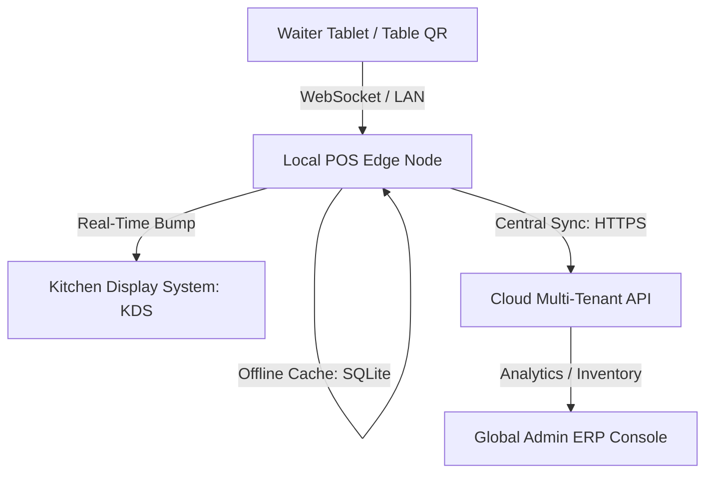

Are you planning to build a multi-tenant, offline-first restaurant management platform or launch a branded SaaS product for hospitality in 2026? Here is the comprehensive architectural blueprint for developing a high-performance, white-label restaurant POS system and integrated Kitchen Display System (KDS) ERP.

## The Need for Modern Restaurant Billing and Kitchen Display ERPs

Hospitality tech is notoriously complex. Traditional restaurant operations often fail due to fragmented communication between the front-of-house (FOH) waitstaff and back-of-house (BOH) kitchen line cooks. When orders are written on paper or entered into disconnected billing applications, ticket times spike, manual errors increase, and guest satisfaction plummets. 

In 2026, forward-thinking hospitality groups and reseller agencies are deploying unified, **white-label restaurant POS systems** featuring real-time kitchen displays. By utilizing a single database engine and event-driven sockets, restaurants can synchronize order tickets instantly, monitor table turnover, automate ingredient inventory, and process payments at the table.

> **Key Industry Trend:** White-label POS software allows agencies to offer pre-configured, branded point-of-sale platforms to regional restaurant chains, establishing predictable monthly recurring SaaS revenue without writing custom software from scratch.

---

## Technical Architecture of a Real-Time POS & KDS Network

To support thousands of transactions daily and ensure zero orders are lost during network drops, a hybrid local-cloud system is required. The architecture utilizes localized edge servers at each outlet synced with a central multi-tenant cloud dashboard.

### 1. Offline-First Database Synchronization
If the internet connection drops during a busy dinner service, billing operations must not halt. Waiter tablets cache local orders inside a SQLite / IndexedDB instance. Once connectivity is restored, a background synchronization worker pushes transaction logs to the cloud API using differential conflict-free replicated data types (CRDTs).

### 2. Event-Driven Kitchen Display Orchestration
Rather than polling the database for new orders, the FOH tablets and KDS screens establish low-latency bidirectional channels using WebSockets or local MQTT brokers. When a waiter confirms a guest order, the ticket payload immediately updates the prep screen in the kitchen, organized by category (e.g., Hot Kitchen, Salad Station, Bar).

### 3. Kitchen Display States and Ticket Lifecycles
Order tickets change states dynamically based on prep statuses:
* **Pending (New):** Blue badge, flashing indicator for high priority.
* **In-Preparation (Cooking):** Yellow badge, tracking cumulative prep time against SLA.
* **Ready (Completed):** Green badge, triggers FOH runner notifications and receipt printing.

---

## Comparing POS Architectures: Custom vs. White-Label

Choosing how to build or deploy a hospitality platform has significant timeline and budget implications:

| Feature | Legacy Desktop POS Systems | Custom-Built Cloud POS | White-Label SaaS POS (TodayInTech) |
|---|---|---|---|
| **Deployment Time** | 3 - 6 Months (on-site hardware setup) | 8 - 12 Months (full development lifecycle) | 2 - 4 Weeks (branded, pre-built deployment) |
| **Development Cost** | High upfront hardware licensing | $120,000+ custom software engineering | Predictable subscription model |
| **Offline Performance** | Good (pure local execution) | Poor (breaks during internet outages) | Excellent (hybrid local-first synchronization) |
| **BOH Integration** | Paper tickets / separate KDS software | Integrated APIs | Native WebSockets-based KDS ERP included |
| **Reseller Rights** | Strictly locked down | Proprietary control | Unlimited rebranding & custom sub-billing |

---

## Technology Stack Recommendations for POS Developers

For teams engineering restaurant management platforms in 2026, we recommend the following stack:

* **FOH Frontend:** React Native or Electron for multi-device cross-platform runtime (iPad, Android tablets, desktop terminals).
* **KDS Frontend:** Next.js or light Svelte applications optimized for high-refresh touchscreen monitors.
* **Backend API Gateway:** Go (Golang) or Node.js (NestJS) for handling concurrent high-throughput socket connections.
* **Local Edge Cache:** SQLite for structured device data, combined with RxDB for real-time offline sync.
* **Thermal Printing Integration:** POS Web SDK supporting ESC/POS commands over USB, Bluetooth, or local TCP/IP networks.

---

## Frequently Asked Questions (FAQ)

### What is a white-label restaurant POS system?
A white-label restaurant POS is a pre-developed point-of-sale and billing application that a software agency or business can customize with their logo, brand colors, and domain name, enabling them to resell it to restaurants as their own proprietary SaaS product.

### How does the kitchen display system (KDS) update in real time?
The KDS connects directly to the local POS edge node via secure WebSockets. The moment an order is finalized by the waiter or a customer orders from a table QR code, the order packet is pushed to the kitchen screen, taking less than 100 milliseconds.

### Can the billing system print receipts without an internet connection?
Yes. Modern hybrid POS applications communicate directly with thermal receipt printers over the local network (LAN) using ESC/POS commands. Printing works independently of cloud internet connectivity.

### Does TodayInTech offer POS and KDS software customizations?
Yes. TodayInTech provides a complete white-label restaurant POS and kitchen display ERP solution. We handle the custom branding, domain mapping, local printing configurations, and deployment. Contact us to book a demo.

---

## Scale Your Hospitality Business Today

Are you ready to build or launch a branded restaurant point-of-sale system? TodayInTech's experienced software engineering team specializes in high-availability WebGL interfaces, real-time sync systems, and secure cloud SaaS platforms.

* **Learn more about our services:** [Explore TodayInTech Projects](/projects/)
* **Get in touch with an expert:** [Book a Consultation Demo](/bookademo/)
